# GaussView 6：构建与编辑分子（p.16–46）

> 元素/基团/环/生物片段、编辑、Clean、 symmetry、键角二面角、显示格式、坐标轴

> 原文件：`../gview6官方说明书.md`（全量单文件存档）｜图片目录：`../imgs/`

---

<!-- p.16 -->

## How To: Build Molecules

## Placing Elements and Fragments

The GaussView molecule building tools always operate on the active View window. In general, GaussView begins and remains in its insert/replace mode, unless one of the options described below explicitly calls for it to act in a different manner. Clicking in an open area of the View window adds the current atom or fragment to the window as a distinct fragment. Clicking on an existing atom adds the current item to the existing structure at the indicated point, usually replacing it (other options are discussed later).

The desired atom or fragment is chosen using one of the Element, Functional Groups, Rings and Biological Fragments buttons and then selecting one of the choices from the resulting palette. The current item always appears in the Current Fragment area of the GaussView control window and/or the Active Fragment area of the standalone Builder palette. Clicking on either the Active Fragment area on the standalone Builder palette or on the fragment name above the main window’s Current Fragment area opens the palette corresponding to the selected fragment type.

Note that the standalone Builder palette is opened with the View=>Builder menu item and can be made to always stay on top of all other open windows by checking the Builder Dialog Stays on Top checkbox in the Window Behavior Preferences (accessed with the File=>Preferences menu path).

## The Element Fragments Palette

The Element Fragments palette allows you to select an element from the periodic table. The various possible coordination patterns for the selected element are shown at the bottom of the window below. The default element type is tetrahedral carbon.

The Element Fragments Palette

The available hybridization (connectivity) variations for the selected element appear along the bottom of the palette.

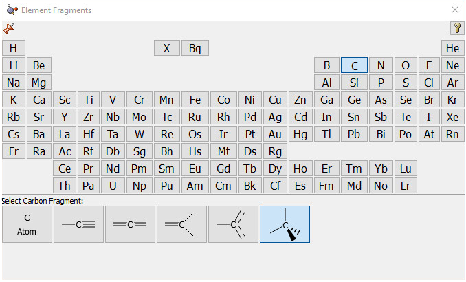

<!-- p.17 -->

## The R-Group Fragments Palette

The R-Group Fragments window allows you to select from a series of AM1-optimized functional group fragments. The default group is carbonyl (formaldehyde).

The R-Group Fragments Palette

Use this palette to select the desired functional group.

Note that several of the fragments use non-traditional bonding. These fragments include a five-member ring with an open bond perpendicular to the plane of the ring: a η5-cyclopentadienyl ligand for use in constructing organometallic systems.

## The Rings Palette

The Ring Fragments window allows you to select from a series of AM1-optimized ring structures. The default ring is benzene.

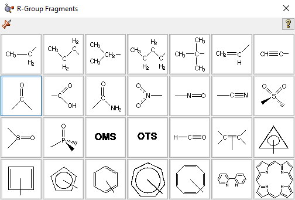

<!-- p.18 -->

The Ring Fragments Palette

Use this palette to select the desired ring system.

## The Biological Fragments Palette

The Biological Fragments palette presents a set of AM1-preoptimized fragments useful to biological researchers: the amino acids and various DNA bases. The default biological fragment is Alanine Central Residue.

Selecting Biological Fragments

Use the various fields in this window to select amino acids and DNA bases.

The Type field allows you to select either Amino Acid or Nucleoside. When Amino Acid is selected, the left popup menu below the Type field can be used to select the desired amino acid, and the right popup menu in that line allows you to specify the structural form as Central Fragment, Amino-Terminal Fragment or Carboxyl-Terminal Fragment (the last two are the N-terminated and C-terminated forms, respectively).

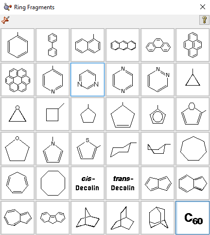

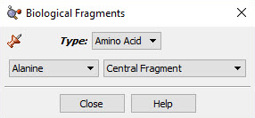

<!-- p.19 -->

When the Type field is set to Nucleoside, the left popup menu below the Type field can be used to select the desired DNA base (nucleic acid fragment), and the right popup menu in that line allows you to specify the structural form as Central Fragment, C3’-Terminal Fragment, C5’-Terminal Fragment or Free Nucleoside.

## Making Palettes Sticky

The various palettes in GaussView can be used in a modal (dialog box behavior) or amodal (floating palette behavior) manner. The thumbtack icon in the upper left corner of the window shows whether the palette will close when another one is selected (or a non-building context is entered). The green pushed-in tack indicates that the palette is “tacked” to the desktop (i.e.,

“sticky”):

; the red upward pointing tack similarly indicates modal operation:

.

## Undo and Redo

The Edit=>Undo and Edit=>Redo menu paths may be used to reverse or reinstate a previous molecule modification or other action. The Undo button and the Redo button may be used for the same purposes.

## Viewing and Adjusting Structure Parameters

The Builder toolbar/window includes the following buttons for viewing and modifying the structural parameters of molecules: Inquire, Bond, Angle, Dihedral, Add Valence, Delete Atom, and Invert About Atom. In addition, other buttons and their corresponding menu items also affect molecular structure—including Clean, Rebond, and Symmetrize—and display.

See these links for details about Modifying Bonds and Modifying Angles.

## Inquire Mode

The Inquire button allows you to request geometric information directly from the View window when you click on the atoms of interest. Note that the selected atoms do not need to be bonded. The structural information appears in the View window’s status bar, as in Figure 14. The number of atoms that you select affects the resulting display on the View window:

- 

Hover over atom: atom type and number:

. This feature is called mouse cursor tracking, and it is controlled by the setting on the Windows Behavior preference. By default, you must hold down F5 to use it. However, you can change the setting to have it always active or disabled entirely.

- 

1 atom: Atom type and number:

.

- 

2 atoms: Bond length (distance):

.

- 

3 atoms: Interatomic angle:

.

- 

4 atoms: The 4-3-2-1 dihedral angle:

.

<!-- p.20 -->

Inquire Mode Display

This display shows the value of the selected bond angle in the window’s lower left corner.

## Adding and Deleting Valences

The Add Valence button attaches additional valences (shown as hydrogen atoms) to the center clicked with the mouse. The new valences will be placed as far as possible from the other atoms attached to the center.

Similarly, the Delete Atom button removes atoms and open valences. When used, the function will eliminate the selected atom and all single valences (hydrogens) attached to it. It may also be used to remove a dangling bond by clicking on the bond stick.

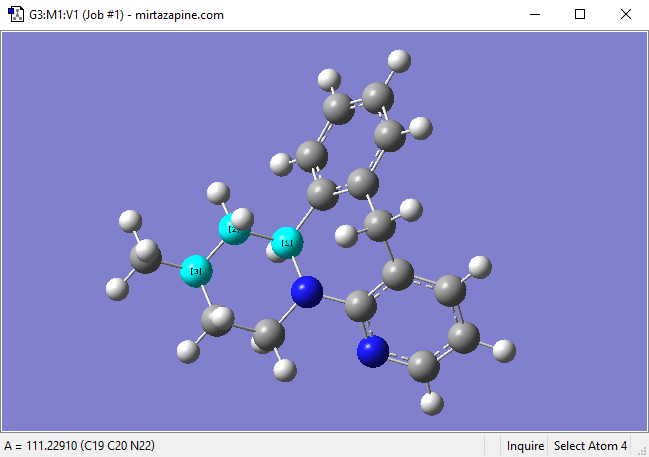

<!-- p.21 -->

Deleting a Dangling Bond (Open Valence)

The Delete Atom button may be used to remove atoms and dangling bonds. An example of the latter is shown at the top of the molecule. Clicking on it will remove the open valence.

## Invert About Atom and Mirror Invert

The Invert About Atom button allows you to reverse the symmetry of a molecule with respect to a selected atom.

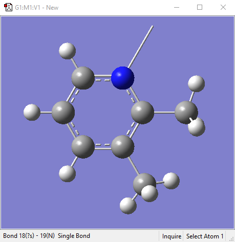

<!-- p.22 -->

Inverting a Structure About an Atom

Clicking on the nitrogen atom with the Invert About Atom tool will result in the structure on the right. The tool changes the stereochemistry of that atom center, resulting in a different diastereomer.

The Edit=>Mirror Invert menu item will invert the stereochemistry of the entire molecule. The example below changes the R diastereomer into the S diastereomer.

Using Mirror Invert

## Cleaning Structures

The Clean button and Edit=>Clean menu items both adjust the geometry of the molecule, based on a defined set of rules, to more closely match chemical intuition. The results are only approximations and are not intended to be perfect. Geometries may require adjustment for non-classical cases such as transition states.

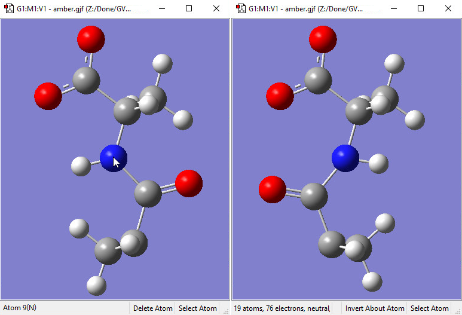

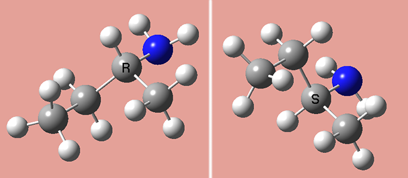

<!-- p.23 -->

The GaussView clean function may be customized via the Clean Controls Preferences panel.

Customizing the Clean Function

You can use this preference panel to modify and customize how the GaussView clean function operates.

The default clean settings attempt to achieve a balance that produces expected “normal” results. Altering the settings in Clean Controls Preferences can cause unexpected and undesirable results, so please read the following sections carefully before making any changes.

The following controls are available in the dialog. The fields in the Rel. Weights column are:

- 

Bond: The targeted bond lengths are assigned based on the van der Waals radii of the two atoms forming the bond, with slight adjustment for bond type. They are not intended to be chemically accurate, but they should give reasonable input geometries for Gaussian.

- 

NonBond: Repulsive term between all atoms that are not directly bonded. The purpose of this component is to keep atom centers apart so one atom is never masking another atom. However, it will not adjust biphenyl.

- 

Hard Angle: Hard angles are calculated for atom centers that contain 2-4 bonds. They are weighted more heavily since the targeted angles are known. These terms are vital for maintaining atom center integrity.

- 

Soft Angle: Soft angles are calculated for atom centers that contain 5 or more bonds. The targeted angles are not well known, but desired results can be achieved with practice. To produce a trigonal bipyramidal structure, adjust the axial bond angle to 180 degrees. Make sure the linear angle bias option is on. Most of the time, the clean procedure will produce the desired structure. Practice with coordinate patterns to get a feel for cleaning more complex coordinations.

- 

1-Ctr Dihed: Calculated from the Newman projections down each bond and limited to atom centers with less than 5 bonds. This term helps maintain atom center integrity when the 2-center dihedrals are causing distortions.

- 

2-Ctr Dihed: This is the only term that affects tertiary structure. The targeted dihedrals will be eclipsed or staggered based on the bond types. If each atom center contains multiple bonds, the targeted dihedral will be eclipsed.

The checkboxes at the bottom of the window have the following effects:

<!-- p.24 -->

- 

Double the weight for linear angles: This term assists cleaning with soft angles where the angles at an atom center are not well known.

- 

Use one 2-center dihedral per bond: Normally, this option should remain unchecked. It is available to provide better performance on slower systems.

The fields in the Opt. Controls column are:

- 

Tolerance: Lower values give more accurate structures, but can take significantly longer to clean. The range should be between 1.0E-5 and 1.0E-12.

- 

View Updates: Controls how often the views of the molecule being cleaned are updated. A value of 1 gives a refresh with every clean cycle. A value of 10 gives a refresh every 10 clean cycles. A value of 0 disables view updates until clean is complete. Depending on your system, this parameter can have a significant effect on cleaning time.

- 

Max Cycles: Maximum number of steps during a clean optimization. A good value is 150. Larger structures may require a larger value.

- 

Max Time: Maximum time (seconds) allowed for a clean operation to complete.

It is important to remember that the various components of the clean force field are relative. Changing one weight will affect the behavior of the other weights. For example, an excessive non-bond weight will produce longer bonds. Similarly, an excessive hard angle weight could affect the 2-center dihedrals.

You can disable any set of terms by assigning a weight of 0.0. For example, disabling the 1-center dihedral term can result in faster cleaning, but the resulting tertiary structure may not be as nice. Do not disable the bond weight or hard angle terms. The former should be kept high relative to the other terms.

### Clean Performance Tips

If the clean function is too slow on your system, try these settings:

- 

NonBond: 0

- 

1-Ctr Dihed: 0

- 

Use one 2-center dihedral per bond: checked

- 

View Updates: 0

Poor performance of the clean function can also be a symptom of a memory shortage on the system.

## Rebonding Structures

The Rebond button and Edit=>Rebond menu path both initiate a rebonding process in which GaussView reidentifies bonded atoms, based on a distance algorithm. Note that Gaussian usually does not use the bond information on the screen for calculations. This information is presented primarily to make it convenient for you to visualize the chemistry of the molecule.

## Imposing Symmetry

The Point Group Symmetry dialog is used to specify the desired symmetry for a molecular structure. It is reached via the Tools=>Point Group menu path. The controls have the following meanings:

- 

Enable point group symmetry: Enable GaussView’s symmetry features.

- 

Constrain to subgroup: Select a point group to which to constrain the structure.

<!-- p.25 -->

- 

For: Select All changes to impose symmetry on future structural changes. None disables symmetry constrains.

- 

Approximate higher-order point groups: Higher symmetry subgroups which might apply.

- 

Tolerance: Cutoff level below which to consider structural parameters equal. Larger cutoffs make higher symmetry groups easier to identify. Thus, increasing the tolerance may cause additional point groups to appear in the popup menu on the left. You can select one of the items on the menu or enter a numerical value into the field.

- 

Symmetrize button: Impose the selected higher-order point group on the molecular structure immediately.

- 

Always track point group symmetry: Tells GaussView to continuously compute point group assignments as the geometry changes. Use this item in conjunction with a symmetry constraint setting of None in order to view point group changes continuously as you adjust structural parameters (e.g., use the bond length slider). Normally, the point group is identified only after the change is completed. For very large molecules on slower systems, enabling this item may cause noticeable delays in response time.

Imposing Symmetry on a Molecular Structure

In this example, GaussView has identified the current point group of this distorted benzene molecule as C1. It also recognizes that the C2v point group might also be appropriate. Clicking the Symmetrize button will apply the specified point group to

<!-- p.26 -->

the structure. The Tolerance field can be used to tighten or relax the symmetry identification process. In this case, loosening the tolerance allows GaussView to identify the highest applicable point group as D6h.

The Symmetrize button (on the toolbar) and the Edit=>Symmetrize menu item both immediately impose the maximum identifiable point group on the current structure, using the most recent Tolerance setting from the Point Group Symmetry dialog for this molecule (or the default of Normal). They also have the side effect of enabling point group symmetry for the molecule (again, using the previous settings, if any).

The View window status bar will indicate any identified and constrained symmetry for the molecule.

Symmetry-Related Status Bar Displays

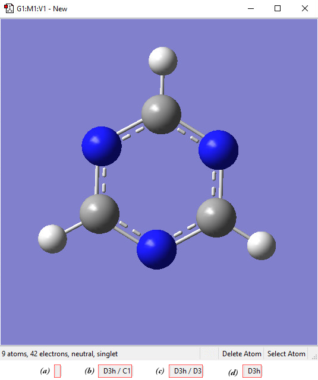

<!-- p.27 -->

Four views of the symmetry information section of the status bar for the triazine molecule: (a) symmetry has not been turned on; (b) molecule symmetry (D3h) but no symmetry constraint (C1); (c) molecule symmetry (D3h) and structure constrained to D3 symmetry; and (d) molecule symmetry and constraint symmetry are both D3h.

## Pasting Molecules into the View Window

The Edit=>Cut and Edit=>Copy menu items and the corresponding Cut and Copy buttons can be used to cut or copy the entire selected atoms, or the structure if no atoms are selected, to the system clipboard. The clipboard contents are displayed in the current fragment area.

The Edit=>Delete menu item and the Delete Molecule button can be used to remove the structure in the current model, discarding it without copying it anywhere.

There are several options for pasting molecules from the clipboard. The Edit=>Paste menu item accesses a slideoff menu containing three items. These items can also be reached via the small downward-pointing triangle on the Paste button. Clicking on the Paste icon itself (avoiding the triangle’s panel) selects the Replace Molecule item.

The items on the Paste submenu are:

- 

Edit=>Paste=>Add to Molecule Group: Create a new model within the current molecule group, and place the structure on the clipboard into it.

- 

Edit=>Paste=>Replace Molecule: Remove the structure in the active window, and place the one on the clipboard there instead.

- 

Edit=>Paste=>Append Molecule: Add the molecule on the clipboard to the active model as a separate fragment.

## Placing a Fragment in a Centroid Position

The Place Fragment at Centroid of Selected Atoms item on the Builder context menu (reached by right clicking in an open area of a View window) will place the current element, R-group, ring, or biological fragment at the centroid position defined by the currently selected atoms. For example, to place an atom inside a C60 cage, select all of the atoms in the molecule, select the desired atom from the Element Fragments palette (specifying the bare atom type), right click in an open area of the view, and select Builder=>Place Fragment at Centroid of Selected Atoms. This process is illustrated below:

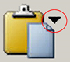

<!-- p.28 -->

Placing a Centroid Atom in C60

Note that if you simply want to define the centroid location without immediately placing any atoms there, you can use the dummy atom (element type X) to do so.

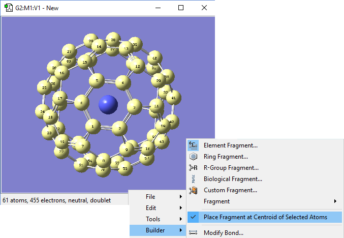

<!-- p.29 -->

## Modifying Bonds: The Bond SmartSlide

Once you have modified a parameter using the SmartSlide, the OK button must be pressed before any of the changes made on any SmartSlide are actually applied to the molecule. Clicking the close box will discard any changes (as will selecting the Cancel button).

The Bond SmartSlide is illustrated below. The initial bond length value is set to the distance between the selected pair of atoms, and the type of bond existing between them is indicated. The SmartSlide provides access to all the possible bond types.

The interatomic distance is dynamically adjusted by moving the slider along the scale. Values may also be directly entered in the text box.

You can change the bond type by clicking one of the bond type radio buttons without affecting the valence on the atoms from which the bonds are removed.

Note that the Bond SmartSlide is also used to add bonds between unbonded atoms. Simply click on the two atoms to be bonded as usual. When the SmartSlide opens, click on the type of bond desired, and the bond will be created. Similarly, to remove a bond, select the two atoms you want to unbond, and then select the None radio button in the dialog.

The Bond SmartSlide

This dialog can be used to add, remove, and change bond lengths.

The Displacement fields specify how attached groups are handled as the bond distance changes:

- 

Translate Atom: Move only the atom, keeping the group’s position fixed in space.

- 

Translate Group: Move the attached group along with the atom (i.e., as a single unit).

- 

Fixed: Do not allow the atom or the group to move (all movement occurs at the other atom).

The following figure illustrates the effects of different combinations of these choices:

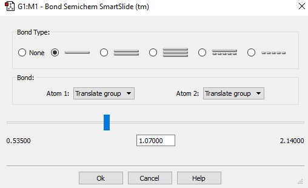

<!-- p.30 -->

1=Fixed, 2=Translate

1=Fixed, 2=Translate Atom

1,2=Translate Group

Group

Original

Bond Length Modification Options

All three of these structures result from lengthening the bond distance between the two selected C atoms (to the same value in all three cases). In the left picture, atom 1 was held fixed, and atom 2 was set to Translate Atom. Compare this to the middle picture which also held atom 1 fixed and set atom 2 to Translate Group. The upper methyl group stays fixed in the first case, while the 1-2-R bond angle remains unchanged in the center case. The right picture sets both atoms to Translate Group, probably the most common choice for a case like this one.

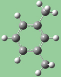

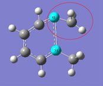

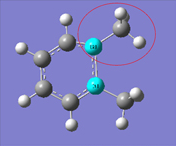

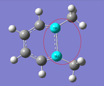

<!-- p.31 -->

## Modifying Bond Angles and Dihedral Angles

Bond angles and dihedral angles are modified with Angle and Dihedral SmartSlides.

The Angle and Dihedral SmartSlides

Once you have modified a parameter using the SmartSlide, the OK button must be pressed before any of the changes made on any SmartSlide are actually applied to the molecule. Clicking the close box will discard any changes; it is equivalent to selecting the Cancel button.

The figure following illustrates some of the combinations of various Displacement settings for bond angles (they work in the same way for dihedral angles). The possible choices for each popup menu are:

- 

Rotate Atom: Move only the atom, keeping the group’s position fixed in space.

- 

Translate Group: Move the attached group along with the atom as a single unit.

- 

Rotate Group: The group’s position rotates along with the atoms as the angle changes.

- 

Fixed: Do not allow the atom or the group to move (all movement occurs at other atoms).

1,2=Fixed, 3=Rotate Atom

1,2=Fixed, 3=Rotate Group

1,2=Fixed, 3=Translate Group

Original Molecule

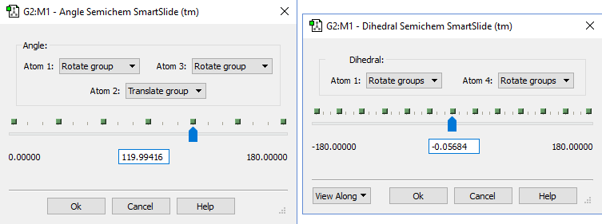

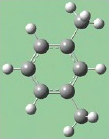

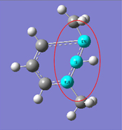

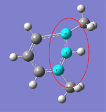

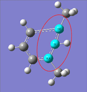

<!-- p.32 -->

1,3=Rotate Atom, 2=Fixed

1,3=Translate Group,

1,3=Rotate Group, 2=Fixed

2=Fixed

Bond Angle Modification Options

All six of these structures result from increasing the 1-2-3 bond angle. In the top row, atoms 1 and 2 are both held fixed. Compare the results of increasing the bond angle to the same value in the three cases (keeping in mind the “normal” position for the ring atoms and the methyl groups). The movement of the methyl group attached to atom 3 ranges from substantial in the first frame to a little in frame 2 to almost none in frame 3. In the second row, atom 2 is held fixed while other choices are used for atoms 1 and 3. Comparison of these illustrations as well as experimentation will make the differences between the choices clear and familiar.

## Modifying Dihedral Angles via Newman Projections

The View Along popup menu in the lower left corner of the Dihedral SmartSlide dialog allows you to reposition the molecule using a Newman projection along the 2,3 internuclear axis or the 3,2 internuclear axis.

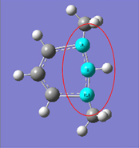

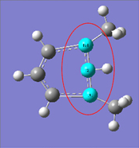

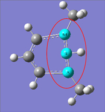

<!-- p.33 -->

Viewing a Dihedral along the 2,3 Internuclear Axis You may choose to reposition the molecule so that the 1,2 or 3,4 axis is vertical.

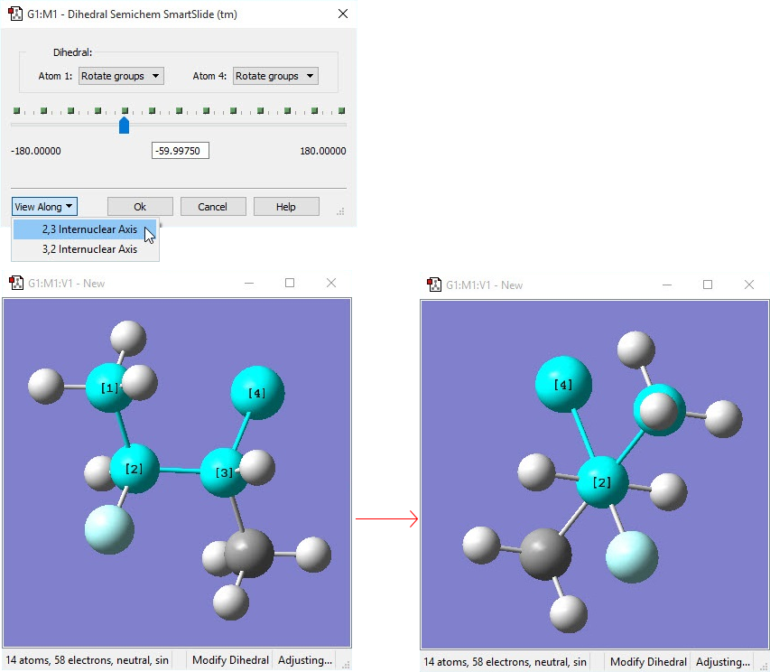

<!-- p.34 -->

## Specifying Fragment Placement Behavior

The small triangle above the Current Fragment area of the GaussView control window can be clicked to reveal some advanced options to specify how new fragments are joined to an existing molecular structure. The Mode popup allows you to select the settings (in which case, all fields are disabled), to specify Custom settings, or to restore the previously-used (Old) non-default settings (also nonmodifiable). You must select Custom in order to make changes to these items. The values for these three groups of settings can be specified in the Building Preferences.

There are two panels in this area. The Before panel, pictured below, sets restrictions for how fragments may be added to a structure. The After panel (the third image) specifies how the structure is treated after a fragment is added.

Here are some preliminary definitions necessary for understanding the options in these panels:

- 

The target atom is the one selected with a mouse click.

- 

The hot atom is the atom in the new fragment that takes the place of the existing target atom when the two pieces are joined.

- 

A terminal atom is any atom bonded to only one atom.

- 

A terminal valence atom is a hydrogen atom or an open valence bonded to only one atom.

- 

A join-bond is a bond between the hot atom and any terminal atom. These are bonds that can be eliminated in the process of connecting the fragment to the target atom. When a fragment is joined to the target atom, there must be one join bond in the fragment for each corresponding bond to the target atom.

These are the items in the Fragment Placement Before panel:

- 

Target and Fragment Join-Bond Types Must Match: The selected join-bonds in the fragment must match the bond types of the target atom. Enabling this item will prevent many placements.

- 

Fragment Join-Bonds Can Be Any Terminal Bonds: Normally, only hydrogen or open valences are taken as joinbonds. When this option is on, any terminal atoms are also candidates for join-bonds. For example, the oxygen bonds. When this option is on, any terminal atoms are also candidates for join-bonds. For example, the oxygen atom in formaldehyde could be used as a join-bond for ethylene because the bond type matches (double bond).

<!-- p.35 -->

Fragment Placement Restrictions

The items in this window set restrictions on the circumstances in which fragments may be joined to an existing structure. This window shows the default values.

- 

Create Fragment Join-Bonds If Necessary: This option will allow most fragments to be attached to any target. If the fragment does not have enough join-bonds for a given target selection, additional valences will be added to satisfy the requirement. Again, the join-bonds are deleted when fragment and target are joined as well as the target atom (on by default).

- 

Terminal Hot Atoms Define Join-Bonds: This option makes it easier to choose terminal atoms as hot atoms. Since most terminal atoms have no join-bonds, the option will use the one bond as the join-bond. However, the bond will not be deleted. This is useful when you have a central atom with more than one terminal bond, and you want to explicitly choose which terminal bond will be used to do the joining.

- 

Bond to Target Atom Instead of Deleting It. This option allows you to bond the fragment to target atom itself, deleting only the join-bonds.

- 

Delete Any Terminal Atoms Bonded to Target Atom: Remove extra terminal bonds.

- 

Automatically Select Hot Atom: This item is designed for use with biological fragments (which is its default setting). It causes GaussView to determine the hot atom dynamically. This makes it easier to build amino acid residues, etc., by producing a sensible backbone as you add residues.

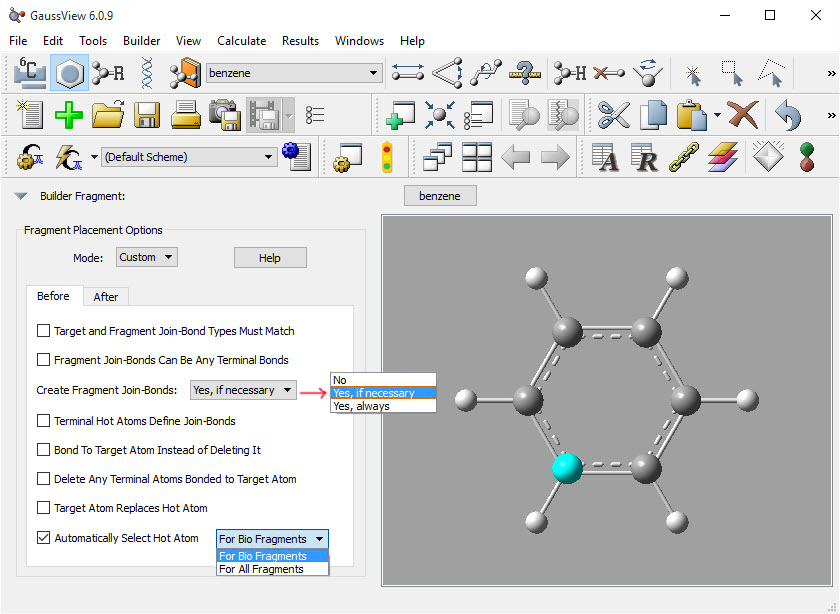

<!-- p.36 -->

Structure Options After a Fragment Placement

The options in this panel allow you to select actions for GaussView to perform automatically after a fragment is added to a molecular structure. The settings in this example are the defaults.

These are the items in the upper portion of the After panel:

- 

Use Fragment Join-Bond Type For New Bond: Normally, the bond connecting the fragment to the target bond type is determined by the original target bond. If this option is on, the fragment’s bond type is used instead. This option is useful when the Match Bond Types option is off.

The next three items activate electron bookkeeping at the target atom site. Note, however, that non-terminal atoms are not affected. Also, GaussView does not reduce or elevate the bond type to satisfy valency requirements.

- 

Delete Terminal Valence Atoms to Satisfy Valency: Allows terminal valence atoms to be deleted to reduce overloaded valency at the target atom site.

- 

Delete Terminal Atoms to Satisfy Valency: Allows for any terminal atom to be deleted to reduce overloaded valency.

- 

Add Hydrogens to Satisfy Valency: Automatically adds hydrogen atoms to satisfy valency requirements.

The popup menu controls the treatment of the hot atom fragment placement. The options are shown in the illustration. The default is to retain the atom. The remaining options enable automatic cleaning operations, and they are self-explanatory: Optimize Dihedral Angle About New Bond, Apply “Clean” Around Hot Atoms, and Apply “Clean” to Whole Structure.

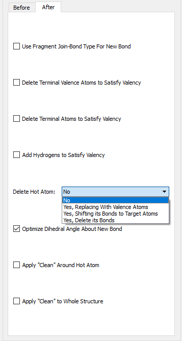

<!-- p.37 -->

## Molecule Positioning Tools

The figure below illustrates the molecule positioning toolbar, which is accessed with the View=>Positioning Tools menu item.

The Positioning Toolbar

For all of the tools, the view’s X, Y, and Z directions are the horizontal, vertical, and depth of the window, and the molecule X, Y, and Z directions are those indicated by the Cartesian axes. The various controls are described individually below (moving across the toolbar from left to right):

- 

The Quick popup contains items that center the molecule in one or more view directions or align axes on the molecule the view’s. For example, the Center and Center X items center the molecule within the window and with respect to the window’s X-axis (i.e., horizontally), while the Mol X -> View Z item aligns the molecule’s X-axis with the View window’s Z-axis. Other items work analogously.

- 

The second popup menu indicates whether the molecule will be rotated or translated to perform the repositioning when the Apply button is pushed. The next two fields also control the operation.

- 

The Around field specifies the axis about which the molecule will be rotated (active when the previous popup is set to Rotate). When Translate is selected in the initial field, then the label changes to Along.

- 

The By field specifies the amount of rotation or translation.

- 

The final slider provides another way to specify the amount of movement. As you adjust the slider, the molecule moves immediately in the direction and manner specified by the first two fields (and the By field is ignored).

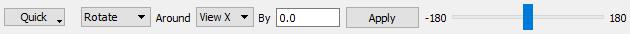

<!-- p.38 -->

## Display Format: General Panel

The items in the General panel control the background color, items displayed in the view, and the fog feature. It is illustrated below.

Display Format General Panel

You can change the View window background color by clicking on the color chip labeled Background Color and selecting a new color using the color selection dialog.

The Use Fog to Improve Depth Perception checkbox causes more distant atoms in the View window to recede to invisible, allowing nearer atoms to become more distinct. The Fog has Zero Visibility at field controls the depth at which atoms become completely invisible. This feature is illustrated below.

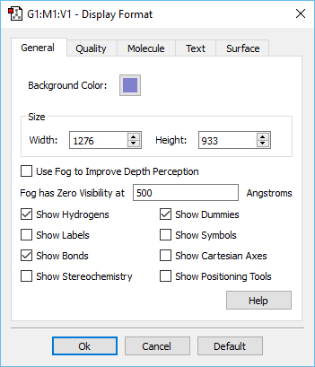

<!-- p.39 -->

The Fog Depth Display Feature The left illustration shows the molecule with the fog feature disabled. In the right illustration,

fog is turned on, and the frontmost atoms are much more distinct than more distant ones.

Compare the display types between the two windows to understand the effect of fog.

The remaining checkboxes in this panel control the display of various labeling and comprehension tools with the View window. Their effects are illustrated in the displays below (which uses benzene with a dummy atom in the center of the ring as its example for most settings):

- 

Show Hydrogens: Display hydrogen atoms in the View window. Default: On

- 

Show Labels: Display numeric labels indicating atom sequence numbers. Default: Off

- 

Show Bonds: Display bonds between atoms. Default: On

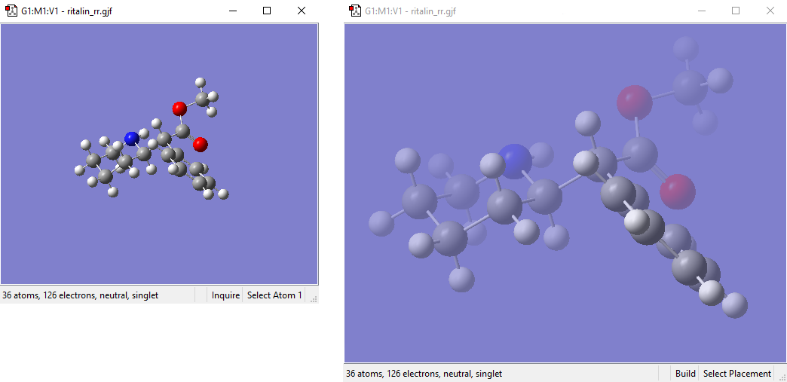

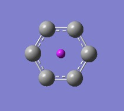

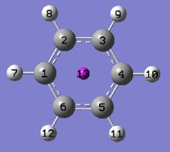

<!-- p.40 -->

- 

Show Stereochemistry: Display the chirality of any chiral centers. Default: Off

- 

Show Dummies: Display of dummy atoms if present. Default: On

- 

Show Symbols: Display the chemical symbol for each atom. Default: Off

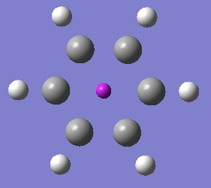

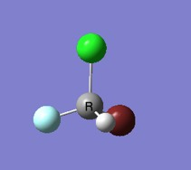

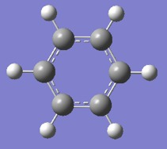

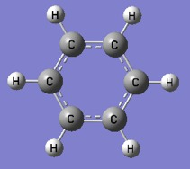

<!-- p.41 -->

- 

Show Cartesian Axes: Display X,Y,Z axes. This feature is illustrated below. Initially, the origin of the axes is in an arbitrary position (sometimes located on atom 1), and it remains fixed despite changes to the molecule. Use the Edit=>Reorient menu item to move the origin to the molecule’s current center of mass. Display: Off

- 

Show Positioning Tools: Opening positioning toolbar in View window. Default: Off See this help entry

You can specify default values for these items via the General panel of the Display Format Preferences. You can also exclude labels and symbols on hydrogen atoms or hydrogen and carbon atoms using the Exclude View Labels and Exclude View Symbols items in the Text panel of the Display Format Preferences (both default to excluding no atom types). Finally, the size of textual labels can be adjusted using the Size field in the Text panel of the Display Format Preferences.

## Displaying Cartesian Axes

The figure below further illustrates GaussView’s Cartesian Axes display option. The window on the left shows the initial position of the axes (which is quite arbitrary), and the one on the right shows the origin’s new position after using the Edit=>Reorient menu item.

Cartesian Axes Display Before (left) and After (right) Reorientation

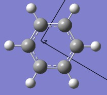

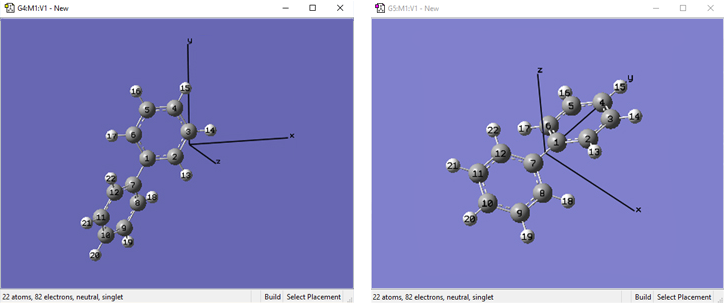

<!-- p.42 -->

## Display Format: The Quality Panel

The items in the Quality panel control the display of stationary and moving objects. It is illustrated below.

Display Format Quality Panel

On slower systems, it can be useful to set the slider more toward the Realistic end of the scale for Stationary Object Display and more toward the Fast end of the scale for Moving Object Display.

The Smooth checkboxes enable/disable smoothing in the display, and the Spotlight checkboxes enable/disable simulated spotlighting on the window contents.

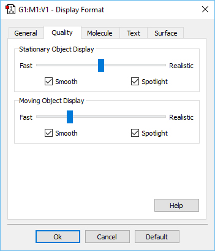

<!-- p.43 -->

## Display Format: Molecule Panel

The options in this panel control how atoms and bonds appear in the View window. The three popup menus specify how atoms in each of the three ONIOM layers will be displayed. If the ONIOM facility is not being used, then the setting for the High Layer is used. The layer display settings are also used by some other GaussView features unrelated to ONIOM (e.g., displaying atoms at the boundaries of PBC unit cells).

The Display Format Molecule Panel

The various supported display types are:

- 

Ball & Stick: Molecule appears as a ball and stick model, with all types of bonds represented by single sticks.

- 

Ball & Bond Type: Molecule appears as a ball and stick model with single bonds represented by single sticks and multiple bonds represented by multiple sticks or, in the case of aromatic systems, by dotted lines. This is the default.

- 

Tube: Molecule appears as a tube model with no indication as to bond type. Atom types are indicated by color bands on the tubes.

- 

Wireframe: Molecule appears as a series of thin lines, colored by atom type and indicating bond type via the number of lines.

- 

None: Atoms are invisible (useful only with multilayer models).

The Use Bond Color checkbox controls whether bonds are partially or entirely colored by atom type in the tube display format. The two options are illustrated below:

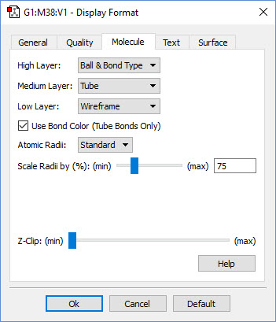

<!-- p.44 -->

Tube Display Formats

These windows show pyrazine using the tube display format without (left) and with (right) the Use Bond Color item checked. The format on the right is the default.

The Atomic Radii popup menu and Scale Radii by field cause the atoms in the View window to be displayed at the indicated scaling of the standard or Atomic (the Standard and Covalent options on the popup menu, respectively). Using Covalent with a scaling value of 150%–200% will produce a space-filling-like molecular display, as in the following figure:

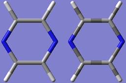

<!-- p.45 -->

A CPK-Like Display

The Z-Clip slider may be used to remove the frontmost portions of the image to allow views into the interior of the molecular display.

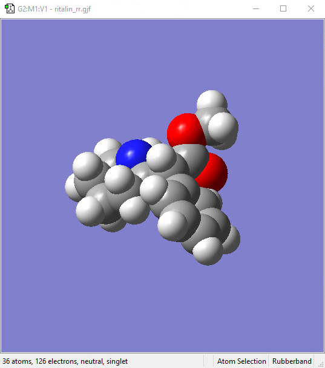

<!-- p.46 -->

## Display Format: Text Panel

The Text panel of the Display Format dialog controls the font and color of atom labels and symbols as well as allows you to exclude certain atoms from labeling, as previously mentioned. It is illustrated below:

The Text Panel of the Display Format Dialog

- 

Font File: This menu allows you to select from several font files provided with GaussView.

- 

Size: This field specifies the relative type size: type resizes with the molecule as you zoom in or out. Note that font sizes are generally limited to those included explicitly on the Size menu.

- 

Render: This field specifies the type rendering method.

- 

Color: This field specifies the type color.

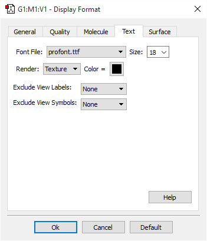
