# GaussView 6：任务管理与脚本（SC Job Manager）（p.214–226）

> 提交任务、SC Job Manager 各面板、Job Types、启用配置、命令行变量、自带脚本

> 原文件：`../gview6官方说明书.md`（全量单文件存档）｜图片目录：`../imgs/`

---

<!-- p.214 -->

## The SC Job Manager

The SC Job Manager is a simple queueing system that is included within GaussView. You can access its control dialog via the Calculate=>SC Job Manager menu path or the corresponding icon. This dialog is illustrated below:

The SC Job Manager The dialog is initially open to its Long Jobs Queue panel.

## Submitting Jobs from GaussView

When the SC Job Manager is specified to run Gaussian calculations, clicking on the Submit button in the Gaussian Calculation Setup dialog starts the process of submitting a job. First, you will be asked to save an input file (if necessary). Next, the following confirmation dialog will appear:

The dialog presents options for:

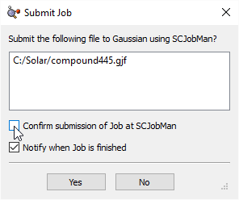

<!-- p.215 -->

- 

Customizing the job before submission (i.e., changing the queue): Confirm submission of Job at SCJobMan (default: unchecked).

- 

Requesting notification when the job completes: Notify when Job is finished (default: checked).

By default, the job is submitted immediately to the default SC Job Manager queue, and you will be notified when it completes.

If you select the upper checkbox in the preceding dialog, GaussView presents you with the dialog below:

The Submit Job Dialog when the SC Job Manager is in Use

When you click the Submit button at the bottom left of the dialog, the checked files in the file list will be submitted to specified SC Job Manager queue. You can use this dialog to modify the default job type and/or queue and to also select additional files for submission.

### Adding Files to the File List

The Add Files button opens up a file viewer, whose form is specified in the UI Options panel, to choose files to add to the file list. Clicking the button will open the most recently used directory. By clicking on the down arrow to the right of the Add Files button, a menu opens allowing the user to select which directory to open.

The Add Recent File button creates a drop-down menu that allows the user to choose from files that were previously opened.

The Add Recent File List button will display a drop-down menu of prevoiusly opened groups of files (files opened in the same open operation).

The Actions button contains the following menu items:

- 

Selected Items: Options apply only to selected (highlighted) files.

- 

All Items: Options apply to all files in the list whether selected or not.

Each of these menus contains the following items:

- 

Clear: This option removes selected/all files.

- 

Check: This option checks the box at the beginning of the line for selected/all items. Checking the box marks the items for submission.

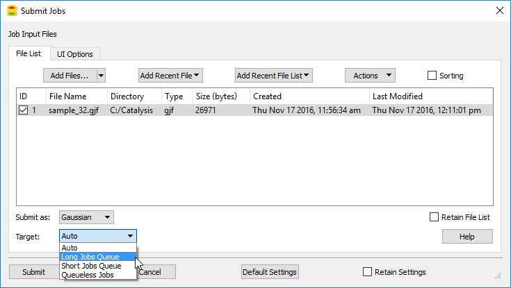

<!-- p.216 -->

- 

Uncheck: This option removes the check from the box for selected/all items, unselecting them (excluding them from submission).

- 

Toggle: This option switches the current state of the checkbox for selected/all items.

The Sorting checkbox controls whether the items in the file list can be sorted. When it is checked, then clicking on any column header will sort the items based upon the field. A caret character ^ (ascending order) or a “v” character (descending order) appears at the top of the current sort column:

The controls at the bottom of the dialog have the following uses:

- 

The Submit as: dropdown menu specifies what type of job will be submitted. By default, Auto is selected, and the job type is determined from the file extension. In the above dialog, Gaussian was selected.

- 

The Target: dropdown menu allows you to specify which SC Job Manager queue the job is added to.

### Modfying the UI Options

The UI Options panel allows you to set the following options:

- 

Use Native File Browser: When checked, GaussView will use the operating system’s native file browser when adding items to the file list.

- 

Start with File Browser if Initial File List is Empty: When checked, GaussView will automatically open the file browser instead of the File List panel when the file list is empty (i.e., you are opening a new file).

- 

File List Detail: The following options are available for displaying file information on the File List tab.

• Low: This shows only basic amount of information about the file(s) being opened: molecule group and structure (if any), filename, and directory.

• Medium: This displays more information about the file being opened: adds the file type.

• High: This displays the highest level of detail of a file that is being opened: adds the file size and creation and modification dates.

- 

Allow Duplicate Files: Checking this option allows GaussView to open the same file multiple times. If it is unchecked, you will not be allowed to add the same file to the file list more than once.

## The SC Job Manager Dialog

The SC dialog has five panels:

- 

Long Jobs Queue: The Long Jobs Queue is where all of the files that have been targeted as such in the Submit Jobs dialog will appear.

- 

Short Jobs Queue: The Short Jobs Queue is where all of the files that have been targeted as such in the Submit Jobs dialog will appear.

- 

Queueless Jobs: The Queueless Jobs Queue is where all of the files that have been targeted as such in the Submit Jobs dialog will appear.

- 

Running Jobs: This panel provides information on the jobs that are currently running or are queued to run.

- 

Finished Jobs: This panel provides information on jobs that have finished running.

- 

Job Types: This panel provides information on the type of jobs that can be run using the SC Job Manager.

<!-- p.217 -->

The various panels in this control panel are discussed below in several separate sections.

The buttons at the bottom of the dialog have the following meanings:

- 

Submit Jobs: This button will open the Submit Jobs dialog.

- 

Hide: This button will hide the SC Job Manager from your view, but it will not stop the jobs that are running, and it will continue to run jobs that have been queued up.

- 

Exit: This button will close the SC Job Manager. Jobs that are currently running will continue, but no new jobs will be started. If the SC Job Manager is not exited, it will remain running as a seperate process even when GaussView is closed, continuing to process jobs.

### Exiting from the SC Job Manager

When you select Exit, a prompt will appear, asking you if you wish to completly exit the SC Job Manager. Clicking Yes will result in a prompt to save the current SC Job Manager project. Choose any convenient directory location for this file. Selecting No will result discard all data about completed, running and pending jobs generated since the last opening the SC Job Manager.

When you restart the SC Job Manager after having saved the data, all previously pending jobs will be present in the queue(s). Queues that held jobs that were running when the SC Job Manager will be paused, and the previously-running jobs will be listed as pending.

## The Long Jobs Queue, Short Jobs Queue, and Queueless Jobs Panels

The SC Job Manager The panels corresponding to queued and queueless jobs all contain the same controls for and information about relevant

jobs

The queue panels show current jobs controlled by the SC Job Manager. The fields in the various job lists contain the following information:

- 

Job ID: This is the ID given to the job. Jobs within the SC Job Manager are numbered sequentially across queues starting from 1.

- 

Name: This is the name of the job file.

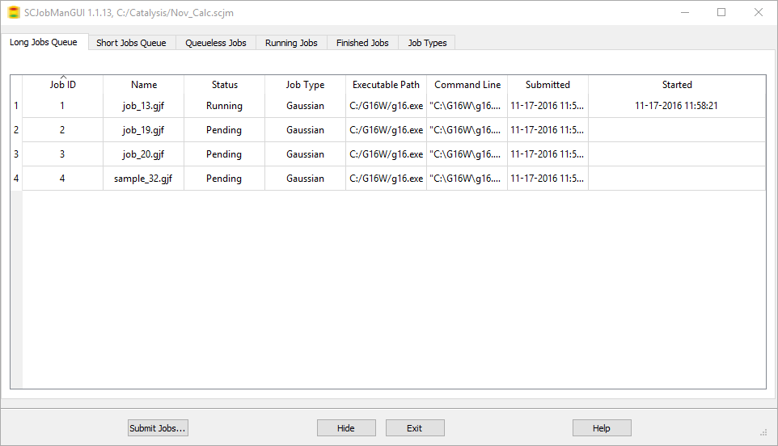

<!-- p.218 -->

- 

Status: This field specifies whether the job is running or it is queued to run in the future. Note that finished jobs do not appear in this list.

- 

Job Type: This field specifies the type of job.

- 

Executable Path: This field shows what program is being used to run the job.

- 

Command Line: This field shows the command line used to run the job.

- 

Submitted: This field gives you the time and date when the job was submitted to the SC Job Manager.

- 

Started: This field gives you the time and date when the job was started.

Double clicking on an item in the file list corresponding to a running job will stream the output for that job. Double clicking on a pending job will open the input file for the job.

Right clicking on an item in the job lists opens the context menu:

The items on the context menu have the following meanings:

- 

Remove: Removes the selected job from the queue. If the job is running, it stops the job (after a confirmation prompt).

- 

Show Input File: Displays the contents of the input file for the selected job.

- 

Stream Output File: Streams the output file as the job runs, allowing you to observe its progress.

- 

Show stdout and stderr: Displays the current standard output and standard error data from the operating system. The data is not refreshed.

- 

Stream stdout and stderr: Streams the standard output and standard error streams from the operating system.

- 

Maximum Number of Running Jobs Allowed (Currently 1)...: Allows you to change the number of jobs which can be running in each queue at one time. By default, it is 1.

The following items appear only on the context menus for queues:

- 

Maximum Number: Specifies how many jobs the SC Job Manager can be running at one time. By default, it is set to 1.

- 

Pause Queue: Pauses the current queue of jobs, preventing any more from being started, but it will not end the job this is currently running.

## The Running Jobs Panel

Selecting the Running Jobs panel results in the dialog below:

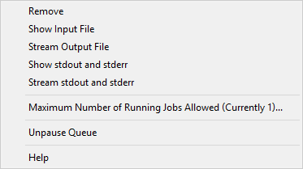

<!-- p.219 -->

SC Job Manager: Running Jobs The fields have the following meanings:

- 

User: This field displays the user who is running the job.

- 

Process ID: This field displays the OS process ID assigned to the job by the underlying operating system.

- 

Parent Process ID: This field displays the OS process ID of the parent process for the job.

- 

App Name: This field displays the name of the application that is being used to run the job.

- 

Status: This field displays the current status of the job.

- 

App Path: This field displays the path to the application that is being used to run the job.

- 

Command Line: This field displays the command line used to run the job.

The Refresh button will update the job list to reflect all jobs’ current status.

The Only Show Known Job Types checkbox will limit the display to job types listed on the Job Types panel. If unchecked, all processes for the current user will be displayed.

Double clicking on an item in the file list will stream the output for that job. Right clicking on an item will allow you to remove it (i.e., kill the job).

## The Finished Jobs Panel

Selecting the Finished Jobs panel brings up the dialog below:

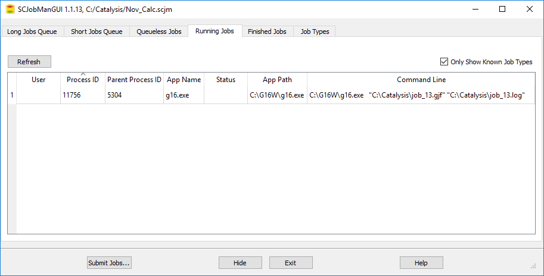

<!-- p.220 -->

SC Job Manager: List of Completed Jobs

The columns hold the following information:

- 

Job ID: This is the ID given to the job that is running. It is numbered sequentially, starting from 1. The Job ID number will be reused once the job is cleared.

- 

Name: This is the name of the file that is running, which includes its file extension.

- 

Status: This field specifies the currrent job status. There are several different statuses that can appear here. Completed indicates that the job finished successfully, and an output file can be open. Failed indicates that the job had an issue, and stopped running, and it may or may not produce a partial output file. Crashed indicates that the job failed without output (often before computation had started). Killed indicates that the job was stopped by the user.

- 

Job Type: This field specifies the type of job.

- 

Queue: This field displays what queue the job ran in.

- 

Executable Path: This field shows what program was used to run the job.

- 

Command Line: This field shows the full command line used to run the job.

- 

Submitted: This field gives you the time and date when the job was submitted to the SC Job Manager.

- 

Started: This field gives you the time and date when the job was started.

- 

Finished: This field gives you the time and date when the job was finished.

Double clicking on an item in the file list will attempt to open the output file for that job.

Right clicking brings up a shortened version of the context menu used in the queue panels. It has these options:

- 

Remove: This button will remove the file from the list.

- 

Show Input File: This button displays the input file used to run the job.

- 

Show Output File: This button displays the output file from the completed job.

- 

Show stdout and stderr: This button displays the standard output and standard error streams from the operating system.

## The Job Types Panel

Selecting the Job Types tab will display the following dialog:

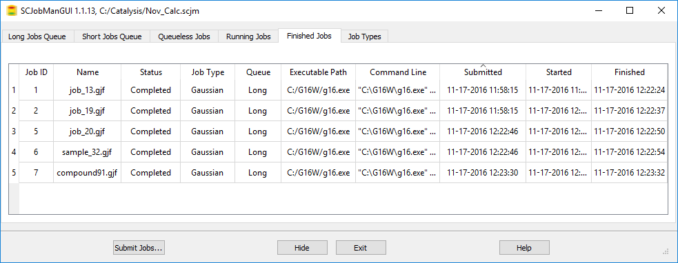

<!-- p.221 -->

The columns in the table have the following meanings:

- 

DBID: This is the database ID for the job type (separate numbering from the jobs themselves).

- 

Name: This is the display name of the application used for running jobs.

- 

Application Name: This is the file name of the application executable used for running jobs.

- 

Executable Path: This displays the path to the executable.

- 

Default Queue: This displays which queue this job type uses by default.

- 

Input File Filter: This specifies what type of input file the job type uses.

- 

Output File Filter: This specifies what type of output file this job type produces.

- 

Environment Variables: Relevant environment variables for this job type.

- 

Generic Command Line: Command line template for launching this job type. This is defined in the Job Setup Preferences.

Right-clicking an item in the Job Types dialog displays the panel’s context menu, which is seen above:

- 

Add Job Type: This allows you add a new job type to the list.

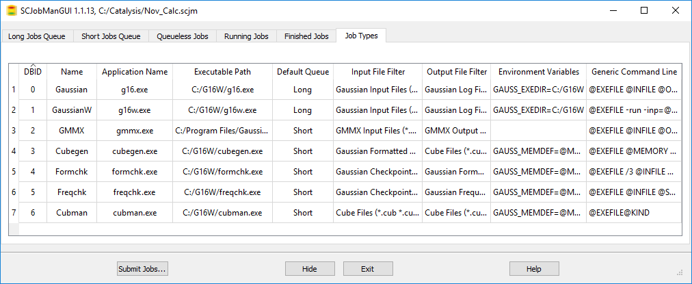

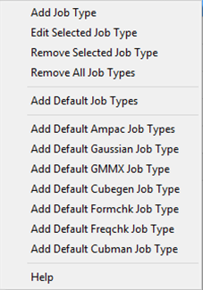

<!-- p.222 -->

- 

Edit Selected Job Type: This allows you to edit the job type (see below).

- 

Remove Selected Job Type: This removes the selected job type from the current list.

- 

Remove All Job Types: This removes all of the job types in the current list.

- 

Add Default Job Types: This option adds all of the default job types that the SCJM begins with.

- 

Add Default Ampac Job Types: This option adds default Ampac jobs.

- 

Add Default Gaussian Job Types: This option adds default Gaussian jobs.

- 

Add Default GMMX Job Types: This option adds default GMMX jobs.

- 

Add Default Cubegen Job Types: This option adds default Cubegen jobs.

- 

Add Default Formchk Job Types: This option adds default Formchk jobs.

- 

Add Default Freqchk Job Types: This option adds default Freqchk jobs.

- 

Add Default Cubman Job Types: This option adds default Cubman jobs.

### Edit Job Type

This option is selected by clicking on Edit Selected Job Type from the context menu. It is displayed below:

Example Job Type: Cubegen Jobs

The dialog contains the following fields:

- 

Name: This is the display name of the application used for running jobs.

- 

Default Queue: This displays which queue this job type uses by default.

- 

Application Name: This is the program name of the application used for running jobs.

- 

Executable Path: This displays the path where the application is.

- 

Generic Command Line: Command line template for launching this job type. This is defined in the Job Setup Preferences.

- 

Input File Filter: This specifies what type of input file the job type uses.

- 

Output File Filter: This specifies what type of output file this job type produces.

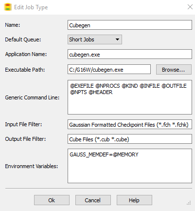

<!-- p.223 -->

- 

Environment Variables: Relevant environment variables for this job type.

Note: This functionality should only be used by someone who has detailed knowledge running Gaussian and its utilities. If you are unsure of what these options are, it is recommended that you not use the Edit Job Type dialog.

## Enabling Use of the SC Job Manager

Select Use SC Job Manager for one or more Applications in the Job Setup Preferences to enable this facility.

Enabling the SC Job Manager for Cubegen Jobs

The Job Setup Preferences dialog allows you to examine and customize how Gaussian and its utilities are launched from within GaussView. It is illustrated below. The Application field at the top of the panel specifies the program or utility whose execution method is currently displayed. Below this popup, there are launch choices, and the command line associated with the selected launch method is displayed in the Command Line area. The values of the GaussView internal variables used in the command line are displayed below the field for your convenience.

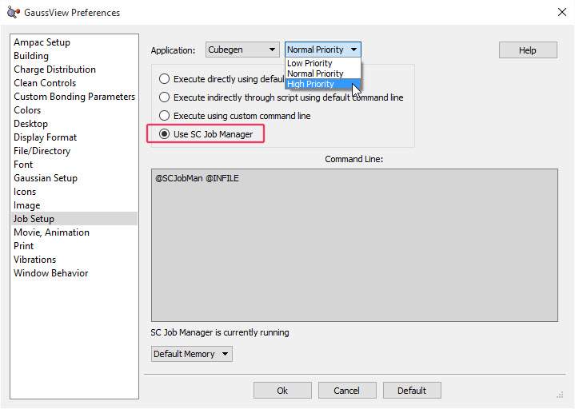

<!-- p.224 -->

Job Setup Preferences This example elects to run Gaussian directly on the local computer via the command line. The grey

box shows the command used to do so (which can be edited). The variables used in the command

line—in uppercase, starting with @—are defined below the Command Line area.

For each job type, there are several launch choices:

- 

Execute directly using default command line: The job will be started on the local system using the command line specified in the lower area.

- 

Execute indirectly through script using default command line: The job will be started on the local system using a GaussView-provided script. These scripts are located in the bin subdirectory of the GaussView installation directory. Their names are listed below. The associated command line appears in the lower area of the dialog. You can customize the script if desired, using a text editor. To use a different script, define a custom command line (see the next bullet).

- 

Execute using custom command line: Use the command line specified in the box to start the job. You can enter whatever command line is appropriate for your situation. The GaussView-provided scripts may be called if desired. Successfully using this feature depends on a clear understanding of the command line invocation of Gaussian and its utilities under the current operating system. Consult the Gaussian User’s Reference for details.

- 

Use SC Job Manager: This functionailty is described in this current document.

The following figure illustrates the command line and other information displayed for running the Gaussian program using the second launch choice:

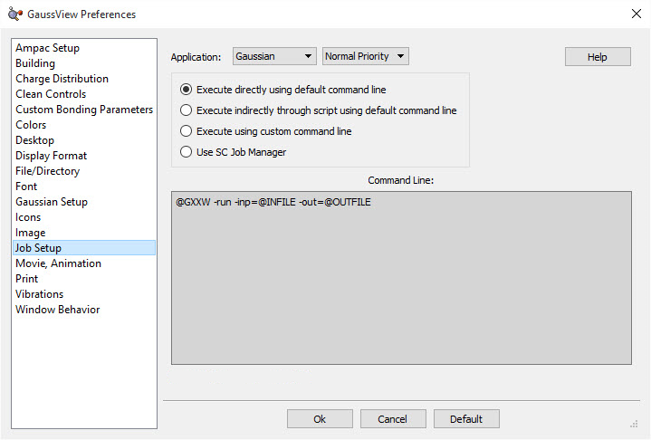

<!-- p.225 -->

Running Gaussian via an External Script This example is from a Windows system. Variable definitions differ on other system types.

## Available Command Line Variables

The following table lists the variables used to access executables and scripts:

Some of the items have additional variables defined for their command lines. Their values are generated from controls within the GaussView interface. See the Gaussian User’s Reference for details on the parameters to the various utilities.

Item Variable(s)

all @INFILE: input file (multiple, numbered input file variables are used in some cases) @OUTFILE: output file

| Item | Direct Execution | Script |
| --- | --- | --- |
| Gaussian program | @GXX (UNIX) @GXXW (Windows) | @GXX_SCRIPT |
| CubeGen utility | @CUBEGEN | @CUBEGEN_SCRIPT |
| CubMan utility | @CUBMAN | @CUBMAN_SCRIPT |
| FormChk utility | @FORMCHK | @FORMCHK_SCRIPT |
| FreqChk utility | @FREQCHK | @FREQCHK_SCRIPT |
| GMMX facility | @GMMX | @GMMX_SCRIPT |
| Gaussian help | @BROWSER | @GAUSSIANHELP_SCRIPT |
| Text editor | @SCFILEEDITOR | @SCFILEEDITOR_SCRIPT |

<!-- p.226 -->

most utilities

@MEMORY: amount of memory to use, specified via the field at the bottom of the dialog:

CubeGen @KIND: type of cube file @NPTS: number of points per “side”? @HEADER: whether to include a header line CubMan @KIND: type of cube file @SCALE: scale factor FreqChk @SAVE: whether to save normal modes @NFD: whether to skip full matrix diagonalization @SEL: whether normal modes will be specified (if applicable) @TEMP, @PRESS, @SCALE: temperature, pressure, scale factor @ISO: alternate isotope selection @PROJ: whether to project out the gradient direction @SELINPUT: list of normal modes to be included (if applicable) Gaussian help @GAUSSIANHELP_URL: location of the Gaussian

## GaussView-Provided Scripts

GaussView provides the following scripts in its bin subdirectory:

Each script’s usage is documented in comments at the beginning of the file. Prudence dictates making a backup copy of any script before modifying it in any way. Unless otherwise specified, all standard UNIX scripts are also provided on Mac OS X systems.

| Menu Item | Linux/UNIX/Mac OS X | Windows |
| --- | --- | --- |
| Gaussian | gv_gxx.sh | gv_gxx.bat |
| Cubegen | gv_cubegen.sh | gv_cubegen.bat |
| Cubman | gv_cubman.sh | gv_cubman.bat |
| FormChk | gv_formchk.sh | gv_formchk.bat |
| FreqChk | gv_freqchk.sh | gv_freqchk.bat |
| GMMX | gv_gmmx.sh | gv_gmmx.bat |
| Gaussian Help | gv_gaussianhelp.sh gv_gaussianhelp_mac.sh (Mac OS X) | gv_gaussianhelp.bat |
| File Editor | gv_fileeditor.sh gv_fileeditor_mac.sh (Mac OS X) | gv_fileeditor.bat |

