# GaussView 6：教程（Tutorials）（p.267–332）

> 多视图/振动动画、建模实例（吡啶、金属羰基物、ONIOM 等）、构象搜索+VCD、PBC 建晶胞系列教程

> 原文件：`../gview6官方说明书.md`（全量单文件存档）｜图片目录：`../imgs/`

---

<!-- p.267 -->

## Animations of Multiview Molecule Groups

The controls on the Molecule Group Animations panel are:

- Repeats: Controls how often, if at all, the animination should repeat after the Start Animation button has been pressed.

- Sequence: Used to play the movie backwards or forwards and combinations of the two.

- Frame Delay (msec): The time, in milliseconds, that the rendering engine waits before moving on to the next image in the movie.

- Endpoint Delay (msec): Indicates, in milliseconds, how long the delay is between the endpoint of the animation and the next loop.

## Animations of Vibrational Frequencies

The controls on the Vibration Animation panel are:

- Repeats: Controls how often, if at all, the animination should repeat after the Start Animation button has been pressed.

- Frames per Cycle: The number of frames the movie is broken into per cycle.

- Frame Delay (msec): The time, in milliseconds, that the rendering engine waits before moving on to the next image in the movie.

Movie/Animation Preferences for Normal Mode Animations

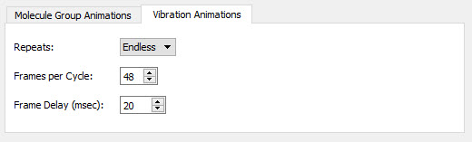

<!-- p.268 -->

## Printing Preferences

The image in the active View window can be printed by selecting File=>Print or clicking on the Print button. The normal operating system Print dialog is then displayed.

Print output is also controlled by settings in the Print Preferences, as shown below. Settings in the Print dialog have precedence over those in the preferences.

GaussView Print Preferences Default values are displayed in this dialog.

The controls in this dialog have the following meanings:

- Object Quality: This slider specifies the quality of the generated print image. Both the time required for rendering and the print job size increase as the slider moves to the Realistic end of the scale.

- Automatically Increase Image Resolution: The default print operation increases the image resolution to match the printer resolution, up to the maximum factor specified in the Limit Image Enlargements to field.

- Limit Image Enlargement to: Specifies the maximum resolution increase for automatic operations. Note that this control does not affect image size (see the next control).

- Enlarge Width and Height by: Increase the image size by the indicated factor. If automatic image resolution is disabled, increasing this may result in poorer quality in the printed image.

- Background Color: Specify the background color for the image. The default is white.

- Gray Scale: Produce a gray scale (toned black-and-white) image. The default is a color image.

The remaining controls specify low-level graphics behavior. Generic Pixel Format says to use the system software renderer. This option should be checked only after rendering problems/failures have been encountered during image capture or printing.

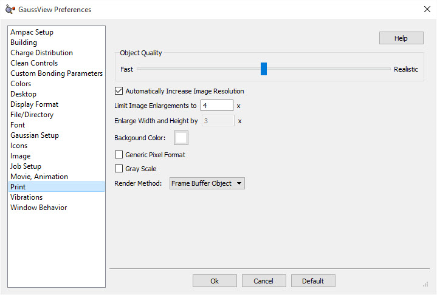

<!-- p.269 -->

The Render Method popup specifies the rendering method to use in generating the image:

The default is Frame Buffer Object. This setting seldom needs to be changed.

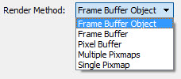

<!-- p.270 -->

## Vibrations Display Preference

Vibration Preferences

This preference specifies the default Display Vibrations dialog settings:

- Displacement Amplitude: The amplitude of atomic displacement in normal mode animations.

- Displacement Vectors: The checkbox controls whether to display the motion associated with the vibration as a displacement vector in the View window. The Scale slider controls the vector’s length.

- Dipole Derivative Unit Vector: The checkbox controls whether to display the dipole derivative unit vector as a vector in the View window. The Scale slider controls the vector’s length.

For both the displacement vectors and the dipole derivative unit vector, you can modify the vector color with the Color control and the vector's thickness with the Radius setting.

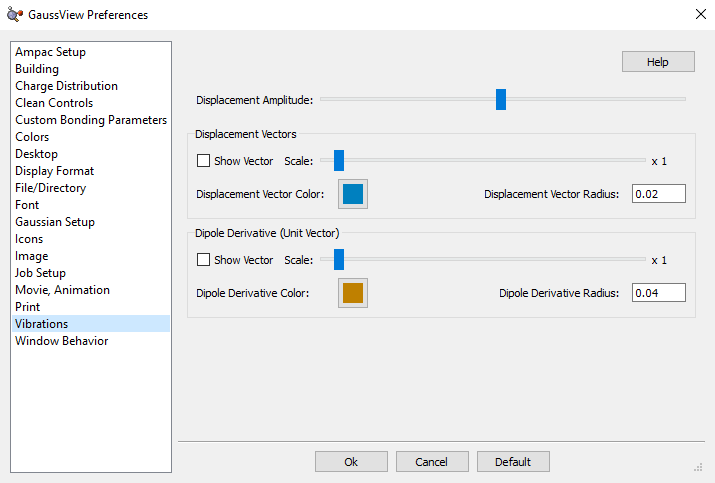

<!-- p.271 -->

## Specifying GaussView Window Behavior

The Window Behavior Preferences, illustrated below, controls how various GaussView window types behave:

Window Behavior Preferences

These settings allow you to force certain window types to remain uppermost, as well as whether an empty View window is automatically created when the program starts.

The Mouse Cursor Tracking in Views popup controls whether the hover over atom display mode is active. By default, holding down F5 causes the atom number and type to be displayed when the cursor hovers over an atom. You can specify that this mode be always on or be disabled using this menu.

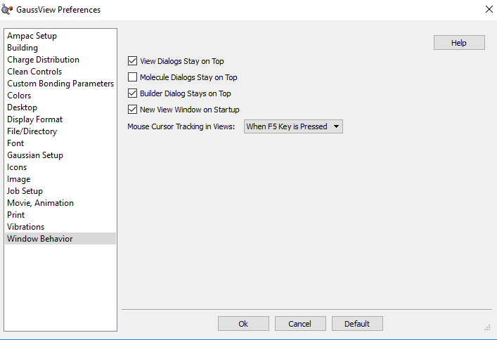

<!-- p.272 -->

## Molecule Building Examples and Strategies

The following examples illustrate how molecules are built in GaussView. As some of the tutorials build on previous material, be sure to save each file when finished.

### 1 - Building Pyridine: Using Untyped Atoms

The following is an example of how Pyridine is built in GaussView:

1-1 Start a new file by selecting the Create New Molecule Group option from the File menu in the main window.

1-2 Opens the Ring Fragment palette by double clicking on the Ring Fragment icon . Select benzene from the ring fragments; a benzene molecule appears in the Current Fragment window. (Alternatively, you can select benzene from the drop-down list in the main toolbar.)

1-3 Return to the View window. Click once: benzene displays.

1-4 Double-click on Element on the Builder window to open the Element Fragment palette. Click on nitrogen within the periodic table to select it. Then click on the N Atom button at the bottom of the palette.

Do not select one of the hybridizations. It is usually easier to use untyped atoms.

1-5 In the View window, click on the carbon atom you want to change to nitrogen.

1-6 Select the Delete Atom button on the Builder window.

1-7 On the View window, delete the hydrogen attached to the nitrogen by clicking on it.

1-8 Click on the Rebond button on the Builder window. Then, click on the Clean button.

You will often want to rebond before cleaning.

Pyridine is now complete. Save your work.

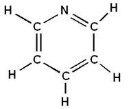

<!-- p.273 -->

### 2 - Building Phenylpyridine: Setting the Angle Between Rings

This example shows how to build Phenylpyridine based on an existing file, in this case, Pyridine.

2-1 We will be continuing from the previous example, Building Pyridine.

2-2 Double-click on Ring Fragment on the Builder window. Be sure that the benzene ring is selected.

2-3 Click on the hydrogen atom located on the carbon atom opposite the nitrogen atom on the View window. A second ring is attached to the first ring in place of the hydrogen.

2-4 Select the Modify Dihedral button on the Builder window.

2-5 Select atoms between the two rings, as shown in the following figure:

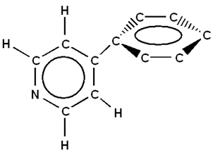

<!-- p.274 -->

The SmartSlide window opens when four atoms have been selected; make sure that Rotate Groups is selected for both Atoms 1 and 4.

#### Modifying the Dihedral Angle

2-6 Move the slider to create a dihedral until the rings are perpendicular to each other (or enter 90.0 in the text box).

Click on the OK button.

Phenylpyridine is now complete.

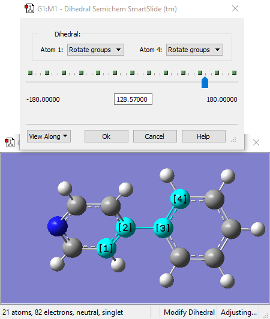

<!-- p.275 -->

### 3 - Building Iron Pentacarbonyl: Selecting the Best Templates for a Given Task

This example builds iron pentacarbonyl.

3-1 Start a new file by selecting the New=>Create Molecule Group option from the File menu in the View window. Select the element iron, and then choose the trigonal bipyramidal iron template:

3-2 Return to the View window. Click once: the iron molecule displays.

3-3 Double-click on R-Group Fragment on the Builder window to open the R-Group Fragment palette. Select the linear C-N template, and place this group on each bond to the iron atom. Note that we select this template rather than one of the C-O groups because the former is linear.

3-4 Change the nitrogen atoms to oxygen atoms: select the element oxygen and then the free atom template (using either the choices at the bottom of the Element Fragment palette or the drop-down list on the main screen).

The molecule is now complete.

Note: This technique applies directly to versions of GaussView prior to version 6. The latter adds a carbonyl ligand group which is linear. When using it, the triple bonds should be changed to double bonds prior to clearing the molecule.

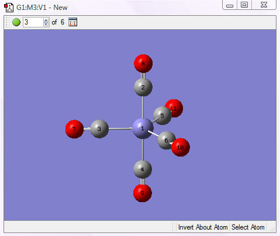

<!-- p.276 -->

### 4 - Building Tyrian Purple Dye: Appending a Structure

The following is an example of how a Tyrian purple dye 6,6'-dibromoindigo is built in GaussView:

4-1 Create a new file. Double-click on Ring Fragment on the Builder window to open the Ring Fragment palette.

4-2 Select the fused 5 and 6 carbon rings on the Builder window (see illustration immediately above), and then click on the View window to place a fragment.

4-3 Select the oxygen element and change the appropriate hydrogen atom in the five-member ring to oxygen by clicking on it.

4-4 Change the carbon atom opposite the oxygen to nitrogen.

4-5 Change the hydrogen atom on the outermost carbon atom in the six-member ring (on the same side as the nitrogen) to bromine in a similar manner.

4-6 Select Clean on the Builder window. Do not rebond.

4-7 Select all of the atoms in the current molecule by pressing the A key. Then choose Edit=>Copy; the molecule will appear in the Current Fragment window. Click in the View window to paste the current fragment.

4-8 Rotate and move the second ring so that the two carbon atoms to be bonded are close together and oriented properly with respect to one another.

To affect just one of the two fragments, hold down the Alt key while dragging the mouse. Using a second window is often helpful when performing complex positioning operations. Use the Add View option on the View menu to create one.

4-9 Delete the hydrogen atoms on the two carbon atoms to be bonded.

4-10 Create a double bond between the two carbon atoms: select the Modify Bond icon on the Builder window, and then click on the two carbon atoms to be bonded. The SmartSlide window opens; choose the double bond option from the BondType list, and click OK.

4-11 Click on Clean.

The 6,6'-dibromoindigo molecule is now complete.

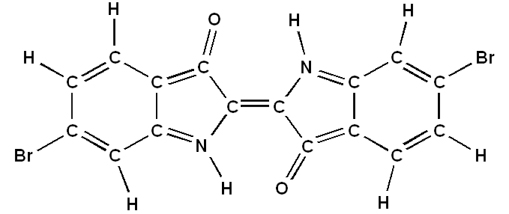

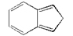

<!-- p.277 -->

Save your work.

### 5 - Docking Two Structures: Building Bichloro-Diphenyl

This example illustrates a method for building a molecular structure consisting of docked framents.

5-1 Create a new View window, and place a benzene ring in it. Change one of the hydrogen atoms to Chlorine. Repeat this process to create a second chlorobenzene ring.

5-2 Rotate one of the rings so that the chlorine atom is in the opposite position to the one in the first ring. You can accomplish this by holding down the Alt key while holding down the left mouse button and dragging:

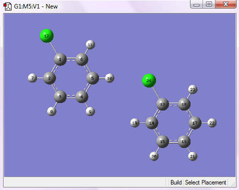

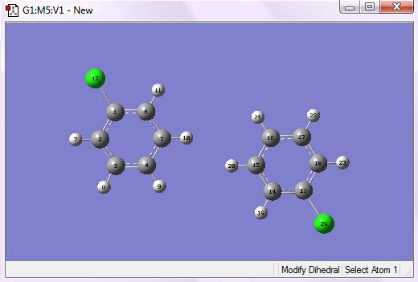

<!-- p.278 -->

5-3 Position the rings so that they overlap and the carbon atoms to be bonded are in the correct position:

5-4 Delete the hydrogen atoms and dangling bonds in the overlap region.

5-5 Create a bond between the two carbon atoms, completing the molecule:

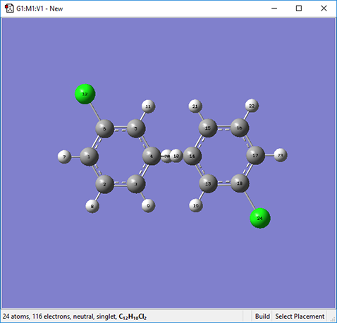

<!-- p.279 -->

5-6 Click on Clean; the molecule is now complete.

### 6 - Assigning Atoms to ONIOM Layers in a Small Peptide Chain

Note: This example is devised for its illustrative clarity rather than for scientific interest. Your molecule may look different from the figures below.

6-1 Create a peptide chain containing these amino acids: Phe-Ala-Gly: use the Biological Fragment palette to choose an Amino-Terminal Phenylalanine, a Central Fragment Alanine, and a Carboxyl-Terminal Glycine, adding each in turn to the the same View window.

6-2 Assign all atoms to the Low layer. Choose Select Layer from the Tools menu, and then click Select All. Verify that the current layer is set to Low. The display will look similar to the following figure.

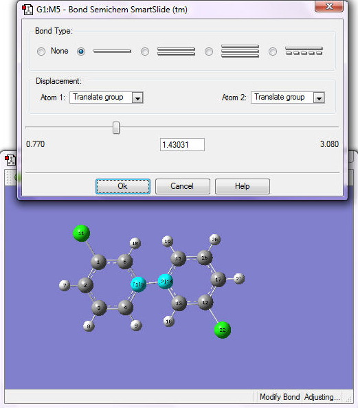

<!-- p.280 -->

Click Apply.

6-3 Assign the following atoms to the Medium layer: all atoms in Ala, carbons in Ring in Phe, and atoms up to the double bond in Gly. Use any selection method you want; it will usually take two or more operations to assign all these atoms. For example, you can select the central carbon atom in Ala and drag the Expand Selection slider to add more atoms. Adding too few atoms is usually easier than adding too many. Click Apply.

Add additional atoms as necessary (use the center mouse button [or Shift+Click] to select, and then click Apply) until the selection is correct as in the following figure. The atoms in the Medium layer are now displayed as tubes, and the ones in the Low layer are in wireframe in the display:

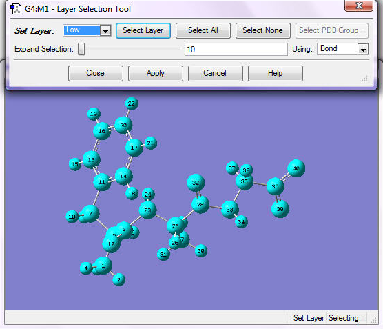

<!-- p.281 -->

6-4 Assign the following atoms to the High layer: all atoms in Ala, including heavy atoms bonded to them. One selection method is to click the central carbon in Ala, change the Using field to Distance, and click twice at the right end of Expand Selection. The display will be as in the following figure:

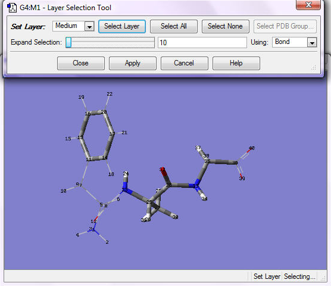

<!-- p.282 -->

Click Apply. The display is as in the following figure:

Completed ONIOM-Assigned Molecule

Click Close. The atom layer assignment is now complete.

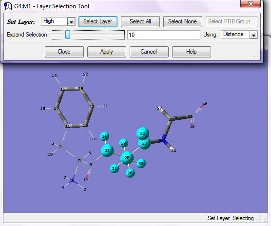

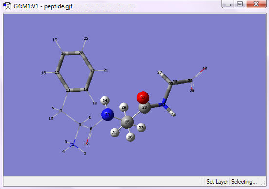

<!-- p.283 -->

### 7 - Setting Up an ONIOM Job

This example uses the molecule that was built and the layers that were defined in the final example in the Building Tutorial, and it continues on from those steps.

7-1 Select Gaussian Calculation Setup from the Calculate menu.

7-2 On the Method tab, check Multilayer ONIOM Model. Three tabs appear (High, Medium, and Low) in the Method section, which you can use to select the methods for treating each layer of atoms.

7-3 Click on the High tab, and then select an RHF/6-31G job:

7-4 Click on the Medium tab, then select an AM1 job:

7-5 Click on the Low tab, and specify a molecular mechanics calculation using the Amber force field:

7-6 These settings place the following line in the job’s route section:

`ONIOM=(RHF/6-31G:AM1:Amber)`

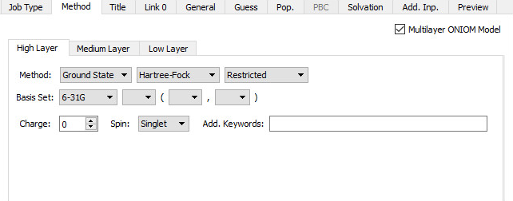

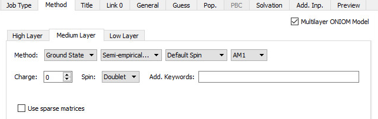

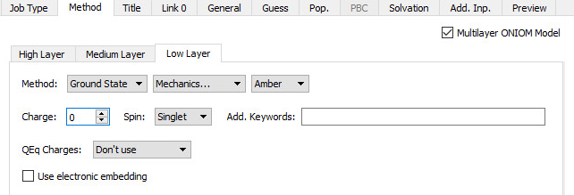

<!-- p.284 -->

You can now go on to fill out the rest of the dialog box, and the job will be ready to be saved and run.

<!-- p.285 -->

## GMMX Conformer Tutorial

The following tutorial illustrates how to perform a conformational search and predict their Boltzmann-weighted spectra. It has three parts:

- Performing the Conformational Search

- Preparing and Running the Calculations

- Examining the Results

## Part 1: Performing a Conformational Search

1-1 Open or build one conformation of the molecule whose spectrum you want to analyze. We chose desflurane because of its simplicity and ease of illustration. You can find our starting file, desflurane_start, in the gmmx-tut subfolder of the help folder in the main GaussView installation directory.

1-2 Choose Calculate=>GMMX Conformer Dialog, and the GMMX Conformer Calculation window will appear.

1-3 We want to use the defaults for this calculation, so simply click Submit.

1-4 GaussView will prompt you to save a .GMMX file before it runs the conformational search. Click Save, and the standard Save window will open.

1-5 Provice a file name and then click Save. You will be prompted to submit the job to GMMX. Choose Submit.

1-6 When the conformation search completes, a dialog will appear, asking you which results file to open. Open the .SDF file:

<!-- p.286 -->

Note: There may be additional columns visible in the file list.

The Open .SDF File Dialog

1-7 The resulting dialog contains a list of the conformers the calculation found. In some cases, there will be duplicates.

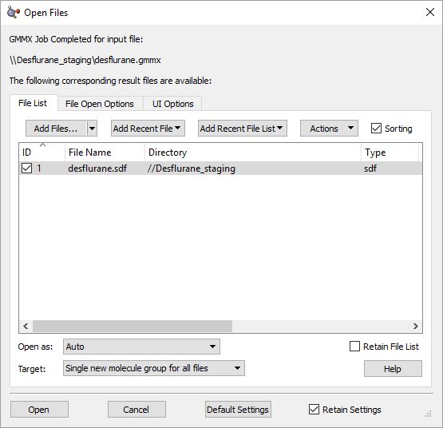

<!-- p.287 -->

The Reading .SDF File Dialog Use this window to select the conformations to examine. The selected ones will be opened in a new molecule group. Duplicates will have been automatically eliminated.

1-8 We select all of the conformers initially and open them by clicking Select All and then Ok. Then from the Results menu, we choose Energy Plot, which opens the Energy Plot window:

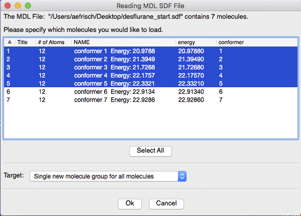

<!-- p.288 -->

The Energy Plot Window Use this window to determine which conformations should be retained.

The graph shows the energy (Y-axis) for each conformation (X-axis). This plot makes it easy to identify conformations with nearly the same energy. By stepping through the resulting plot, we can compare the structures and identify the physically distinct ones. For the purposes of this tutorial, we will work with conformations 1 through 6.

1-9 Once we have selected the conformations for which we want to run additional calculations, we close the .SDF file and reopen it by selecting its name from the File=>Recent Files list. Be sure that the Target drop-down is set to Single new molecule group for all molecules. The following molecule group will result (which we've annotated here with conformer identifications):

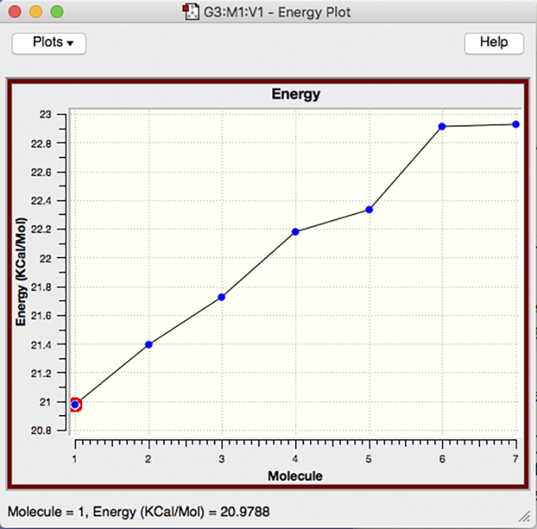

<!-- p.289 -->

Conformations of Desflurane

## Part 2: Preparing the Optimization and VCD Calculations

2-1 We now need to optimize the structures of the various conformation with a more accurate model chemistry and then predict their VCD spectra. Set up an Optimization+Frequency calculation using GaussView to do this, using the APFD/ 6-311+G(2d,p) model chemistry (or a different one of your choice). Check the Compute VCD button on the Job Type panel.

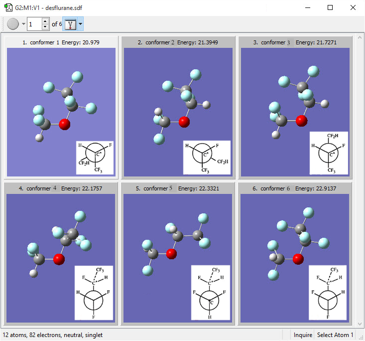

<!-- p.290 -->

The Gaussian Calculation Setup Window This window sets the parameters for the Gaussian calculation. The Assign to Molecule Group button applies them to the whole molecule group.

2-2 You can specify the job’s parameters by hand or by using a scheme.

2-3 Assign the job to the whole molecule group by clicking the Assign to Molecule Group button at the bottom right of the dialog.

2-4 Press Submit, and you will be prompted to save the input files in the subsequent window.

2-5 Click Advanced in order to open the Advanced Save dialog. This will allow us to save the input files for all 6 conformations in a single step.

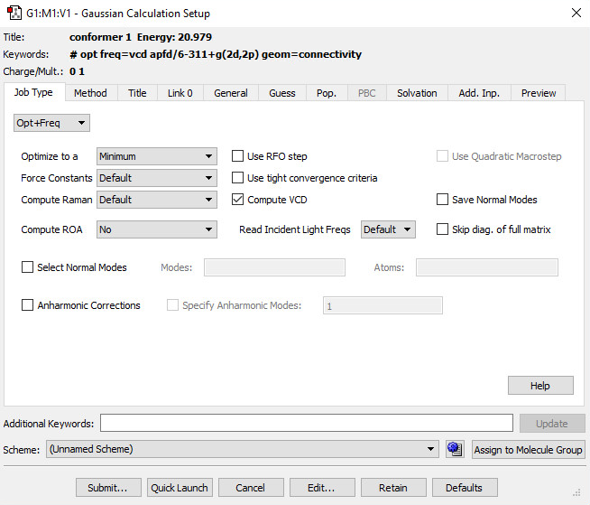

<!-- p.291 -->

Accessing the Advanced Save Dialog Click on the Advanced button in the Basic Save dialog.

2-6 Set Save Molecule Group to Yes, separate file for each molecule.

2-7 Right click and then choose Select Actions=>All Items=>Set Files in order to designate the base file name and directory location for the files. We used the base name desflurane.

2-8 Select Actions=>All Items=>Include molecule numbers in file names. This will add a number to the base file name for each conformer, making them unique. This process is shown below.

Adding Molecule Numbers to the File Names

2-9 Be sure that the checkbox in the first column of each row is checked. This tells GaussView whether to save the corresponding file. Then click Save.

2-10 Once the files are saved, GaussView will prompt you to submit to each job. If you choose to do so, the resulting dialogs will differ depending on whether you are using the SC Job Manager (specified in the Job Setup Preferences).

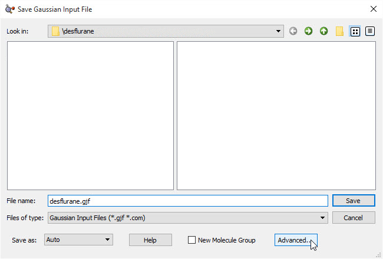

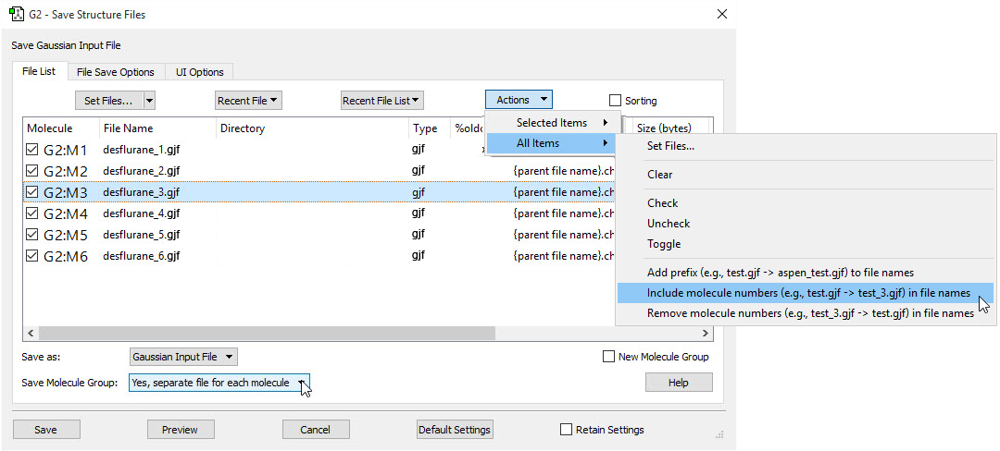

<!-- p.292 -->

However, for the purposes of this tutorial, do not actually submit the jobs. We have provided the log files in the help/gmmxtut subfolder of the main GaussView installation location (help\gmmx-tut under Windows systems).

## Part 3: Examining the VCD Spectra

3-1 Open the log files. They are in the gmmx-tut subfolder of the help folder under the GaussView installation directory:

Opening the Results Files

Be sure that the Target is set to Single new molecule group for all files. This allows you to open all the files as a single molecule group.

3-2 Select Results=>Vibrations, which will open the following window. In the Vibrations window, click on the Spectra button, then choose Mixture Spectra.

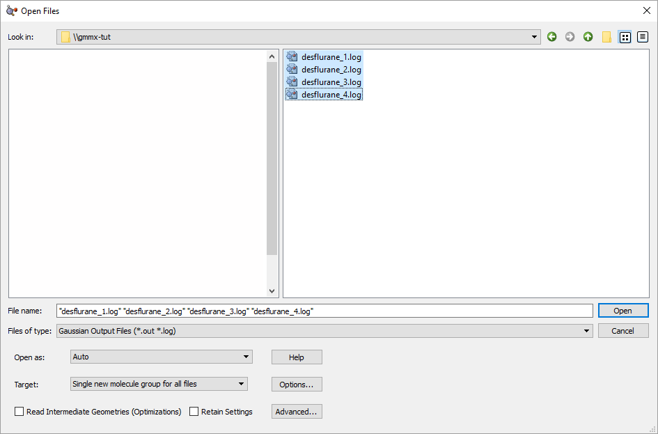

<!-- p.293 -->

The Vibrations Window Opening the composite spectrum window.

3-3 The Vibrational Spectra of Mixture window will appear. Close the IR Spectrum plot by clicking Plots in the upper left and deselecting IR Spectrum from the list. The VCD spectrum plot is displayed below.

The Vibrational Spectra of Mixture Window The spectra defaults to curve and stick representation, resulting in a "busy" plot.

Note that each conformer’s data appears twice: as both a curve plot and as a stick plot. Thus, this display is busy and hard to interpret.

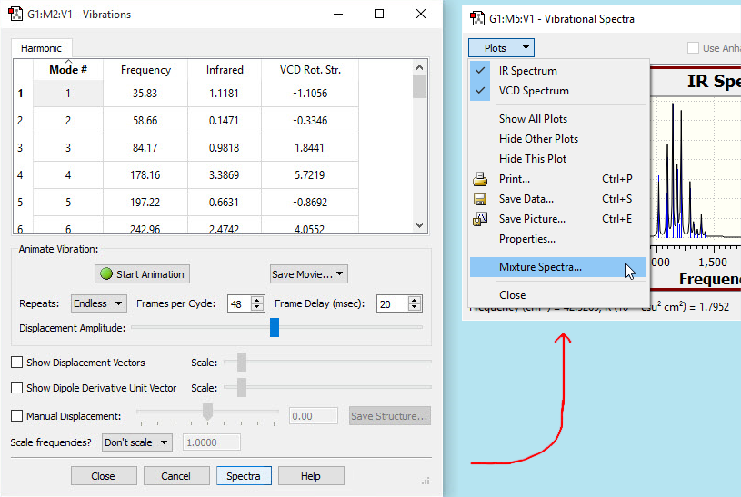

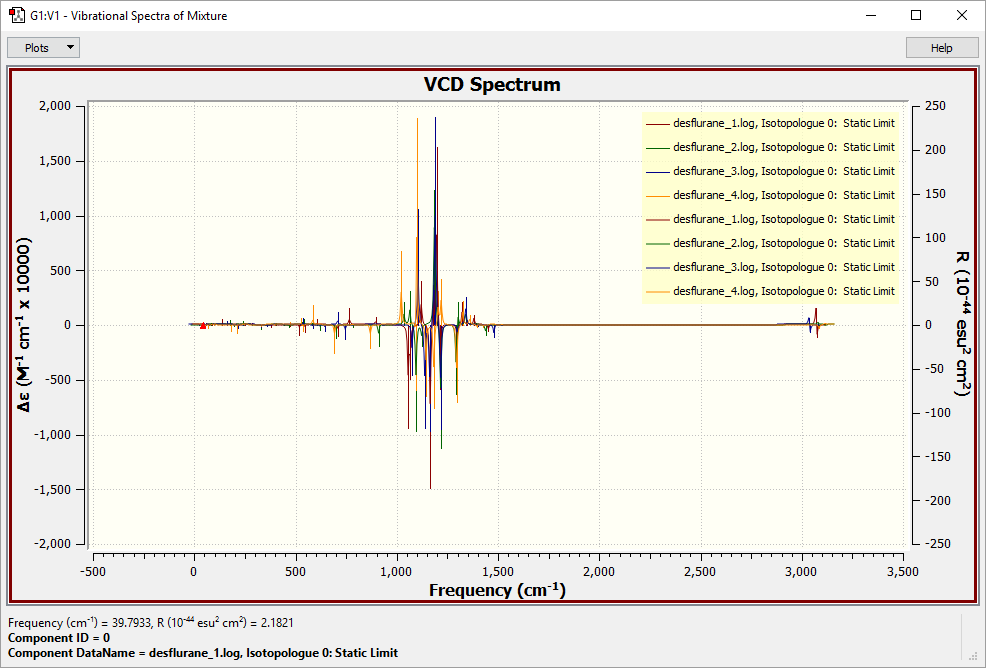

<!-- p.294 -->

3-4 We used the Mixture Editor (Plots=>Mixture Editor) to make the plot easier to understand, we changed the Plot Style field of each spectrum to Curve (the default is Sticks and Curve). Set Plot Style in the Combination area to None.

Modifying the Plot with the Mixture Editor

This produces the following spectra graph, which is much simpler to read. It is also zoomed to show the relevant parts of the spectra.

VCD Spectrum of Desflurane We have removed the sticks plot for each conformer.

3-6 Go back to Mixture Editor. Click the Use Boltzmann Populations as Weights box above the conformation list. The weight values will be changed to their population fraction.

3-7 For demonstration purposes, we will remove most of the curves from the spectrum. Set the Plot Style to None for all but the first two conformations.

3-8 Add the Boltzmann-averaged combination plot by selecting Plot Style=>Curve in the Combination area. Then click Curve Pen. Set the curve pen to be thicker, dotted and its color to be red, as shown below.

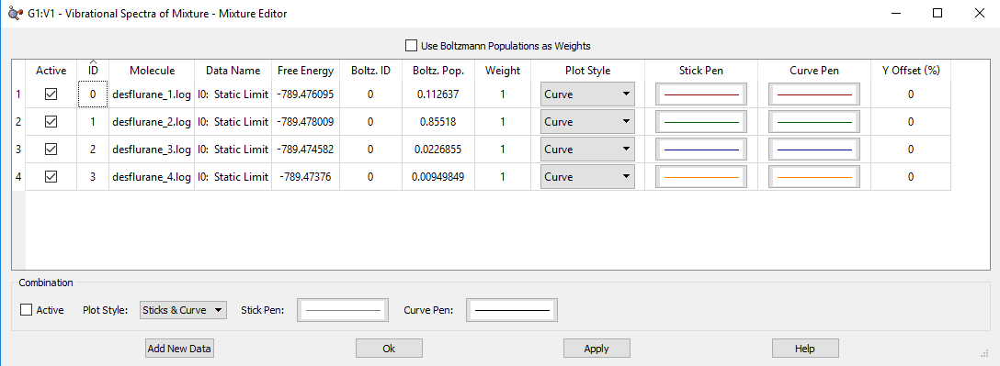

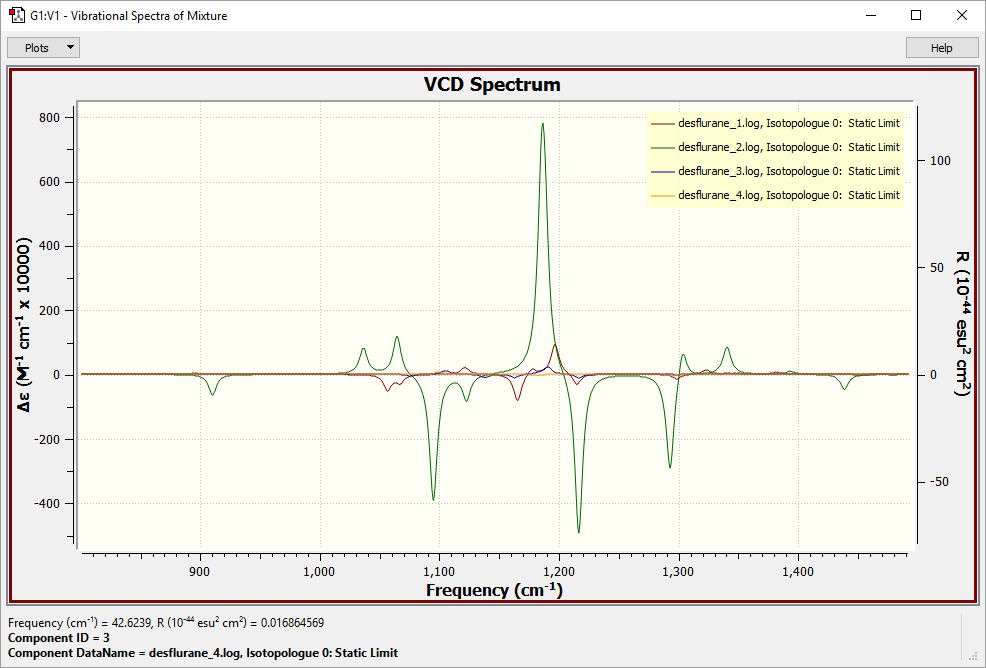

<!-- p.295 -->

Modifying the Curve Appearance

Click Ok to close the Mixture Editor. These changes produce the following plot.

Final Spectra Display The composite spectrum is shown as a dotted red curve.

This spectrum display can be saved, customized, and printed as usual.

3-9 Close the spectrum display and the Vibrations dialog. Select Results=>Molecule Group Table from the menu. This opens a window where you can view the key calculation results in a tabular form:

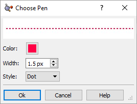

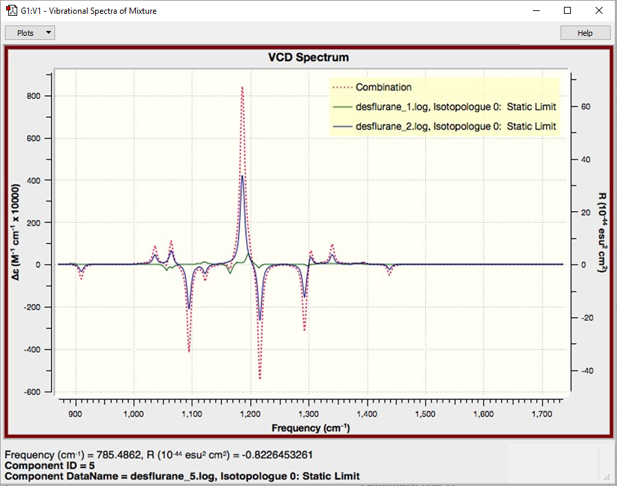

<!-- p.296 -->

Default Molecule Group Table Display

It is possible to customize this table; the exact options depend on the job type. Here, we have added the 3D View column and changed the magnification and orientation for each conformation:

The Customized Molecule Group Table Window

Experiment with different options within the Molecule Group Table to acquaint yourself with its features.

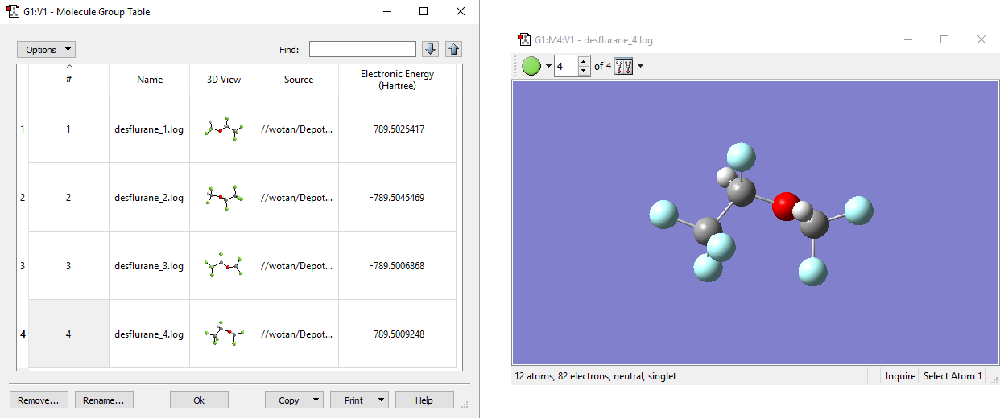

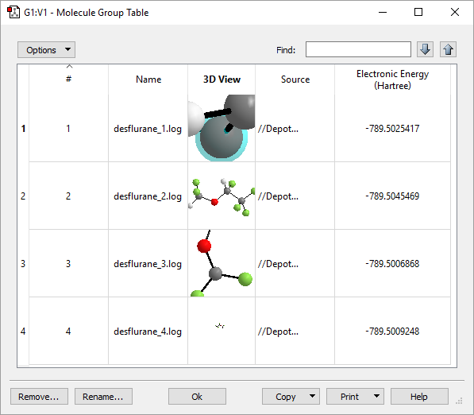

<!-- p.297 -->

## Periodic Boundary Conditions (PBC) Tutorials

### Tutorial 1 - Build a Trans-Polyacetylene Polymer From Ethylene, PBC/1D

1-1 Start a new file by selecting the Create New Molecule Group option from the File menu in the main window.

1-2 Make the vinyl fragment (ethylene) the “current fragment” by double-clicking on the R-Group Fragment toolbar button and then clicking on the “vinyl” button in the R-Group Fragment palette.

1-3 Click anywhere in the empty View window to create and ethylene molecule.

1-4 Center the molecule in the View window by clicking on the Center toolbar button.

1-5 Turn on atom labels for the View window by checking Labels from the View menu of the main window.

1-6 In the View window, click on atom 5 of ethylene to create a trans-butadiene molecule.

1-7 Show the PBC dialog for the molecule by selecting PBC from the Tools menu of the main window.

1-8 In the Symmetry tab of the PBC dialog, select One from the Lattice Dimensions drop-down list.

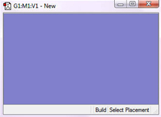

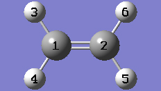

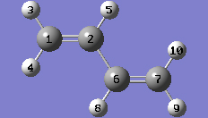

<!-- p.298 -->

1-9 In the Cell tab of the PBC dialog, push down the Place button, and make sure Vertex Only is selected to enable placement of the cell origin (O (0)) vertex at any atom selected in the View window, using the mouse. In the View window, click on atom 2.

1-10 In the Cell tab of the PBC dialog, select a (1) instead of O (0) to enable placement of the “a” cell vertex at any atom selected in the View window using the mouse. In the View window, click on atom 7.

1-11 In the Cell tab of the PBC dialog, select Delete All Atoms Outside Cell from the Trim Contents drop-down list.

1-12 In the Cell tab of the PBC dialog, click on the Center Contents button.

1-13 At this point, we have defined a primitive unit cell for a PBC/1D model of trans-polyacetylene polymer.

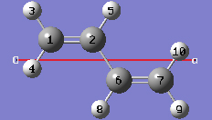

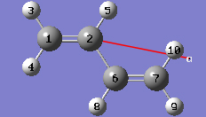

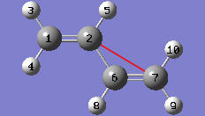

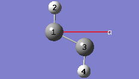

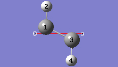

<!-- p.299 -->

1-14 In the View tab of the PBC dialog, show two cells along the “a” axis by selecting 2 from the corresponding spin box in the Cell Replication section. By default, the contents of replicate cells are shown in Low Layer format.

1-15 In the View tab of the PBC dialog, select Normal from the Replicate Contents Display drop-down list to show the contents of the replicate cells in the same format as the reference unit cell contents.

1-16 In the Contents tab of the PBC dialog, select the Rebond Intercell item from Bonds popup menu to update the bonding between atoms in adjacent cells.

1-17 Both of the unique CC bond lengths are too long in comparison to experiment. Change the intracell bond length between atoms 1 and 3 by clicking on the Modify Bond toolbar button and then clicking on atoms 1 and 3 in the same cell in the View window. In the corresponding Semichem Smartslide dialog, change the bond length value from 1.54 to 1.44 in the input field and then click on the OK button.

1-18 Change the intercell bond length between atoms 1 and 3 by clicking on the Modify Bond toolbar button and then clicking on atoms 3 and 1 in adjacent cells in the View window. In the corresponding Semichem Smartslide dialog, change the bond length value from 1.38253 to 1.36 in the input field and then click on the OK button.

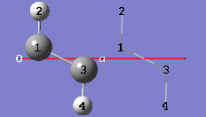

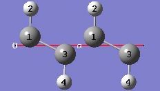

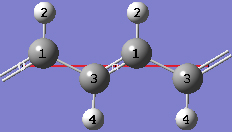

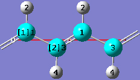

<!-- p.300 -->

1-19 In the Contents tab of the PBC dialog, select the Rebond All item from the Bonds popup menu to update the bonding between atoms in the same cell as well as in adjacent cells.

1-20 In the View tab of the PBC dialog, click on the Combine button in the Cell Replication section. This will cause the reference unit cell and the replicate unit cell shown on screen to be combined into a larger “supercell” that is twice the primitive unit cell. Note the atom number changes. Note also that the number of cells being viewed is automatically reduced to one.

### Tutorial 2 - Build a Graphite Sheet From Benzene, PBC/2D

2-1 Start a new file by selecting the Create New Molecule Group option from the File menu in the main window.

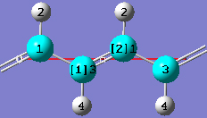

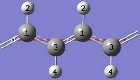

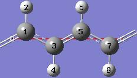

<!-- p.301 -->

2-2 Make the benzene fragment the “current fragment” by double-clicking on the Ring Fragment tool button and then clicking on the “benzene” button in the Ring Fragment palette.

2-3 Click anywhere in the empty View window to create a benzene molecule.

2-4 Center the molecule in the View window by clicking on the Center toolbar button.

2-5 Turn on atom labels for the View window by selecting Labels from the View menu.

2-6 Show the Point Group dialog for the molecule by selecting Point Group from the Tools menu of the main window. In the Point Group dialog, check the Enable Point Group Symmetry box and click on the Symmetrize button to symmetrize benzene to D6h. Then, select D6h from the Constraint to Subgroup drop-down list.

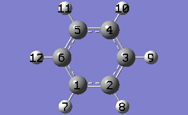

<!-- p.302 -->

2-7 Change the CC bond lengths to match the experimental values for graphite. Click on the Modify Bond toolbar button and then click on atoms 1 and 2 in the the view window. In the corresponding Semichem Smartslide dialog, change the bond length value from 1.39499 to 1.42 in the input field and then click on the OK button. Note that all of the CC bond lengths have increased to 1.42 to preserve the D6h symmetry. In the Point Group dialog, uncheck the Enable Point Group Symmetry box, and then click the OK button.

2-8 Show the PBC dialog for the molecule by selecting PBC from the Tools menu of the main window.

2-9 In the Symmetry tab of the PBC dialog, select Two from the Lattice Dimensions drop-down list.

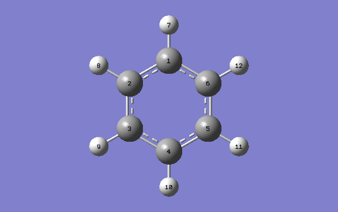

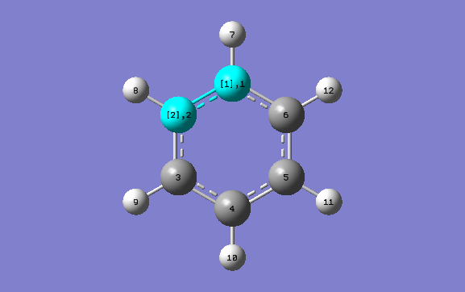

<!-- p.303 -->

2-10 In the Cell tab of the PBC dialog, push down the Place button, and make sure Vertex Only is selected to enable placement of the cell origin (O (0,0)) vertex at any atom selected in the view window using the mouse. In the View window, click on atom 6.

2-11 In the Cell tab of the PBC dialog, select a (1,0) instead of O (0,0) to enable placement of the “a” cell vertex at any atom selected in the View window using the mouse. In the View window, click on atom 2.

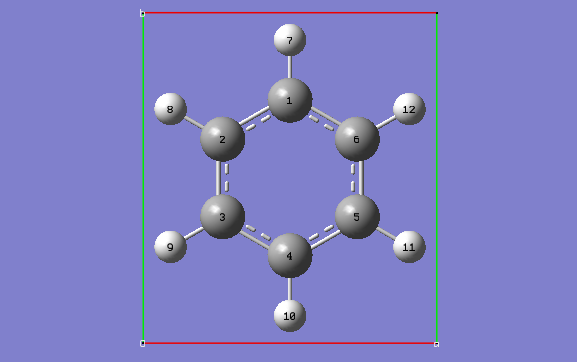

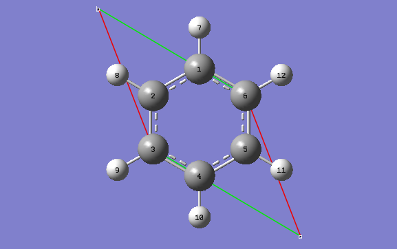

<!-- p.304 -->

2-12 In the Cell tab of the PBC dialog, select b (0,1) instead of a (1,0) to enable placement of the “b” cell vertex at any atom selected in the View window using the mouse. In the View window, click on atom 4.

2-13 In the Cell tab of the PBC dialog, select Delete All Atoms Outside Cell from the Trim Contents drop-down list.

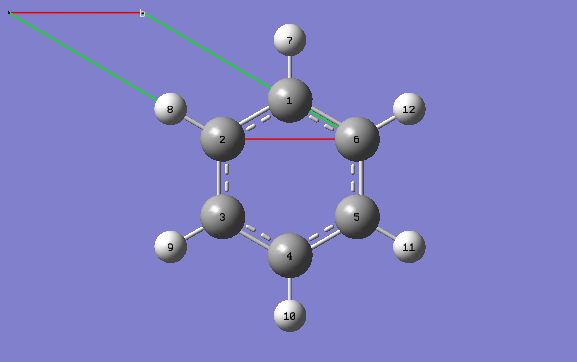

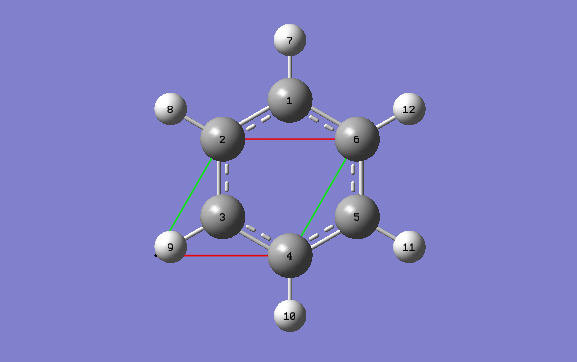

<!-- p.305 -->

2-14 Delete the hydrogen atom by clicking on the Delete Atom toolbar button and then clicking on the hydrogen atom in the View window.

2-15 In the Cell tab of the PBC dialog, click on the Center Contents button.

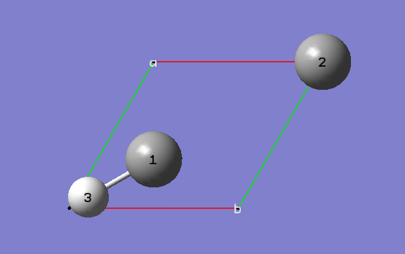

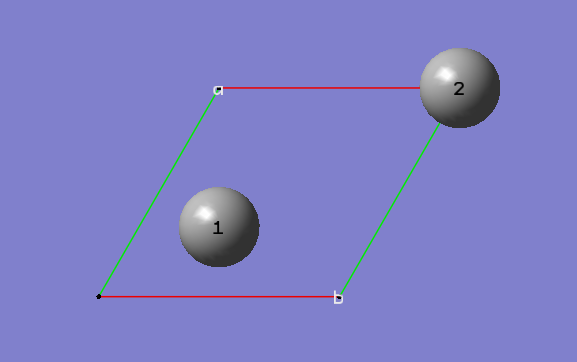

<!-- p.306 -->

2-16 At this point, we have defined a primitive unit cell for a PBC/2D model of graphite.

2-17 In the View tab of the PBC dialog, show three cells along both the “a” and “b” axes by selecting 3 from the corresponding spin boxes in the Cell Replication section. By default, the contents of replicate unit cells are shown in Low Layer format.

2-18 In the View tab of the PBC dialog, select Normal from the Replicate Contents Display drop-down list to show the replicate contents in the same format as the reference unit cell contents.

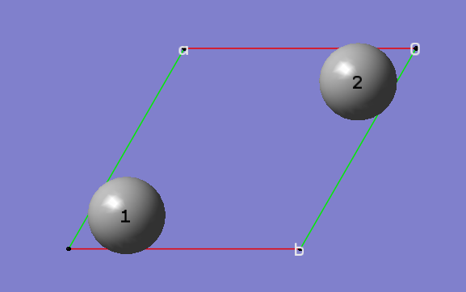

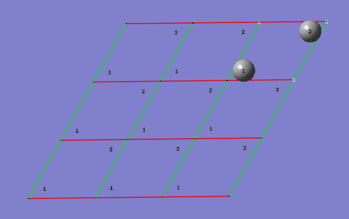

<!-- p.307 -->

2-19 In the Contents tab of the PBC dialog, select the Rebond All item from Bonds popup menu to update the bonding between all atoms.

2-20 In the View tab of the PBC dialog, click on the Combine button in the Cell Replication section. This will cause the reference unit cell and the replicate unit cells shown on screen to be combined into a larger “supercell” that is nine times the primitive unit cell. Note the atom number changes. Note also that the number of cells being viewed is automatically reduced to one to avoid potential confusion.

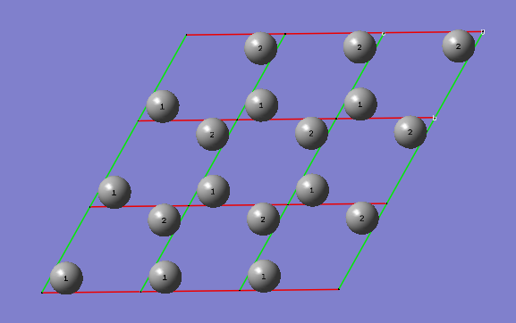

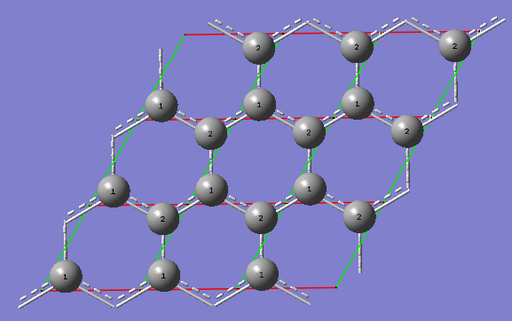

<!-- p.308 -->

### Tutorial 3 - Build a Primitive Unit Cell of Diamond Crystal From Methane, PBC/3D

3-1 Start a new file by selecting the Create New Molecule Group option from the File menu in the main window.

3-2 Make the Carbon Tetrahedral fragment the “current fragment” by double-clicking on the Element Fragment tool button and then clicking on Carbon and then Carbon Tetrahedral in the Element Fragment palette.

3-3 Click anywhere in the empty View window to create a methane molecule.

3-4 Center the molecule in the View window by clicking on the Center toolbar button and then position the molecule so all atoms are visible.

3-5 Turn on atom labels for the View window by checking Labels from the View menu of the main window.

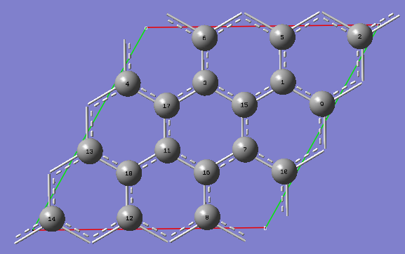

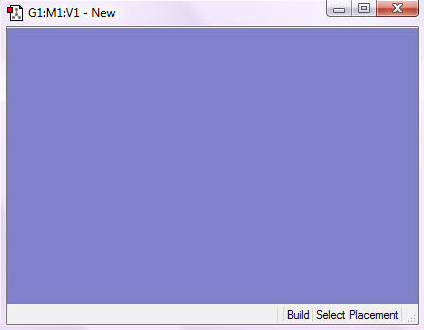

<!-- p.309 -->

3-6 Show the Point Group dialog for the molecule by selecting Point Group from the Tools menu of the main window. In the Point Group dialog, check the Enable Point Group Symmetry box, and then select Td from the Constraint to Subgroup drop-down list.

3-7 Change the CH bond lengths to match the experimental values for the diamond CC bond length. Click on the Modify Bond toolbar button, and then click on atoms 1 and 2 in the the View window. In the corresponding Semichem Smartslide dialog, change the bond length value from 1.07 to 1.54 in the input field, and then click on the OK button. Note that all of the CH bond lengths have increased to 1.54 to preserve the Td symmetry. In the Point Group dialog, uncheck the Enable Point Group Symmetry box, and then click the OK button.

3-8 Show the PBC dialog for the molecule by selecting PBC from the Tools menu of the main window.

3-9 In the Symmetry tab of the PBC dialog, select Three from the Lattice Dimensions drop-down list.

3-10 In the Cell tab of the PBC dialog, push down the Place button to enable placement of the cell origin (O (0,0,0)) vertex at any atom selected in the View window using the mouse. In the Moving drop-down list, select Whole Cell instead of Vertex Only so that the whole cell will be translated rather than just the cell origin vertex. In the View window, click on atom 3.

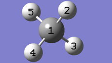

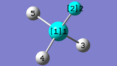

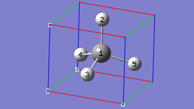

<!-- p.310 -->

3-11 In the Cell tab of the PBC dialog, select a (1,0,0) instead of O (0,0,0) to enable placement of the head of the “a” lattice vector at any atom selected in the View window using the mouse. In the Moving drop-down list, select Vertex Only instead of Whole Cell so that just the “a” vertex will be translated rather than the whole cell. In the View window, click on atom 5.

3-12 In the Cell tab of the PBC dialog, select b (0,1,0) instead of a (1,0,0) to enable placement of the head of the “b” lattice vector at any atom selected in the View window using the mouse. In the View window, click on atom 4.

3-13 In the Cell tab of the PBC dialog, select c (0,0,1) instead of b (0,1,0) to enable placement of the head of the “c” lattice vector at any atom selected in the View window using the mouse. In the View window, click on atom 2.

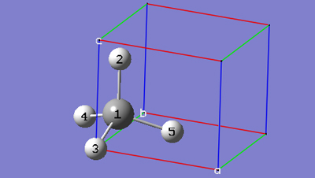

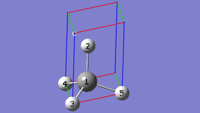

<!-- p.311 -->

3-14 In the Contents tab of the PBC dialog, select the Delete=>All Redundant Atoms item from the Edit menu of the Atom List editor.

3-15 In the Contents tab of the PBC dialog, change the hydrogen atom to a carbon atom atom by editing the second row of the Symbol column in the Atom List editor.

3-16 In the Contents tab of the PBC dialog, select Rebond All from the Bonds popup menu.

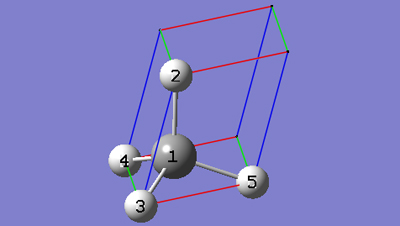

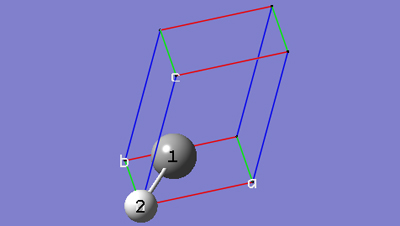

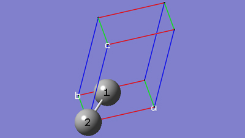

<!-- p.312 -->

3-17 The bonds between reference unit cell atoms and replicate cell atoms are shown in the replicate format, which is Low Layer by default. In the View tab of the PBC dialog, select Dull from the Replicate Contents Display drop-down list in order to better see the bonds in this case.

3-18 At this point, we have defined a primitive unit cell for a PBC/3D model of a diamond crystal.

3-19 In the View tab of the PBC dialog, check the Show All Boundary Atoms checkbox to show all atoms in or on the boundary of the cell.

3-20 In the View tab of the PBC dialog, show two cells along each of the “a,” “b,” and “c” axes by selecting 2 from the corresponding spin boxes in the Cell Replication section.

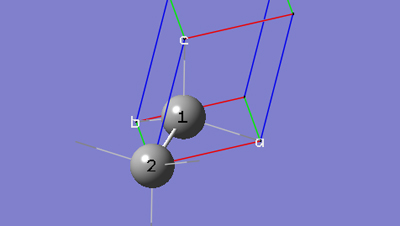

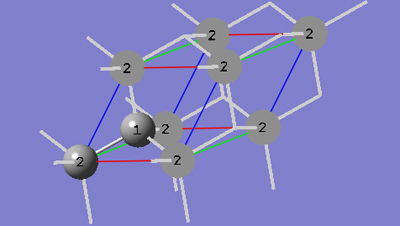

<!-- p.313 -->

3-21 In the View tab of the PBC dialog, click on the Combine button in the Cell Replication section. This will cause the reference unit cell and the replicate unit cells shown on screen to be combined into a larger “super” unit cell that is 8 times the primitive unit cell. Note the atom number changes. Note also that the number of cells being viewed is automatically reduced to one to avoid potential confusion.

### Tutorial 4 - Build a Face-Centered Cubic Unit Cell for Diamond Crystal Using Space Group Symmetry, PBC/3D

4-1 Start a new file by selecting the Create New Molecule Group option from the File menu in the main window.

4-2 Show the PBC dialog for the molecule by selecting PBC from the Tools menu of the main window.

4-3 In the Symmetry tab of the PBC dialog, select Three from the Lattice Dimensions drop-down list.

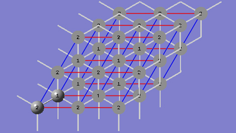

<!-- p.314 -->

4-4 In the Symmetry tab of the PBC dialog, check the Enable Space Group Symmetry checkbox, and then select 227 (F d -3 m:1) from the Constrain to Space Group drop-down list.

4-5 In the Contents tab of the PBC dialog, add a carbon atom at fractional coordinates (0, 0, 0) by first selecting C from the Symbol column (be sure to tab out of the Symbol field) and then selecting the Add button.

4-6 In the Cell tab of the PBC dialog, select Fix Contents’ Fractional Coordinates from the Cell Changes drop-down list, and then change the “a” cell length from 4 to the experimental value of 3.56 in the corresponding input field. Note that all of the cell lengths change to 3.56, and also the space group symmetry is preserved because of the Cell Changes option being used.

4-7 In the Contents tab of the PBC dialog, select Rebond All from the Bonds popup menu. Then, go to the the View tab and select Dull instead of Low Layer from the Replicate Contents Display drop-down list.

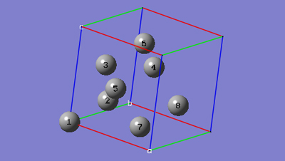

<!-- p.315 -->

4-8 At this point, we have defined a Face-Centered Cubic unit cell for a PBC/3D model of a diamond crystal.

4-9 In the View tab of the PBC dialog, check the Show All Boundary Atoms checkbox to show all atoms in or on the boundary of the cell.

4-10 In the View tab of the PBC dialog, show two cells along each of the “a”, “b”, and “c” axes by selecting 2 from the corresponding spin boxes in the Cell Replication section. Also, select the Low Layer item from the Replicate Contents Display drop-down list.

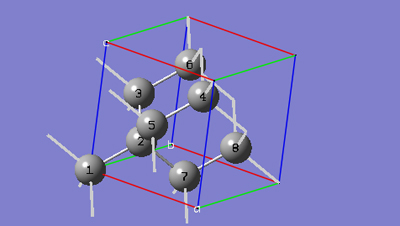

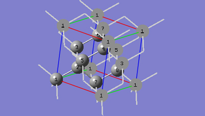

<!-- p.316 -->

4-11 In the Symmetry tab of the PBC dialog, uncheck the Enable Space Group Symmetry checkbox.

4-12 In the View tab of the PBC dialog, click on the Combine button in the Cell Replication section. This will cause the reference unit cell and the replicate unit cells shown on screen to be combined into a larger “supercell” that is 8 times the primitive unit cell. Note the atom number changes. Note also that the number of cells being viewed is automatically reduced to one to avoid potential confusion.

### Tutorial 5 - Transform a Primitive Unit Cell of Diamond Crystal to a Face-Centered Cubic Unit Cell, PBC/3D

5-1 Start a new file by selecting the Create New Molecule Group option from the File menu in the main window.

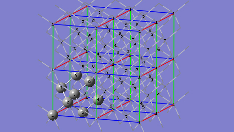

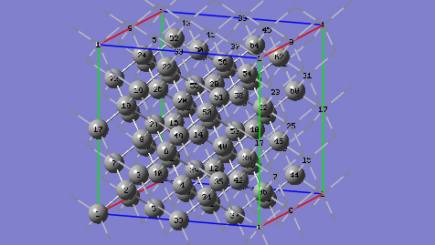

<!-- p.317 -->

5-2 Make the Carbon Tetrahedral fragment the “current fragment” by double-clicking on the Element Fragment tool button and then clicking on Carbon and then Carbon Tetrahedral in the Element Fragment palette.

5-3 Click anywhere in the empty View window to create a methane molecule.

5-4 Center the molecule in the View window by clicking on the Center toolbar button and then position the molecule so all atoms are visible.

5-5 Turn on atom labels for the View window by checking Labels from the View menu of the main window.

5-6 Show the Point Group dialog for the molecule by selecting Point Group from the Tools menu of the main window. In the Point Group dialog, check the Enable Point Group Symmetry box, and then select Td from the Constraint to Subgroup drop-down list.

5-7 Change the CH bond lengths to match the experimental values for the diamond CC bond length. Click on the Modify Bond toolbar button, and then click on atoms 1 and 2 in the the View window. In the corresponding Semichem Smartslide dialog, change the bond length value from 1.07 to 1.54 in the input field, and then click on the OK button. Note that all of the CH bond lengths have increased to 1.54 to preserve the Td symmetry. In the Point Group dialog, uncheck the Enable Point Group Symmetry box, and then click the OK button.

<!-- p.318 -->

5-8 Show the PBC dialog for the molecule by selecting PBC from the Tools menu of the main window.

5-9 In the Symmetry tab of the PBC dialog, select Three from the Lattice Dimensions drop-down list.

5-10 In the Cell tab of the PBC dialog, push down the Place button to enable placement of the cell origin (O (0,0,0)) vertex at any atom selected in the View window using the mouse. In the Moving drop-down list, select Whole Cell instead of Vertex Only so that the whole cell will be translated rather than just the cell origin vertex. In the View window, click on atom 3.

5-11 In the Cell tab of the PBC dialog, select a (1,0,0) instead of O (0,0,0) to enable placement of the head of the “a” lattice vector at any atom selected in the View window using the mouse. In the Moving drop-down list, select Vertex Only instead of Whole Cell so that just the “a” vertex will be translated rather than the whole cell. In the View window, click on atom 5.

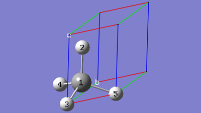

<!-- p.319 -->

5-12 In the Cell tab of the PBC dialog, select b (0,1,0) instead of a (1,0,0) to enable placement of the head of the “b” lattice vector at any atom selected in the View window using the mouse. In the View window, click on atom 4.

5-13 In the Cell tab of the PBC dialog, select c (0,0,1) instead of b (0,1,0) to enable placement of the head of the “c” lattice vector at any atom selected in the View window using the mouse. In the View window, click on atom 2.

5-14 In the Contents tab of the PBC dialog, select the Delete=>All Redundant Atoms item from the Edit menu of the Atom List editor.

5-15 In the Contents tab of the PBC dialog, change the hydrogen atom to a carbon atom atom by editing the second row of the Symbol column in the Atom List editor.

<!-- p.320 -->

5-16 In the Contents tab of the PBC dialog, select Rebond All from the Bonds popup menu.

5-17 The bonds between reference unit cell atoms and replicate cell atoms are shown in the replicate format, which is Low Layer by default. In the View tab of the PBC dialog, select Dull from the Replicate Contents Display drop-down list in order to better see the bonds in this case.

5-18 At this point, we have defined a primitive unit cell for a PBC/3D model of a diamond crystal.

5-19 Show the PBC dialog for the molecule by selecting PBC from the Tools menu of the main window.

5-20 In the View tab of the PBC dialog, select Dull from the Replicate Contents Display drop-down list.

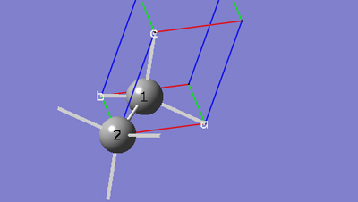

<!-- p.321 -->

5-21 In the View tab of the PBC dialog, check the Show All Boundary Atoms checkbox.

5-22 In the View tab of the PBC dialog, show one replicate cell along the “-c” axis, using the corresponding spin boxes (1 1 1 0 0 1) in the Cell Replication section.

5-23 In the Cell tab of the PBC dialog, select Fix Contents Cartesian Coordinates from the Cell Changes drop-down list, and check the Add/Remove atoms checkbox. Then, push down the Place button, and select a (1,0,0) instead of 0 (0,0,0) to enable placement of the head of the “a” lattice vector at any atom selected in the View window, using the mouse. In the View window, click on the atom at position (1, 1,-1).

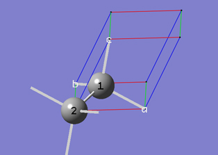

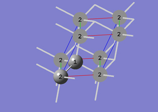

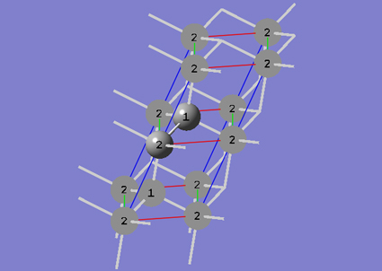

<!-- p.322 -->

5-24 In the View tab of the PBC dialog, show zero replicate cells along the “-c” axis again, one along the “-a” axis, and two along the “+b” axis, using the corresponding spin boxes (1 2 1 1 0 0) in the Cell Replication section.

5-25 In the Cell tab of the PBC dialog, select b (0,1,0) instead of a (1,0,0) to enable placement of the head of the “b” lattice vector at any atom selected in the View window, using the mouse. In the View window, click on the atom at position (-1, 2, 0).

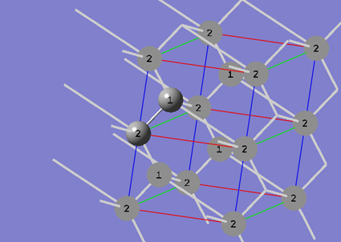

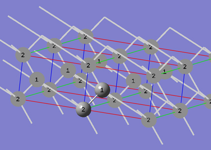

<!-- p.323 -->

5-26 In the View tab of the PBC dialog, show one replicate cell along the “+a” axis again, one along the “-b” axis, and two along the “+c” axis, using the corresponding spin boxes (1 1 2 0 1 0) in the Cell Replication section.

5-27 In the Cell tab of the PBC dialog, select c (0,0,1) instead of b (0,1,0) to enable placement of the head of the “c” lattice vector at any atom selected in the View window, using the mouse. In the View window, click on the atom at position (0, -1, 2).

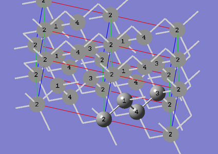

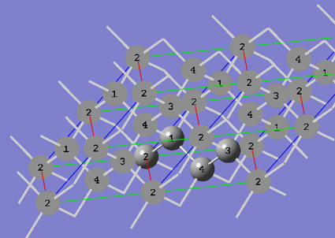

<!-- p.324 -->

5-28 In the View tab of the PBC dialog, show just the reference cell using the corresponding spin boxes (1 1 1 0 0 0) in the Cell Replication section.

5-29 In the View tab of the PBC dialog, uncheck the Show All Boundary Atoms checkbox.

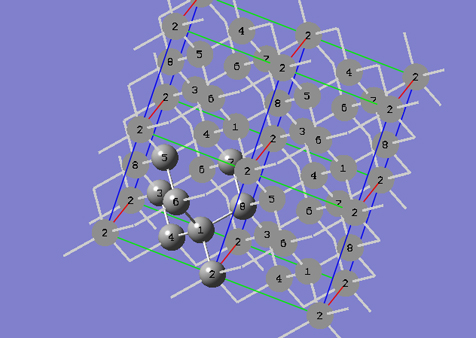

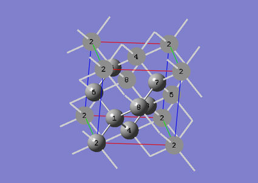

<!-- p.325 -->

5-30 We now have a face-centered cubic unit cell of diamond that gives the same crystal structure as that from the primitive unit cell we started with.

### Tutorial 6 - Transform a Face-Centered Unit Cell of Diamond Crystal to a Primitive Unit Cell, PBC/3D

6-1 Start a new file by selecting the Create New Molecule Group option from the File menu in the main window.

6-2 Show the PBC dialog for the molecule by selecting PBC from the Tools menu of the main window.

6-3 In the Symmetry tab of the PBC dialog, select Three from the Lattice Dimensions drop-down list.

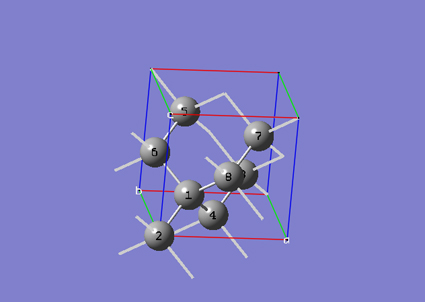

<!-- p.326 -->

6-4 In the Symmetry tab of the PBC dialog, check the Enable Space Group Symmetry checkbox, and then select 227 (F d -3 m:1) from the Constrain to Space Group drop-down list.

6-5 In the Contents tab of the PBC dialog, add a carbon atom at fractional coordinates (0, 0, 0) by first selecting C from the Symbol column (be sure to tab out of the Symbol field) and then selecting the Add button.

6-6 In the Cell tab of the PBC dialog, select Fix Contents’ Fractional Coordinates from the Cell Changes drop-down list, and then change the “a” cell length from 4 to the experimental value of 3.56 in the corresponding input field. Note that all of the cell lengths change to 3.56, and also the space group symmetry is preserved because of the Cell Changes option being used.

6-7 In the Contents tab of the PBC dialog, select Rebond All from the Bonds popup menu. Then, go to the the View tab and select Dull instead of Low Layer from the Replicate Contents Display drop-down list.

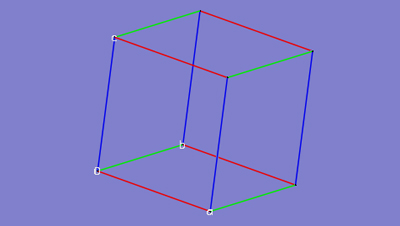

<!-- p.327 -->

6-8 At this point, we have defined a Face-Centered Cubic unit cell for a PBC/3D model of a diamond crystal.

6-9 Then, do the following steps: (a) uncheck the Enable Space Group Symmetry box in the Symmetry tab; (b) select Fix Contents’ Cartesian Coordinates from the Cell Changes drop-down list of the Cell tab.

6-10 In the Cell tab of the PBC dialog, push down the Place button, and select a (1,0,0) instead of 0 (0,0,0) to enable placement of the head of the “a” lattice vector at any atom selected in the View window using the mouse. In the View window, click on atom 7.

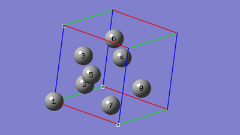

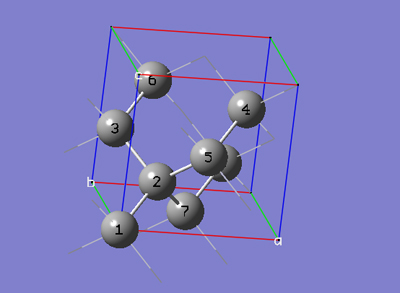

<!-- p.328 -->

6-11 In the Cell tab of the PBC dialog, push down the Place button, and select b (0,1,0) instead of a (1,0,0) to enable placement of the head of the “b” lattice vector at any atom selected in the View window using the mouse. In the View window, click on atom 3.

6-12 In the Cell tab of the PBC dialog, push down the Place button, and select c (0,0,1) instead of b (0,1,0) to enable placement of the head of the “c” lattice vector at any atom selected in the View window using the mouse. In the View window, click on atom 5.

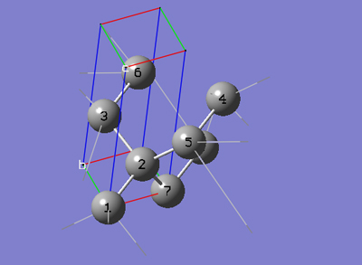

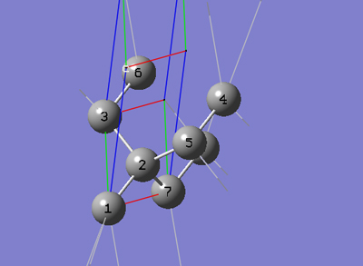

<!-- p.329 -->

6-13 In the Cell tab of the PBC dialog, select Delete All Atoms Outside Cell from the Trim Contents popup menu.

6-14 In the Contents tab of the PBC dialog, select Rebond All from the Bonds popup menu.

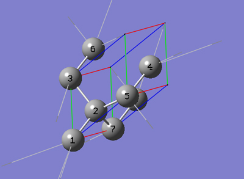

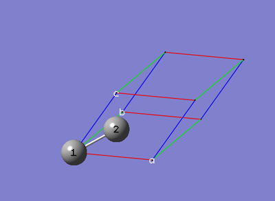

<!-- p.330 -->

6-15 In the View tab of the PBC dialog, select Dull from the Replicate Contents Display drop-down list.

6-16 We now have a primitive unit cell for diamond crystal that gives the same crystal structure as that from the face-centered cubic unit cell we started with.

6-17 In the View tab of the PBC dialog, check the Show All Boundary Atoms checkbox.

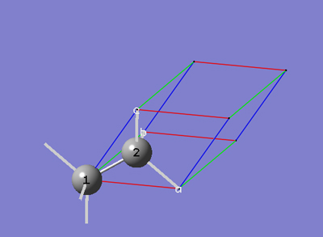

<!-- p.331 -->

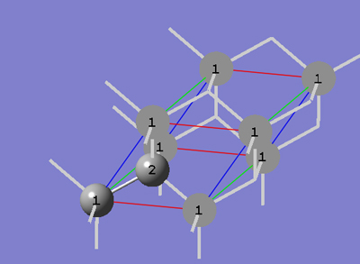
