# GaussView 6：绘图与光谱（Plots & Spectra）（p.88–135）

> 3D Scan 图、Plot 各面板、自定义、右键菜单、参考数据、位移模式、同位素、线型、Spectra 菜单与数据保存

> 原文件：`../gview6官方说明书.md`（全量单文件存档）｜图片目录：`../imgs/`

---

<!-- p.88 -->

## Scan 结果

通过结果（Results）=>Scan 菜单路径，可以查看产生多个结构的计算所得能量及其他结果的绘图。

Scan 结果示例 点击图中的一点，对应的结构即会出现在视图窗口中。

关于使用绘图（Working with Plots）的更多信息见此处。

## 3D Scan 图

对两个变量进行 Scan 的 Gaussian 计算，GaussView 会将其绘制为三维表面。与 2D 图一样，可以点击该图中的各个点。


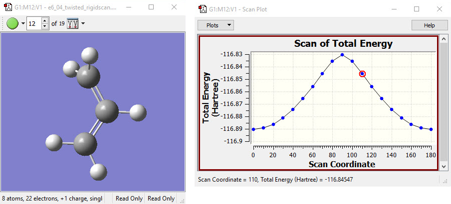

<!-- p.89 -->

对 2 个变量进行 PES Scan 的结果绘图 只有恰好对两个变量进行 Scan 的计算才会产生这样的图形。该图可使用标准鼠标操作进行旋转和缩放，并可通过点击选择节点。

3D Scan 的右键菜单与其他绘图不同（如上图所示）。它包含以下项目：

- 保存图像文件（Save Image File）：将图像保存为图形文件。

- 保存数据（Save Data）：将图形数据保存为文本文件。

- 显示表面（Show Surface）：选择表面显示类型。默认为填充网格（filled mesh）。

- 显示柱条（Show Bars）：以多种样式将数值绘制为 z 方向的线条（柱条）。柱条最常与线框（Wireframe）或无（None）表面显示组合使用。

- 显示节点（Show Nodes）：将所有结构的位置显示为白点（全部（All），为默认值）、仅显示活动（Active）节点（显示为绿点），或在交叉处不做特殊标记（无（None））。

- 其余五个 show 项目用于显示或隐藏相应项目。这些选项为开关切换。

- 4 个 Edit 项目允许修改各种标签文本。

- 反转坐标轴（Invert Axis）：反转所选坐标轴的方向。

- 坐标轴缩放（Axis Scale）：缩放所选坐标轴上的数值并相应调整标签。默认为 1.0。

- 坐标轴原点（Axis Origin）：更改所选坐标轴的原点，并将标签改为相对于该新值的形式。默认为 0。

- 背景颜色（Background Color）：设置窗口背景颜色。

- 数值颜色（Value Color）：指定所绘表面的配色方案。


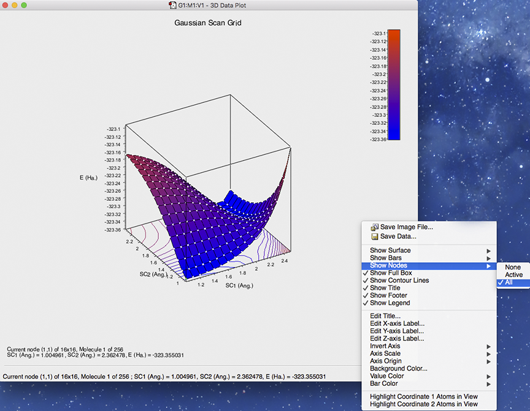

<!-- p.90 -->

- 柱条颜色（Bar Color）：指定所绘柱条（如果可见）是按数值颜色（按数值颜色（value color）中所指定）着色，还是全部绘制为统一的单一颜色。后一种情况下，使用选择通用颜色（choose common）菜单项设置所需颜色。

- 在视图中高亮坐标轴 n 的原子（Highlight Coordinate n Atoms i View）：在视图窗口中高亮并标记用于定义坐标 n（1 或 2）的原子。这些项目为开关切换。


<!-- p.91 -->

## Trajectory 图

该功能允许查看 Gaussian 轨迹计算（ADMP 或 BOMD）所得能量及其他结果的绘图。

ADMP 轨迹计算的核动能图 所绘制的项目如下：

- 核动能（Nuclear Kinetic Energy）

- 电子动能（Electronic Kinetic Energy）

- 势能（Potential Energy）

- 总能量（Total Energy）

- 总角（Total Angular）

- 动量（Momentum）

- Alpha 电子数守恒（Conservation of Alpha Electrons）

- 平均 Alpha 幂等性（Average Alpha Idempotency）

- RMS Alpha 幂等性（RMS Alpha Idempotency）

- Beta 电子数守恒（Conservation of Beta Electrons）

- 平均 Beta 幂等性（Average Beta Idempotency）

- RMS Beta 幂等性（RMS Beta Idempotency）

后三项仅适用于开壳层计算。

关于该功能的更多信息见使用绘图（Working with Plots）。


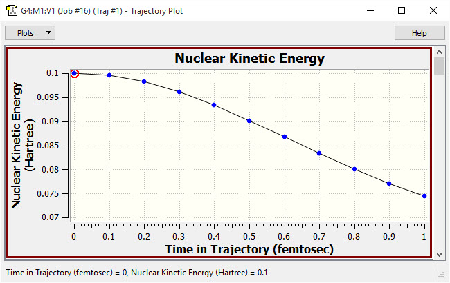

<!-- p.92 -->

## 显示能量图

相关信息：

- 自定义绘图与光谱（Customizing Plots and Spectra）

结果（Results）=>能量图（Energy Plot）菜单项显示 GaussView 中 GMMX 构象体计算所得的能量。

Desflurane 的能量图示例 该图将每个分子显示为各自的绘图点。每个分子都是原始输入文件的不同构象体。点击图中的任意一点，即可在分子组中显示相应的分子。

在上例中，分子 15 上的红色圆圈表示该分子当前被选中。对话框左下角显示该分子的信息。


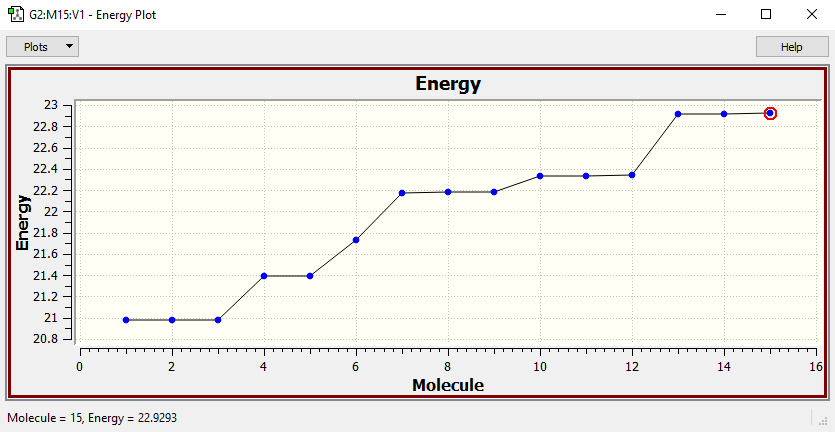

<!-- p.93 -->

## 使用 Plot 属性自定义绘图与光谱

从 Plot 菜单或绘图/光谱的右键菜单中选择属性（Properties）项时，会出现 Plot 属性（Plot Properties）窗口。该对话框可用于自定义绘图或光谱的许多方面。它有四个面板，如下图所示：


<!-- p.94 -->


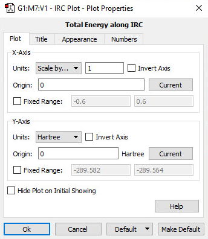

<!-- p.95 -->

自定义 Plot（左）或 Spectrum（右）

## Plot 面板

该面板中各控件的作用如下：

- 单位（Units）：指定相应坐标轴的单位。还可通过从弹出菜单中选择缩放依据（Scale by）并在文本框中输入数值来缩放坐标（见上图 Y 轴）。

- 原点（Origin）：指定相应坐标轴的原点值。

- 当前（Current）按钮：使当前选中点的坐标用作相应坐标轴的原点。

- 反转坐标轴（Invert Axis）：垂直（Y 轴）或水平（X 轴）反转图形。

光谱版本的窗口中可能还会出现其他字段，例如缩放频率？（Scale Frequencies?）和 IR 峰半宽高（IR Peak Half-Width Height）选项。


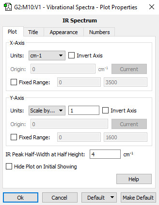

<!-- p.96 -->

## 标题（Title）面板


<!-- p.97 -->


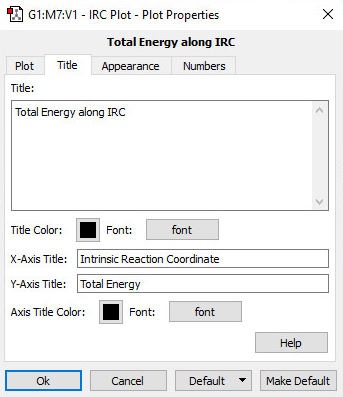

<!-- p.98 -->

自定义标题 该面板中各控件的作用如下：

- 标题（Title）：更改绘图图形的标题。

- 标题颜色（Title Color）：调整标题的颜色。

- 字体（Font）：更改标题的字体。

- X 轴标题、Y 轴标题（X-Axis Title, Y-Axis Title）：分别编辑 X 轴或 Y 轴的标题。可以包含特殊字符，以 HTML 实体形式表示（例如上图 IR 光谱的 Y 轴标题），也可使用 <sub> 和 <sup> 标签分别表示下标和上标。

- 坐标轴标题颜色（Axis Title Color）：调整两个坐标轴标题的颜色。

光谱版本的窗口中可能还会出现其他字段：例如上图的 Y2 轴标题（Y2-Axis Title）选项。


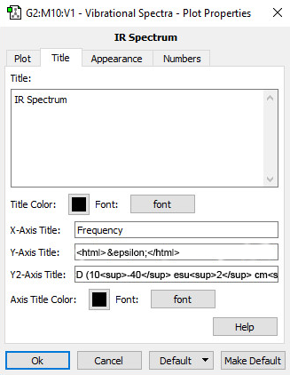

<!-- p.99 -->

## 外观（Appearance）面板


<!-- p.100 -->


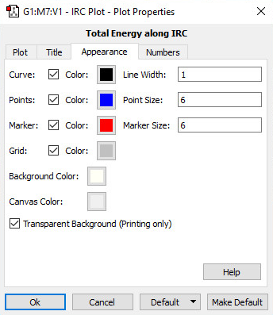

<!-- p.101 -->

自定义 Plot（左）/Spectrum（右）外观 该面板中各控件的作用如下：

- 曲线（Curve）：允许调整曲线的颜色并编辑线宽。还可通过取消勾选复选框来删除曲线。

- 点（Points）：允许调整点的颜色并编辑点的大小。还可通过取消勾选复选框来删除点。

- 标记（Marker）：该选项允许调整标记的颜色并编辑标记的大小。还可通过取消勾选复选框来删除标记。

- 网格（Grid）：调整图上网格线的颜色。还可通过取消勾选复选框来删除网格。

- 背景颜色（Background Color）：更改图形的背景颜色。

- 画布颜色（Canvas Color）：调整图形的画布颜色。

- 透明背景（Transparent Background）：该选项允许设置透明或不透明背景，但仅在打印时有效。


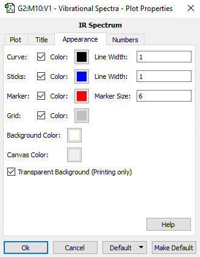

<!-- p.102 -->

## 数字（Numbers）面板


<!-- p.103 -->


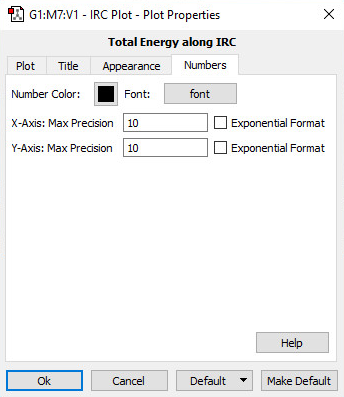

<!-- p.104 -->

自定义数字的外观 该面板中各控件的作用如下：

- 数字颜色（Number Color）：调整数字的颜色。

- 字体（Font）：更改数字的字体。

- X 轴：最大精度（X-Axis: Max Precision）：更改 X 轴间隔。

- Y 轴：最大精度（Y-Axis: Max Precision）：更改 Y 轴间隔。

- 指数格式（Exponential Format）：以指数记数法显示 X 轴和 Y 轴的数字。

光谱版本的窗口中可能还会出现其他字段，例如上图的 Y2 轴：最大精度（Y2-Axis: Max Precision）选项。

## 恢复默认设置

默认（Default）弹出菜单和设为默认（Make Default）按钮允许恢复之前的一组绘图/光谱属性：


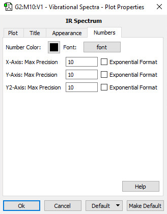

<!-- p.105 -->

恢复已保存或出厂默认设置 这些控件的作用如下：

- 默认（Default）：打开包含以下选项的下拉菜单：

  - 已保存默认值（Saved Default）：将对话框的设置恢复为之前保存的默认值。

  - 出厂默认值（Factory Default）：将对话框的设置恢复为出厂默认值。

- 设为默认（Make Default）：将当前设置设为默认设置。


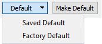

<!-- p.106 -->

## 使用绘图

## 操作和自定义绘图

可以点击图中的各个点，对应的结构即会出现在视图窗口中。

所有绘图都可以通过多种方式进行查看操作：

- 滚动和调整大小：通常，同一对话框中有多个绘图/光谱可用，不会同时全部可见。此时，可以调整对话框窗口大小以同时查看更多内容，或使用滚动条滚动到所需的绘图。如果同时可见多个绘图，则调整窗口大小会沿 X 轴放大/缩小，而绘图高度保持不变。换句话说，只有 viewing 区域的高度发生变化。当只可见一个绘图时——即对话框只包含一个绘图，或其他绘图已被隐藏（见下文）——调整对话框大小会沿两个坐标轴同时放大/缩小绘图。要聚焦于其中一两个绘图，可使用 Plot 菜单隐藏其他绘图。

- 缩放和取消缩放：所有绘图都支持缩放。该功能对于分辨精细细节非常方便。要放大，点击并按住鼠标左键选择缩放区域的一个角。按住鼠标按钮的同时，将鼠标移动到所需缩放区域的对角。缩放区域将以黑色虚线标记，如下图所示。释放鼠标按钮，所选区域即被放大以充满整个区域。该视图如下方右侧图所示。可以根据需要不断放大。要取消缩放（即恢复原始视图），使用绘图右键菜单中的缩小（Zoom Out）项。


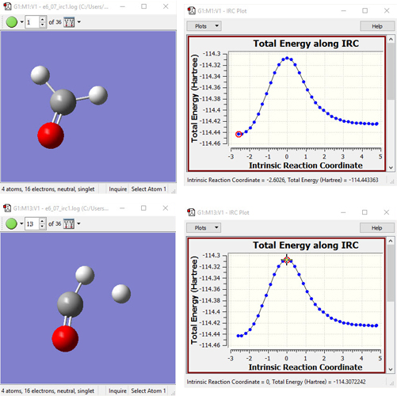

<!-- p.107 -->

- 平移（Panning）：在绘图内，按住 Shift 键同时拖动，可沿 X 轴或 Y 轴移动视图。与缩放结合使用时很有用，可沿绘图路径跟踪查看。

放大绘图

- 隐藏单个绘图/光谱：Plot 菜单的上部如下图所示，列出所有当前可用项目。可通过去掉/恢复项目名前面的勾选来分别隐藏或显示列表中的单个项目（respectively）。显示所有 Plot（Show All Plots）项将始终显示（勾选）所有项目。右键菜单（见下文）中的隐藏其他 Plot（Hide Other Plots）将隐藏除当前显示项之外的所有项。该菜单中的隐藏本 Plot（Hide This Plot）项将隐藏当前显示的项。

Plot 菜单 该菜单见于所有绘图和光谱窗口。本例来自 IRC 计算的绘图窗口。当前所有可用绘图均可见。

该菜单还提供打印（Printing）和保存（Saving）绘图、保存绘图图片以及修改绘图属性的选项。


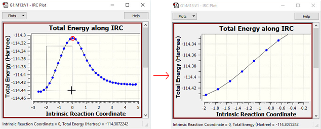

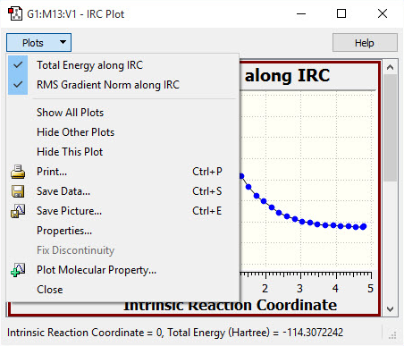

<!-- p.108 -->

对于这些任务类型，可以创建各种性质的附加绘图。具体做法是在绘图窗口中选择 Plot=>绘制分子性质（Plot Molecular Property）菜单项。随后出现如下图所示的对话框。

创建附加绘图 本例中，我们要在几何优化过程中添加显示原子 1 和 2 之间 C-C 键距离的绘图。左侧对话框显示可绘制的各种项目。

可绘制的项目因任务类型而异。生成后，新绘图出现在绘图窗口中标准图下方。

### 修正绘图不连续性

读取多几何结构绘图的数据时，X 轴上的值应形成单一连续递增集合。有时，用户可能在同一分子组中包含来自两个或更多不同文件中的分子。这有时为便于比较或为扩展之前运行的输出而使用。此时，X 轴的值不再形成单一连续递增集合，导致所得绘图呈锯齿状外观。检测到这种情况时，会显示信息提示。

可使用 Plot=>修正不连续性（Fix Discontinuity）菜单项修正此类绘图。使用该功能后，绘图标题中会添加“（Modified）”字样，以提醒用户绘图中的数据已被修改，应谨慎查看。

## 绘图右键菜单

在绘图或光谱内右击时出现左侧菜单。


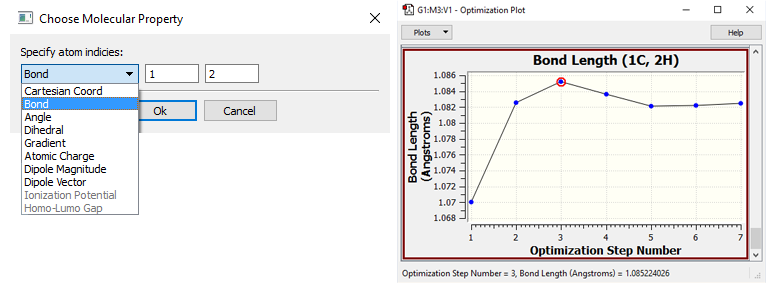

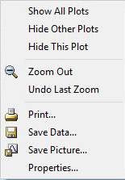

<!-- p.109 -->

在绘图或光谱内右击，包括包含标题和坐标轴标签的灰色区域，将弹出针对该特定绘图/光谱的右键菜单。菜单中的选项一般仅适用于当前项目。右键菜单如上图所示。各项目的含义如下：

- 显示所有 Plot（Show All Plots）和隐藏其他 Plot（Hide Other Plots）分别显示所有项目和隐藏除当前项之外的所有项。

- 缩小（Zoom Out）恢复原始绘图外观，撤销所有缩放。撤销上次缩放（Undo Last Zoom）仅撤销最近一次缩放操作。

- 打印（Print）打印当前绘图或光谱。

- 保存数据（Save Data）允许将绘图或光谱数据保存为文本文件（见下文）。

- 保存图片（Save Picture）允许将绘图或光谱保存为图形文件。

- 属性（Properties）允许自定义绘图的许多方面。详细讨论见此处。

### 保存数值绘图数据

绘图的右键菜单包含保存数据（Save Data）项。几何优化、IRC 计算等的绘图数据可以同样方式保存。以下是 IRC 计算的示例数据：

```text
Total Energy along IRC # X-Axis: Intrinsic Reaction Coordinate # Y-Axis: Total Energy (Hartree) #         X                   Y
-0.5999778220      -289.5812430000 -0.4999857200      -289.5768190000 -0.3999923250      -289.5728940000 ...
```


<!-- p.110 -->

## 绘制附加性质

对于这些任务类型，可以创建各种性质的附加绘图。具体做法是在绘图窗口中选择 Plot=>选择分子性质（Choose Molecular Property）菜单项。随后出现如下图所示的对话框。

创建附加绘图 本例中，我们要在几何优化过程中添加显示原子 1 和 2 之间 C-C 键距离的绘图。左侧对话框显示可绘制的各种项目。

可绘制的项目因任务类型而异。生成后，新绘图出现在绘图窗口中标准图下方。


<!-- p.111 -->

## NMR 光谱

结果（Results）=>NMR 菜单项显示 NMR 计算的光谱。示例光谱如下所示。

NMR 光谱显示 这是默认的 NMR 显示格式。显示所有计算出的峰。用光标点击峰会在窗口左下角显示屏蔽值和简并度（例如上图的峰 2-C）。

NMR 光谱窗口底部的字段允许以相对于 TMS 或其他标准的相对值查看相同数据。要使用该功能，首先在最左侧的弹出菜单中选择所需元素，然后从参考（Reference）字段中选择可用的标准计算结果之一。或者，也可以直接在屏蔽（Shielding）字段中输入数值。峰将随后反映相对于所选参考的相对值（在图上标记为“Ref”的参考包含在内）：

显示 NMR 化学位移

在此显示模式下点击峰，会在窗口左下角显示相对于指定标准的数值化学位移。相应的屏蔽值显示在屏蔽（Shielding）字段中。


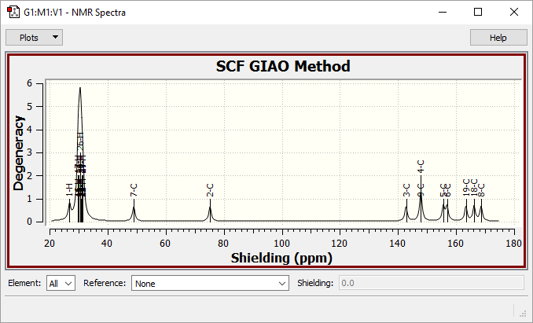

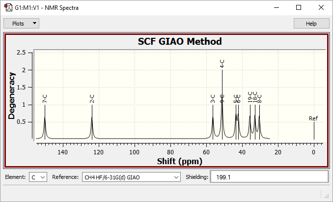

<!-- p.112 -->

修改 NMR 绘图属性

NMR 图的属性可通过 Plot=>属性（Properties）菜单路径修改。GaussView 允许使用对话框中相应的框修改峰半高半宽。简并度容差也可在该对话框中修改。修改峰半高半宽的示例如下所示。


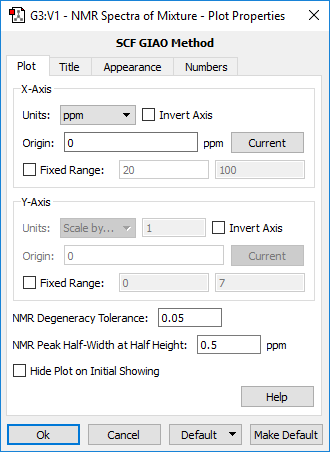

<!-- p.113 -->

NMR 光谱图也可使用混合编辑器（Mixture Editor）自定义。关于混合编辑器（Mixture Editor）的更多信息见此处。

## 添加新的参考结果

GaussView 主目录下的 data 子目录包含 nmr.data，其中保存 NMR 显示的参考数据。这是普通文本文件，可用任何文本编辑软件修改。但必须注意保持现有格式。在添加或修改之前，谨慎做法是先备份该文件。

从左到右各字段如下：元素符号、预测屏蔽值和菜单项标签（通常为参考化合物和理论方法）。我们添加了红色所示的 APFD/6-311+G(2d,p) 理论方法的一行。

## Sym Shielding Description

C   199.9853  "TMS HF/6-31G(d) GIAO" C   182.4656  "TMS B3LYP/6-311+G(2d,p) GIAO" C   187.435   "TMS APFD/6-311+(2d,p) GIAO" C   199.1     "CH4 HF/6-31G(d) GIAO" H    32.5976  "TMS HF/6-31G(d)  GIAO" H    31.8821  "TMS B3LYP/6-311+G(2d,p) GIAO" Si  449.7802  "TMS HF/6-31G(d)  GIAO" Si  327.3890  "TMS B3LYP/6-311+G(2d,p) GIAO" N   260.8     "NH3 HF/6-31G(d) GIAO" N   258.4     "NH3 B3LYP/6-311+G(2d,p) GIAO" O   323.1     "H2O HF/6-31G(d) GIAO" O   320.0     "H2O B3LYP/6-311+G(2d,p) GIAO"


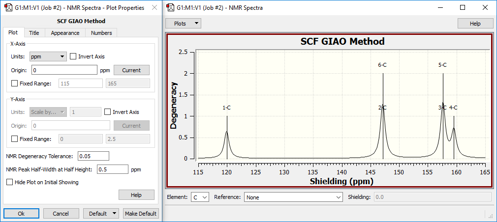

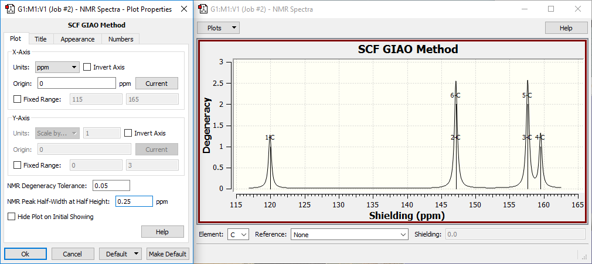

<!-- p.114 -->

B   106.7     "B2H6 HF/6-31G(d) GIAO" B    83.6     "B2H6 B3LYP/6-311+G(2d,p) GIAO"

如果描述中包含空格，需要引号（Quotation marks）。首列中的井号（#）表示注释。

<!-- p.115 -->

## 显示振动频率结果

该对话框显示频率计算所得所有计算光谱的表格。根据所执行的具体计算，可包括振动频率、红外强度、拉曼强度和/或 VCD 旋光强度。该窗口的光谱（Spectra）按钮用于访问预测光谱的图形表示。

显示振动（Display Vibrations）窗口 对话框顶行的项目允许选择显示哪个同位素体（isotopologue）的数据（活动数据（Active Data）弹出菜单）。新建数据（New Data）按钮打开运行 FreqChk（Run FreqChk）对话框，编辑同位素体（Edit Isotopologues）按钮打开原子列表编辑器（Atom List Editor）。注意，当从 .LOG 文件打开频率数据时，这些项目不可见。

列表区域中高亮的行表示当前选中用于动态显示的振动。可通过选择开始动画（Start Animation）按钮启动该显示，再次点击（此时标记为停止动画（Stop Animation））即可停止。动画期间，循环显示与所选振动对应的核运动。可通过在滚动列表中点击所需模式来选择不同模式。无需停止前一个模式即可选择新模式。还可使用常规鼠标按钮旋转和移动振动中的分子。


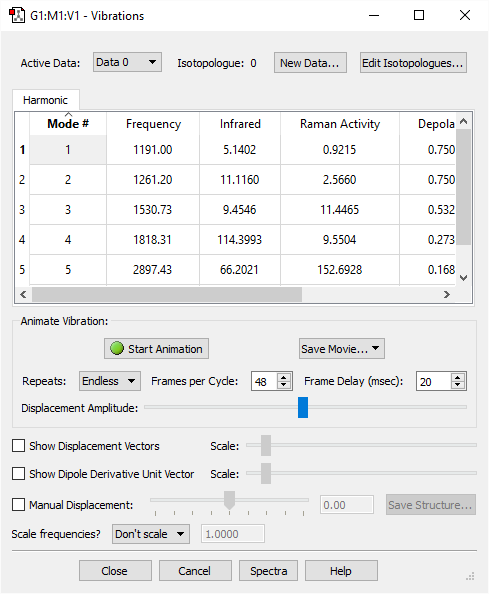

<!-- p.116 -->

开始/停止动画（Start/Stop Animation）按钮下方的两个滑动条用于调整运动的速度和幅度。这些设置的默认值可在振动首选项（Vibrations Preferences）面板中指定（以及下文讨论的位移和偶极导数单位矢量）。

动画还可使用保存影片（Save Movie）按钮保存为电影和/或保存为单帧。该按钮下一行中的控件指定所得电影的特性。

重复（Repeats:）菜单为分子的动画提供几种不同选项。数字表示按下开始动画（Start Animation）按钮时将显示多少个周期。选择无限（Endless）表示动画将一直持续，直到按下停止动画（Stop Animation）按钮。每周期帧数（Frames per Cycle:）菜单允许指定每个周期应包含多少帧。可指定 4 到 120 之间的任意帧数。完成一个周期所需的帧数越多，所得动画越平滑。帧延迟（Frame Delay (msec):）菜单允许修改每帧之间的时间长度。增大该数值可使动画更慢。

位移幅度（Displacement Amplitude:）滑动条允许指定动画振动模式时原子的位移幅度。这将决定振动在动画中看起来有多剧烈。向右拖动滑动条增大位移会使振动更明显，向左拖动减小则会使振动更细微。

缩放频率？（Scale frequencies?）区域可用于按统一量缩放频率值。当弹出菜单设为指定（Specify）时，可在右侧字段中输入缩放因子。

对话框下部的两个与矢量相关的复选框含义如下（示例见下图）：

- 显示位移矢量（Show Displacement Vectors）：将与振动相关的运动显示为每个原子上的矢量。

- 显示偶极导数单位矢量（Show Dipole Derivative Unit Vector）：将偶极导数单位显示为矢量。

<!-- p.117 -->

显示位移矢量和偶极导数单位矢量 默认情况下，位移矢量为蓝色，偶极导数矢量为橙色。

各种位移矢量显示为蓝色，偶极导数单位矢量为左侧的橙色箭头。

可使用振动首选项（Vibrations Preference）指定该对话框的默认值。可使用颜色首选项（Colors Preference）的振动颜色（Vibration Colors）面板更改矢量的颜色。

## 使用手动位移显示模式

手动位移（Manual Displacement）框允许设置偏离平衡几何结构的位移。勾选后，振动的动画将被关闭。勾选后，滑动条、数字框和保存结构（Save Structure）按钮变为活动状态。在此模式下，更改滑动条或相应的数字框会导致分子沿当前活动的简正模式静态位移。滑动条的中间值或文本框中的零对应无位移。向右移动滑动条或在文本框中输入正值，将使原子沿当前活动的简正模式位移。向左移动或输入负值，将使原子沿与当前活动的简正模式相反的方向位移。文本框中允许的数值范围为 -1 到 +1。点击保存结构（Save Structure）将出现新的分子窗口，其几何结构恰好对应位移后的结构。

该工具的主要用途是帮助消除虚假的负本征值。当寻找过渡态时，最终得到含有两个（或更多）负本征值的结构并不罕见。这些虚假的负本征值一般很小，但必须消除才能分离出真正的过渡态。对于这些情况，选择与虚假负本征值对应的简正模式，然后选择手动位移（Manual Displacement）。向右调整滑动条（或在文本框中输入正数），然后选择保存结构（Save Structure）以创建具有位移几何结构的新分子，随后可对其重新优化。如果正向位移未能消除虚假负本征值，按相同步骤尝试负方向位移。还可以尝试改变位移的大小。


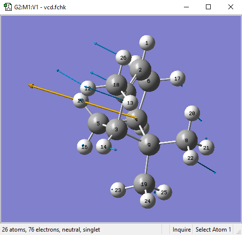

<!-- p.118 -->

手动位移的第二个用途是生成分子处于振动过程中的图片。因此，可用于将振动的动画有效地冻结在特定点。

<!-- p.119 -->

## 比较同位素体的光谱

GaussView 使比较同一结构的不同的同位素体（isotopologues）的光谱变得容易。为此，首先使用原子列表编辑器（Atom List Editor）为每个同位素体定义所需的同位素。然后为每个同位素体生成振动数据集（见下文）。完成后，可使用显示振动（Display Vibrations）对话框检查光谱和简正模式。

比较三个同位素体的简正模式 在原子列表编辑器（Atom List Editor）（顶部）中，我们为这个简单分子定义了三个同位素体：一个使用标准同位素，一个用氘替换每个氢，第三个用氚替换单个氢。与第六个频率对应的简正模式在每个同位素体中位置发生移动（比较每个视图窗口下方的数值）。前两个同位素体的运动相似，但氚形式的模式运动局限于该原子。

右上角的按钮可用于定义同位素体并为其生成频率数据。


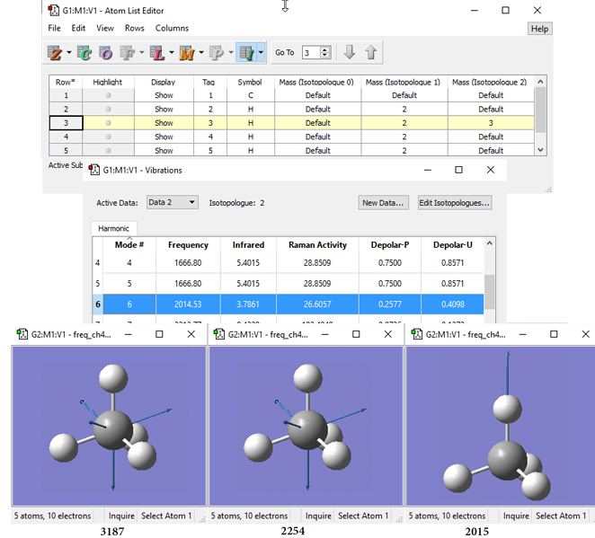

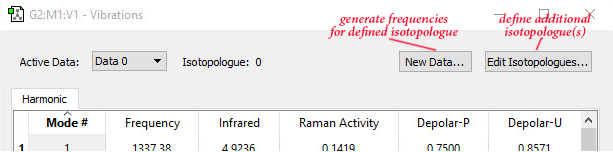

<!-- p.120 -->

## 定义更多的同位素体

转到原子列表编辑器（Atom List Editor），点击“I”?图标上的箭头。将下一个同位素体添加到该列。

根据需要调整同位素值。

## 为同位素体生成并显示频率数据

在振动（Vibrations）窗口中点击新建数据（New Data）。出现如下图所示的窗口，允许选择所需的同位素体：


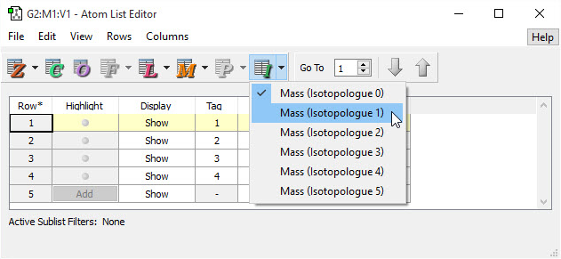

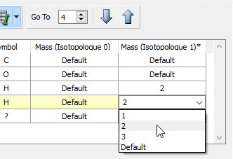

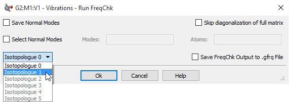

<!-- p.121 -->

回到振动（Vibrations）窗口，使用活动数据（Active Data）弹出菜单选择要显示的数据集（同位素体）：

当前显示的数据集由弹出菜单右侧的标签指示。光谱、简正模式动画及其他显示将反映所选同位素集。


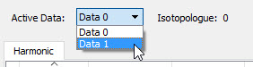

<!-- p.122 -->

## 频率相关计算结果

Gaussian 频率计算可指定计算振动性质时所用的电磁场微扰值。对于此类频率相关计算，GaussView 允许通过在振动（Vibrations）窗口顶部添加弹出菜单来指定所需的入射光频率，如下图所示：

选择入射光频率

对于频率相关计算结果，GaussView 在振动（Vibrations）窗口顶部添加此菜单。静态极限（Static Limit）选项对应标准频率计算。


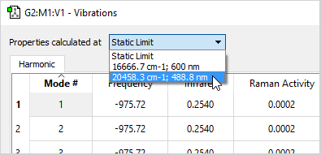

<!-- p.123 -->

## 非谐频率分析结果

Gaussian 非谐频率计算的结果可通过结果（Results）=>振动（Vibrations）菜单路径由 GaussView 报告。下图说明当有非谐频率结果可用时该对话框的形式：

非谐频率结果 通常的频率表现在有三个选项卡。谐性（Harmonic）和非谐性（Anharmonic）选项卡中所选频率是联动的，所选模式涉及的非谐模式列在非谐性，模式（Anharmonic, mode）选项卡中（本例中为模式 6）。

频率数据表中提供以下选项卡：

- 谐性（Harmonic）：报告谐性频率数据。

- 非谐性，模式 N（Anharmonic, mode N）：第 N 个简正模式的非谐数据表，其中 N 为谐性表中当前选中的模式。

- 非谐性（Anharmonic）：所有简正模式的非谐数据表。

光谱窗口顶部有两个控件。显示谐性（Show Harmonic）和显示非谐性（Show Anharmonic）复选框切换相应光谱数据的可见性。非谐光谱显示为红色。


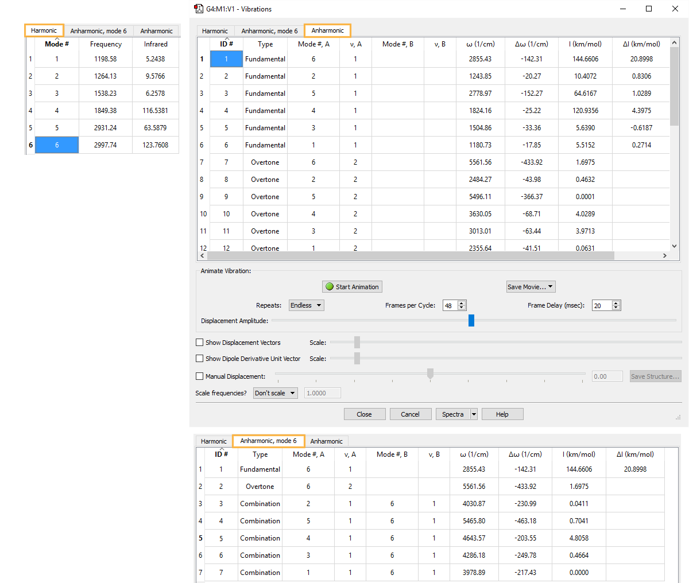

<!-- p.124 -->

同时查看谐性和非谐光谱

可使用混合编辑器（Mixture Editor）（Plot=>混合编辑器（Mixture Editor）菜单路径）控制图形的外观。


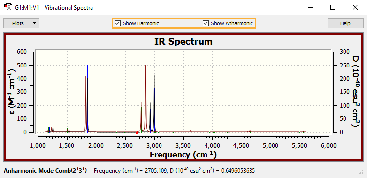

<!-- p.125 -->

## 显示振动 — 运行 FreqChk

结果（Results）=>振动（Vibrations）菜单项用于访问频率计算的各种光谱结果。它允许基于频率计算的信息，将计算出的振动数据显示为动态屏幕运动。当从 Gaussian 检查点文件或格式化检查点文件检索结果时，该菜单项最初可能显示显示振动 - 运行 FreqChk（Display Vibrations - Run FreqChk）对话框，如下图所示。注意，如果打开的是 Gaussian 日志文件，则直接进入显示振动（Display Vibrations）对话框。

运行 FreqChk 以执行振动分析 在某些情况下，该对话框先于显示振动（Display Vibrations）对话框出现。

该对话框用于运行 Gaussian 自带的 freqchk 工具。该工具对对话框左侧弹出菜单（标有星号的菜单）中指定的同位素体执行振动分析；此处，将对第二个同位素体执行分析。完成后，模式和光谱即可通过显示振动（Display Vibrations）对话框可视化。

保存简正模式（Save Normal Modes）和选择简正模式（Select Normal Modes）项仅与 Gaussian 09 及更高版本相关。它们分别对应 Freq=SaveNormalModes 和 Freq=SelectNormalModes 选项（以及等效的 FreqChk 选项）。前者将计算出的简正模式保存回检查点文件，后者将振动分析限制为所列模式（模式（Modes））和涉及所列原子/原子类型的模式（原子（Atoms））。使用相应字段指定感兴趣的模式或原子。

跳过全矩阵对角化（Skip diagonalization of full matrix）对应 Freq=NoDiagFull。

退出运行 FreqChk（Run FreqChk）对话框后，该工具将运行，显示振动（Display Vibrations）窗口将打开。


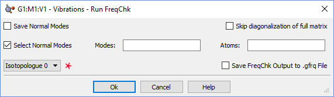

<!-- p.126 -->

## 电子振动（Vibronics）光谱

结果（Results）=>电子振动（Vibronics）菜单项显示电子振动分析结果：电子振动 OPA 光谱（Vibronic OPA Spectrum）和 Duschinsky 矩阵。

电子振动光谱 分子的 Duschinsky 矩阵如下所示。它以从无重叠（白色）到完全重叠（纯色）的色调显示每对初态和终态之间的重叠。

Duschinsky 矩阵显示

Plot 下拉菜单允许选择报告跃迁表（Reported Transitions Table）选项，该选项将显示当前分子的报告跃迁。


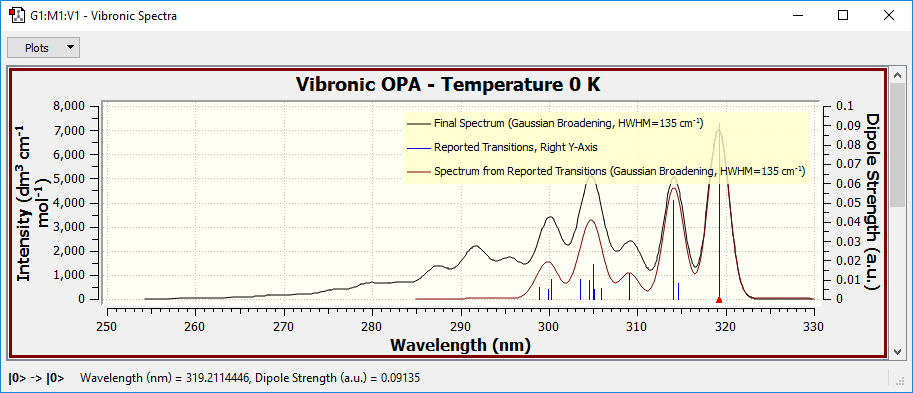

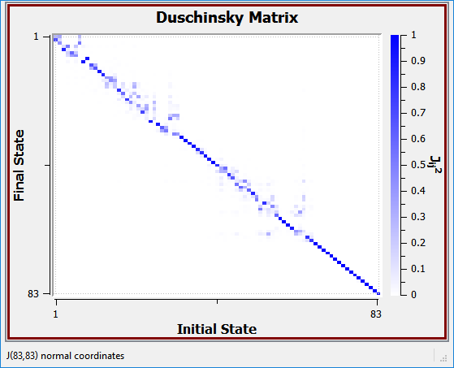

<!-- p.127 -->

电子振动跃迁表


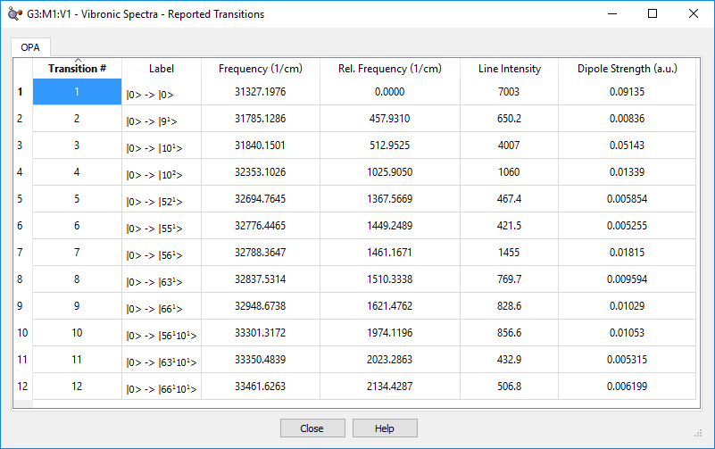

<!-- p.128 -->

## 检查多个振动光谱：混合编辑器

多个数据集的示例光谱图 混合编辑器（Mixture Editor）

混合编辑器（Mixture Editor）对话框用于在绘制多个数据集时修改图形。该对话框包含两个部分：

- 类似电子表格的列表包含每个可用数据集的控件。点击任意列标题可对列表排序。可使用 control 命令键和 shift 键选择多个数据集。所做的任何更改将应用于所有选定项。

- 列表下方的组合（Combination）区域包含修改对应组合及（可能）加权数据的绘图曲线的选项。

文件列表中最左侧的列如下：

- 活动（Active）：数据集是否包含在图中。非活动数据不参与玻尔兹曼布居（Boltzmann Populations）计算。对于组合图，活动（Active）框控制 GaussView 确定图形缩放时是否考虑该数据。组合（Combination）数据是否存在由其绘图样式（Plot Style）（无（None）表示隐藏）控制。

- ID：显示赋予文件的标识号。编号从 0 开始。该列可用于恢复原始顺序。

- 分子（Molecule）：显示输出文件的名称。

- 数据名称（Data Name）：包含描述数据集的字符串（用于图例）。可编辑。

- 自由能（Free Energy）：显示分子的自由能。该字段的单位为 hartree。当自由能不可用时，标签变为能量（Energy），字段显示总能量。

- Boltz. ID：该集合玻尔兹曼组的标识号（见下文）。ID 从 0 开始。


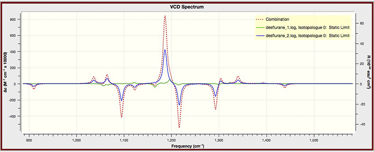

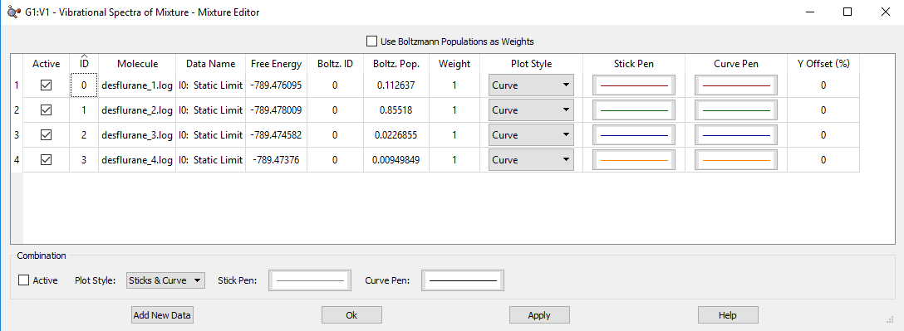

<!-- p.129 -->

- Boltz. Pop.：显示该构象体对玻尔兹曼布居的贡献。

- 权重（Weight）：显示每个分子数据在图中的权重。默认情况下，GaussView 将所有数据集加权为 1。这些值可编辑。

- 绘图样式（Plot Style）和画笔（Pen）字段：见下文。

- Y 偏移（%）（Y Offset (%)）：该选项允许按指定量平移数据的 Y 轴，以百分比表示。

勾选使用玻尔兹曼布居作为权重（Use Boltzmann Populations as Weights）框将为所有项目设置玻尔兹曼加权，并从表中删除权重（Weight）列。在文件列表内右击会弹出包含以下选项的菜单，这些选项也会修改权重（Weight）列中的值：

- 将玻尔兹曼布居赋给权重（Assign Boltzmann Populations to Weights）：将玻尔兹曼布居复制到权重（Weight）列（可在其中编辑）。

- 赋 1.0 权重（Assign 1.0 Weights）：为每个数据集赋 1.0 的权重（恢复为 GaussView 默认值）。

- 赋等值归一化权重（Assign Equal, Normalized Weights）：为每个数据集赋在所有活动数据集上归一化的等值权重。

玻尔兹曼布居由所有具有玻尔兹曼 ID 的活动数据集计算，包括绘图样式（Plot Style）设为无（None）的数据集。来自玻尔兹曼组的同分异构体（isomes）（包括核质量）的振动数据与相同入射频率匹配。谐性和非谐数据属于不同组。该字段可编辑，允许重新定义玻尔兹曼组。

下面的数据列表显示 2 个玻尔兹曼组：

玻尔兹曼组：静态极限（Static Limit）（0）和 18797nm（1）

以下控件同时位于组合（Combination）区域和每个数据集行中：

- 绘图样式（Plot Style）菜单决定相应曲线的显示方式。对于组合图，默认样式为无（None）（不可见）；单个数据集的默认样式为棒线和曲线（Sticks and Curve），显示为棒（Stick）（绘制为柱状）和曲线（Curve）（连接各绘图点的斜线）。

- 棒画笔（Stick Pen）选项允许在选择棒（Stick）或棒线和曲线（Sticks and Curve）选项时自定义显示。可选择更改颜色、宽度和线型（见下文）。

- 曲线画笔（Curve Pen）选项允许在选择曲线（Curve）或棒线和曲线（Sticks and Curve）选项时自定义所显示的线条。可选择更改颜色、宽度和线型（见下文）。

在该对话框底部，添加新数据（Add New Data）按钮允许向当前图形添加更多数据，它会打开操作系统默认的文件打开系统。确定（OK）按钮将关闭混合编辑器（Mixture Editor）对话框，应用（Apply）按钮将在不关闭对话框的情况下应用所做的所有更改。

## 自定义线型

点击任何曲线画笔（Curve Pen）或棒画笔（Stick Pen）菜单时，将出现以下对话框：


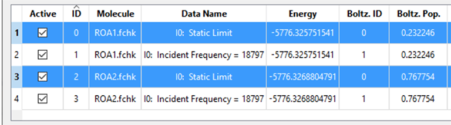

<!-- p.130 -->

选择画笔（Choose Pen）对话框

各字段允许指定棒和/或线的颜色、粗细和样式。颜色（Color）字段使用标准操作系统颜色选择功能，宽度（Width）字段允许以 0.1 像素增量指定线条粗细，样式（Style）字段使用如上图所示的弹出菜单指定线的种类。指定样式在对话框顶部的字段中预览。


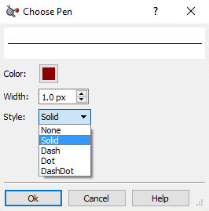

<!-- p.131 -->

## 显示 UV-可见光谱

结果（Results）=>UV-VIS 菜单项显示激发态计算所计算的光谱。示例光谱如下所示。

UV-可见光谱显示示例

对于某些计算，可能还有其他光谱，包括手性分子的 ECD。


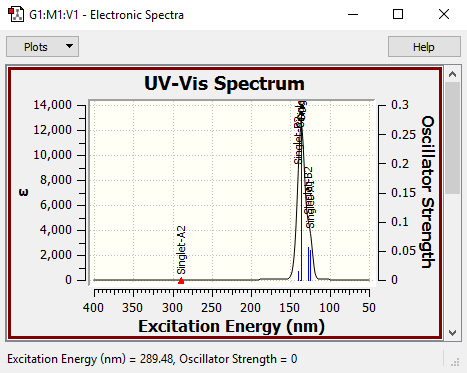

<!-- p.132 -->

## ORD 图

对于 ORD 计算，GaussView 为每个指定波长绘制预测的光学旋光色散。

ORD 结果图

关于该功能的更多信息见此处的使用绘图（Working with Plots）。


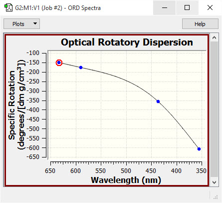

<!-- p.133 -->

## 操作和自定义光谱

所有光谱都可以通过多种方式进行查看操作：

- 滚动和调整大小：通常同一对话框中有多个绘图/光谱可用，不会同时全部可见。此时，可以调整对话框窗口大小以同时查看更多内容，或使用滚动条滚动到所需的光谱。如果同时可见多个光谱，则调整窗口大小会沿 X 轴放大/缩小，而绘图高度保持不变。换句话说，只有 viewing 区域的高度发生变化。当只可见一个光谱时——即对话框只包含一个光谱，或其他绘图已被隐藏（见下文）——调整对话框大小会沿两个坐标轴同时放大/缩小光谱。要聚焦于其中一两个光谱，可使用 Plot 菜单隐藏其他光谱。

- 隐藏单个光谱：Plot 菜单的上部如下图所示，列出所有当前可用项目。可通过去掉/恢复项目名前面的勾选来分别隐藏或显示列表中的单个项目（respectively）。显示所有 Plot（Show All Plots）项将始终显示（勾选）所有项目。右键菜单（见下文）中的隐藏其他 Plot（Hide Other Plots）将隐藏除当前显示项之外的所有项。

- 平移（Panning）：在光谱内，按住 Shift 键同时拖动，可沿 X 轴或 Y 轴移动视图。与缩放结合使用时很有用，可沿光谱路径跟踪查看。

光谱显示的 Plot 菜单 该菜单见于所有绘图和光谱窗口。本例来自 IRC 计算的绘图窗口。当前所有可用光谱均可见。

- 缩放和取消缩放：所有光谱都支持缩放。该功能对于分辨精细细节非常方便。要放大，点击并按住鼠标左键选择缩放区域的一个角。按住鼠标按钮的同时，将鼠标移动到所需缩放区域的对角。缩放区域将以绿色矩形标记（见图 109）。释放鼠标按钮，所选区域即被放大以充满整个区域。可以根据需要不断放大。要取消缩放（即恢复原始视图），使用绘图右键菜单中的缩小（Zoom Out）项。


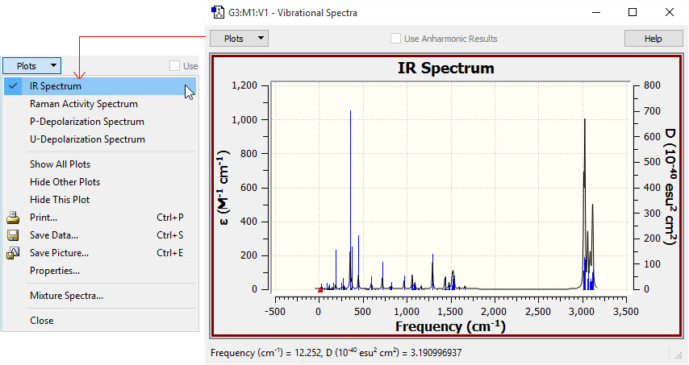

<!-- p.134 -->

放大光谱 左侧光谱是 GaussView 最初显示的光谱。此处，我们正在放大所示矩形区域。所得视图显示在右侧。

## 光谱右键菜单

在光谱内右击时出现右侧菜单。

右键菜单中的选项一般仅适用于当前光谱。它们的含义如下：

- 显示所有 Plot（Show All Plots）和隐藏其他 Plot（Hide Other Plots）分别显示所有项目和隐藏除当前项之外的所有项。

- 缩小（Zoom Out）恢复原始光谱外观，撤销所有缩放。撤销上次缩放（Undo Last Zoom）仅撤销最近一次缩放操作。

- 打印（Print）打印当前绘图或光谱。

- 保存数据（Save Data）允许将绘图或光谱数据保存为文本文件（见下文）。

- 保存图片（Save Picture）允许将绘图或光谱保存为图形文件。

- 属性（Properties）允许自定义光谱的许多方面。详细讨论见此处。


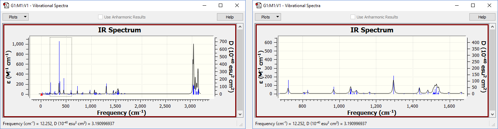

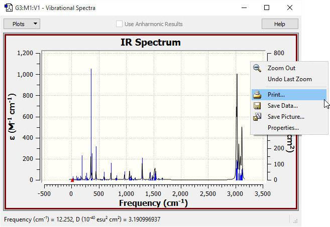

<!-- p.135 -->

## 保存光谱数据

光谱的右键菜单包含保存数据（Save Data）项。该项可用于将绘图/光谱对应的数值数据保存到外部文件。以下是从 IR 光谱保存的数据示例：

```text
IR Spectrum # X-Axis:  Frequency (cm-1) # Y-Axis:  <html>&epsilon;</html> (M-1 cm-1)
Peak information #                  X                   Y #      92.0270000000      295.0377577730 #     211.5876000000      210.4813272886 …
Spectra #                  X                   Y               DY/DX
0.0000000000        0.0443536939        0.0009621102 8.7500000000        0.0541413503        0.0012972784 17.5000000000        0.0675621566        0.0018078842 …
```

可通过 GaussView 在标准保存（Save）对话框中添加的额外字段指定此类数据的范围和点间步长（上图数据右侧所示）。

对于 NMR 光谱，还可使用光谱右键菜单上的 NMR 汇总（NMR Summary）项写入额外的汇总文件。示例如下：

```text
Summary of NMR spectra ( SCF GIAO Magnetic shielding) # Degenerate peaks are condensed together (Degeneracy Tolerance 0.05) # #          Shielding (ppm)     Degeneracy    Elem    Atoms
26.6182000000        1.0000       H        1 27.7949000000        2.0000       H       5,6 76.9883000000        1.0000       C        2 93.9401000000        1.0000       C        3 106.1777000000        1.0000       C        4
```


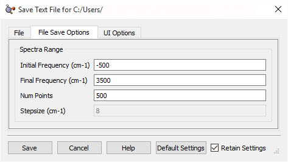
