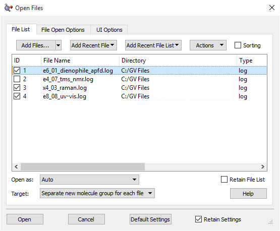
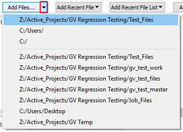
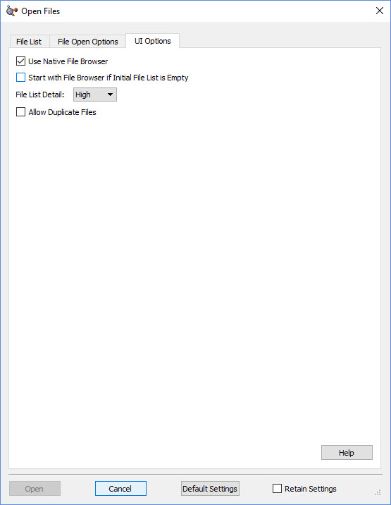
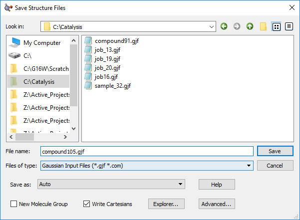
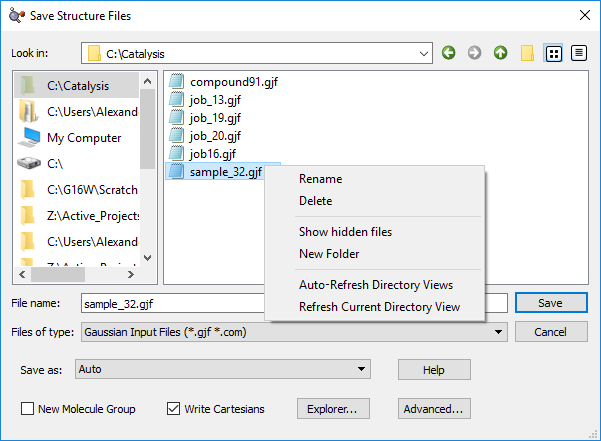
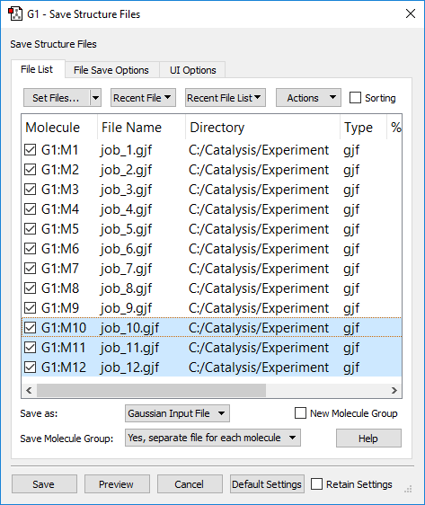
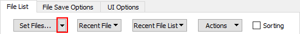
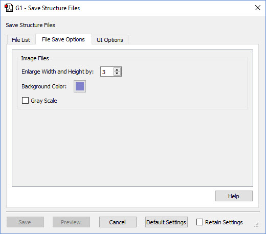
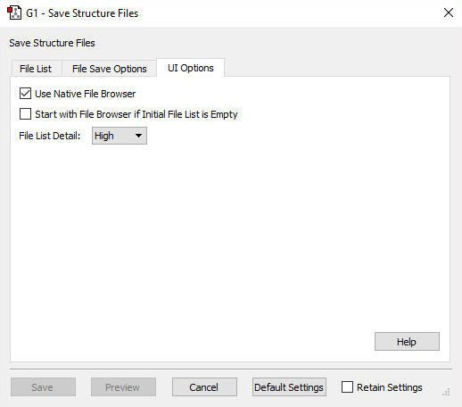
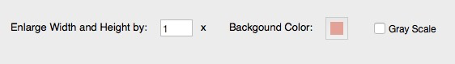

# GaussView 6：文件与分子列表（p.194–206）

> 文件列表、新分子的去向、分子列表、命名、排序、保存操作

> 原文件：`../gview6官方说明书.md`（全量单文件存档）｜图片目录：`../imgs/`

---

<!-- p.194 -->

## 高级打开文件对话框：打开文件列表（Advanced Open Files Dialog: Open File List）

打开文件列表（Open File List）菜单 本页介绍高级打开文件（Advanced Open File）对话框的文件列表（File List）面板。文件列表（File List）面板可用于一次保存一个或多个文件，并为这些文件指定设置。注意，该对话框的标题会根据所保存信息的种类而变化。文件/目录首选项（File/Directory Preference）控制默认出现的文件保存对话框版本（基础版（Basic）或高级版（Advanced））。

## 将文件添加到文件列表（Adding Files to the File List）

添加文件（Add Files）按钮将打开一个文件查看器（其形式在用户界面选项（UI Options）面板中指定），用于选择要添加到文件列表的文件。点击该按钮将打开最近使用的目录。点击添加文件（Add Files）按钮右侧的向下箭头，将打开一个菜单，允许用户选择要打开哪个目录。

<!-- p.195 -->

添加最近文件（Add Recent File）按钮会创建一个下拉菜单，允许用户从以前打开过的文件中进行选择。

添加最近文件列表（Add Recent File List）按钮将显示一个下拉菜单，其中列出以前打开过的文件组（在同一次打开操作中打开的文件）。

操作（Actions）按钮包含以下菜单项：

- 所选项（Selected Items）：选项仅应用于所选（高亮显示）的文件。

  - 清除（Clear）：该选项移除当前已选定的文件。

  - 选中（Check）：该选项选中屏幕左侧复选框，即选中这些文件。

  - 取消选中（Uncheck）：该选项移除“ID”列中复选框的勾选，即取消选中这些文件。

  - 切换（Toggle）：该选项切换复选框的当前状态。如果未选中，则在屏幕左侧加上勾选；如果当前已选中，则移除屏幕左侧的勾选。

- 所有项（All Items）：选项应用于列表中的所有文件。

  - 清除（Clear）：该选项移除当前列表中的所有文件。

  - 选中（Check）：该选项选中当前列表中所有项屏幕左侧的复选框。

  - 取消选中（Uncheck）：该选项移除当前列表中所有项所有复选框的勾选。

  - 切换（Toggle）：该选项切换当前列表中所有项的当前状态。如果复选框已选中，则变为空；如果为空，则变为选中。

排序（Sorting）复选框控制文件列表中的项是否可以排序。选中后，点击任何列标题都将根据该字段对各项排序。当前排序列的顶部会出现插入符“^”（表示升序）或“v”字符（表示降序）：

## 使用文件列表（Working with the File List）

在文件列表中，点击即可选中各项；其所在行将以蓝色背景高亮显示。也可以选中或取消选中，即通过每行开头的复选框控制该文件是否被标记为打开。操作（Actions）菜单允许您一次操作修改多组文件的选中状态和勾选状态。

<!-- p.196 -->

## 新分子的去向（Destinations for the New Molecules）

打开为（Open as）按钮显示一个下拉菜单，用于指定 GaussView 将如何打开文件列表中的文件。默认选中自动（auto）。如果保持不变，GaussView 将自动选择文件类型。

目标（Target）按钮显示一个下拉菜单，提供以下选项：

- 为每个文件创建独立的新分子组（Separate new molecule group for each file）：为读入的每个文件创建一个新的单成员分子组。这是默认选项。

- 所有文件共用一个新分子组（Single new molecule group for all files）：创建一个新的分子组，并将每个文件作为其中的一个分子。当只打开单个文件时，该选项与第一个选项等效。

- 将所有文件追加到当前分子（Append all files to active molecule）：将所有打开文件中的结构放入当前分子（当前分子组中的当前分子）。这将导致添加额外的片段。

- 将所有文件添加到当前分子组（Add all files to active molecule group）：将每个文件作为当前分子组中独立的新分子添加。当前分子保持不变。

- 所有文件共用一个新分子（Single new molecule for all files）：将所有文件中的结构添加到单个单成员分子组中（与第三个选项类似，但会创建新分子）。

保留文件列表（Retain File List）复选框用于保留所用的文件列表。

该菜单底部栏显示用户可用的几个选项。打开（Open）按钮在没有文件通过其左侧复选框标记为打开之前处于非活动状态。

打开（Open）按钮将打开文件列表中的项。

取消（Cancel）按钮将关闭打开文件（Open Files）窗口。

默认设置（Default Settings）按钮将所有选项恢复为 GaussView 默认值。

保留设置（Retain Settings）选项通过点击复选框启用。启用后，GaussView 将在关闭窗口后保留用户输入的设置。下次使用该对话框时将沿用这些设置。

<!-- p.197 -->

## 高级打开文件对话框：用户界面选项（Advanced Open Files Dialog: UI Options）

用户界面选项（UI Options）面板 用户界面选项（UI Options）面板允许您使用以下选项：

- 使用系统原生文件浏览器（Use Native File Browser）：选中后，GaussView 在向文件列表添加项时将使用操作系统的原生文件浏览器。

- 初始文件列表为空时先打开文件浏览器（Start with File Browser if Initial File List is Empty）：选中后，当文件列表为空（即您正在打开新文件）时，GaussView 将自动打开文件浏览器，而不是文件列表（File List）面板。

<!-- p.198 -->

- 文件列表详情（File List Detail）：以下选项用于在文件列表（File List）选项卡上显示文件信息。

  - 低（Low）：仅显示关于所打开文件的最基本信息：分子组和结构（如有）、文件名和目录。

  - 中（Medium）：显示关于所打开文件的更多信息：增加文件类型。

  - 高（High）：显示所打开文件的最高详细程度：增加文件大小以及创建和修改日期。

- 允许重复文件（Allow Duplicate Files）：选中该选项允许 GaussView 多次打开同一文件。如果未选中，则不允许将同一文件多次添加到文件列表。

<!-- p.199 -->

## 保存文件：基础版（Saving Files: Basic）

基础保存文件（Basic Save File）对话框 上图所示为基础保存文件（Basic Save File）对话框。使用哪个版本的文件保存对话框由文件/目录首选项（File/Directory Preference）控制。

左侧列表框显示最近和常用访问的目录。在其中一个目录上右键点击，将给出将其从列表中移除的选项。

点击左侧列表中的目录将在右侧列表框中显示其内容，您可以通过点击其中的文件夹进一步导航。文件类型（Files of type）弹出选项用于限制文件列表中显示的文件类型。

这两个列表框之间的分隔条可以通过点击拖动来移动，以改变它们的大小。

<!-- p.200 -->

在右侧列表中的文件上右键点击，将显示以下选项：

- 重命名（Rename）：允许用户重命名文件。

- 删除（Delete）：允许用户删除一个文件或一组所选文件。

- 显示隐藏文件（Show Hidden Files）：显示隐藏文件。

- 新建文件夹（New Folder）：在当前目录中创建新的子文件夹。

- 自动刷新目录视图（Auto-Refresh Directory Views）：在适当时自动刷新目录视图。

- 刷新目录视图（Refresh Directory View）：刷新当前目录的视图。

文件名（File name）输入行允许您输入自选的文件名。点击右侧列表中的已有文件可自动填充该字段。

另存为（Save As:）按钮将显示文件类型菜单（例如 Gaussian 输入文件、PDB 文件等）。当您想用的扩展名与实际文件类型不匹配时，这些选项很有用。自动（Auto）选项根据扩展名推断文件类型，通常是正确的选择。

新建分子组（New Molecule Group）复选框，选中后将在保存操作结束时创建由所保存分子组成的新分子组。

写入直角坐标（Write Cartesians）复选框，选中后将强制 GaussView 把分子结构以直角坐标写入所保存的文件（即在默认格式不是直角坐标时）。

资源管理器（Explorer）按钮打开操作系统对话框，进入上方当前打开的目录。在 Mac OS X 系统上，该按钮标注为访达（Finder）。

高级（Advanced）按钮将进入高级保存文件（Advanced Save File）对话框。

<!-- p.201 -->

## 高级保存文件对话框：文件列表（Advanced Save File Dialog: File List）

高级保存文件（Advanced Save File）对话框的文件列表（File List）面板 在本例中，最后三个文件被选中（高亮显示），所有文件均已勾选。某些操作（Actions）菜单项仅适用于所选项。保存操作仅保存已勾选的文件。

本页介绍高级保存文件（Advanced Save File）对话框的文件列表（File List）面板。文件列表（File List）面板可用于一次保存一个或多个文件，并为这些文件指定设置。注意，该对话框的标题会根据所保存信息的种类而变化。默认出现哪个版本的文件保存对话框（基础版（Basic）或高级版（Advanced））由文件/目录首选项（File/Directory Preference）控制。

使用操作（Actions）菜单上的控件，可以在文件名中添加前缀和/或分子编号。

## 使用分子列表（Working with the Molecule List）

在文件列表中，点击即可选中各项；其所在行将变为蓝色背景。也可以选中或取消选中，即通过每行开头的复选框控制该文件是否被标记为保存。

<!-- p.202 -->

## 指定文件名（Assigning File Names）

设置文件（Set Files）按钮打开一个文件查看器（其格式在用户界面选项（UI Options）面板中指定），您可在其中指定保存文件的目录（默认为最近使用的目录）以及文件名。该对话框会将指定的目录和名称赋给当前所选的所有分子。您也可以在同一对话框中或通过主保存对话框中的弹出菜单指定文件类型。

您可以直接点击文件名进行编辑。双击任何目录设置并导航到所需文件夹，即可更改目录设置。

最近文件（Recent File）和最近文件列表（Recent File List）按钮也会使用以前打开或保存过的文件名为文件命名。在大多数情况下，我们不建议使用此功能。

### 更改目录（Changing the Directory）

点击设置文件（Set Files）按钮右边缘的向下箭头，可以从最近目录列表中选择：

所选目录将在打开的保存对话框中设置。

## 修改分子列表和排序（Modifying and Sorting the Molecule List）

操作（Actions）按钮以及在文件列表中右键点击，包含以下顶层菜单项：

- 所选项（Selected Items）：操作仅应用于文件列表中所选（高亮显示）的项。

- 所有项（All Items）：这些操作将应用于列表中的所有文件。

这两个菜单都包含以下子菜单项，分别应用于所选文件或所有文件：

- 设置文件（Set Files）：该选项允许您为相关文件指定文件名。可使用本菜单上的其他选项在名称中添加前缀和/或分子编号。

- 设置目录（Set Directory）：该选项更改相关文件的目标目录。

- 清除（Clear）：该选项清除赋给文件的名称。

- 选中（Check）：该选项将相关文件标记为保存。

- 取消选中（Uncheck）：该选项移除相关文件名左侧复选框的勾选，将其从保存操作中移除。

- 切换（Toggle）：该选项切换每个相关文件复选框的当前状态。

- 添加前缀（Add prefix）：该选项为每个相关文件名添加您指定的前缀。

- 在文件名中包含分子编号（Include molecule numbers in file name）：保存多个结构时，该选项为相关文件的基本文件名添加分子编号。

- 在文件名中移除分子编号（Remove molecule numbers in file name）：该选项移除相关项文件名中的任何分子编号。

排序（Sorting）复选框控制文件列表中的项是否可以排序。选中后，点击任何列标题都将根据该字段对各项排序。当前排序列的顶部会出现插入符 ^（升序）或“v”字符（降序）：

<!-- p.203 -->

## 控制保存操作（Controlling the Save Operation）

其余控件显示在文件列表下方。

另存为（Save As）按钮打开一个下拉菜单，可用于覆盖指定文件扩展名所隐含的格式。

新建分子组（New Molecule Group）复选框，启用后将在保存操作结束时创建包含所保存分子的新分子组。

保存分子组（Save Molecule Group）下拉菜单控制如何处理包含多个结构的分子组。它包括以下选项：

  - 否（No）：仅保存分子组中的当前结构。

  - 是，每个分子存为单独文件（Yes, separate file for each molecule）：保存分子组中的所有分子，为每个分子创建单独的文件。

  - 是，所有分子存为单个文件（Yes, single file for all molecules）：将分子组中的所有分子保存到单个文件中。

该对话框底部栏中的各项用途如下：

- 保存（Save）按钮将保存文件列表。

- 预览（Preview）按钮将打开一个显示待保存文件的新窗口。

- 取消（Cancel）按钮将关闭保存文件（Save Files）对话框而不保存任何内容。

- 默认设置（Default Settings）按钮将所有选项恢复为 GaussView 默认值。

- 保留设置（Retain Settings）复选框将在保存操作后保存当前设置。下次使用该对话框时将从保存的设置开始。

保存（Save）和预览（Preview）按钮在没有文件被勾选（标记为保存）且未指定文件名之前处于非活动状态。

从一个分子组保存多个文件时，GaussView 不允许为多个文件指定相同的名称。每个保存的文件必须指定独立、唯一的文件名。

<!-- p.204 -->

## 高级保存文件对话框：文件保存选项（Advanced Save File Dialog: File Save Options）

文件保存选项（File Save Options）面板 文件保存选项（File Save Options）面板允许您为图像文件指定以下选项：

- 放大宽度和高度（Enlarge Width and Height by）：该选项将按指定量放大图像尺寸。

- 背景颜色（Background Color）：该选项将更改所保存图像的背景颜色。

- 灰度（Gray Scale）：选中该选项将以灰度捕捉图像。

该面板对所有其他文件类型处于非活动状态。

<!-- p.205 -->

## 高级保存文件对话框：用户界面选项（Advanced Save File Dialog: UI Options）

保存文件用户界面选项（Save File UI Options）面板 用户界面选项（UI Options）面板允许您使用以下选项：

- 使用系统原生文件浏览器（Use Native File Browser）：选中后，GaussView 在向文件列表添加项时将使用操作系统的原生文件浏览器。

- 初始文件列表为空时先打开文件浏览器（Start with File Browser if Initial File List is Empty）：选中后，当文件列表为空（即您正在保存新文件）时，GaussView 将自动打开文件浏览器，而不是文件列表（File List）面板。

- 文件列表详情（File List Detail）：以下选项用于在文件列表（File List）选项卡上显示详情。

  - 低（Low）：仅显示关于所保存文件的基本信息：分子组和结构、文件名和目录。

  - 中（Medium）：显示关于所保存文件的更多信息：文件类型和检查点文件名。

  - 高（High）：显示所保存文件的最高详细程度：增加文件大小以及创建和修改日期。

<!-- p.206 -->

## 保存图像（Saving Images）

保存图像（Save Image）对话框的附加字段（布局有所不同）

当您保存图像文件时，保存文件（Save File）对话框会针对该文件类型定制。文件类型（Files of type）和另存为（Save as）弹出菜单将包含支持的图像文件格式。上面所示的附加字段也会出现。它们的含义如下：

- 放大宽度和高度（Enlarge Width and Height by）：设置图像缩放因子。

- 背景颜色（Background Color）：图像的背景颜色。注意，生成图像文件时会忽略视图窗口中的当前背景。

- 灰度（Gray Scale）：选中后，在捕捉前将图像转换为灰度（即黑白）。默认保存彩色图像。

