# GaussView 6 官方说明书（PDF 转 Markdown）
> 来源：`gview6官方说明书.pdf`，共 332 页，目录 148 条，由 PyMuPDF 直接提取（可复制文本，无需 OCR）。
## 目录（来自 PDF 书签）
- The GaussView Interface（p.5）
- GaussView Toolbars（p.6）
- Molecules, Molecule Groups, and Views（p.8）
  - Working with MultiView Windows（p.9）
    - Customizing MultiView Windows（p.11）
  - Deleting Views from Molecule Groups（p.12）
  - Animating Multiple Structures（p.12）
- Using the Mouse（p.13）
  - Limiting Mouse Actions to One Fragment（p.13）
- GaussView Menus（p.13）
- GaussView Preferences（p.14）
- Displaying GaussView Tips（p.15）
- Placing Elements and Fragments（p.16）
- The Element Fragments Palette（p.16）
- The R-Group Fragments Palette（p.17）
- The Rings Palette（p.17）
- The Biological Fragments Palette（p.18）
- Making Palettes Sticky（p.19）
- Undo and Redo（p.19）
- Viewing and Adjusting Structure Parameters（p.19）
- Inquire Mode（p.19）
- Adding and Deleting Valences（p.20）
- Invert About Atom and Mirror Invert（p.21）
- Cleaning Structures（p.22）
  - Clean Performance Tips（p.24）
- Rebonding Structures（p.24）
- Imposing Symmetry（p.24）
- Pasting Molecules into the View Window（p.27）
- Placing a Fragment in a Centroid Position（p.27）
- Modifying Dihedral Angles via Newman Projections（p.32）
- Displaying Cartesian Axes（p.41）
- The Gaussian Calculation Setup Window（p.47）
- The Options Subpanel（p.54）
- The Edit Subpanel（p.55）
- The Default Route Subpanel（p.55）
- Retrieving Items from a Checkpoint File（p.57）
- Special Considerations for Various Gaussian Job Types（p.66）
  - Transition Structure Optimizations: Opt=QST2 and Opt=QST3（p.66）
  - Calculations on Polymers, Surfaces, and Crystals（p.66）
  - Multi-Layer ONIOM Calculations（p.66）
  - Specifying CASSCF Active Spaces Using Guess=Permute（p.67）
  - Modifying Redundant Internal Coordinates (Geom=ModRedundant)（p.67）
  - Freezing Atoms During Geometry Optimizations（p.67）
  - Selecting Normal Modes for Frequency Calculations (Freq=SelectNormalModes)（p.67）
  - Setting up Scan Calculations（p.68）
    - Relaxed Scans（p.68）
    - Rigid Scans（p.69）
  - Calculating NMR Spin-Spin Coupling: NMR=(SpinSpin,ReadAtoms)（p.70）
  - Specifying Fragment-Specific Charges and Spin Multiplicities（p.70）
  - Setting Up Excited State Calculations（p.71）
- Submitting a Gaussian Calculation（p.73）
- The Quick Launch Feature（p.74）
- Controlling Running Calculations（p.75）
- Specifying How the Gaussian Program is Executed（p.75）
- 3D Scan Plots（p.88）
- The Plot Panel（p.95）
- The Title Panel（p.96）
- The Appearance Panel（p.99）
- The Numbers Panel（p.102）
- Restoring Default Settings（p.104）
- Manipulating and Customizing Plots（p.106）
  - Correcting Plot Discontinuities（p.108）
- The Plot Context Menu（p.108）
  - Saving Numerical Plot Data（p.109）
- Adding New Reference Results（p.113）
- Using Manual Displacement Display Mode（p.117）
- Defining Additional Isotopologues（p.120）
- Generating and Displaying Frequency Data for an Isotopologue（p.120）
- Customizing Line Styles（p.129）
- The Spectra Context Menu（p.134）
- Saving Spectra Data（p.135）
- Cubes（p.136）
- Visualizing Volumetric Data（p.137）
- Surfaces（p.137）
- Contours（p.137）
- Generating and Manipulating Cubes（p.137）
- Defining the Contour Plane（p.142）
- Selection-Related Toolbar Icons（p.150）
  - Selection Keystrokes in View Windows（p.150）
- Selecting with the Atom List Editor and Similar Tools（p.151）
  - The Atom Selection Editor（p.151）
  - Atom Highlighting and Display（p.157）
  - Defining Isotopologues（p.158）
  - Atom List Editor Menus（p.158）
  - Types of Atom Groups（p.167）
    - Modifying Orbital Occupancies, Molecular Charge, and Spin Multiplicity（p.178）
    - Controlling the Orbitals Display（p.179）
    - Generating and Retrieving MOs（p.179）
    - Rearranging Orbital Ordering（p.180）
    - Miscellaneous Options（p.180）
  - Conformer Search（p.182）
  - Grid Search（p.183）
  - PBC Building Tutorials（p.185）
  - Directory List（p.187）
  - Supported File Types（p.188）
  - File List Context Menu（p.189）
- Adding Files to the File List（p.194）
- Working with the File List（p.195）
- Destinations for the New Molecules（p.196）
- Working with the Molecule List（p.201）
- Assigning File Names（p.202）
  - Changing the Directory（p.202）
- Modifying and Sorting the Molecule List（p.202）
- Controlling the Save Operation（p.203）
- Initial Setup（p.207）
- Creating a Normal Mode Animation Movie（p.210）
- Saving a Multiview Molecule Group as a Movie（p.211）
- Submitting Jobs from GaussView（p.214）
  - Adding Files to the File List（p.215）
  - Modfying the UI Options（p.216）
- The SC Job Manager Dialog（p.216）
  - Exiting from the SC Job Manager（p.217）
- The Long Jobs Queue, Short Jobs Queue, and Queueless Jobs Panels（p.217）
- The Running Jobs Panel（p.218）
- The Finished Jobs Panel（p.219）
- The Job Types Panel（p.220）
  - Edit Job Type（p.222）
- Enabling Use of the SC Job Manager（p.223）
- Available Command Line Variables（p.225）
- GaussView-Provided Scripts（p.226）
- Table of Icons and Menu Items（p.227）
- Gaussian Calculation Setup Keywords & Options（p.240）
- Frequently Asked Questions（p.244）
- Clean Performance Tips（p.248）
- Specifying Colors for Surfaces（p.252）
- Desktop Preferences: Specifying File Associations Under Windows（p.256）
- Available Command Line Variables（p.264）
- GaussView-Provided Scripts（p.265）
- Animations of Multiview Molecule Groups（p.267）
- Animations of Vibrational Frequencies（p.267）
  - 1 - Building Pyridine: Using Untyped Atoms（p.272）
  - 2 - Building Phenylpyridine: Setting the Angle Between Rings（p.273）
    - Modifying the Dihedral Angle（p.274）
  - 3 - Building Iron Pentacarbonyl: Selecting the Best Templates for a Given Task（p.275）
  - 4 - Building Tyrian Purple Dye: Appending a Structure（p.276）
  - 5 - Docking Two Structures: Building Bichloro-Diphenyl（p.277）
  - 6 - Assigning Atoms to ONIOM Layers in a Small Peptide Chain（p.279）
  - 7 - Setting Up an ONIOM Job（p.283）
- Part 1: Performing a Conformational Search（p.285）
- Part 2: Preparing the Optimization and VCD Calculations（p.289）
- Part 3: Examining the VCD Spectra（p.292）
  - Tutorial 1 - Build a Trans-Polyacetylene Polymer From Ethylene, PBC/1D（p.297）
  - Tutorial 2 - Build a Graphite Sheet From Benzene, PBC/2D（p.300）
  - Tutorial 3 - Build a Primitive Unit Cell of Diamond Crystal From Methane, PBC/3D（p.308）
  - Tutorial 4 - Build a Face-Centered Cubic Unit Cell for Diamond Crystal Using Space Group Symmetry, PBC/3D（p.313）
  - Tutorial 5 - Transform a Primitive Unit Cell of Diamond Crystal to a Face-Centered Cubic Unit Cell, PBC/3D（p.316）
  - Tutorial 6 - Transform a Face-Centered Unit Cell of Diamond Crystal to a Primitive Unit Cell, PBC/3D（p.325）
- Table of Contents（p.1）

---

<!-- p.5 -->
# The GaussView Interface

The main GaussView interface consists of several windows in addition to other dialogs which appear in the course of working. The following figure illustrates a simple session in which the user has just started to build a molecule:

GaussView on the Desktop

Several GaussView features are visible here. At the top, we see the main GaussView control panel, containing the menu bar, a variety of toolbars, and the Current Fragment area. Below this, on the right, are the palettes used to select functional groups and individual atoms for addition to a molecule (note that these can function in a modal or amodal mode, according to user preference). At the bottom left is the active View window containing the molecule being built.

The GaussView interface consists of these main components:

- 

The control panel containing the menu bar and Builder Fragment display area (grey background).

- 

Various toolbars. By default, these are placed below the menu bar in the control panel, but they may also be detached if desired (see below). They may also be rearranged within the control panel as desired. This is why your toolbar may differ from the illustration above.

- 

One or more molecule View window(s) (blue background by default).

- 

Dialogs corresponding to the various GaussView features.

- 

Preferences which control various aspects of the program’s functioning.

Molecules appear and can be modified in View windows. Do not confuse the Builder Fragment display area below the main toolbar for a View window; it shows what item will be added to the current molecule at the next mouse click.

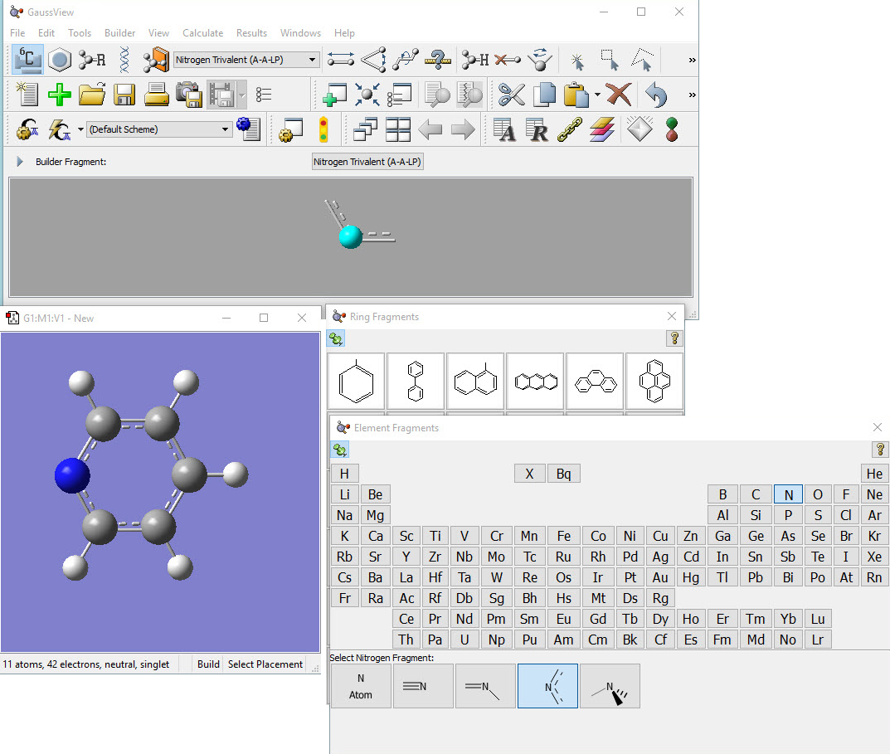

<!-- p.6 -->
# GaussView Toolbars

The toolbars that appear by default under the menu bar in the GaussView control panel are illustrated individually below. Descriptions of the various icons are provided here.

GaussView Toolbars in Standalone Mode

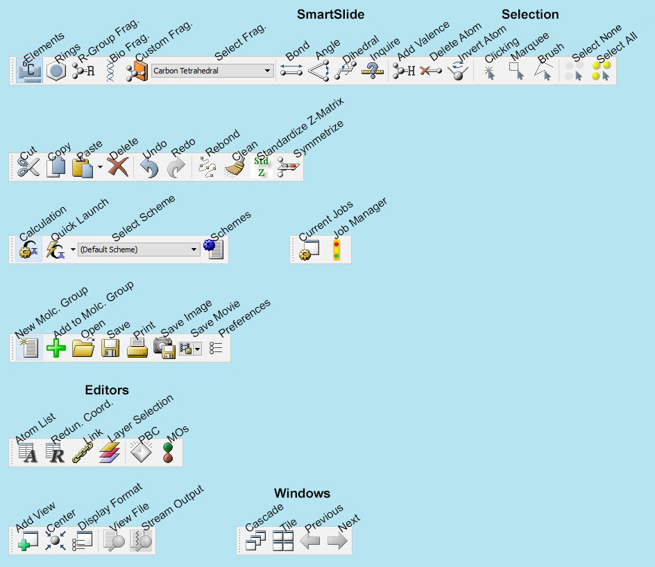

<!-- p.7 -->
GaussView Builder Palette The Builder palette on the right is revealed with the View=>Builder menu path.

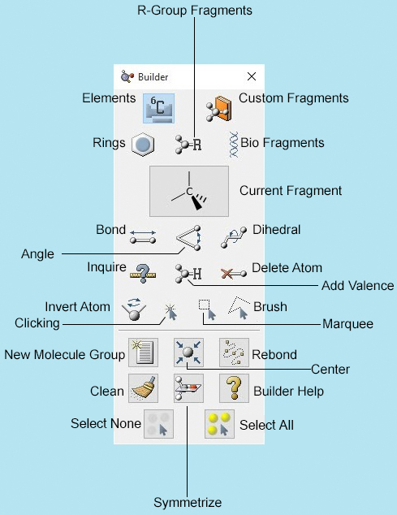

<!-- p.8 -->
You can detach an individual toolbar from the main toolbar by grabbing its handle and dragging it out of the toolbar area. To reattach a standalone toolbar, either drag it back into the main toolbar or double click it.

The Builder toolbar can also appear as a standalone palette (as illustrated on the right above). You can open it with View=>Builder.

# Molecules, Molecule Groups, and Views

GaussView uses these constructs to organize the many molecules which are being utilized at any given time:

- 

A molecule is most often a single molecule being worked on in isolation from other ones that may also be open. A molecule generally corresponds to a single file stored on disk. These are also sometimes referred to as models. Note that a molecule in this sense may contain more than one chemical species (i.e., “molecules” in the usual chemical sense).

- 

If there is more than one window open for the same molecule, the various different ones are referred to as views. Accordingly, a View window displays a molecule, and different views—and View windows—can display different orientations and properties of the same molecule.

- 

A molecule group is a collection of one or more molecules that are worked on as a unit. Molecule groups containing more than one molecule display each one in a separate subwindow of a combination View window (see Figure 4). Molecule groups are also referred to as model groups.

View window title bars display information about the current molecule group, molecule, and view: each distinct molecule group is identified by an icon whose color is uniquely associated with it. The figure below shows the color icons from two different View windows (each corresponding to a different molecule group). All dialogs that are directly associated with that molecule group will use the same color icon to visually associate themselves with their parent molecule group (including new views created using View=>Add View). This color icon is also used to identify the molecule group in the Windows menu.

Color Icons from 2 Different Views

The icon on the left corresponds to the 4th molecule in the 1st molecule group (red), while the one on the right is the 2nd view of the 1st molecule in the second molecule group (green). This same color icon will appear in all dialogs associated with that molecule. For some operating systems, the color icon is located in the status bar.

In addition to its color icon, each View window is uniquely identified by its group/molecule/view identifier. This identifier consists of the molecule group (G), the molecule number (M), and the view number (V). Each of the molecules in a molecule group are numbered sequentially, starting at 1. If a molecule in the group is deleted, the molecules are renumbered to maintain a continuous sequence.

Note that dialogs corresponding to molecule-editing function are molecule-specific. If you activate a different View window with, say, the Atom List Editor open, its context does not follow. Examine the header label of a dialog in order to determine the corresponding View window.

Right clicking anywhere within a molecule window will bring up a context menu. The contents of the context menu duplicates much of the Builder, the menu bars, and the toolbars. This is provided as a convenience for the user.

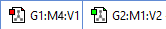

<!-- p.9 -->
View Window Context Menu Each of the options on the context menu brings up a submenu containing related items.

## Working with MultiView Windows

For molecule groups containing more than one molecule, there are two display modes. Single-view mode displays a single molecule at a time (on the left in the figure below). The current molecule number appears in the toolbar.

In a single-view window, clicking the multiview icon

brings up multiview mode, in which several molecules can be viewed at one time (on the right below). Be aware that the multiview fields and controls in the toolbar appear only when there is >1 molecule in the molecule group. The icon toggles between two forms, depending on the current view mode.

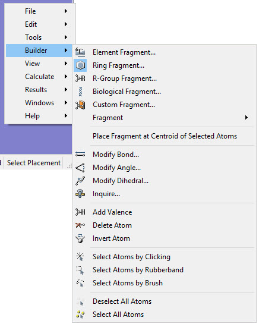

<!-- p.10 -->
A Molecule Group Containing 12 Molecules

Individual molecule views are contained within the larger multiview window. The molecule number is shown in the title bar of each frame. The currently active molecule is shown with a slightly lighter background to distinguish it from the other molecules and is the one involved in atom selections or in the dialogs. Clicking on one of the individual molecule windows that is not the active molecule window will cause it to become the active molecule. In the event that not all of the individual molecules can fit in the View window, a scroll bar allows you to move between the different molecules.

Clicking on the small triangle to the right of the multiview icon reveals the Multiview Display Mode context menu:

The Multiview Mode Content Menu

You can also open this menu by right clicking the title bar of the multiview display area. This menu controls the layout and behavior of multiview display mode:

- 

Workspace Background Color: Modify the background color of the current window.

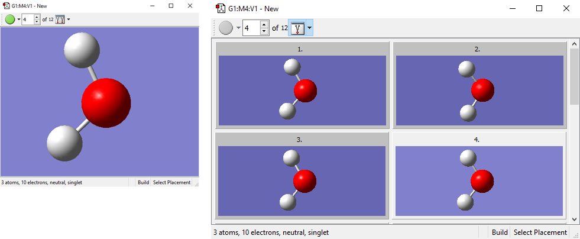

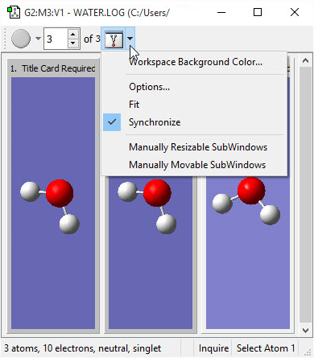

<!-- p.11 -->
- 

Options: Open the MultiView Options dialog (see below).

- 

Fit: Resize all individual molecule frames so all are visible in the window.

- 

Synchronize: Link all frames so that mouse actions in one affect all of them (e.g., rotations). By default, each view is independent.

- 

Manually Resizable SubWindows: Allow the resizing the SubWindows manually by clicking and dragging on the triangle in the lower right corner.

- 

Manually Movable SubWindows: Allow for the moving of the SubWindows manually by clicking and dragging on the upper portion of the SubWindow.

### Customizing MultiView Windows

The Multiview Options Dialog The button labeled Less above closes the bottom part of the dialog, and its label is More when the lower display is hidden.

The various controls in the MultiView Options dialog have the following uses:

- 

Visible Rows and Visible Columns: Number of rows and columns of individual frames initially appearing in a multiview window.

- 

Scrolling: Placement of scroll bars.

- 

Auto Fit SubWindows: When unchecked, resizing the multiview window does not affect the size of the individual frames, so more of them are typically visible when the window is made larger. When checked, individual frames are resized whenever the main window is so the same number of frames are always visible (based on the row and column values specified).

The following controls are visible when the More button has been pressed:

- 

Workspace Margin, Horizontal Spacing, and Vertical Spacing: Padding around the block of individual view subwindows and between the individual columns and rows (respectively).

- 

Borders, Titles, Captions, and Numbers: When checked, Borders displays border on individual view frames. Titles and Numbers control whether the job title and structure number appear in each frame title bar. Captions controls all title-bar text as a whole, and unchecking it suppresses all text regardless of the settings of the other items.

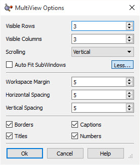

<!-- p.12 -->
## Deleting Views from Molecule Groups

When you no longer need views within a molecule group, the Edit=>Delete menu path will delete the current molecule and its View. The Delete button on the toolbar can perform the same function. Notat that if any atoms are currently selected in the current View, then both of these delete functions will only delete those atoms, and leave the rest.

If you want to remove all of the atoms but keep the empty view within the molecule group, click on the Select All Atoms button on the toolbar and then navigate to one of the two delete functions. This will clear the View window.

The Cut button and the Edit=>Cut offer the same functionality as the Delete function, except that it puts the molecule (or atoms) on the clipboard for future use.

## Animating Multiple Structures

Clicking on the green run button in the toolbar for a multiview molecule group will cause the View window to show each molecule in the group sequentially and continue to cycle through the full list until stopped. This has the effect of visually animating the sequence of molecules like a movie. This can be particularly useful for animating a series of related geometries, such as a Reaction Path plot. After the green run button has been pressed, it turns into a red stop button, which will stop the animation.

Animation Playback Controls

The small triangle next to the animation button contains a small menu. The Repeats button allows the user to specify how often the animation will play for. The Sequence button allows the user to specify how the animation will play. The Frame Delay (msec) button indicates, in miliseconds, how long the delay is between each frame. The Endpoint Delay (msec) button indicates, in miliseconds, how long the delay is between the endpoint of the animation and the next loop.

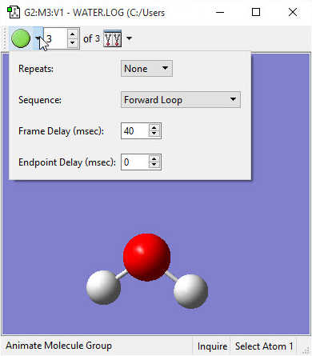

<!-- p.13 -->
# Using the Mouse

Interaction with molecules is designed around the movements of a three-button mouse. The functions of the mouse buttons are described in the following table:

Note that these mouse actions are active in any molecule display (including ones in GaussView dialogs).

## Limiting Mouse Actions to One Fragment

If two items are not bonded to one another (not connected by visible chemical bonds on the screen), you can manipulate them individually on screen by holding down the Alt key and moving the cursor. When you use the Alt key, only the fragment closest to the cursor is affected. Thus, Alt-Shift or Alt-Center mouse button will allow you to drag only the closest fragment.

# GaussView Menus

GaussView contains the following menus, which have the indicated general purposes:

- 

File: Creating, opening, printing, and saving structures and movies, as well as setting GaussView preferences.

- 

Edit: Performing configuration tasks on a structure as a whole.

- 

Tools: Specialized features for specific building tasks and calculation types.

- 

Builder: Creating and modifying molecular structures and structural parameters.

- 

View: Managing and interacting with the display of molecules.

- 

Calculate: Setting up and submitting Gaussian calculations and viewing current GaussView-initiated jobs.

- 

Results: Examining calculation results, including surfaces, spectra, plots, and animations.

- 

Windows: Managing the various GaussView windows.

- 

Help: Viewing help files for GaussView and Gaussian, as well as GaussView tips.

A reference table listing all GaussView menu items and toolbar icons is available here.

| Mouse Button |  |  |
| --- | --- | --- |
| 3-Button | 1,2-Button Equiv. | Action |
| Left | Left | Click |
|  |  | Click (C key pressed) |
|  |  | Drag (R key pressed) |
|  |  | Drag (P key pressed) |
|  |  | Drag Left/Right |
|  |  | Drag Up/Down |
| Center | Shift-Left | Drag |
| Right | Ctrl-Left | Drag Left/Right |
|  |  | Drag Up/Down |
|  |  | Click in an open area |
|  |  | Shift-Click on atom |

<!-- p.14 -->
# GaussView Preferences

Default settings for many GaussView features can be customized via the preferences, which are reached with the File=>Preferences menu path. The following preferences are available:

- 

Building: Specify default settings for advanced fragment placement options.

- 

Charge Distribution: Specify desired settings for displaying atomic charge and dipole moment data.

- 

Clean Controls: Set the adjustable parameters and controls for the structure cleaning function.

- 

Colors: Customize the coloring of various GaussView displays.

- 

Custom Bonding Parameters: Specify data for identifying/assigning bond types.

- 

Desktop: Define file associations for extensions associated with Gaussian and GaussView files (Windows version only).

- 

Display Format: This category is broken down into four seperate categories: General, Molecule, Surface, and Text.

- 

File/Directory: Set preferred directory locations for various GaussView contexts.

- 

Font: Specify the font used for the GaussView interface.

- 

Gaussian Setup: Set the preferred Gaussian Calculation Setup dialog settings.

- 

Icons: Set default icon sizes in the user interface.

- 

Image: Set the preferred values for capturing images.

- 

Job Setup: Define execution procedures for Gaussian and related jobs.

- 

Movie, Animation: Specify preferences for animations created by GaussView.

- 

Print: Set the preferred values for printing images.

- 

Vibrations: Set the preferred Display Vibrations dialog settings.

- 

Window Behavior: Set the preferred behavior for dialogs.

All of the preferences dialogs contain several buttons: Ok (save current settings and exit), Cancel (exit and discard unsaved changes), Default (restore GaussView’s installation settings), and Help (obtain online help). When you use the Default button, a dialog similar to the one below will appear:

Restoring Default Preferences When you click the Default button in the Preferences, you are given the choice of restoring all default preferences or only the ones pertaining to the current dialog (here, the default preferences for Vibrations).

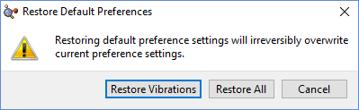

<!-- p.15 -->
# Displaying GaussView Tips

The Help=>GaussView Tips menu path opens the GaussView Tips window, which displays various tips for using the program effectively. You can also choose to have a tip displayed each time GaussView starts up, using the checkbox at the bottom of the window (the default is unchecked).

GaussView Tips Click Show tips at startup to view a tip each time you start GaussView.

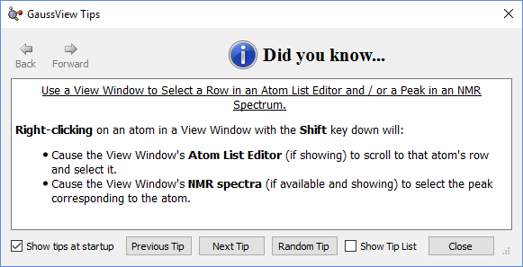

<!-- p.16 -->
# How To: Build Molecules

# Placing Elements and Fragments

The GaussView molecule building tools always operate on the active View window. In general, GaussView begins and remains in its insert/replace mode, unless one of the options described below explicitly calls for it to act in a different manner. Clicking in an open area of the View window adds the current atom or fragment to the window as a distinct fragment. Clicking on an existing atom adds the current item to the existing structure at the indicated point, usually replacing it (other options are discussed later).

The desired atom or fragment is chosen using one of the Element, Functional Groups, Rings and Biological Fragments buttons and then selecting one of the choices from the resulting palette. The current item always appears in the Current Fragment area of the GaussView control window and/or the Active Fragment area of the standalone Builder palette. Clicking on either the Active Fragment area on the standalone Builder palette or on the fragment name above the main window’s Current Fragment area opens the palette corresponding to the selected fragment type.

Note that the standalone Builder palette is opened with the View=>Builder menu item and can be made to always stay on top of all other open windows by checking the Builder Dialog Stays on Top checkbox in the Window Behavior Preferences (accessed with the File=>Preferences menu path).

# The Element Fragments Palette

The Element Fragments palette allows you to select an element from the periodic table. The various possible coordination patterns for the selected element are shown at the bottom of the window below. The default element type is tetrahedral carbon.

The Element Fragments Palette

The available hybridization (connectivity) variations for the selected element appear along the bottom of the palette.

<!-- p.17 -->
# The R-Group Fragments Palette

The R-Group Fragments window allows you to select from a series of AM1-optimized functional group fragments. The default group is carbonyl (formaldehyde).

The R-Group Fragments Palette

Use this palette to select the desired functional group.

Note that several of the fragments use non-traditional bonding. These fragments include a five-member ring with an open bond perpendicular to the plane of the ring: a η5-cyclopentadienyl ligand for use in constructing organometallic systems.

# The Rings Palette

The Ring Fragments window allows you to select from a series of AM1-optimized ring structures. The default ring is benzene.

<!-- p.18 -->
The Ring Fragments Palette

Use this palette to select the desired ring system.

# The Biological Fragments Palette

The Biological Fragments palette presents a set of AM1-preoptimized fragments useful to biological researchers: the amino acids and various DNA bases. The default biological fragment is Alanine Central Residue.

Selecting Biological Fragments

Use the various fields in this window to select amino acids and DNA bases.

The Type field allows you to select either Amino Acid or Nucleoside. When Amino Acid is selected, the left popup menu below the Type field can be used to select the desired amino acid, and the right popup menu in that line allows you to specify the structural form as Central Fragment, Amino-Terminal Fragment or Carboxyl-Terminal Fragment (the last two are the N-terminated and C-terminated forms, respectively).

<!-- p.19 -->
When the Type field is set to Nucleoside, the left popup menu below the Type field can be used to select the desired DNA base (nucleic acid fragment), and the right popup menu in that line allows you to specify the structural form as Central Fragment, C3’-Terminal Fragment, C5’-Terminal Fragment or Free Nucleoside.

# Making Palettes Sticky

The various palettes in GaussView can be used in a modal (dialog box behavior) or amodal (floating palette behavior) manner. The thumbtack icon in the upper left corner of the window shows whether the palette will close when another one is selected (or a non-building context is entered). The green pushed-in tack indicates that the palette is “tacked” to the desktop (i.e.,

“sticky”):

; the red upward pointing tack similarly indicates modal operation:

.

# Undo and Redo

The Edit=>Undo and Edit=>Redo menu paths may be used to reverse or reinstate a previous molecule modification or other action. The Undo button and the Redo button may be used for the same purposes.

# Viewing and Adjusting Structure Parameters

The Builder toolbar/window includes the following buttons for viewing and modifying the structural parameters of molecules: Inquire, Bond, Angle, Dihedral, Add Valence, Delete Atom, and Invert About Atom. In addition, other buttons and their corresponding menu items also affect molecular structure—including Clean, Rebond, and Symmetrize—and display.

See these links for details about Modifying Bonds and Modifying Angles.

# Inquire Mode

The Inquire button allows you to request geometric information directly from the View window when you click on the atoms of interest. Note that the selected atoms do not need to be bonded. The structural information appears in the View window’s status bar, as in Figure 14. The number of atoms that you select affects the resulting display on the View window:

- 

Hover over atom: atom type and number:

. This feature is called mouse cursor tracking, and it is controlled by the setting on the Windows Behavior preference. By default, you must hold down F5 to use it. However, you can change the setting to have it always active or disabled entirely.

- 

1 atom: Atom type and number:

.

- 

2 atoms: Bond length (distance):

.

- 

3 atoms: Interatomic angle:

.

- 

4 atoms: The 4-3-2-1 dihedral angle:

.

<!-- p.20 -->
Inquire Mode Display

This display shows the value of the selected bond angle in the window’s lower left corner.

# Adding and Deleting Valences

The Add Valence button attaches additional valences (shown as hydrogen atoms) to the center clicked with the mouse. The new valences will be placed as far as possible from the other atoms attached to the center.

Similarly, the Delete Atom button removes atoms and open valences. When used, the function will eliminate the selected atom and all single valences (hydrogens) attached to it. It may also be used to remove a dangling bond by clicking on the bond stick.

<!-- p.21 -->
Deleting a Dangling Bond (Open Valence)

The Delete Atom button may be used to remove atoms and dangling bonds. An example of the latter is shown at the top of the molecule. Clicking on it will remove the open valence.

# Invert About Atom and Mirror Invert

The Invert About Atom button allows you to reverse the symmetry of a molecule with respect to a selected atom.

<!-- p.22 -->
Inverting a Structure About an Atom

Clicking on the nitrogen atom with the Invert About Atom tool will result in the structure on the right. The tool changes the stereochemistry of that atom center, resulting in a different diastereomer.

The Edit=>Mirror Invert menu item will invert the stereochemistry of the entire molecule. The example below changes the R diastereomer into the S diastereomer.

Using Mirror Invert

# Cleaning Structures

The Clean button and Edit=>Clean menu items both adjust the geometry of the molecule, based on a defined set of rules, to more closely match chemical intuition. The results are only approximations and are not intended to be perfect. Geometries may require adjustment for non-classical cases such as transition states.

<!-- p.23 -->
The GaussView clean function may be customized via the Clean Controls Preferences panel.

Customizing the Clean Function

You can use this preference panel to modify and customize how the GaussView clean function operates.

The default clean settings attempt to achieve a balance that produces expected “normal” results. Altering the settings in Clean Controls Preferences can cause unexpected and undesirable results, so please read the following sections carefully before making any changes.

The following controls are available in the dialog. The fields in the Rel. Weights column are:

- 

Bond: The targeted bond lengths are assigned based on the van der Waals radii of the two atoms forming the bond, with slight adjustment for bond type. They are not intended to be chemically accurate, but they should give reasonable input geometries for Gaussian.

- 

NonBond: Repulsive term between all atoms that are not directly bonded. The purpose of this component is to keep atom centers apart so one atom is never masking another atom. However, it will not adjust biphenyl.

- 

Hard Angle: Hard angles are calculated for atom centers that contain 2-4 bonds. They are weighted more heavily since the targeted angles are known. These terms are vital for maintaining atom center integrity.

- 

Soft Angle: Soft angles are calculated for atom centers that contain 5 or more bonds. The targeted angles are not well known, but desired results can be achieved with practice. To produce a trigonal bipyramidal structure, adjust the axial bond angle to 180 degrees. Make sure the linear angle bias option is on. Most of the time, the clean procedure will produce the desired structure. Practice with coordinate patterns to get a feel for cleaning more complex coordinations.

- 

1-Ctr Dihed: Calculated from the Newman projections down each bond and limited to atom centers with less than 5 bonds. This term helps maintain atom center integrity when the 2-center dihedrals are causing distortions.

- 

2-Ctr Dihed: This is the only term that affects tertiary structure. The targeted dihedrals will be eclipsed or staggered based on the bond types. If each atom center contains multiple bonds, the targeted dihedral will be eclipsed.

The checkboxes at the bottom of the window have the following effects:

<!-- p.24 -->
- 

Double the weight for linear angles: This term assists cleaning with soft angles where the angles at an atom center are not well known.

- 

Use one 2-center dihedral per bond: Normally, this option should remain unchecked. It is available to provide better performance on slower systems.

The fields in the Opt. Controls column are:

- 

Tolerance: Lower values give more accurate structures, but can take significantly longer to clean. The range should be between 1.0E-5 and 1.0E-12.

- 

View Updates: Controls how often the views of the molecule being cleaned are updated. A value of 1 gives a refresh with every clean cycle. A value of 10 gives a refresh every 10 clean cycles. A value of 0 disables view updates until clean is complete. Depending on your system, this parameter can have a significant effect on cleaning time.

- 

Max Cycles: Maximum number of steps during a clean optimization. A good value is 150. Larger structures may require a larger value.

- 

Max Time: Maximum time (seconds) allowed for a clean operation to complete.

It is important to remember that the various components of the clean force field are relative. Changing one weight will affect the behavior of the other weights. For example, an excessive non-bond weight will produce longer bonds. Similarly, an excessive hard angle weight could affect the 2-center dihedrals.

You can disable any set of terms by assigning a weight of 0.0. For example, disabling the 1-center dihedral term can result in faster cleaning, but the resulting tertiary structure may not be as nice. Do not disable the bond weight or hard angle terms. The former should be kept high relative to the other terms.

## Clean Performance Tips

If the clean function is too slow on your system, try these settings:

- 

NonBond: 0

- 

1-Ctr Dihed: 0

- 

Use one 2-center dihedral per bond: checked

- 

View Updates: 0

Poor performance of the clean function can also be a symptom of a memory shortage on the system.

# Rebonding Structures

The Rebond button and Edit=>Rebond menu path both initiate a rebonding process in which GaussView reidentifies bonded atoms, based on a distance algorithm. Note that Gaussian usually does not use the bond information on the screen for calculations. This information is presented primarily to make it convenient for you to visualize the chemistry of the molecule.

# Imposing Symmetry

The Point Group Symmetry dialog is used to specify the desired symmetry for a molecular structure. It is reached via the Tools=>Point Group menu path. The controls have the following meanings:

- 

Enable point group symmetry: Enable GaussView’s symmetry features.

- 

Constrain to subgroup: Select a point group to which to constrain the structure.

<!-- p.25 -->
- 

For: Select All changes to impose symmetry on future structural changes. None disables symmetry constrains.

- 

Approximate higher-order point groups: Higher symmetry subgroups which might apply.

- 

Tolerance: Cutoff level below which to consider structural parameters equal. Larger cutoffs make higher symmetry groups easier to identify. Thus, increasing the tolerance may cause additional point groups to appear in the popup menu on the left. You can select one of the items on the menu or enter a numerical value into the field.

- 

Symmetrize button: Impose the selected higher-order point group on the molecular structure immediately.

- 

Always track point group symmetry: Tells GaussView to continuously compute point group assignments as the geometry changes. Use this item in conjunction with a symmetry constraint setting of None in order to view point group changes continuously as you adjust structural parameters (e.g., use the bond length slider). Normally, the point group is identified only after the change is completed. For very large molecules on slower systems, enabling this item may cause noticeable delays in response time.

Imposing Symmetry on a Molecular Structure

In this example, GaussView has identified the current point group of this distorted benzene molecule as C1. It also recognizes that the C2v point group might also be appropriate. Clicking the Symmetrize button will apply the specified point group to

<!-- p.26 -->
the structure. The Tolerance field can be used to tighten or relax the symmetry identification process. In this case, loosening the tolerance allows GaussView to identify the highest applicable point group as D6h.

The Symmetrize button (on the toolbar) and the Edit=>Symmetrize menu item both immediately impose the maximum identifiable point group on the current structure, using the most recent Tolerance setting from the Point Group Symmetry dialog for this molecule (or the default of Normal). They also have the side effect of enabling point group symmetry for the molecule (again, using the previous settings, if any).

The View window status bar will indicate any identified and constrained symmetry for the molecule.

Symmetry-Related Status Bar Displays

<!-- p.27 -->
Four views of the symmetry information section of the status bar for the triazine molecule: (a) symmetry has not been turned on; (b) molecule symmetry (D3h) but no symmetry constraint (C1); (c) molecule symmetry (D3h) and structure constrained to D3 symmetry; and (d) molecule symmetry and constraint symmetry are both D3h.

# Pasting Molecules into the View Window

The Edit=>Cut and Edit=>Copy menu items and the corresponding Cut and Copy buttons can be used to cut or copy the entire selected atoms, or the structure if no atoms are selected, to the system clipboard. The clipboard contents are displayed in the current fragment area.

The Edit=>Delete menu item and the Delete Molecule button can be used to remove the structure in the current model, discarding it without copying it anywhere.

There are several options for pasting molecules from the clipboard. The Edit=>Paste menu item accesses a slideoff menu containing three items. These items can also be reached via the small downward-pointing triangle on the Paste button. Clicking on the Paste icon itself (avoiding the triangle’s panel) selects the Replace Molecule item.

The items on the Paste submenu are:

- 

Edit=>Paste=>Add to Molecule Group: Create a new model within the current molecule group, and place the structure on the clipboard into it.

- 

Edit=>Paste=>Replace Molecule: Remove the structure in the active window, and place the one on the clipboard there instead.

- 

Edit=>Paste=>Append Molecule: Add the molecule on the clipboard to the active model as a separate fragment.

# Placing a Fragment in a Centroid Position

The Place Fragment at Centroid of Selected Atoms item on the Builder context menu (reached by right clicking in an open area of a View window) will place the current element, R-group, ring, or biological fragment at the centroid position defined by the currently selected atoms. For example, to place an atom inside a C60 cage, select all of the atoms in the molecule, select the desired atom from the Element Fragments palette (specifying the bare atom type), right click in an open area of the view, and select Builder=>Place Fragment at Centroid of Selected Atoms. This process is illustrated below:

<!-- p.28 -->
Placing a Centroid Atom in C60

Note that if you simply want to define the centroid location without immediately placing any atoms there, you can use the dummy atom (element type X) to do so.

<!-- p.29 -->
# Modifying Bonds: The Bond SmartSlide

Once you have modified a parameter using the SmartSlide, the OK button must be pressed before any of the changes made on any SmartSlide are actually applied to the molecule. Clicking the close box will discard any changes (as will selecting the Cancel button).

The Bond SmartSlide is illustrated below. The initial bond length value is set to the distance between the selected pair of atoms, and the type of bond existing between them is indicated. The SmartSlide provides access to all the possible bond types.

The interatomic distance is dynamically adjusted by moving the slider along the scale. Values may also be directly entered in the text box.

You can change the bond type by clicking one of the bond type radio buttons without affecting the valence on the atoms from which the bonds are removed.

Note that the Bond SmartSlide is also used to add bonds between unbonded atoms. Simply click on the two atoms to be bonded as usual. When the SmartSlide opens, click on the type of bond desired, and the bond will be created. Similarly, to remove a bond, select the two atoms you want to unbond, and then select the None radio button in the dialog.

The Bond SmartSlide

This dialog can be used to add, remove, and change bond lengths.

The Displacement fields specify how attached groups are handled as the bond distance changes:

- 

Translate Atom: Move only the atom, keeping the group’s position fixed in space.

- 

Translate Group: Move the attached group along with the atom (i.e., as a single unit).

- 

Fixed: Do not allow the atom or the group to move (all movement occurs at the other atom).

The following figure illustrates the effects of different combinations of these choices:

<!-- p.30 -->
1=Fixed, 2=Translate

1=Fixed, 2=Translate Atom

1,2=Translate Group

Group

Original

Bond Length Modification Options

All three of these structures result from lengthening the bond distance between the two selected C atoms (to the same value in all three cases). In the left picture, atom 1 was held fixed, and atom 2 was set to Translate Atom. Compare this to the middle picture which also held atom 1 fixed and set atom 2 to Translate Group. The upper methyl group stays fixed in the first case, while the 1-2-R bond angle remains unchanged in the center case. The right picture sets both atoms to Translate Group, probably the most common choice for a case like this one.

<!-- p.31 -->
# Modifying Bond Angles and Dihedral Angles

Bond angles and dihedral angles are modified with Angle and Dihedral SmartSlides.

The Angle and Dihedral SmartSlides

Once you have modified a parameter using the SmartSlide, the OK button must be pressed before any of the changes made on any SmartSlide are actually applied to the molecule. Clicking the close box will discard any changes; it is equivalent to selecting the Cancel button.

The figure following illustrates some of the combinations of various Displacement settings for bond angles (they work in the same way for dihedral angles). The possible choices for each popup menu are:

- 

Rotate Atom: Move only the atom, keeping the group’s position fixed in space.

- 

Translate Group: Move the attached group along with the atom as a single unit.

- 

Rotate Group: The group’s position rotates along with the atoms as the angle changes.

- 

Fixed: Do not allow the atom or the group to move (all movement occurs at other atoms).

1,2=Fixed, 3=Rotate Atom

1,2=Fixed, 3=Rotate Group

1,2=Fixed, 3=Translate Group

Original Molecule

<!-- p.32 -->
1,3=Rotate Atom, 2=Fixed

1,3=Translate Group,

1,3=Rotate Group, 2=Fixed

2=Fixed

Bond Angle Modification Options

All six of these structures result from increasing the 1-2-3 bond angle. In the top row, atoms 1 and 2 are both held fixed. Compare the results of increasing the bond angle to the same value in the three cases (keeping in mind the “normal” position for the ring atoms and the methyl groups). The movement of the methyl group attached to atom 3 ranges from substantial in the first frame to a little in frame 2 to almost none in frame 3. In the second row, atom 2 is held fixed while other choices are used for atoms 1 and 3. Comparison of these illustrations as well as experimentation will make the differences between the choices clear and familiar.

# Modifying Dihedral Angles via Newman Projections

The View Along popup menu in the lower left corner of the Dihedral SmartSlide dialog allows you to reposition the molecule using a Newman projection along the 2,3 internuclear axis or the 3,2 internuclear axis.

<!-- p.33 -->
Viewing a Dihedral along the 2,3 Internuclear Axis You may choose to reposition the molecule so that the 1,2 or 3,4 axis is vertical.

<!-- p.34 -->
# Specifying Fragment Placement Behavior

The small triangle above the Current Fragment area of the GaussView control window can be clicked to reveal some advanced options to specify how new fragments are joined to an existing molecular structure. The Mode popup allows you to select the settings (in which case, all fields are disabled), to specify Custom settings, or to restore the previously-used (Old) non-default settings (also nonmodifiable). You must select Custom in order to make changes to these items. The values for these three groups of settings can be specified in the Building Preferences.

There are two panels in this area. The Before panel, pictured below, sets restrictions for how fragments may be added to a structure. The After panel (the third image) specifies how the structure is treated after a fragment is added.

Here are some preliminary definitions necessary for understanding the options in these panels:

- 

The target atom is the one selected with a mouse click.

- 

The hot atom is the atom in the new fragment that takes the place of the existing target atom when the two pieces are joined.

- 

A terminal atom is any atom bonded to only one atom.

- 

A terminal valence atom is a hydrogen atom or an open valence bonded to only one atom.

- 

A join-bond is a bond between the hot atom and any terminal atom. These are bonds that can be eliminated in the process of connecting the fragment to the target atom. When a fragment is joined to the target atom, there must be one join bond in the fragment for each corresponding bond to the target atom.

These are the items in the Fragment Placement Before panel:

- 

Target and Fragment Join-Bond Types Must Match: The selected join-bonds in the fragment must match the bond types of the target atom. Enabling this item will prevent many placements.

- 

Fragment Join-Bonds Can Be Any Terminal Bonds: Normally, only hydrogen or open valences are taken as joinbonds. When this option is on, any terminal atoms are also candidates for join-bonds. For example, the oxygen bonds. When this option is on, any terminal atoms are also candidates for join-bonds. For example, the oxygen atom in formaldehyde could be used as a join-bond for ethylene because the bond type matches (double bond).

<!-- p.35 -->
Fragment Placement Restrictions

The items in this window set restrictions on the circumstances in which fragments may be joined to an existing structure. This window shows the default values.

- 

Create Fragment Join-Bonds If Necessary: This option will allow most fragments to be attached to any target. If the fragment does not have enough join-bonds for a given target selection, additional valences will be added to satisfy the requirement. Again, the join-bonds are deleted when fragment and target are joined as well as the target atom (on by default).

- 

Terminal Hot Atoms Define Join-Bonds: This option makes it easier to choose terminal atoms as hot atoms. Since most terminal atoms have no join-bonds, the option will use the one bond as the join-bond. However, the bond will not be deleted. This is useful when you have a central atom with more than one terminal bond, and you want to explicitly choose which terminal bond will be used to do the joining.

- 

Bond to Target Atom Instead of Deleting It. This option allows you to bond the fragment to target atom itself, deleting only the join-bonds.

- 

Delete Any Terminal Atoms Bonded to Target Atom: Remove extra terminal bonds.

- 

Automatically Select Hot Atom: This item is designed for use with biological fragments (which is its default setting). It causes GaussView to determine the hot atom dynamically. This makes it easier to build amino acid residues, etc., by producing a sensible backbone as you add residues.

<!-- p.36 -->
Structure Options After a Fragment Placement

The options in this panel allow you to select actions for GaussView to perform automatically after a fragment is added to a molecular structure. The settings in this example are the defaults.

These are the items in the upper portion of the After panel:

- 

Use Fragment Join-Bond Type For New Bond: Normally, the bond connecting the fragment to the target bond type is determined by the original target bond. If this option is on, the fragment’s bond type is used instead. This option is useful when the Match Bond Types option is off.

The next three items activate electron bookkeeping at the target atom site. Note, however, that non-terminal atoms are not affected. Also, GaussView does not reduce or elevate the bond type to satisfy valency requirements.

- 

Delete Terminal Valence Atoms to Satisfy Valency: Allows terminal valence atoms to be deleted to reduce overloaded valency at the target atom site.

- 

Delete Terminal Atoms to Satisfy Valency: Allows for any terminal atom to be deleted to reduce overloaded valency.

- 

Add Hydrogens to Satisfy Valency: Automatically adds hydrogen atoms to satisfy valency requirements.

The popup menu controls the treatment of the hot atom fragment placement. The options are shown in the illustration. The default is to retain the atom. The remaining options enable automatic cleaning operations, and they are self-explanatory: Optimize Dihedral Angle About New Bond, Apply “Clean” Around Hot Atoms, and Apply “Clean” to Whole Structure.

<!-- p.37 -->
# Molecule Positioning Tools

The figure below illustrates the molecule positioning toolbar, which is accessed with the View=>Positioning Tools menu item.

The Positioning Toolbar

For all of the tools, the view’s X, Y, and Z directions are the horizontal, vertical, and depth of the window, and the molecule X, Y, and Z directions are those indicated by the Cartesian axes. The various controls are described individually below (moving across the toolbar from left to right):

- 

The Quick popup contains items that center the molecule in one or more view directions or align axes on the molecule the view’s. For example, the Center and Center X items center the molecule within the window and with respect to the window’s X-axis (i.e., horizontally), while the Mol X -> View Z item aligns the molecule’s X-axis with the View window’s Z-axis. Other items work analogously.

- 

The second popup menu indicates whether the molecule will be rotated or translated to perform the repositioning when the Apply button is pushed. The next two fields also control the operation.

- 

The Around field specifies the axis about which the molecule will be rotated (active when the previous popup is set to Rotate). When Translate is selected in the initial field, then the label changes to Along.

- 

The By field specifies the amount of rotation or translation.

- 

The final slider provides another way to specify the amount of movement. As you adjust the slider, the molecule moves immediately in the direction and manner specified by the first two fields (and the By field is ignored).

<!-- p.38 -->
# Display Format: General Panel

The items in the General panel control the background color, items displayed in the view, and the fog feature. It is illustrated below.

Display Format General Panel

You can change the View window background color by clicking on the color chip labeled Background Color and selecting a new color using the color selection dialog.

The Use Fog to Improve Depth Perception checkbox causes more distant atoms in the View window to recede to invisible, allowing nearer atoms to become more distinct. The Fog has Zero Visibility at field controls the depth at which atoms become completely invisible. This feature is illustrated below.

<!-- p.39 -->
The Fog Depth Display Feature The left illustration shows the molecule with the fog feature disabled. In the right illustration,

fog is turned on, and the frontmost atoms are much more distinct than more distant ones.

Compare the display types between the two windows to understand the effect of fog.

The remaining checkboxes in this panel control the display of various labeling and comprehension tools with the View window. Their effects are illustrated in the displays below (which uses benzene with a dummy atom in the center of the ring as its example for most settings):

- 

Show Hydrogens: Display hydrogen atoms in the View window. Default: On

- 

Show Labels: Display numeric labels indicating atom sequence numbers. Default: Off

- 

Show Bonds: Display bonds between atoms. Default: On

<!-- p.40 -->
- 

Show Stereochemistry: Display the chirality of any chiral centers. Default: Off

- 

Show Dummies: Display of dummy atoms if present. Default: On

- 

Show Symbols: Display the chemical symbol for each atom. Default: Off

<!-- p.41 -->
- 

Show Cartesian Axes: Display X,Y,Z axes. This feature is illustrated below. Initially, the origin of the axes is in an arbitrary position (sometimes located on atom 1), and it remains fixed despite changes to the molecule. Use the Edit=>Reorient menu item to move the origin to the molecule’s current center of mass. Display: Off

- 

Show Positioning Tools: Opening positioning toolbar in View window. Default: Off See this help entry

You can specify default values for these items via the General panel of the Display Format Preferences. You can also exclude labels and symbols on hydrogen atoms or hydrogen and carbon atoms using the Exclude View Labels and Exclude View Symbols items in the Text panel of the Display Format Preferences (both default to excluding no atom types). Finally, the size of textual labels can be adjusted using the Size field in the Text panel of the Display Format Preferences.

# Displaying Cartesian Axes

The figure below further illustrates GaussView’s Cartesian Axes display option. The window on the left shows the initial position of the axes (which is quite arbitrary), and the one on the right shows the origin’s new position after using the Edit=>Reorient menu item.

Cartesian Axes Display Before (left) and After (right) Reorientation

<!-- p.42 -->
# Display Format: The Quality Panel

The items in the Quality panel control the display of stationary and moving objects. It is illustrated below.

Display Format Quality Panel

On slower systems, it can be useful to set the slider more toward the Realistic end of the scale for Stationary Object Display and more toward the Fast end of the scale for Moving Object Display.

The Smooth checkboxes enable/disable smoothing in the display, and the Spotlight checkboxes enable/disable simulated spotlighting on the window contents.

<!-- p.43 -->
# Display Format: Molecule Panel

The options in this panel control how atoms and bonds appear in the View window. The three popup menus specify how atoms in each of the three ONIOM layers will be displayed. If the ONIOM facility is not being used, then the setting for the High Layer is used. The layer display settings are also used by some other GaussView features unrelated to ONIOM (e.g., displaying atoms at the boundaries of PBC unit cells).

The Display Format Molecule Panel

The various supported display types are:

- 

Ball & Stick: Molecule appears as a ball and stick model, with all types of bonds represented by single sticks.

- 

Ball & Bond Type: Molecule appears as a ball and stick model with single bonds represented by single sticks and multiple bonds represented by multiple sticks or, in the case of aromatic systems, by dotted lines. This is the default.

- 

Tube: Molecule appears as a tube model with no indication as to bond type. Atom types are indicated by color bands on the tubes.

- 

Wireframe: Molecule appears as a series of thin lines, colored by atom type and indicating bond type via the number of lines.

- 

None: Atoms are invisible (useful only with multilayer models).

The Use Bond Color checkbox controls whether bonds are partially or entirely colored by atom type in the tube display format. The two options are illustrated below:

<!-- p.44 -->
Tube Display Formats

These windows show pyrazine using the tube display format without (left) and with (right) the Use Bond Color item checked. The format on the right is the default.

The Atomic Radii popup menu and Scale Radii by field cause the atoms in the View window to be displayed at the indicated scaling of the standard or Atomic (the Standard and Covalent options on the popup menu, respectively). Using Covalent with a scaling value of 150%–200% will produce a space-filling-like molecular display, as in the following figure:

<!-- p.45 -->
A CPK-Like Display

The Z-Clip slider may be used to remove the frontmost portions of the image to allow views into the interior of the molecular display.

<!-- p.46 -->
# Display Format: Text Panel

The Text panel of the Display Format dialog controls the font and color of atom labels and symbols as well as allows you to exclude certain atoms from labeling, as previously mentioned. It is illustrated below:

The Text Panel of the Display Format Dialog

- 

Font File: This menu allows you to select from several font files provided with GaussView.

- 

Size: This field specifies the relative type size: type resizes with the molecule as you zoom in or out. Note that font sizes are generally limited to those included explicitly on the Size menu.

- 

Render: This field specifies the type rendering method.

- 

Color: This field specifies the type color.

<!-- p.47 -->
# How To: Set up Gaussian Jobs

This page discusses setting up Gaussian calculations with GaussView. It deals only with the mechanics of doing so. Consult the Gaussian User’s Reference for detailed information about all Gaussian keywords and options.

# The Gaussian Calculation Setup Window

Once the desired molecule is completed, you can use the Calculate=>Gaussian Calculation Setup menu path to open the Gaussian Calculation Setup dialog. It is illustrated below:

The Gaussian Calculation Setup Dialog

This dialog allows you to set up virtually all types of Gaussian calculations and to submit them from GaussView. The route section that GaussView is generating appears at the top of the dialog, and it is constantly updated as you make selections in the dialog’s various panels.

The dialog contains the following panels:

- 

Job Type: The specified type of job appears in the top popup menu. The default is a single point energy calculation. The remaining fields in the panel represent common options for the selected job type.

- 

Method: This panel specifies the quantum mechanical method to be used in a calculation. The factory default method is a ground state, closed shell Hartree-Fock calculation using the 3-21G basis set, but you can modify this with the Gaussian Setup Preferences.

- 

Title: This panel holds a field used for the Gaussian title section (designed to contain a brief description of the job). Type your description into the text box.

- 

Link 0: This panel is used for entering Link 0 commands for the job.

- 

General: This panel allows you to select commonly used general calculation options.

- 

Guess: This panel contains settings related to the initial guess. Consult the discussion of the Guess keyword in the Gaussian User’s Reference for full details on these options.

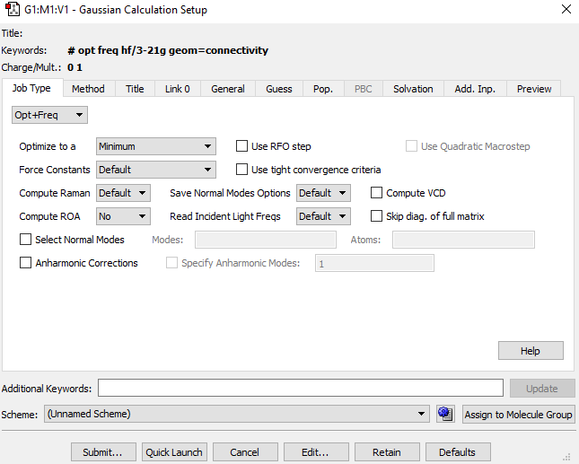

<!-- p.48 -->
- 

Pop: This panel is used to select NBO analysis at the conclusion of the Gaussian job.

- 

PBC: This panel is used to specify options to the Gaussian PBC keyword.

- 

Preview: Preview the generated input file.

- 

Solvation: This panel allows you to specify that the calculation is to be performed in solution rather than in the gas phase.

- 

Additional Input Panel: The final panel in the Gaussian Calculation Setup dialog is labeled Add. Inp. It may be used to enter any additional input section(s) required by the calculation you plan to run.

The Additional Keywords field below the panel area is used to enter any desired Gaussian keyword and/or option. Note that you must include the keyword for every option in this field even if it already appears in the route section as a result of panel item selection.

Below the panel area is the Calculation Scheme area. The controls have the following uses:

- 

Scheme popup menu: Select and apply a calculation scheme.

- 

(Schemes button): Open the Gaussian Calculation Schemes editor. This can also be accessed with the More Schemes selection from the Scheme menu.

- 

Assign to Molecule Group: Apply the current settings to all members of the current molecule group. Saving multiple files is explained here. Submitting multiple jobs is explained here.

The buttons at the bottom of the dialog have the following effects:

- 

Submit: Starts a Gaussian calculation using the current input file. You will be prompted to save the input file if you have not already done so.

- 

Quick Launch: Launches a Gaussian job without further ado (more information here).

- 

Cancel: Closes the dialog box and returns all selections to their default values.

- 

Edit: Allows direct access to the input file with an external text editor. The input file is not available for editing until it has been saved with GaussView.

- 

Retain: Closes the dialog box. Current selections are retained, but the input file is not created/updated, and no Gaussian job is submitted.

- 

Defaults: Returns all items to their default values.

<!-- p.49 -->
# The Job Type Panel

The Job Type panel appears below.

The Job Type Panel This dialog illustrates adding an option via the Additional Keywords field.

The top dropdown menu selects the job type. The default is a single point energy calculation. The remaining fields in the panel represent common options for the selected job type.

The available job types are:

- 

Energy: Performs a single point energy calculation.

- 

Optimization: Performs a geometry optimization until a stationary point on the potential energy surface is found. More information...

- 

Frequency: Computes Vibrational frequencies and intensities. More information...

- 

Opt+Freq: Performs a geometry optimization and then analyzes frequencies.

- 

IRC: Specifies that a reaction path be followed by integrating the intrinsic reaction coordinate. More information...

- 

Scan: Perfoms a potential energy surface scan. More information...

- 

Stability: Performs a calculation to test the stability of the Hartree-Fock or DFT wavefunction. More information...

- 

NMR: Predits NMR shielding tensors and magnetic susceptibilities. More information...

- 

blank: In order to select a job type other than those listed in the popup menu, select the blank menu item at the bottom of the list, and then type the appropriate Gaussian keyword into the Additional Keywords field in the lower section of the dialog.

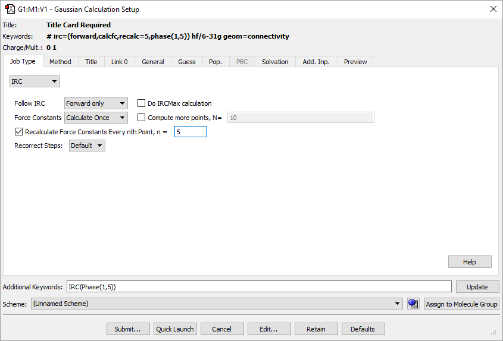

<!-- p.50 -->
You can also use the Additional Keywords field to add any desired Gaussian keyword and/or option. GaussView will merge all options for the same keyword within the generated route section. Note that you must include the keyword with any options appearing in this field even if it already appears in the route section. For example, in the dialog above, we’ve added the Phase option to the IRC keyword, while other options has been generated with the various popup and checkbox selections.

The Additional Keywords field is designed only for adding keywords to the route section. Use the Edit button for creating complex input files.

See here for a list of equivalent G16 Keywords for Gaussian Calc. Setup selections.

<!-- p.51 -->
# The Method Panel

The Method panel specifies the quantum mechanical method to be used in a calculation. The default method is a ground state, closed shell Hartree-Fock calculation using the 3-21G basis set. This panel is illustrated below.

The Method Panel

The fields in the Method line specify the following items:

- 

Whether the calculation is for a ground state (the default) or an excited state. If the latter, then the desired excited state method should be selected.

- 

The theoretical method. For some choices, a fourth field will appear. It is used to select the specific method of the given type. For example, in the figure above, the method field is set to DFT, and the fourth field selects the B3LYP functional.

- 

The wavefunction type (closed shell vs. open shell). The default is an unspecified type. The Restricted, Unrestricted, and Restricted-Open selections prepend R, U, and RO to the method keyword (respectively).

The Custom item on the second menu from the left—the theoretical method menu—can be used to specify a method other than those available via the menu(s). Place the desired method keyword in the text area that appears.

The Basis Set menus allow the selection of the basis set to be used in the calculation. Polarization functions and diffuse functions may be added to the basis set, using the corresponding menus in this line. Select the Custom item at the bottom of the basis set menu to select a basis set other than those that can be constructed via the controls in this area. You may enter any basis set keyword in the name field.

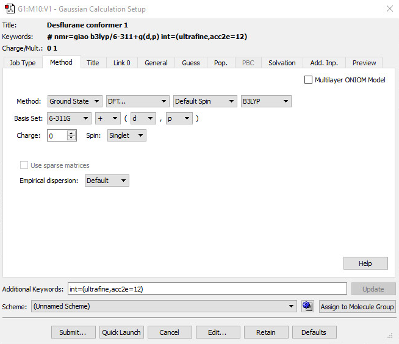

<!-- p.52 -->
Entering a Custom Basis Set Keyword

The Charge and Spin fields specify the molecule’s charge and spin multiplicity. GaussView will select values for these fields based on the molecular structure. They may be modified as needed.

The Empirical dispersion popup allows you to specify that empirical dispersion should be included in a DFT calculation.

The If defined selection will use whatever dispersion treatment is available for the selected functional. You can also select a particular dispersion scheme via one of the menu options. Finally, the None option will prevent the use of empirical dispersion.

See here for a list of equivalent G16 Keywords for Gaussian Calc. Setup selections.

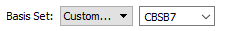

<!-- p.53 -->
# The Title Panel

The Title panel holds a field used for the Gaussian title section (designed to contain a brief description of the job). Type your description into the text box.

<!-- p.54 -->
# The Link 0 Panel

The Link 0 panel is used for entering Link 0 commands for the job. It has three subpanels.

The Link 0 Panel

This panel specifies a name for the checkpoint file, old checkpoint file and the read-write file, the amount of memory to use for this job, the number of shared memory processors, and/or the locations of Linda workers.

# The Options Subpanel

You can specify the various settings via controls in the Options subpanel. The items on the various popup menus have the following meanings (the default choice is starred):

Item Link 0 Command Selections

Memory Limit %Mem

*Don't use: Do not include %Mem in the input file. value: Use the selected value (in megawords). Specify: Use the specified value and units (see the example above). Shared Processors %NProcShared

*Don't use: Do not include %NProcShared in the input file. value: Use the selected number of processors. Specify: Use the value specified in the text field that appears with the option. Chkpoint File %Chk

*Default name: Include %Chk with a name derived from the input filename. Specify: Use the name specified in the input field. Use the ... button to navigate to a file. Don't save: Do not include %Chk in the input file. See the note below. OldChk File %OldChk

*No: Do not include %OldChk in the input file Default name: Include %OldChk with a name derived from the input filename. Specify: Use the name specified in the input field. Use the ... button to navigate to a file. Read-write File %RW

*Don't save: Do not include %RWF in the input file. Default name: Include %RWF with a name derived from the input filename. Specify: Use the name specified in the input field. Use the ... button to navigate to a file. Linda Workers %LindaWorkers

*Don't use: Do not include %LindaWorkers in the input file. Specify: Use the value specified in the text field. Kill Job %KJob

No: Run job normally. Lnnn: Stop after the specified link completes. Specify: Enter the desired link into the test field.

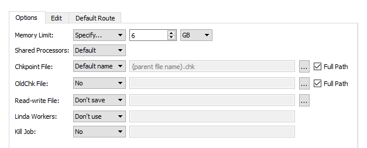

<!-- p.55 -->
Note: If you remove the specification for the name and location of the checkpoint file, you will not be able to visualize output automatically from this job.

The Full Path checkboxes control whether an absolute path (checked) or relative path (unchecked) is placed into the %Chk or %OldChk Link 0 command. However, the full path will not appear in the Edit subpanel even when the box is checked. The ... buttons allow you to select a specific file by navigating it it.

# The Edit Subpanel

The Edit subpanel allows you to edit the Link 0 commands directly.

The Link 0 Commands Editing Panel

# The Default Route Subpanel

The Default Route subpanel shows the contents of the Default.Route file in use. The path to the file is indicated at the top of the panel.

Viewing the Default.Route File

This display is informational only; the file cannot be edited.

See here for a list of equivalent G16 Keywords for Gaussian Calc. Setup selections.

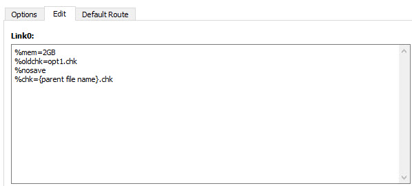

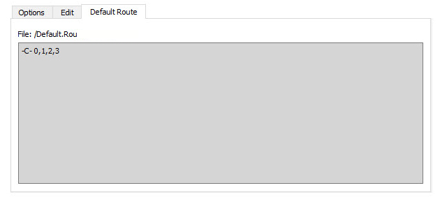

<!-- p.56 -->
# The General Panel

The General panel allows you to select commonly used general calculation options. It is illustrated below:

Gaussian Calculation Setup General Options Panel

This panel contains a set of commonly used options. The following table indicates the Gaussian keywords corresponding to the checkboxes:

Option DefaultKeyword Use Quadratically Convergent SCF Off SCF=QC Use Modified Redundant Coordinates On Geom=ModRedundant Ignore Symmetry Off NoSymm Use Counterpoise Off Counterpoise Write Cartesians On Cartesian coordinates are written (Off=Z-matrix coordinates) Additional Print Off #P Write Connectivity On Geom=Connectivity Write PDB Data On ResNum, ResName, PDBName (in molecule specification) Write Gaussian Fragment Data On Fragment (in molecule specification) Use MaxDisk Off MaxDisk=values Compute polarizabilities Off Polar Compute optical rotations Off Polar=OptRot Read Incident Light Freqs No CPHF=RdFreq

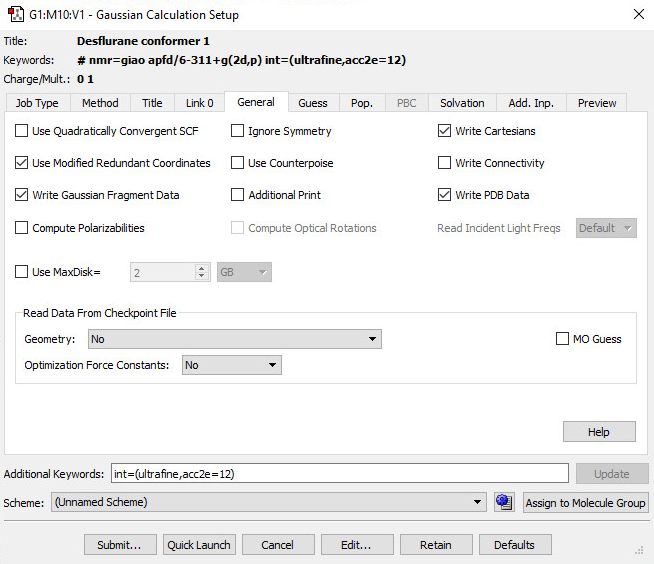

<!-- p.57 -->
The Use Modified Redundant Coordinates item is enabled only if you have created redundant coordinates with the Redundant Coordinate Editor. If not, the item is ignored (despite its default value). Write Gaussian Fragment Data and Write PDB Data are enabled by default, but have no effect unless the corresponding items are defined.

The Write Connectivity option also includes the appropriate additional input section(s) in the Gaussian input file.

If Write Cartesians is unchecked, then a Z-matrix will be written to the input file instead of Cartesian coordinates.

Note: Consult the discussion of the SCF keyword in the Gaussian User’s Reference for recommendations for unusual/problem cases (SCF=QC is not always the best next choice).

# Retrieving Items from a Checkpoint File

The items in the Read Data From Checkpoint File section control which items are retrieved from the checkpoint file from a previous job:

Option Default Keyword Geometry No Molecule Specification: Geom=Check Title, Charge and ... Molecule Specification: Geom=AllCheck Optimization Force Constants No Read Internal: Opt=ReadFC Read Cartesian: Opt=RCFC MO Guess Off Guess=Read

See here for a list of equivalent G16 Keywords for Gaussian Calc. Setup selections.

<!-- p.58 -->
# The Guess Panel

The Guess panel contains settings related to the initial guess. It is illustrated below. Consult the discussion of the Guess keyword in the Gaussian User’s Reference for full details on these options.

The Guess Method popup specifies the type of initial guess to use. It has the following options:

- 

Default: Uses the default Harris initial guess.

- 

Core Hamiltonian: Uses the Gaussian 98 default initial guess (Guess=INDO). Generally, we do not recomment its use except when recommended by Gaussian, Inc. technical support staff.

- 

Extended Huckel: Uses the Huckel guess (Guess=Huckel).

- 

Read checkpoint file: Retrieves the initial guess from the checkpoint file (Guess=Read).

- 

Read checkpoint if possible; otherwise generate: Check checkpoint file for the initial guess; generate if not present (Guess=TCheck).

- 

Read input checkpoint file: Read the guess from the checkpoint file whose name is specified in the input stream (Guess=Input).

Gaussian Initial Guess Options

The checkboxes in this panel have the following meanings:

Option Default Keyword

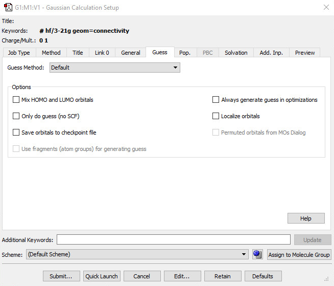

<!-- p.59 -->
The Permuted orbitals for MOs Dialog is disabled unless you have specified an alternate orbital ordering with the MO Editor. If enabled, it is on by default.

The Use fragments (atom groups) for generating guess is disabled unless fragments have been defined using the Atom Group Editor. If enabled, it is unchecked by default. When this box is checked, fragment-specific charges and spin multiplicities are generated and placed into the route section. You can also modify them using the Atom Group Editor (see the example for antiferromagnetic coupling in a later section of this manual).

See here for a list of equivalent G16 Keywords for Gaussian Calc. Setup selections.

| Mix HOMO & LUMO orbitals | Off | Guess=Mix |
| --- | --- | --- |
| Only do guess (no SCF) | Off | Guess=Only |
| Save orbitals to checkpoint file | Off | Guess=Save |
| Use fragments (atom groups) for generating guess | Off | Guess=Fragment |
| Always generate guess in optimizations | Off | Guess=Always |
| Localize orbitals | Off | Guess=Local |
| Permuted orbitals from MOs Dialog | On | Guess=Permute |

<!-- p.60 -->
# The Population Panel

The Population Panel

The Population Panel allows you to specify parameters for the population analysis (corresponding to options to the Population keyword).

Level of Output: This controls the level of detail produced in the output. This option produces a dropdown menu with Default (Print just the total atomic charges and orbital energies), Full (Same as the Regular population analysis, except that all orbitals are printed), Regular (The five highest occupied and five lowest virtual orbitals are printed, along with the density matrices and a full (orbital by orbital and atom by atom) Mulliken population analysis), Minimal (Total atomic charges and orbital energies are printed), and None (No orbitals are printed, and no population analysis is done).

At every geometry: When checked, this option will do a population analysis at every step during a geometry optimization instead of the default of the first and last steps.

The Merz-Kollman (ESP) Charges, Hirshfeld (CM5) charges, and Natural Transition Orbitals (NTOs) checkboxes request these types of electrostatic potential-derived charges.

The Biorthogonalize orbitals button will specify that the orbitals be biothogonalized when the calculation is run.

Perform NBO calc

- 

No NBO: This option will not perform an NBO calculation. This is the default option.

- 

Full NBO: This option will request a full Natural Bond Orbital analysis.

- 

NPA only: This option just requests the Natural Population Analysis phase of NBO.

- 

Full NBO (use NBO 6), NPA only (use NBO 6): These are the same as the options above, but use the separate NBO6 program via the external interface.

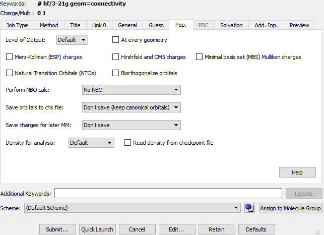

<!-- p.61 -->
- 

Full NBO (use NBO 7), NPA only (use NBO 7): These are the same as the options above, but use the separate NBO7 program via the external interface.

Save orbitals to chk file: This section allows you to select what orbitals you save to the checkpoint file. The options Save Mulliken, Save ESP, Save NPA, and Save Hirshfeld (CM5) can be can be used to save the corresponding charges.

- 

Don't save (keep canonical orbitals): This will not save any orbitals to the checkpoint file. This is the default option.

- 

Save NLMOs: This will save natural localized molecular orbitals.

- 

Save NBOs: This will save natural bond orbitals.

- 

Save Mixture of NLMOs and NBOs: This will save NBOs for the occupied orbitals and the NLMOs for the unoccupied orbitals.

- 

Save NTOs: This will save the generated orbitals in the checkpoint file, replacing the canonical ones if the density was read-in from there.

- 

Save Biorthogonalized orbitals: This will save biorthogonalized orbitals in the checkpoint file over the canonical MOs.

Save charges for later MM: This menu offers options for saving the charges for later Molecular Mechanics calculations.

The Choose Density for Analysis section allows you select the Density used in the population analysis. The Select density for analysis drop-down menu specifies the density:

- 

Default: This is the Hartree-Fock density for post-SCF methods; the DFT density for DFT jobs, and the CASSCF density for CAS jobs

- 

Current: Use the density matrix for the current method.

- 

SCF: Use the SCF density.

- 

MP2: Use the generalized density corresponding to the second-order energy.

- 

Transition: Use the CIS transition density between state M and state N. These states can be specified in the corresponding fields. M defaults to 0, which corresponds to the ground state.

- 

All Transitions: Use all available CIS transition densities.

- 

CI: Use the generalized density corresponding to the CI energy.

- 

QCI/CC: Use the generalized density corresponding to the coupled cluster/ACI energy.

Read density from checkpoint file: Enabling this option will ensure GaussView reads the density from the checkpoint file and apply it to the calculation.

See here for a list of equivalent G16 Keywords for Gaussian Calc. Setup selections.

<!-- p.62 -->
# The Solvation Panel

The Solvation panel allows you to specify that the calculation is to be performed in solution rather than in the gas phase. It is illustrated below.

The Solvation Panel

The Model field allows you to specify a specific solvation model (the default is IEFPCM). Some solvation models may present different/additional fields for their required parameters.

You can specify the solvent by selecting it from the corresponding popup menu. Use the Other selection to select a solvent other than those on the list:

Specifying a Defined Solvent not in the Menu

Only defined solvent keywords should be specified in this way. It is not possible to define additional solvents for the IEFPCM method in this way. See the Gaussian User’s Reference for the list of defined solvents.

You may use the Read additional input box to generate the SCRF=Read option; additional input may be entered via the Gaussian Calculation Setup dialog?’s Add. Inp. panel.

See here for a list of equivalent G16 Keywords for Gaussian Calc. Setup selections.

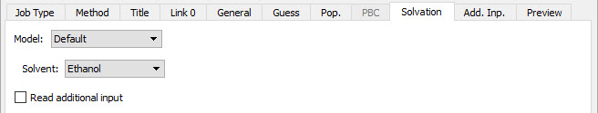

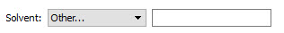

<!-- p.63 -->
# The Gaussian Calculation Setup PBC Panel

The PBC panel is used to specify options to the Gaussian PBC keyword. Checking the Use PBC box causes the translation vectors to be added to the molecule specification. This is the default when a unit cell has been defined with the Crystal Editor. The panel is disabled for non-periodic systems.

The PBC Panel

The Use PBC checkbox causes the translation vectors to be placed in the molecule specification. After you select the option above, an additional field for specifying the number of K-points will appear.

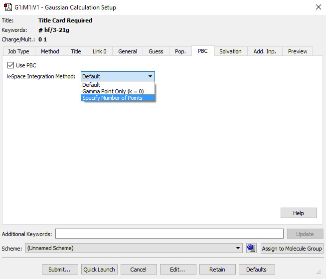

<!-- p.64 -->
# The Additional Input Panel

Additional Input Panel This example provides the input required for the CPHF=RdFreq option.

The penultimate panel in the Gaussian Calculation Setup dialog is labeled Add. Inp. It may be used to enter any additional input section(s) required by the calculation you plan to run. This input will be written to the Gaussian input file, provided that Write Additional Input is checked. Any additional input present in input files that you open will also appear in this panel.

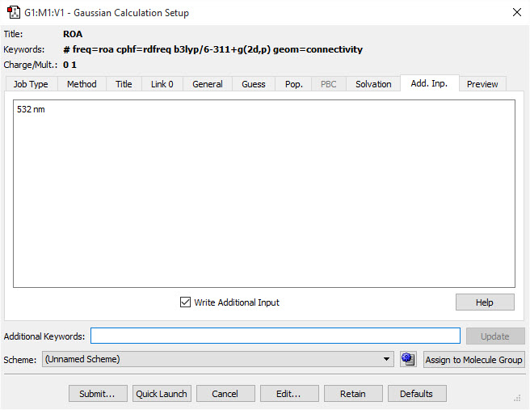

<!-- p.65 -->
# Gaussian Calculation Setup Preview Panel

This panel presents a preview of the Gaussian input file that GaussView will create when a save or job submit operation is requested:

Gaussian Calculation Setup Preview Panel

The text is read-only. Use the Edit button to modify it directly.

The Runtestrt button runs the testrt utility to verify the job's route section. The utility's output will appear in a separate window.

Gaussian Context Menu

The context menu for this panel's display area contains the following items:

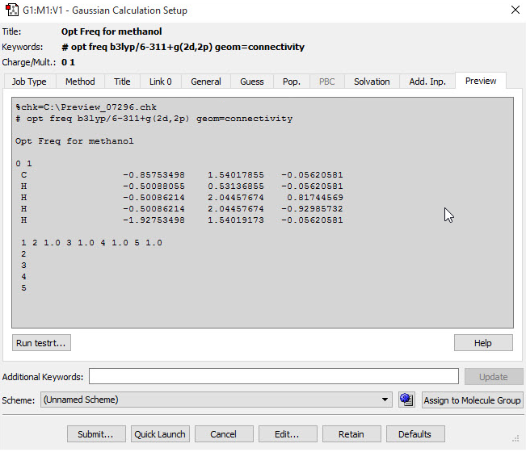

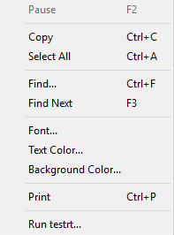

<!-- p.66 -->
- 

Copy: Copy selected text to the clipboard.

- 

Select All: Select all text.

- 

Find and Find Next: Search the generated input file.

- 

Font, Text Color and Background Color: Customize the display font and colors.

- 

Print: Print the generated input file.

- 

Help: Display help for this panel.

- 

Run testrt: Equivalent to the Runtestrt button described above.

# Special Considerations for Various Gaussian Job Types

This section summarizes information about setting up various Gaussian job types for which some special steps are required.

## Transition Structure Optimizations: Opt=QST2 and Opt=QST3

Gaussian STQN-based transition structure optimizations require two or three structures as input. To set up these jobs, you must create a molecule group containing the required number of structures. Once you have done so, the TS (QST2) and TS (QST3) options will be enabled in the Optimize to a field for the Optimization job type in the Job panel of the Gaussian Calculation Setup dialog.

If you plan on running an Opt=QST3 job, then the transition structure initial guess is assumed to be molecule 3 unless you specify a different structure on the Job Type panel.

Verifying and Specifying Atom Equivalences: In most cases, GaussView will automatically identify the corresponding atoms in the multiple structures for these transition state optimizations. However, you can verify this using the Connection Editor, accessed via the Connection Editor button on the toolbar or the Tools=>Connection Editor menu item. Connection Editor details here.

Warning: The atoms in the various molecules used for these two job types must be identical. If GaussView detects any ordering discrepancy, the option will be disabled on the Optimize to a dropdown.

## Calculations on Polymers, Surfaces, and Crystals

You can set up jobs for Gaussian’s Periodic Boundary Conditions facility using the Crystal Editor (reached via the Crystal Editor button or the Tools=>PBC menu path). Once you have defined a unit cell, GaussView automatically sets up PBC jobs for this structure by including the translation vectors within the molecule specification. This is indicated by the enabling of the PBC panel in the Gaussian Calculation Setup dialog and the checked Use PBC item. Note that, for normal cases, you do not need to access this panel at all and can proceed directly to setting up Gaussian input in the normal manner.

## Multi-Layer ONIOM Calculations

GaussView contains several features for setting up ONIOM calculations.

- 

Assigning Atoms to Layers: The Layer Editor allows you to graphically assign atoms to various ONIOM layers. It is accessed via the toolbar’s Select Layer button or via the Tools=>Select Layer menu item.

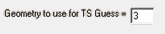

<!-- p.67 -->
- 

Assigning Molecular Mechanics Atoms Types: GaussView will assign Molecular Mechanics atoms types for UFF, Dreiding, and Amber (including Amber charges) to all atoms in the molecule automatically. You can view and modify these using the Atom List Editor (reached via the Atom List Editor button on the toolbar or the Tools=>Atom List menu path).

- 

Defining Link Atoms: GaussView will automatically assign minimal link atom information for the appropriate atoms in an ONIOM calculation. However, all link atoms are always handled in the same way, and they may require modification for your purposes. Link atoms generated by GaussView are always hydrogens (using the H_ UFF and Dreiding atom types and the HR Amber atom type, where R is the element of the linked-to atom). The only other link atom parameter that is included is the linked-to atom (the atom in the higher layer to which the current atom is bonded); all other parameters are left blank. The Atom List Editor is often a convenient way to examine and modify link atoms for ONIOM calculations. You can use the ONIOM Layers button to view and modify link atoms easily.

- 

Specifying the Model Chemistry for Each Layer: Once you have prepared the structure and specified all necessary parameters, you can set up an ONIOM calculation via the Method panel of the Gaussian Calculation Setup dialog. The Multilayer ONIOM Model checkbox indicates that this will be an ONIOM calculation.

## Specifying CASSCF Active Spaces Using Guess=Permute

GaussView can make it easy to specify CASSCF active space. The MOs dialog allows you to generate, view, select, and reorder the starting orbitals. It is reached with the Tools=>MOs menu path and via the MO Editor button on the toolbar. More details here.

## Modifying Redundant Internal Coordinates (Geom=ModRedundant)

You can specify additions and other modifications to redundant internal coordinates for geometry optimizations and other jobs by using the Redundant Coordinate Editor, reached via the Redundant Coordinate Editor button on the toolbar or the Edit=>Redundant Coordinates menu path.

## Freezing Atoms During Geometry Optimizations

The Atom Group Editor can be used to specify atoms whose positions are to be held fixed during a geometry optimization via its Freeze Atoms group class. This class is defined with four groups by default, corresponding to unfrozen atoms, frozen atoms, and the first two ONIOM frozen rigid blocks (freeze settings of -2 and -3; see the discussion of the Geom keyword in the Gaussian User’s Reference for full details on specifying frozen atoms and rigid blocks for ONIOM calculations). In order to hold specific atoms fixed during a geometry optimizations, add them to the Freeze (Yes) group.

## Selecting Normal Modes for Frequency Calculations (Freq=SelectNormalModes)

You can use the Atom Group Editor to select atoms for which normal mode analysis is conducted (see the Gaussian User’s Reference for details). Placing the desired atoms into the Select Normal Modes (Yes) group will cause them to be entered into the Atoms field corresponding to Select Normal Modes in the Gaussian Calculation Setup’s Job Type panel for Frequency jobs. You can modify this list manually as needed, but doing so will have no effect on the definition of the groups in the Atom Group Editor’s Select Normal Modes group class.

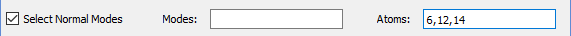

<!-- p.68 -->
## Setting up Scan Calculations

Different procedures are required for rigid scans and relaxed scans.

### Relaxed Scans

When setting up a relaxed scan calculation, you first must specify coordinates to be scanned in the Redundent Coordinate Editor.

For this example, we will be scanning the bond between two benezene rings as they rotate about each other. The initial bond is 90 degrees, and we wish to take 9 steps of 10 degrees each. First, click the Add button, and then select Dihedral from the dropdown menu. Change the second dropdown to Scan Coordinate.Now click on the dihedral you wish to scan in the View window. The Coordinate: fields in the Redundent Coordinate Editor dialog will fill in with the atoms you have selected. Two new input fields will appear allowing you to specify the number of steps and each step size in the scan. For our example, we fill in 9 steps of 10 degrees.

Adding a Scan Variable with the Redundant Coordinate Editor

When you open the Gaussian Calculation Setup’s Job Type panel, Scan, Relaxed (Redundant Coord) is already filled in, meaning the calculation will run with the settings you specified in the Redundant Coordinate Editor. In the Gaussian Calculation Setup’s Preview panel, which is shown below, you can see the input created by the Redundant Coordinate Editor at the end of the input.

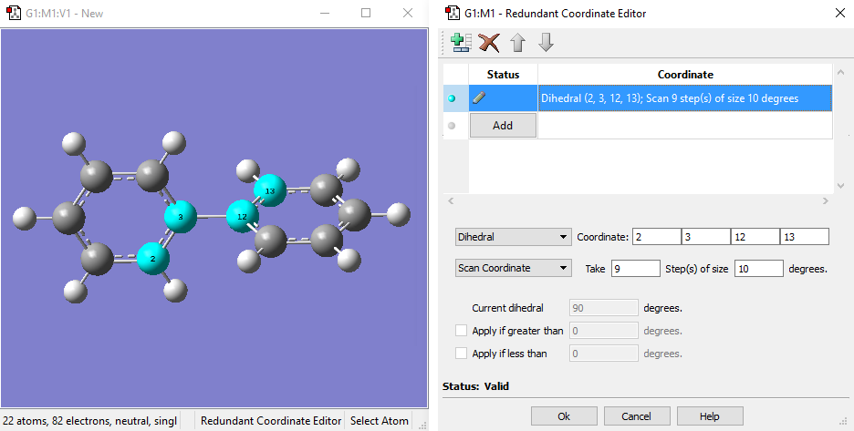

<!-- p.69 -->
Previewing the Relaxed PES Scan Calculation Input

### Rigid Scans

To set up a rigid scan calculation, we use the Atom List Editor to identify the structural parameters to be scanned. For this example, we open the Atom List Editor and then click on the Z and O buttons to display the Z-Matrix and Optimization Flags columns. We want to scan the C2-C3-C12-C13 dihedral angle. We locate this in row 13 of the table. In the Opt 3 column for this row, we change Yes to Rxn/Scan.

Adding a Scan Variable for a Rigid Scan with the Atom List Editor

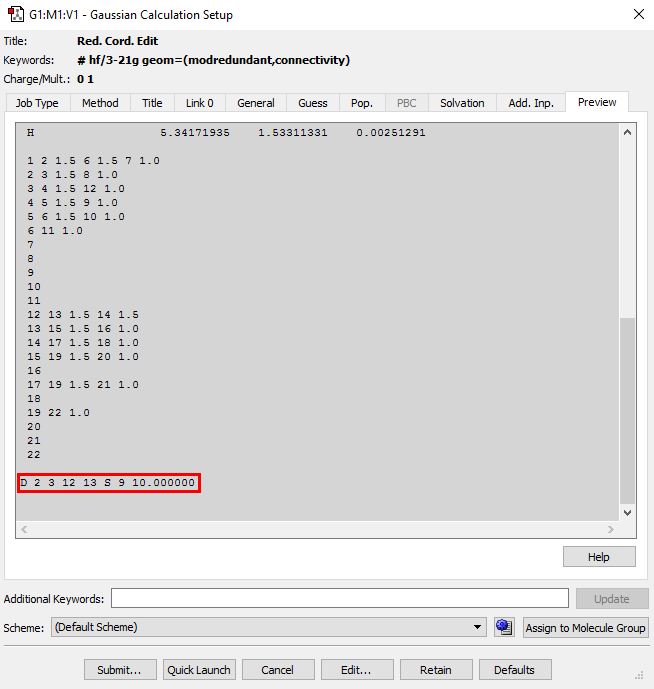

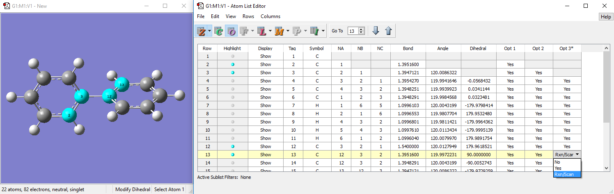

<!-- p.70 -->
We close the Atom List Editor and then open the Gaussian Calculation Setup’s Job Type panel and select Scan, and Rigid for the scan type. The Scan Coordinate 1 subpanel shows the scan coordinate. Here you can specify the number of steps, the step size and/or end value. Changing any value causes the other boxes to automatically update. For example, by changing the number of steps and the desired end value, GaussView will automatically calculate the step size. In our example, we specified 9 steps of 10 degrees. The Preview panel dialog on the right shows the scan input included within the molecule specification.

Input Setup for a Rigid Scan

Calculating NMR Spin-Spin Coupling: NMR=(SpinSpin,ReadAtoms)

When you select an NMR calculation in the Gaussian Calculation Setup’s Job Type panel, the compute spin-spin couplings popup appears. The atom list in the parentheses that appears to the right of the popup when either of the yes options are selected corresponds to the members of the NMR Spin-Spin (Yes) group, as defined in the Atom Group Editor. By default, all atoms are placed into this group, and the list of atoms reads all atoms. A specific group of atoms appears in this item when the NMR Spin-Spin (No) group contains at least one atom.

## Specifying Fragment-Specific Charges and Spin Multiplicities

You can specify individual charge and spin multiplicity values for each fragment defined via the Atom Group Editor. This facility is useful for setting up fragment guess jobs (Guess=Fragment) for modeling antiferromagnetic coupling, counterpoise calculations (Counterpoise) for computing counterpoise corrections and basis set superposition errors, and the like. The image below illustrates setting up a system for modeling antiferromagnetic coupling effects.

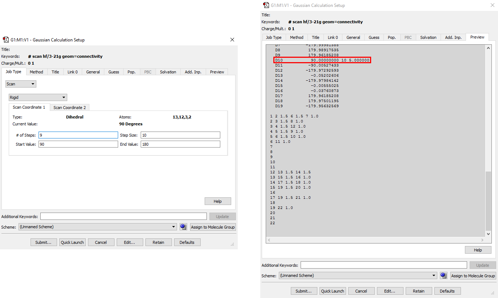

<!-- p.71 -->
Specifying Per-Fragment Charge and Spin

Antiferromagnetic coupling is an effect that is important for molecules with high spin multiplicity. This Fe2Cl6 compound is a simple example. Here, we have defined three fragments. Each iron atom is in its own fragment, and the six chlorine atoms are in a third fragment. The two iron fragments are each assigned a charge of +3, and both are defined as sextets with opposite spin (i.e., spin multiplicities of 6 and -6). The fragment containing the chlorine atoms is defined as a singlet with a -6 charge. These values will be placed into the route section of the Gaussian job set up in GaussView.

The Gaussian Calculation Setup’s General panel contains features relevant to these two calculation types: Write Gaussian Fragment Data (for both types) and Use Counterpoise (for Counterpoise calculations). In addition, the Guess panel has two items useful for the first job step of a fragment guess job: Only do Guess (no SCF) and Use fragments (atom groups) for generating guess, corresponding to Guess=Only and Guess=Fragment (respectively). Typically, such a job would be followed by a second job to compute the energy including the antiferromagnetic coupling: Guess=Read Geom=AllCheck Stable=Opt.

## Setting Up Excited State Calculations

In the first selection menu of the method section, you will see various options signifying the electronic state. The first option is Ground State, while all other selections represent excited states.

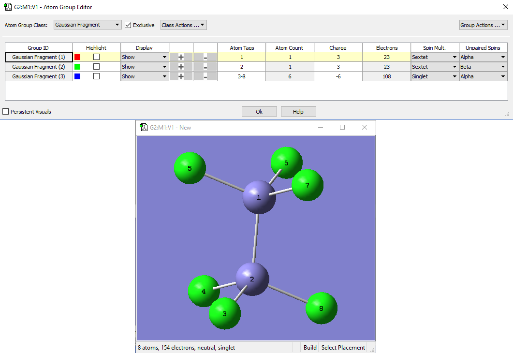

<!-- p.72 -->
Selecting the Electronic State from the Method Section

By selecting any of the excited state options, the States menu will appear. This menu allows for you to indicate which kinds of states to solve for. The Solve for More States and the State of Interest options will also appear. The Solve for More States will enable you to choose the number of states you want to solve for. The State of Interest selection allows you to choose the state for which properties will be predicted. Additionally, it is important to note that the excited state ZINDO does not use the Basis Set field.

Solving for States Using Excited Electronic States

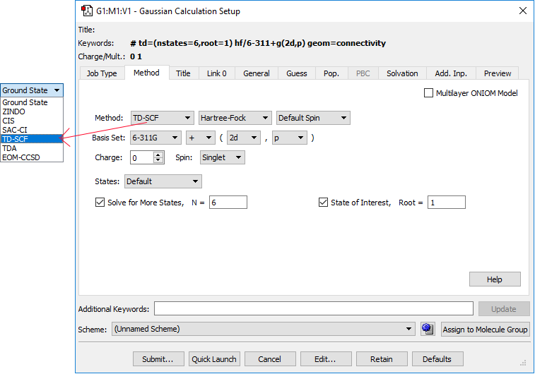

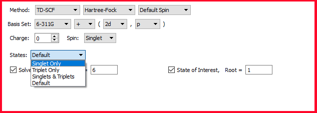

<!-- p.73 -->
# How To: Run Gaussian Calculations

This page discusses setting up Gaussian calculations with GaussView. It deals only with the mechanics of doing so. Consult the Gaussian User’s Reference for detailed information about all Gaussian keywords and options.

# Submitting a Gaussian Calculation

Clicking the Submit button at the bottom of the Gaussian Calculation Setup dialog begins the submission process. If needed, a dialog appears that allows you to save an input file. This is followed by a job submission confirmation dialog. which has the following form by default:

Job Submission Confirmation Dialog

Clicking Yes will submit the job to Gaussian. The checkbox controls whether you are notified when the job completes. The format of this dialog varies when the SC Job Manager is in use (more info here).

Once the Gaussian calculation has completed, a dialog like the one below will appear on Windows systems:

Selecting Yes closes the Gaussian 16W window.

On all systems, you are given the option of opening either the checkpoint file or the log file of the job you have just run. This prompt is displayed in the dialog below:

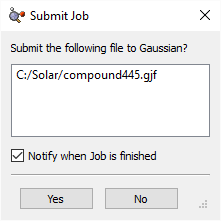

<!-- p.74 -->
Selecting a Results File to Open

Make sure that the box in the first column is checked for the file you wish to open. The default is the checkpoint file. Be sure to open this type of file if you plan to visualize molecular orbitals or other surfaces.

# The Quick Launch Feature

The Quick Launch feature greatly simplifies running Gaussian calculations. A job can be launched using the Quick Launch toolbar button, the Quick Launch button in the Gaussian Calculation Setup dialog, or the Calculate=>Gaussian Quick Launch menu path. Clicking on the button in the Gaussian Calculation Setup dialog or on the portion of the toolbar icon to the left of the small arrow will immediately launch a Gaussian job using the current calculation scheme and temporary files.

The toolbar icon arrow and the Calculate menu item both lead to a submenu. Its Temp File item will also result in a job started from a temporary input file. The Save File option will prompt you to save an input file and submit that file as a Gaussian job afterwards. The Save and Edit File option will prompt you to save an input file and then open that file in the external editor. Finally, the Current Input File menu item will run a calculation using the data present in the currently open input file.

When you start a new calculation using Quick Launch, a new View window is opened corresponding to it. While the job is running, a text message identifying the job, a stop button, and a stream output file button are placed in the status bar of the View window. Once the job finishes successfully, the results file is opened automatically. When more than one results file is produced by a calculation—e.g., both a log file and a checkpoint file are created—then you will be prompted to select the file to open.

You can save the files generated from a Quick Launch operation to temporary files using the File=>Save Temp Files menu item. This item replaces the usual Related Files option under these circumstances.

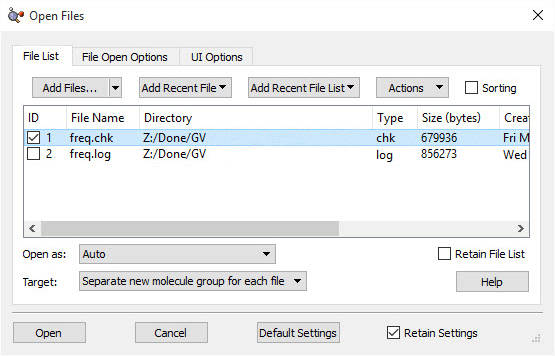

<!-- p.75 -->
# Controlling Running Calculations

GaussView has two facilities for managing the current job. Which one is active is controlled by the Job Setup Preferences. When available, the Use SC Job Manager item selects the internal SC Job Manager facility. The other choices all use the legacy Current Jobs facility. Additional information:

- 

Current Jobs facility

- 

SC Job Manager

# Specifying How the Gaussian Program is Executed

The Job Setup Preferences dialog allows you to examine and customize how Gaussian and its utilities are launched from within GaussView.

<!-- p.76 -->
# Viewing and Controlling Gaussian Jobs

The Calculate=>Current Jobs menu path opens the Job Manager dialog (shown below); the Current Jobs button on the

toolbar performs the same function:

. Note that GaussView 6 also includes a more sophisticated facility for managing calculations: the SC Job Manager.

This window displays all the jobs started by GaussView that are currently running. Note that only jobs started during the current session of GaussView are displayed. Examples of jobs that may be displayed are Gaussian jobs submitted from the Gaussian dialog box, Gaussian input file edit sessions launched from GaussView, CubeGen processes for building surfaces for display, FreqChk processes to generate vibrational analysis data, and/or processes from other Gaussian utilities.

The Current Jobs Dialog

This dialog allows you to view and control Gaussian jobs as well as jobs running Gaussian utilities like CubeGen. You can terminate a job, using the Kill button.

Clicking on the Jobs Log button displays the current GaussView job log containing system messages associated with the execution of GaussView external processes. The Clear button in the resulting window removes old jobs from the job list, and the Close button dismisses the job list window.

Note that the Jobs Log button does not display the log file associated with a running Gaussian job. The latter is accomplished by the Stream Output File button for Gaussian calculations. This can also be accessed by the Results=> Stream Output File menu path. Note that selecting this button for job types (e.g., cube generation jobs) will display whatever file GaussView can find that is associated with the job (often the Gaussian input file).

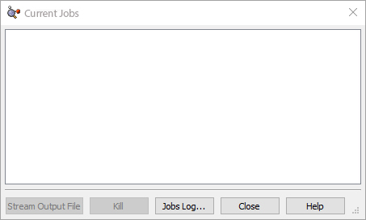

<!-- p.77 -->
# Defining Calculation Schemes

Schemes are named sets of calculation keywords and options, and you can define and save as many different ones as you wish. You can view the calculation scheme in effect at the bottom of the Gaussian Calculation Setup dialog, in the scheme popup in the toolbar, and in the Calculate=>Gaussian Calculation Scheme submenu. You can apply a scheme to the current molecule using any of these controls as well.

When you open a new molecule from a file, the scheme will be set to the scheme that matches its settings (if any) or to Unnamed Scheme.

For new molecules, the Default scheme is initially applied. Modifying the Gaussian Setup preference as described here has the effect of modifying the Gaussian calculation scheme named Default; although, this scheme may also be edited in this dialog.

You can view and modify the properties of the various defined schemes using the Schemes button or by selecting More Schemes from any scheme list. The resulting dialog appears below:

Viewing and Modifying Calculation Schemes

This dialog shows four schemes organized into two groups. The editable fields in this dialog are the following:

- 

Name: The scheme name, which will appear in the Schemes menu.

- 

Keywords: The keyword section for the Gaussian job.

- 

Link 0: The Link 0 section for the Gaussian job. Multiple lines should be separated with spaces.

- 

Title: Job title.

- 

Additional Input: Additional job input sections. The ORD scheme above includes the incident light frequencies for the CPHF=RdFreq option. When you edit this cell, another, larger window will open to allow for multiple input lines.

Any field within a scheme can be edited by clicking on it. Note that neither the Default scheme nor the Main group may be renamed or deleted.

Right clicking on a scheme produces a context menu:

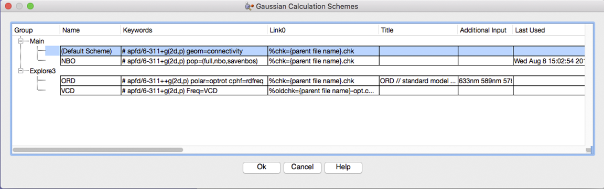

<!-- p.78 -->
Calculation Schemes Context Menu

The items in this menu have the following meanings:

- 

New Group: Add a new scheme group.

- 

New Scheme: Add a new scheme to the current scheme group.

- 

Open File: Opens a previously saved scheme group.

- 

Save File: Saves the current scheme group in a location of your choice.

- 

Edit Cell: Allows text editing of the currently selected cell in the scheme group.

- 

Cut, Copy, Paste, Delete: Simple text editing, same function as any other word-editing software.

- 

Font, Text Color, Background Color: Allows changing of the font, text color, and background color of the scheme group.

- 

Show Grid: Displays the grid in the scheme group.

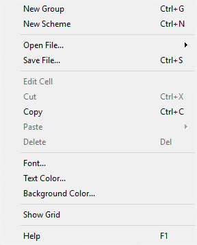

<!-- p.79 -->
# Calculation Summary

The Results=>Summary menu item displays summary data about the results of the Gaussian calculation (available when a Gaussian log file or checkpoint file is opened). It is displayed in the figure below.

<!-- p.80 -->

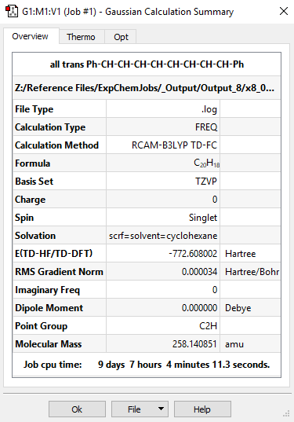

<!-- p.81 -->
Summary of a Gaussian Calculation These windows summarize the results of a CAM-B3LYP/TZVP TD Opt Freq calculation in the solvent cyclohexane.

The window on the left displays the Overview tab of the job. It displays essential information about the calculation itself as well as the predicted total energy, dipole moment, point group, and, in the case of a frequency calculation, number of imaginary frequencies. The second tab, illustrated in the window on the right in the figure above, is the Thermo tab, which contains the thermochemistry values predicted by the calculation (if available). The contents of the third tab depend on the specific type of calculation that was run.

The Results=>View File menu item and the View File button on the GaussView toolbar and the File=>View using Text Editor dropdown on the Calculation Summary dialog can all be used to open the Gaussian log file associated with the Gaussian calculation (if available).

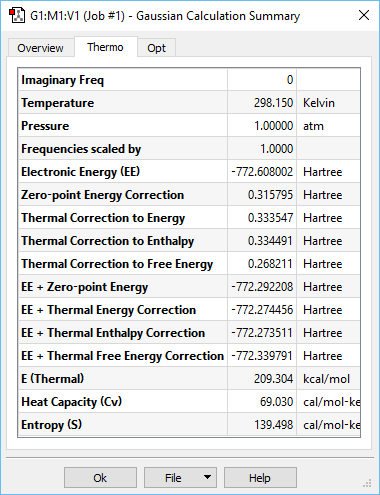

<!-- p.82 -->
The Results=>Stream Output File menu item and the Stream Output button can both be used to view the Gaussian log file associated with the current Gaussian calculation continuously as the job runs.

<!-- p.83 -->
# The Molecule Group Table

The Molecule Group Table dialog is used to view and edit information about opened molecules. This is useful for creating tables of results:

The Molecule Group Table dialog This window allows the user to arrange the molecules in the group by a variety of criteria and also allows for 3D navigation

of individual molecules. Click on a column header to sort the table.

The Options drop-down menu has the following selections by default:

- 

Constrain Row Heights to be Equal: When enabled, this option makes all of the rows equal height wise.

- 

Show Name Column: When enabled, the name for the item will be visible in the table. The name can be edited, and it defaults to the file name.

- 

Show 3D View Column: When enabled, a 3D view of the molecule will be displayed in the table.

- 

Show Source Column: When enabled, the source of the file will be displayed in the table.

- 

Show Symbol Column: When enabled, a column for entering symbol text will be included.

- 

Show Comments Column: When enabled, a column for entering comments will be visible.

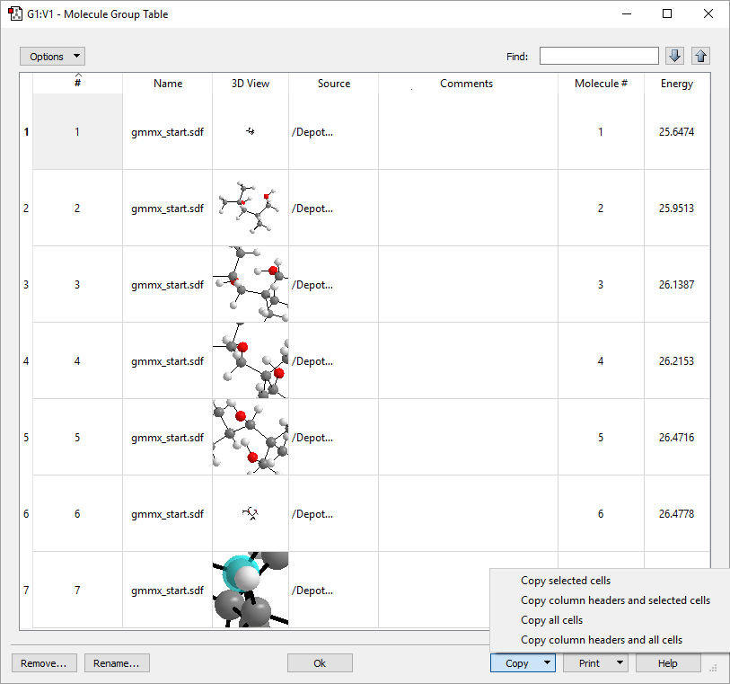

<!-- p.84 -->
Other Show selections will appear on this menu, depending on the type of results file opened (e.g., the Molecule # column for the GMMX results set shown above). Those listed above are always present.

The Find box in the upper right allows you to search the table by entering text into the text box. The up and down arrows will cycle through the matching items.

Buttons at the bottom of the dialog allows you to modify the contents of the table and to print it.

The Remove button removes the selected molecule from the group table.

The Rename button enables the editing of the name of the selected molecule via the dialog below:

The Copy drop-down menu (shown in the example dialog above) allows you to copy data between cells and rows. It has the following options:

- 

Copy selected cells: This option copies only the cells you have selected to the clipboard.

- 

Copy column headers and selected cells: This option copies all of the headers and cells that you have selected to the clipboard.

- 

Copy all cells: This option copies all of the cells in the table to the clipboard.

- 

Copy column headers and all cells: This option copies all of the data in the table to the clipboard.

The Print drop-down menu has the following options:

- 

Page Setup: This option opens the operating system’s print setup dialog.

- 

Print Preview selected row: This option opens the operating system’s print preview dialog, displaying only thecurrently selected row.

- 

Print selected row: This option opens the operating system’s printer selection dialog in order to print the currently selected row.

- 

Print Preview all rows: This option opens the operating system’s print preview dialog, displaying all rows.

- 

Print all rows: This option opens the operating system’s printer selection dialog in order to print all rows.

The Ok button will close the Molecule Group Table dialog.

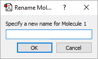

<!-- p.85 -->
# Viewing the Input File for the Current Results

Pressing the View File button or selecting the Results=>View File menu item opens the file which was opened for the current model, provided that the molecule has not been structurally modified in any way since it was opened. In the case of binary input files like Gaussian checkpoint files, the displayed file will be the one that was created automatically by GaussView with the FormChk utility.

<!-- p.86 -->
# Optimization Plot

For Optimization calculations, GaussView plots the total energy and the root-mean-square gradient for each optimization point in the calculation. It is accessed via Results=>Optimization.

More information about the functionality, Working with Plots is here.

<!-- p.87 -->
# IRC Plot

For IRC calculations, GaussView plots the intrinsic reaction coordinate vs. the predicted energy for each point in the computed IRC.

More information about Working with Plots here.

<!-- p.88 -->
# Scan Results

The Results=>Scan menu path allows you to view plots of energy and other results from calculations that produce multiple structures among their results.

Example Scan Results Clicking on a point in the graph causes the corresponding structure to appear in the View window.

There is more information about Working with Plots here.

# 3D Scan Plots

Gaussian Scan calculations over two variables are plotted by GaussView as three-dimensional surfaces. You can click on the various points in this plot as for 2D plots.

<!-- p.89 -->
Results Plot for a PES Scan over 2 Variables Only scan calculations over exactly two variables will produce plots like this one. This plot can be rotated and zoomed using the standard mouse actions, and a node can be selected by clicking on it.

The context menu is different for 3D scans than for other plots (as illustrated above). It has the following items:

- 

Save Image File: Save image to a graphics file.

- 

Save Data: Save graph data to a text file.

- 

Show Surface: Choose surface display type. The default is filled mesh.

- 

Show Bars: Plot values as lines (bars) in the z-direction in several styles. Bars are most often combined with Wireframe or None surface diplays.

- 

Show Nodes:Display the locations of all structures as white dots (All, which is the default), only the Active node (as a green dot) or without special marking at the intersection (None).

- 

The five remaining show items include or hide the corresponding items. These selections toggle.

- 

The 4 Edit items allow you to modify various label text.

- 

Invert Axis: Reverse the direction of the selected axis.

- 

Axis Scale: Scale the values on the selected axis and adjust labels accordingly. The default is 1.0.

- 

Axis Origin: Change the origin for the selected axis and change labels to be relative to this new value. The default is 0.

- 

Background Color: Set the window background color.

- 

Value Color: Specify the color scheme for the plotted surface.

<!-- p.90 -->
- 

Bar Color: Specify what the plotted bars (if visible) are colored according to the value color (as specified in value color) or all plotted in asingle common color. Use the choose common menu item to set the desired color in the second case.

- 

Highlight Coordinate n Atoms i View: Highlight and label atoms which are used to define coordinate n (1 or 2) in the view window. These items toggle.

<!-- p.91 -->
# Trajectory Plot

This feature allows you to view plots of energy and other results from Gausian trajectory calculations (ADMP or BOMD).

Nuclear Kinetic Energy Plot from an ADMP Trajectory Calculation

The following items are plotted:

- 

Nuclear Kinetic Energy

- 

Electronic Kinetic Energy

- 

Potential Energy

- 

Total Energy

- 

Total Angular

- 

Momentum

- 

Conservation of Alpha Electrons

- 

Average Alpha Idempotency

- 

RMS Alpha Idempotency

- 

Conservation of Beta Electrons

- 

Average Beta Idempotency

- 

RMS Beta Idempotency

The latter three apply only to open shell calculations.

More information about this functionality is in Working with Plots.

<!-- p.92 -->
# Displaying Energy Plots

Related Information:

- 

Customizing Plots and Spectra

The Results=>Energy Plot menu item displays the energy as found by the GMMX Conformer Calculation in GaussView.

Example Energy Plot of Desflurane

The plot will display each molecule as its own plot point. Each molecule is a different conformer of the original input file. Clicking on any point in the plot will display the corresponding molecule in the molecule group.

In the example above, the red circle on molecule 15 indicates that this molecule is currently selected. In the lower left hand of the dialog, information about this molecule is displayed.

<!-- p.93 -->
# Customizing Plots and Spectra with Plot Properties

The Plot Properties window appears when you select the Properties item from the Plots menu or from the context menu for a plot/spectrum. This dialog may be used to customize many aspects of the plot or spectrum. It has four panels, as illustrated below:

<!-- p.94 -->

<!-- p.95 -->
Customizing a Plot (left) or Spectrum (right)

# The Plot Panel

The various controls in the panel have the following effects:

- 

Units: Specifies the units for the corresponding axis. Coordinates can also be scaled by selecting the Scale by from the popup menu and entering value into the text box (see the Y-axis above).

- 

Origin: Specifies the value for the origin for the corresponding axis.

- 

Current buttons: Causes the coordinate of the currently selected point to be used as the origin for the corresponding axis.

- 

Invert Axis: Invert the plot vertically (Y-axis) or horizontally (X-axis).

Additional fields may appear in the spectrum version of the window, e.g., the Scale Frequencies? and IR Peak Half-Width Height options.

<!-- p.96 -->
# The Title Panel

<!-- p.97 -->

<!-- p.98 -->
Customizing the Title

The various controls in the panel have the following effects:

- 

Title: Change the title of the plot graph.

- 

Title Color: Adjust the color of the title.

- 

Font: Change the font of the title.

- 

X-Axis Title, Y-Axis Title: Edit the title of the X-Axis or Y-axis (respectively). You can include special characters as HTML entities (e.g. the Y-axis title for the IR spectrum above) as weel as the  and  tags for subscripts and superscripts (respectively).

- 

Axis Title Color: Adjust the color of both axis titles.

Additional fields may appear in the spectrum version of the window: e.g., the Y2-Axis Title option above.

<!-- p.99 -->
# The Appearance Panel

<!-- p.100 -->

<!-- p.101 -->
Customizing the Plot (left)/Spectrum (right) Appearance

The various controls in the panel have the following effects:

- 

Curve: Allows you to adjust the color and edit the width of the curve. There is also the option of removing the curve by unckecking the box.

- 

Points: Allows you to adjust the color and edit the size of the points. There is also the option of removing the points by unckecking the box.

- 

Marker: This option allows you to adjust the color and edit the size of the marker. There is also the option of removing the marker by unckecking the box.

- 

Grid: Adjust the color of the grid lines on the graph. There is also the option of removing the grid by unckecking the box.

- 

Background Color: Change the background color of the graph.

- 

Canvas Color: Adjust the canvas color of the graph.

- 

Transparent Background: This option allows for a transparent or non-transparent, background, but only when printing.

<!-- p.102 -->
# The Numbers Panel

<!-- p.103 -->

<!-- p.104 -->
Customizing the Appearance of Numbers

The various controls in the panel have the following effects:

- 

Number Color: Adjust the color of the numbers.

- 

Font: Change the font of the numbers.

- 

X-Axis: Max Precision: Change the X-Axis interval.

- 

Y-Axis: Max Precision: Change the Y-Axis interval.

- 

Exponential Format: Displays the numbers of the X and Y axes in exponential notation.

Additional fields may appear in the spectrum version of the window, e.g., the Y2-Axis: Max Precision option above.

# Restoring Default Settings

The Default popup and Make Default buttons allow you to restore a previous set of plot/spectrum properties:

<!-- p.105 -->
Restoring Saved or Factory Default Settings

These controls have the following effects:

- 

Default: Opens a drop-down menu of the following options:

• Saved Default: Restore the settings of the dialog to a previously saved default.

• Factory Default: Restore the settings of the dialog to the factory default.

- 

Make Default: Makes the current settings the default settings.

<!-- p.106 -->
# Working with Plots

# Manipulating and Customizing Plots

You can click on the various points in the plot, and the corresponding structure will appear in the View window.

All plots can be manipulated for viewing in a variety of ways:

- 

Scrolling and resizing: Typically, multiple plots/spectra are available in the same dialog and will not all be viewable at the same time. In that case, the dialog window can be resized to see more of them at the same time, or the user can use the scroll bar to scroll down to see the desired plot. If several plots are visible, then resizing the window expands/shrinks the X-axis while the plot height stays constant. In other words, only the height of the viewing area changes. When only one plot is visible—i.e., the dialog only contains one plot or the other plots have been hidden (see below)—then resizing the dialog expands/shrinks the plot along both axes. To focus on one or two plots, hide the other plots, using the Plots menu.

- 

Zooming and unzooming: All of the plots support zooming. This feature is very handy for resolving fine details. To zoom in, click and hold the left mouse button to select one corner of the zoom field. While holding the mouse button down, move the mouse to opposite corner of the desired zoom area. The zoom area will be marked with a black dashed line, as seen in the figure below. Release the mouse button, and the selected area will be zoomed to fill the full area. This view is replicated in the plot below on the right. You can keep zooming in as much as you want. To unzoom (i.e., restore the original view), use the plot context menu’s Zoom Out item.

<!-- p.107 -->
- 

Panning: Within a plot, the view can be moved along the X-axis or Y-axis by holding down the Shift key while dragging. This can be useful when used in conjunction with zooming, allowing you to follow the plot’s path.

Zooming In on a Plot

- 

Hiding individual plots/spectra: The upper section of the Plots menu, illustrated in the figure below, contains a list of all currently available items. You can hide or reveal individual items within the list by removing/restoring the checkmark before the item name (respectively). The Show All Plots item will always reveal (check) all items. The Hide Other Plots on the context menu (see below) will hide all but the currently displayed item. The Hide This Plot item on the menu will hide the currently displayed item.

The Plots Menu

This menu is found in all plot and spectra windows. This particular example comes from the plots window displayed for an IRC calculation. Currently, all available plots are visible.

This menu also offers options for Printing and Saving the plot, Saving a picture of the plot, and modifying the properties of the plot.

<!-- p.108 -->
You can create additional plots of various properties for these job types. This is done by selecting the Plots=>Plot Molecular Property menu item in the plot window. This results in the dialog seen below.

Creating An Additional Plot

In this example, we are adding a plot displaying the C-C bond distance for atoms 1 and 2 over the course of the geometry optimization. The dialog at the left displays the various items that may be plotted.

The items available for plotting vary by the job type. Once generated, the new plot appears below the standard ones in the plots window.

## Correcting Plot Discontinuities

When data is read in for a multi-geometry plot, the values along the X-axis should form a single continuous ascending set. In some occasions, a user may include molecules from two or more different files within the same molecule group. This is sometimes useful for comparison purposes or to extend the output from a previous run. When this occurs, the X-axis values will no longer form a single continuous ascending set, resulting in a jagged appearance in the resulting plot. When this situation is detected, an informational message is displayed.

The Plots=>Fix Discontinuity menu item may be used to correct such plots. When this feature is used, the words “(Modified)” are added to the title of the plot to remind the user that the data in the plot has been modified and so should be viewed with caution.

# The Plot Context Menu

The menu on the left appears when you right click within a plot or spectrum.

<!-- p.109 -->
Right clicking in the plot or spectrum, including the gray section containing the title and axis labels, will bring up a context menu for that specific plot/spectrum. The options in the menu generally apply only to the current item. The context menu is illustrated above. The items have the following meanings:

- 

Show All Plots and Hide Other Plots reveal all items and hide all but the current item, respectively.

- 

Zoom Out restores the original plot appearance, undoing all zooming. Undo Last Zoom reverses only the most recent zoom operation.

- 

Print prints the current plot or spectrum.

- 

Save Data allows you to save the plot or spectrum data to a text file (see below).

- 

Save Picture allows you to save the plot or spectrum as a graphics file.

- 

Properties allows you to customize many aspects of the plot. It is discussed in detail here.

## Saving Numerical Plot Data

The context menu for plots contains the Save Data item. Data from plots of geometry optimizations, IRC calculations, and the like can be saved in the same way. Here is some example data from an IRC calculation:

# Total Energy along IRC # X-Axis: Intrinsic Reaction Coordinate # Y-Axis: Total Energy (Hartree) #         X                   Y

-0.5999778220      -289.5812430000 -0.4999857200      -289.5768190000 -0.3999923250      -289.5728940000 ...

<!-- p.110 -->
# Plotting Additional Properties

You can create additional plots of various properties for these job types. This is done by selecting the Plots=>Choose Molecular Property menu item in the plot window. This results in the dialog below.

Creating An Additional Plot

In this example, we are adding a plot displaying the C-C bond distance for atoms 1 and 2 over the course of the geometry optimization. The dialog at the left displays the various items that may be plotted.

The items available for plotting vary by the job type. Once generated, the new plot appears below the standard ones in the plots window.

<!-- p.111 -->
# NMR Spectra

The Results=>NMR menu item displays the spectrum from an NMR calculation. An example spectrum is shown below.

NMR Spectrum Display

This is the default NMR display format. It displays all computed peaks. Clicking on a peak with the cursor displays the shielding value and degeneracy in the lower left corner of the window (e.g., peak 2-C above).

The fields at the bottom of the NMR Spectra window allow you to view the same data as relative values with respect to TMS or other standards. To use this feature, first select the desired element in the leftmost popup menu, and then select one of the available standard calculation results from the Reference field. Alternatively, you can enter a value directly into the Shielding field. The peaks will then reflect relative values with respect to the selected reference (which is included on the plot marked as "Ref"):

Displaying NMR Chemical Shifts

Clicking on a peak in this display mode shows the numeric chemical shift with respect to the specified standard in the lower left corner of the window. The corresponding shielding value is displayed in the Shielding field.

<!-- p.112 -->
Modifying NMR Plot Properties

The properties of the NMR plot can be modified by using the Plots=>Properties menu path. GaussView offers the ability to modify the peak half-width at half height using the corresponding box on the dialog. The degeneracy tolerance can also be modified in this dialog. An example of modifying the peak half-width at half height is shown below.

<!-- p.113 -->
The NMR Spectra graph can also be customized using the Mixture Editor. More information on the Mixture Editor can be found here.

# Adding New Reference Results

The data subdirectory of the main GaussView directory contains the nmr.data, which holds refernce data for NMR displays. This is an ordinary text file, and it can be modified with any text-editing software. However, you must take care to user maintain the existing format. It is prudent to make a backup copy of the file before adding to or modifying it.

The fields shown below, left to right, are: element symbol, predicted shielding value, and menu item label (typically the reference compound and model chemistry). We have added the line in red for the APFD/6-311+G(2d,p) model chemistry.

# Sym Shielding Description

C   199.9853  "TMS HF/6-31G(d) GIAO" C   182.4656  "TMS B3LYP/6-311+G(2d,p) GIAO" C   187.435   "TMS APFD/6-311+(2d,p) GIAO" C   199.1     "CH4 HF/6-31G(d) GIAO" H    32.5976  "TMS HF/6-31G(d)  GIAO" H    31.8821  "TMS B3LYP/6-311+G(2d,p) GIAO" Si  449.7802  "TMS HF/6-31G(d)  GIAO" Si  327.3890  "TMS B3LYP/6-311+G(2d,p) GIAO" N   260.8     "NH3 HF/6-31G(d) GIAO" N   258.4     "NH3 B3LYP/6-311+G(2d,p) GIAO" O   323.1     "H2O HF/6-31G(d) GIAO" O   320.0     "H2O B3LYP/6-311+G(2d,p) GIAO"

<!-- p.114 -->
B   106.7     "B2H6 HF/6-31G(d) GIAO" B    83.6     "B2H6 B3LYP/6-311+G(2d,p) GIAO"

Quotation marks are required if the description includes spaces. A pound sign (#) in the first column indicates a comment.

<!-- p.115 -->
# Displaying Vibrational Frequency Results

This dialog displays a table of all computed spectra from frequency calculations. These can include vibrational frequencies, infrared intensities, Raman intensities and/or VCD rotational strengths (depending on the specific calculation performed). The window’s Spectra button is used to access graphical representations of the predicted spectra.

The Display Vibrations Window

The items in the top row of the dialog allow you to select which isotopologue’s data is displayed (the Active Data popup menu). The New Data button opens the Run FreqChk dialog, and the Edit Isotopologues button opens the Atom List Editor. Note that these items are not visible when you have opened the frequency data from a .LOG file.

The highlighted row in the list area indicates which vibration is currently selected for dynamic display. You can start this display by selecting the Start Animation button and halt it by clicking on it again, now labeled Stop Animation. During animation, a cyclical display shows the nuclear motions corresponding to the vibration selected. You can select a different mode by clicking on the desired mode in the scrolling list. You can select a new mode without halting the previous one. You can also rotate and move the vibrating molecule, using the normal mouse buttons.

<!-- p.116 -->
The two slide bars below the Start/Stop Animation button adjust the speed and magnitude of the motion. Default values for these settings may be specified in the Vibrations Preferences panel (as well as for the displacement and dipole derivative unit vector discussed below).

The animation can also be saved as a movie and/or as individual frames using the Save Movie button. The controls in the line below this button specify characteristics of the resulting movie.

The Repeats: menu offers several different options for the animation of the molecule. The numbers represent how many cycles will be displayed when you press the Start Animation button. Selecting Endless means the animation will not end until you press the Stop Animation button. The Frames per Cycle: menu allows you to specify how many frames should be present in each cycle. You can specify any number of frames between 4 and 120. The more frames that it takes to complete a cycle makes the resulting animation smoother. The Frame Delay (msec): menu allows you to modify the length of time between each frame. Increasing this number allows for a slower animation.

The Displacement Amplitude: slider allows you to specify the magnitude of the displacement of the atoms when animating a vibrational mode. This will determine how extreme the vibrations will appear in the animiation. Increasing the displacement by dragging the slider to the right will make the vibrations more pronounced, while decreasing it--dragging the slider towards the left--will make them more subtle.

The Scale frequencies? area can be used to scale frequency values by a uniform amount. When the popup menu is set to Specify, you can enter the scaling factor into the field at the right.

The two vector-related checkboxes in the lower section of the dialog have the following meanings (see figure below for examples):

- 

Show Displacement Vectors: Display the motion associated with the vibration as vectors on each atom.

- 

Show Dipole Derivative Unit Vector: Display the dipole derivative unit as a vector.

<!-- p.117 -->
Displaying the Displacement Vector and Dipole Derivative Unit Vector By default, the displacement vectors are blue, and the dipole derivative vector is orange.

The various displacement vectors are displayed in blue, and the dipole derivative unit vector is the orange arrow on the left.

You can specify defaults for this dialog using the Vibrations Preference. You can change the colors of the vectors using the Vibration Colors panel of the Colors Preference.

# Using Manual Displacement Display Mode

The Manual Displacement box allows you to set a displacement from the equilibrium geometry. When it is checked, animation of the vibration will be turned off. When checked, the slider, number box, and Save Structure button become active. In this mode, changing the slider or the corresponding number box will cause the molecule to be statically displaced along the currently active normal mode. The center value of the slider, or zero in the text box, corresponds to no displacement. Moving the slider to the right or entering a positive value in the text box will displace the atoms along the currently active normal mode. Moving to the left or entering a negative value will displace the atoms in the direction opposite of the currently active normal mode. The range of values allowed in the text box ranges from -1 to +1. Clicking on Save Structure will cause a new molecule window to appear with a geometry exactly corresponding to the displaced structure.

The primary use of this tool is to help eliminate spurious negative eigenvalues. When one is searching for a transition state, it is not uncommon to end up with a structure containing two (or more) negative eigenvalues instead. These spurious negative eigenvalues are generally small but must be eliminated to isolate the true transition state. For these cases, select the normal mode corresponding to the spurious negative eigenvalue, and then select Manual Displacement. Adjust the slider to the right (or enter a positive number in the text box), and then select Save Structure to create a new molecule with the displaced geometry, which you can then reoptimize. If a positive displacement fails to eliminate the spurious negative eigenvalue, follow the same procedure with a displacement in the negative direction. You can also try varying the magnitude of the displacement.

<!-- p.118 -->
A second purpose of manual displacement is to generate pictures of a molecule in the midst of a vibration. Thus, it can be used to effectively freeze the animation of the vibration at a specific point.

<!-- p.119 -->
# Comparing Spectra for Isotopologues

GaussView makes it easy to compare spectra for different isotopologues of the same structure. To do so, you first define the desired isotopes for each isotopologue using the Atom List Editor. Then you generate vibrational data sets for each one (see below). Once completed, you can use the Display Vibrations dialog to examine the spectra and normal modes.

Comparing Normal Modes for Three Isotopologues

In the Atom List Editor (top), we have defined three isotopologues for this simple molecule: one with the standard isotopes, one with deuterium replacing each hydrogen, and a third with tritium replacing a single hydrogen. The normal mode corresponding to the sixth frequency shifts location for each isotopologue (compare the values beneath each View window). The motion for the first two isotopologues is similar, but the mode for the tritium form has the motion confined to that atom.

The buttons in the upper right can be used to define isotopologues and generate frequency data for them.

<!-- p.120 -->
# Defining Additional Isotopologues

Go to the Atom List Editor, and click the arrow on the “I”? icon. Add the next isotopologue to the column.

Adjust the isotope values as appropriate.

# Generating and Displaying Frequency Data for an Isotopologue

Click New Data in the Vibrations window. The window shown below appears, allowing you to choose the desired isotopologue:

<!-- p.121 -->
Back in the Vibrations windows, use the Active Data popup to pick a data set (isotopologue) to display:

The currently displayed set is indicated by a label to the right of the popup. The spectrum, normal mode animation and other displays will reflect the selected isotope set.

<!-- p.122 -->
# Frequency-Dependent Calculation Results

Gaussian frequency calculations can specify values for the electromagnetic field perturbation at which to compute vibrational properties. GaussView allows you to specify the desired incident light frequency for such frequency-dependent calculations by adding a popup menu to the top of the Vibrations window, as illustrated below:

Selecting the Incident Light Frequency

GaussView adds this menu at the top of the Vibrations window for frequency-dependent calculation results. The Static Limit selection corresponds to a standard frequency calculation.

<!-- p.123 -->
# Anharmonic Frequency Analysis Results

The results from Gaussian anharmonic frequency calculations can be reported by GaussView via the Results=>Vibrations menu path. The following figure illustrates the form of this dialog when anharmonic frequency results are available:

Anharmonic Frequency Results The usual frequency table now has three tabs. The selected frequencies in the Harmonic and Anharmonic tabs are

coordinated, and the anharmonic modes involving the selected mode are listed in the Anharmonic, mode tab (mode 6 in this example).

The following tabs are available in the frequency data table:

- 

Harmonic: reports the harmonic frequency data.

- 

Anharmonic, mode N: the table of anharmonic data for the Nth normal mode, where N is the currently selected mode in the harmonic table.

- 

Anharmonic: gives the table of anharmonic data for all normal modes.

The spectra window contains a two controls at the top. The Show Harmonic and Show Anharmonic check boxes toggle the visibility of the corresponding spectra data. The anharmonic spectrum is displayed in red.

<!-- p.124 -->
Viewing Both Harmonic and Anharmonic Spectra

You can control the appearance of the plot using the Mixture Editor (Plots=>Mixture Editor menu path).

<!-- p.125 -->
# Display Vibrations — Run FreqChk

The Results=>Vibrations menu item is used to access various spectral results from frequency calculations. It allows calculated vibrational data to be displayed as dynamic screen motions, based on information from a frequency calculation. When you have retrieved results from a Gaussian checkpoint file or formatted checkpoint file, this menu item may initially display the Display Vibrations - Run FreqChk dialog, illustrated in the figure below. Note that if you have opened a Gaussian log file, you are taken directly to the Display Vibrations dialog.

Running FreqChk to Perform Vibrational Analysis In some cases, this dialog precedes the Display Vibrations dialog.

This dialog is used to run the freqchk utility included with Gaussian. This utility performs vibrational analysis for the isotopologue specified in the popup menu in the left portion of the dialog (the menu is marked with a star); here, the analysis will be performed for the second isotopologue. Once complete, the modes and spectra are available for visualization via the Display Vibrations dialog.

The Save Normal Modes and Select Normal Modes items are relevant only with Gaussian 09 and later. They correspond to the Freq=SaveNormalModes and Freq=SelectNormalModes options, respectively (and to the equivalent FreqChk options). The former saves computed normal modes back to the checkpoint file, and the latter limits the vibrational analysis to the listed modes (Modes) and modes involving the listed atoms/atom types (Atoms). Use the corresponding fields to specify the mode or atoms of interest.

The Skip diagonalization of full matrix corresponds to Freq=NoDiagFull.

Once you exit the Run FreqChk dialog, the utility will run, and the Display Vibrations window will open.

<!-- p.126 -->
# Vibronics Spectra

The Results=>Vibronics menu item displays vibronic analysis results: Vibronic OPA Spectrum and the Duschinsky Matrix.

Vibronic Spectrum

The molecule's Duschinsky Matrix is shown below. It shows the overlap between each pair of initial and final states as a shade on a tone scale from no overlap (white) to complete overlap (solid color).

Duschinsky Matrix Display

The Plots dropdown allows you to select the Reported Transitions Table option, which will display the reported transitions of the current molecule.

<!-- p.127 -->
Vibronic Transitions Table

<!-- p.128 -->
# Examining Multiple Vibrational Spectra: The Mixture Editor

Example Spectra Plot for Multiple Data Sets

The Mixture Editor

The Mixture Editor dialog is used to modify plots when more than one data set is plotted. The dialog contains two sections:

- 

The spreadsheet-like list contains controls for each available data set. The list may be sorted by clicking on any column header. You can select multiple data sets using the control command and shift keys. Any changes made will apply to all selected items.

- 

The Combination region below the list contains the options for modifying the plot line corresponding to the combined and (possibly) weighted data.

The leftmost columns in the file list are as follows:

- 

Active: Whether the data set is included in the plot. Inactive data does not contribute Boltzmann Populations calculations. For the combination plot, the Active box controls whether this data is considered when GaussView determines plot scaling. The presence of the Combination data is controlled by its Plot Style (None hides it).

- 

ID: This displays the identification number given to the file. Numbering starts at 0. This column may be used to restore the original ordering.

- 

Molecule: This displays the name of the output file.

- 

Data Name: Contains a string describing the data set (used for plot legends). This may be edited.

- 

Free Energy: This displays the free energy of the molecule. The units for this field are hartrees. When free energies are not available, the label changes to Energy and the field displays the total energy.

- 

Boltz. ID: Identification number for the set's Boltzmann group (see below). IDs start at 0.

<!-- p.129 -->
- 

Boltz. Pop.: This displays the conformer’s contribution to the Boltzmann population.

- 

Weight: This displays the weight given to each molecule’s data in the plot. By default, GaussView will weight all data sets at 1. These values can be edited.

- 

Plot Style and Pen Fields: See below.

- 

Y Offset (%): This option allows you to shift the Y-axis for the data by the amount you specify, expressed as a percentage.

Checking the Use Boltzmann Populations as Weights box will set Boltzmann weighting for all items and remove Weight column from table. Right-clicking within the file list brings up a menu with the following options which also modify the values in the Weight column:

- 

Assign Boltzmann Populations to Weights: Copy the Boltzmann populations into the Weight column (where they may be edited).

- 

Assign 1.0 Weights: Assigns each data set a weight of 1.0 (restoring it to the GaussView default).

- 

Assign Equal, Normalized Weights: Assigns each data set an equal weight that is normalized over all Active data sets.

Boltzmann Populations are computed from all Active data sets having the Boltzmann ID, including ones with Plot Style set to None. Vibration data of isomes (including nuclear mass) that match the same incident frequency from a Boltzmann group. Harmonic and anharmonic data are in different groups. This field is editable to allow you to redefine Boltzmann groups.

The data list below shows 2 Boltzmann groups:

Boltzmann Groups: Static Limit (0) and 18797nm(1)

The following controls are located in both the Combination area and in each data set row:

- 

The Plot Style menu determines how the corresponding line is displayed. For the combination plot, the default style is None (it is not visible); the default for the individual data sets is Sticks and Curve which displays as both Stick (plotted as pillars) and Curve (a sloped line connecting each of the plot points).

- 

The Stick Pen option allows you to customize the display when the Stick or Sticks and Curve options are selected. It has options to change the color, width, and line style (see below).

- 

The Curve Pen option allows you to customize the line displayed when the Curve or Sticks and Curve option are selected. It has options to change the color, width, and line style (see below).

On the bottom of this dialog, the Add New Data button allows you to add more data to the current plot, and it opens the OS default file opening system. The OK button will close the Mixture Editor dialog, and the Apply button will apply all changes you have made to the plot without closing the dialog.

# Customizing Line Styles

The following dialog will appear when you click on any of the Curve Pen or Stick Pen menus:

<!-- p.130 -->
The Choose Pen Dialog

The fields allow you to specify the color, thickness and style of the sticks and/or line. The Color field will use the standard OS color selection facility, the Width field allows you to specify the line thickness in 0.1 pixel increments, and the Style field specifies the kind of line using the popup menu illustrated above. The specified style is previewed in the field at the top of the dialog.

<!-- p.131 -->
# Displaying UV-Visible Spectra

The Results=>UV-VIS menu item displays the spectra computed by an excited states calculation. An example spectrum is displayed below.

Example UV-Visible Spectrum Display

Additional spectra may be present for some calculations, including ECD for chiral molecules.

<!-- p.132 -->
# ORD Plot

For ORD calculations, GaussView plots the predicted optical rotatory dispersion for each specified wavelength.

ORD Results Plot

More information about this functionality is in Working with Plots here.

<!-- p.133 -->
# Manipulating and Customizing Spectra

All spectra can be manipulated for viewing in a variety of ways:

- 

Scrolling and resizing: Typically multiple plots/spectra are available in the same dialog and will not all be viewable at the same time. In that case, the dialog window can be resized to see more of them at the same time, or the user can use the scroll bar to scroll down to see the desired spectra. If several spectra are visible, then resizing the window expands/shrinks the X-axis while the plot height stays constant. In other words, only the height of the viewing area changes. When only one spectrum is visible—i.e., the dialog only contains one spectrum or the other plots have been hidden (see below)—then resizing the dialog expands/shrinks the spectrum along both axes. To focus on one or two spectra, hide the other spectra using the Plots menu.

- 

Hiding individual spectra: The upper section of the Plots menu, illustrated below, contains a list of all currently available items. You can hide or reveal individual items within the list by removing/restoring the checkmark before the item name (respectively). The Show All Plots item will always reveal (check) all items. The Hide Other Plots on the context menu (see below) will hide all but the currently displayed item.

- 

Panning: Within a spectrum, the view can be moved along the X-axis or Y-axis by holding down the Shift key while dragging. This can be useful when used in conjunction with zooming, allowing you to follow the spectra’s path.

The Plots Menu for Spectra Displays

This menu is found in all plot and spectra windows. This particular example comes from the plots window displayed for an IRC calculation. Currently, all available spectra are visible.

- 

Zooming and unzooming: All of the spectra support zooming. This feature is very handy for resolving fine details. To zoom in, click and hold the left mouse button to select one corner of the zoom field. While holding the mouse button down, move the mouse to opposite corner of the desired zoom area. The zoom area will be marked with a green rectangle (see Figure 109). Release the mouse button, and the selected area will be zoomed to fill the full area. You can keep zooming in as much as you want. To unzoom (i.e., restore the original view), use the plot context menu’s Zoom Out item.

<!-- p.134 -->
Zooming In on a Spectrum

The spectrum on the left is the one initially displayed by GaussView. Here, we are zooming in on the indicated rectangular area. The resulting view is displayed on the right.

# The Spectra Context Menu

The menu on the right appears when you right click within a spectrum.

The options in the context menu generally apply only to the current spectrum. They have the following meanings:

- 

Show All Plots and Hide Other Plots reveal all items and hide all but the current item, respectively.

- 

Zoom Out restores the original spectrum appearance, undoing all zooming. Undo Last Zoom reverses only the most recent zoom operation.

- 

Print prints the current plot or spectrum.

- 

Save Data allows you to save the plot or spectrum data to a text file (see below).

- 

Save Picture allows you to save the plot or spectrum as a graphics file.

- 

Properties allows you to customize many aspects of the spectrum. It is discussed in detail here.

<!-- p.135 -->
# Saving Spectra Data

The context menu for spectra contains the Save Data item. This may be used to save the numeric data corresponding to a plot/spectrum to an external file. Here is an example of the data saved from an IR spectrum:

# IR Spectrum # X-Axis:  Frequency (cm-1) # Y-Axis:  <html>&epsilon;</html> (M-1 cm-1)

# Peak information #                  X                   Y #      92.0270000000      295.0377577730 #     211.5876000000      210.4813272886 …

# Spectra #                  X                   Y               DY/DX

0.0000000000        0.0443536939        0.0009621102 8.7500000000        0.0541413503        0.0012972784 17.5000000000        0.0675621566        0.0018078842 …

You can specify the range of data and step size between points for this kind of data via the additional fields that GaussView adds to the standard Save dialog (illustrated to the right of the data above).

For NMR spectra, an additional summary file may also be written, using the NMR Summary item on the spectrum’s context menu. Here is an example:

# Summary of NMR spectra ( SCF GIAO Magnetic shielding) # Degenerate peaks are condensed together (Degeneracy Tolerance 0.05) # #          Shielding (ppm)     Degeneracy    Elem    Atoms

26.6182000000        1.0000       H        1 27.7949000000        2.0000       H       5,6 76.9883000000        1.0000       C        2 93.9401000000        1.0000       C        3 106.1777000000        1.0000       C        4

<!-- p.136 -->
# Surfaces and Contours

The Results=>Surfaces/Contours menu item opens the GaussView Surfaces and Contours dialog (illustrated below). It allows you to display various chemical data in three dimensions. The volumetric data may be generated from a Gaussian checkpoint file or be read in from a cube file. Note that there are two steps involved in actually displaying a surface:

- 

Obtaining a cube by generating it or reading it in.

- 

Generating the actual surface or contour for display.

This dialog allows you to select cubes for display as surfaces and/or contours and also to manipulate currently displayed surfaces and contours.

The Surfaces and Contours Dialog

The three areas of the dialog control cubes (sets of volumetric data such as molecular orbitals and electron densities), surfaces (three-dimensional plots of cube data superimposed on the molecule display), and contours (cube data projected to a plane).

# Cubes

The Cube Actions menu contains the following items:

- 

New Cube: Opens the Generate Cube dialogue, which allows you to choose which type of cube you wish to create for the file and specify its properties. The new cube is then added to the list of available cubes from which surfaces and contours are generated.

- 

Load Cube: Read in cube data from an external file. The cube may have been saved earlier from GaussView or generated independently by the cubegen utility.

- 

Save Cube: Allows you to save a cube for later use.

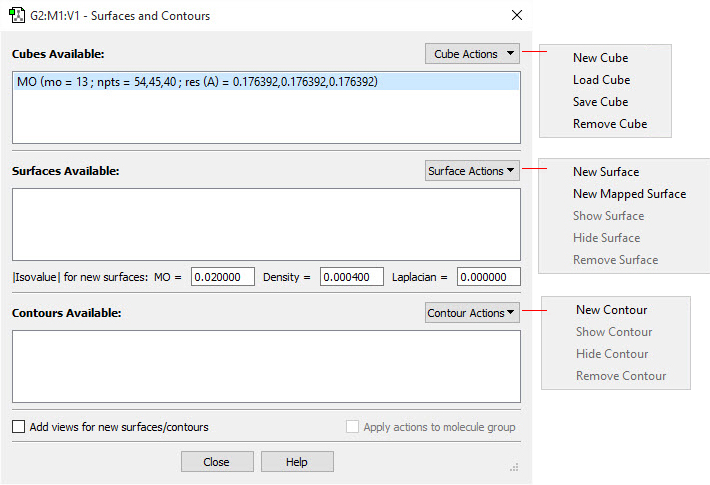

<!-- p.137 -->
- 

Remove Cube: Remove an item from the list. If the cube was loaded from an external file or saved, the file is unaffected. If the cube was generated during this session and not saved, the data is discarded and must be regenerated for future viewing.

# Visualizing Volumetric Data

The New … items on the Surface Actions and Contour Actions menus apply to the currently selected cube. The other items apply to the current surface/contour (i.e., the one in the current View window).

The checkboxes at the bottom of the dialog apply to both surfaces and contours:

- 

Add views for new surfaces/contours:

- 

Apply actions to molecule group:

# Surfaces

The Surface Actions menu contains the following items:

- 

New Surface: Generates a new surface from the currently selected cube and adds it to the list of available surfaces to view.

- 

New Mapped Surface: Opens the Surface Mapping dialogue, which allows you to decide which type of surface to generate and from which cube to generate it. The surface generated is a scaled heat map of the specified properties. After being created, it is added to the list of surfaces that can be displayed.

- 

Show Surface: Reveals a hidden surface.

- 

Hide Surface: Hides a surface.

- 

Remove Surface: Removes a surface from the list of surfaces that can be displayed. To view it again, it must be generated again.

The |Isovalue| for new surfaces fields below the surfaces list control the characteristics of the generated surface. Modifying their values will apply to subsequently generated surfaces but will not affect existing ones. Generally, the values should not be changed. Note: Comparing surfaces from different molecules that used different isovalues is usually misleading.

# Contours

The Contour Actions menu contains the following items:

- 

New Contour: Opens the Generate Contours window. This is used to create a new contour.

- 

Show Contour: Reveals a hidden contour.

- 

Hide Contour: Hides a contour.

- 

Remove Contour: Removes a contour from the list of contours that can be displayed. To view it again, it must be generated again.

# Generating and Manipulating Cubes

The New Cube selection on the Cube Actions menu in the Surfaces and Contours dialog brings up the dialog in the figure below. It is used to generate new cubes from the electron density and other data in the checkpoint file. GaussView automatically invokes the CubeGen utility.

<!-- p.138 -->
The Type popup selects the molecular property for which to generate a cube. For most selections, additional fields will appear to further specify the desired data. For example, in the figure below, the density matrix to use when generating the electrostatic potential cube can be selected. Similarly, for molecular orbitals, the specific orbital(s) to generate are indicated via additional fields.

The Generate Cubes Dialog

This dialog will generate the type of cube specified in the Type field. Here, we are generating a cube of the electrostatic potential computed from the SCF electron density (frozen core by default).

The Grid field is used to specify the density of the cube. Increased density brings increased computational requirements. Generally, the default setting of Coarse is adequate for most visualization purposes; Medium is adequate for most printing and presentation purposes. The equivalent number of points per “side” is indicated in the second field in this line for each of the Coarse, Medium, and Fine selections. Use the Custom item to specify a different value.

Clicking the Ok button will generate the cube (as a background calculation) and exit the dialog. The new cube will appear in the Cubes Available list when the calculation finishes. You can view the job via the Calculate=>Current Jobs menu item or the equivalent Current Jobs button. Note: Cubes generated on the fly in this manner are not saved to disk unless you do so explicitly; otherwise, they will be lost when GaussView terminates.

There are several items in the Type popup that allow you to transform one or more cubes: you can scale and square cubes and add or subtract two cubes. For example, if you wanted to display a difference density, you can load in the two cube files (e.g., the densities computed in the gas phase and in solution). Once they are loaded, you can create a new cube (via Cube Actions=>New Cube) and then select Subtract Two Cubes from the Type menu.

Creating a Cube as the Difference of Two Densities

This dialog creates a new cube that is the difference between corresponding values in the two source cubes.

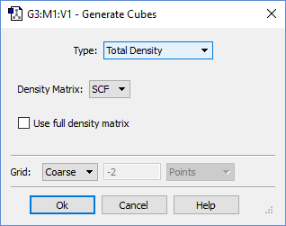

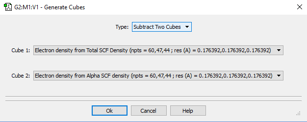

<!-- p.139 -->
# Generating Mapped Surfaces

GaussView also allows you to map the values of one property on an isosurface of a different property, in other words, to create a surface in which the coloring is determined by the values of a second property. The window on the right below shows an electron density surface painted according to the value of the electrostatic potential for formaldehyde.

Creating a Mapped Surface

The fields in this dialog have the following purposes:

- 

Use an existing cube: Use one of the current cubes as the colorization data. Select the desired surface from the list that is present when this item is selected.

- 

Generate values only at surface points: Generate the colorization data on the fly at each surface point. This is generally a faster choice. Specify the desired surface for colorization data in the popup menu and other fields.

View windows display mapped surfaces and include a color mapping toolbar at the top (as in the window on the right in the figure above). The colors used in rendering a mapped surface are based on a uniform scaling between minimum and maximum values, as specified in the text boxes to the left and right of the spectrum (respectively). Changing the values in these boxes will change the color scale and correspondingly change the coloring on the mapped surface. Like other toolbars, this color-mapping toolbar can be moved by clicking and holding on the grip bar and dragging it around the window.

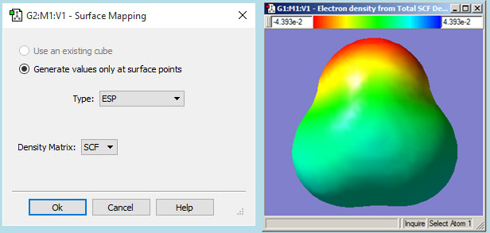

<!-- p.140 -->
# Customizing Surface Displays

Surfaces may be displayed in solid, transparent, and wire mesh forms. The surface display may be modified using the Display Format dialog’s Surface panel (accessed via the View=>Display Format menu item and the equivalent Display Format button on the toolbar). The dialog format for a transparent surface is displayed below.

Customizing a Surface Display Here we are modifying a transparent surface.

For transparent surfaces, the Transparent Options slider varies the opacity of the transparent surface, and the Fade mapped surface value checkbox causes the values in the midrange of the spectrum to become transparent (i.e., those close to zero).

The remaining controls are present in the dialog for all surface types.

- 

The IsoValues popup controls whether the positive values, negative values, or both (the default) are displayed.

- 

The Hide backside checkbox controls whether the back side of surfaces are displayed. Checking it results in increased transparency for transparent surfaces. Try turning it on and off with the Format set to Mesh to see exactly what is being hidden or revealed.

- 

The Z-Clip slider may be used to remove the frontmost portions of the image to allow views into the interior of the molecular display.

Defaults for surface properties can be set via the Display Format Preferences’ Surface panel, which contains the same controls.

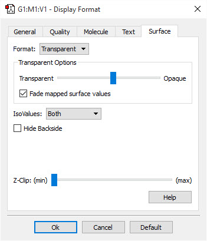

<!-- p.141 -->
# Generating Contours

Contours are two dimension projections of cube data into a plane. They also use the cubes generated in the Surfaces and Contours dialog. You can use the items on the Contour Actions menu to create a new contour (New Contour), to display or hide a contour (Show Contour and Hide Contour), and to remove a contour (Remove Contour). The figure below illustrates an example contour display.

Example Contour Plot This contour projects the HOMO into a

plane perpendicular to the C=O bond.

The figure below illustrates the dialog that results from selecting Contour Actions=>New Contour.

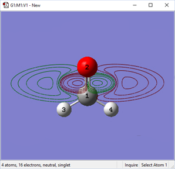

<!-- p.142 -->
The Generate Contours Dialog

This dialog will generate a contour from an existing cube created or loaded previously via the Cube Actions menu in the Surfaces and Contours dialog. It contains four subareas:

- 

2-D Grid: Specifies characteristics of the grid used to compute the contour points. You specify the units for the values in this area with the popup menu. The U and V fields specify the minimum and maximum values in the two grid directions, and the Resolution field specifies the distance between grid points.

- 

Plane: Specifies the plane in which the contour will be drawn. This item is discussed below.

- 

Cube: Selects the source of the contour data: either an existing cube (select it from the list) or values generated explicitly for the planar grid. The former is illustrated in the figure above; the latter is similar to the analogous feature for mapped surfaces.

- 

IsoValues: Specifies the series of isovalues at which the contour will be computed. You can add or remove items from this list as desired.

# Defining the Contour Plane

By default, the contour plane is defined as the view’s XY plane. The plane can be defined in the Contour dialog’s Plane area. It is defined as the plane perpendicular to the vector defined by the specified Normal and Origin points in the dialog. The default origin point is (0,0,0), and the default point defining the normal vector is (0,0,1).

More complex plane definitions can be specified by clicking on the Define Plane button, which brings up the dialog in the figure below. There are two methods for defining the plane: Normal Vector (as described above) and Three Points (illustrated in the figure). In the latter method, you define the origin and two other points to define the contour plane (traditionally referred to as O, P and Q). The easiest way to define the points is to specify atoms for them, but you can also enter lists of atoms (the average of their coordinates will then be used) or completely arbitrary Cartesian coordinates.

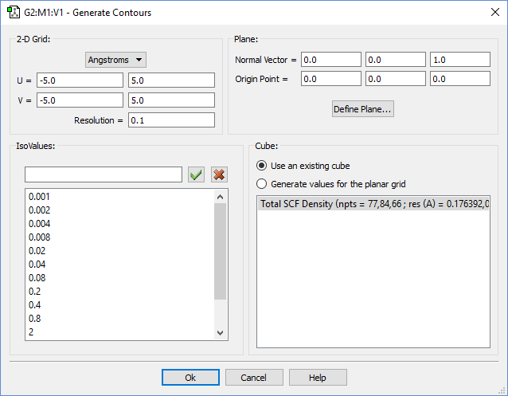

<!-- p.143 -->
Specifying the Desired Contour Plane

In this example, we are defining the contour plane as the one containing the carbon atoms, using the 3-points-definition method. The green lines in the View window indicate the normal vector (labeled N) at the origin (O) and the line OQ. The OP line is not visible in this view, as it mirrors the C-C bond between atoms 1 and 5.

Once the contour plane is defined, you can move it further using the popup and other controls in the bottom part of the dialog. The plane can be translated or rotated about the various defined axes.

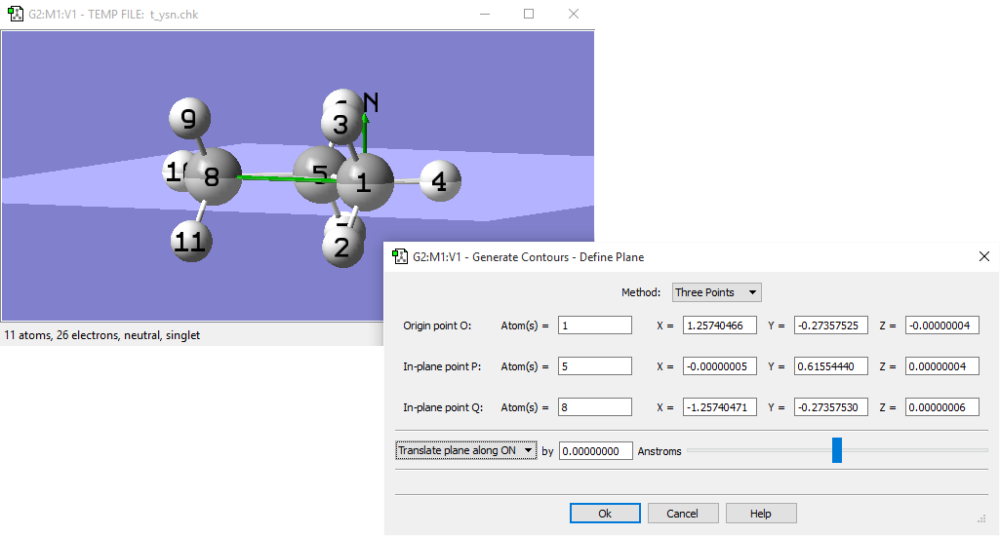

<!-- p.144 -->
# PCM Solvation Cavity

The PCM Solvation Display Dialog

The PCM Solvation Display displays the solvation cavity computed via the SCRF=Read facility’s PrintSpheres additional keyword.

When the Show Surface button is checked, the overall surface of the molecule is activated. Its format can be specified via three checkboxes below.

When the Show Solid button is checked, it displays the surface as a solid, hiding the molecule. When the Show Mesh button is checked, it displays the surface as a mesh, allowing you to still see the atoms and the bonds beneath the surface. When the Show Points button is checked, it displays the surface as a series of points, offering a better view of the atoms and bonds than the Show Mesh display does. More than one display type can be used at the same time.

The Color menu allows you to choose which color the surface is displayed as. This functionality is not available if the Color by Atom button is checked, which will color different portions of the surface using the color of the atoms that generated it.

The Cull Backside button removes the portion of the surface “behind” the molecule. This can sometimes result in an improved display.

The dropdown menu below the Cull Backside button is only available for the Show Mesh and Show Points buttons. The options for this are Small, Medium, and Large. They control the size of the mesh lines or the points that surround the molecule.

The Solid Opacity slider is only available when Show Solid or Show Mesh are selected. This slider controls how opaque/ transparent the surface is. The left end of the slider corresponds to a completely transparent surface (invisible), and the right end corresponds to a completely opaque surface.

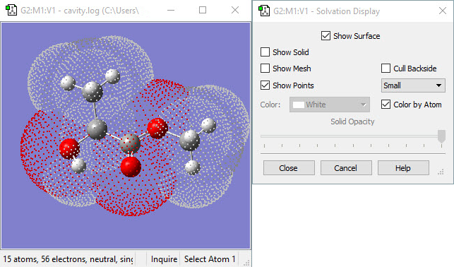

<!-- p.145 -->
# Atom Properties

The Atom Properties dialog

The Atom Properties dialog is used to visualize atomic properties from a completed Gaussian Calculation. The Name menu allows you to select the atomic property to display (only items present in the Gaussian log/checkpoint file will be active). The examples here will use the Mulliken Charge property for demonstration.

The Color Range fields specify the endpoint values of the color range used to color atoms by property value. By default, the range is taken from the minimum and maximum values present in the data.

The Symmetric Range for Color checkbox will force the Color Range input to use the same absolute value for the minimum and maximum. The default values are ±max(|data_max|,|data_min|).

The Fixed Range for Color checkbox will enable you to enter your own values in the Color Range input.

The Show Colors checkbox colors the atoms according to the settings in the Color Range fields:

Atom Coloring Atoms are colored by their predicted Mulliken charge.

The Show Numbers checkbox displays the numeric property value for each atom in the View window:

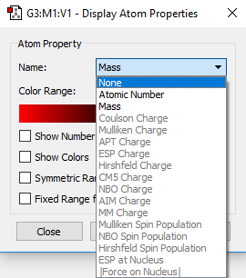

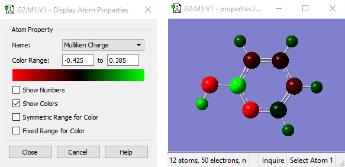

<!-- p.146 -->
Property Value Display Each atom is labeled with its predicted Mulliken charge.

You can leave the dialog with either the Close or Cancel buttons. Close maintains the atomic properties display after the dialog closes, while Cancel restores the normal View display.

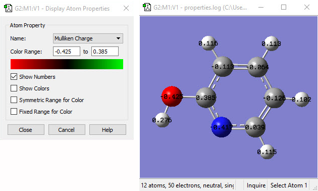

<!-- p.147 -->
# Bond Properties

The Bond Properties dialog is used to display predicted bond lengths and bond orders visually. The Name menu controls which property display is active.

The Show Numbers checkbox display the selected property for each bond:

Bond Lengths Numeric Display This example displays bond lengths in Å.

The Show Colors checkbox colors the atoms according to the settings in the Color Range fields. The Color Range fields specify the endpoint values of the color range used to color atoms by property value. By default, the range is taken from the minimum and maximum values present in the data. The Symmetric Range for Color checkbox will force the Color Range input to use the same absolute value for the minimum and maximum. The default values are ±max(|data_max|,|data_min|).

The Fixed Range for Color checkbox will enable you to enter your own values in the Color Range input.

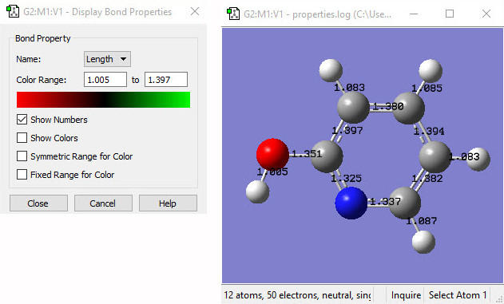

<!-- p.148 -->
Coloring by Bond Order This example colors the bonds in ball-and-stick display mode by bond

order: red=single bond, green=double bond, black=resonant bond.

You can leave the dialog with either the Close or Cancel buttons. Close maintains the atomic properties display after the dialog closes while Cancel restores the normal View display.

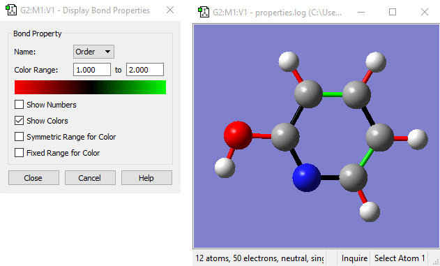

<!-- p.149 -->
# Displaying Atomic Charges Computed in Gaussian

The Results=>Charge Distribution menu item opens the Display Atomic Charges dialog (see figure below). This tool manages the display of partial charge density as computed by various methods in Gaussian. Displays are available in the Atomic Charges area of the dialog for the default Mulliken charges and other computed charges that are available for this job. The Type menu lists the available choices.

Displaying Atomic Charges The dialog on the left is used to control what charges are shown and how they are displayed. The window in the middle shows the numeric charge numbers display, and the one on the right shows the atoms colored by

charge (reflecting the settings in the dialog on the left), as well as the dipole moment vector.

By default, the color spectrum for charge display is set by reading the maximum charge computed for the molecule and setting the range to match the charge. The range can also be adjusted manually by entering values into the Color Range fields.

The remaining checkboxes in the top portion of this dialog have the following meanings:

- 

Show Numbers: Place atomic charge values next to each atom.

- 

Color Atoms by Charge: Recolor each atom by atomic charge according to the specifications of the Color Range fields and the Symmetric Color Range checkbox.

- 

Symmetric Color Range: Forces the positive and negative limits of the charge range to have the same absolute magnitude (regardless of the actual range of the atomic charge values).

- 

Fixed Color Range: Force the charge display to use the default fixed range. This range is set to -1.0 to 1.0 by default, and it can be modified in the Charge Distribution Preferences.

The Dipole Moment area of the dialog controls whether a vector representing the dipole moment is included in the display. When the vector is displayed, you can specify the scaling factor for the vector’s length (the default is about 1.0) as well as its origin. The available values for the latter are illustrated in the preceding figure.

The buttons at the bottom of the Display Charge Distribution dialog control whether the display persists after the dialog is closed. Clicking Close will cause the Atomic Charges display to be retained, while clicking Cancel will return the View window to its normal state.

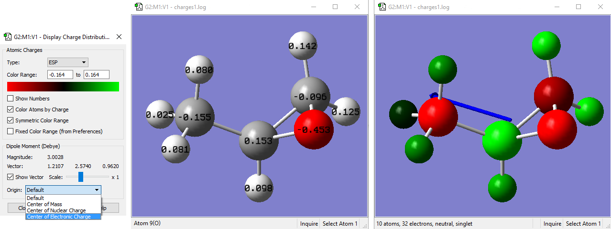

<!-- p.150 -->
# All About Selections: From Atoms to Fragments, Residues, Chains, and

# Beyond

GaussView has a wide variety of different methods and techniques for selecting atoms within molecular structures. Groups of selected atoms are used for many purposes in building structures and setting up Gaussian jobs. This section will discuss the various alternatives, which are summarized in the following list:

- 

Selection-related toolbar icons: Select by Clicking, Select by Rubberband/Marquee, Select by Brush, Select All, and Select None

- 

View window selection keystrokes

- 

Selecting with the Atom List Editor, the PDB Residue Editor, and the PDB Secondary Structures Editor

- 

Using the Atom Group Editor

- 

The Atom Selection Editor

# Selection-Related Toolbar Icons

The main window builder toolbar and the standalone Builder palette both contain icons that control item-selection behavior and place the cursor in a dedicated selection mode. The icon on the left sets the selection mode to clicking: clicking on an atom toggles its selection mode. Selected atoms appear light yellow (see the two leftmost atoms in the illustration at the right above), and their serial numbers are displayed. Contrast this to highlighting, where atoms are displayed in light blue for easy identification and/or location (e.g., the hydrogen atom at the lower right). If an atom is both selected and highlighted, it appears light blue (highlighted).

The second selection mode is marquee mode, also called rubberband mode (the second icon from the leftt at the head of this section). In this mode, pressing and holding the mouse button while dragging the cursor will draw a rectangle in the view. When the mouse button is released, all atoms within the defined area are added to the selection.

The final selection mode is brush mode. In this mode, dragging the mouse selects all atoms that fall under the cursor.

Variations to the default functioning for all modes are available via the Atom Selection dialog discussed below.

The other two selection-related icons are the Select All and Select None buttons, which select and deselect all atoms in the molecule, respectively.

## Selection Keystrokes in View Windows

These same selection options are available at all times in any View window via the following keystrokes (which are not casesensitive), regardless of the current toolbar icon selection: sensitive), regardless of the current toolbar icon selection:

| Key | Efefct |
| --- | --- |
| a | Select all atoms. |
| n | Deselect all atoms (select no atoms). |

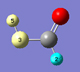

<!-- p.151 -->
# Selecting with the Atom List Editor and Similar Tools

The Atom List Editor provides a spreadsheet-like mechanism for viewing and modifying molecular structures and parameters. The same facilities are also provided by the PDB Residue Editor and PDB Secondary Structure Editor.

The Atom List Editor

There are three main selection-related features in these dialogs:

- 

All of these tools have the ability to highlight various parts/substructures of the molecule, controlled via the Highlight column. Highlighted atoms can be selected and deselected via the Add/Remove Highlighted Atoms to/from General-Selction items on the View menu in the Atom List Editor and the similar Select/Deselect Highlighted Residues and Select/Deselect Highlighted Secondary Structures items in the View menus of the other tools.

- 

The Rows menus of these three tools all contain the Generally-Select Atoms of Selected Rows item. Choosing it will cause all atoms corresponding to selected rows in the spreadsheet to be added to the current selection.

- 

The Invert Selection and Select All items on the Rows menus modify the selection to include all unselected atoms and to include all atoms, respectively.

Selection functionality is also present in the Group Actions menu of the Atom Group Editor:

The Atom Group Editor The final items on the Group Actions menu select/deselect the atoms in the current atom group (here, fragment 2).

## The Atom Selection Editor

The Atom Selection Editor, reached via the Tools=>Atom Selection menu path, brings selection capabilities and tool preferences. It is illustrated below:

| r | Marquee selection is active while the R key is held down. |
| --- | --- |
| c | Individual atom click mode selection is active while the C key is held down. |
| b | Brush selection mode is active while the B key is held down. |

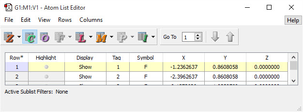

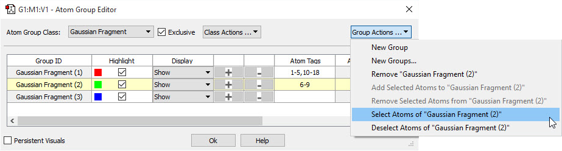

<!-- p.152 -->
The Atom Selection Editor

This dialog allows you to select all atoms, no atoms, and to select and deselect by atom group. It also sets default behaviors for the various selection modes. You can also expand the current selection to adjacent atoms using the slider, with proximity defined by bonding, distance, or PDB residue, as well as a maximum value. Detailed information about it is available here.

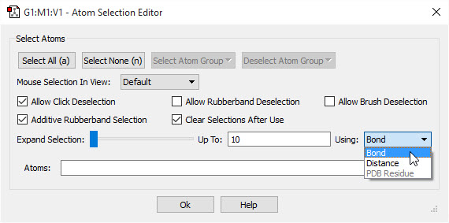

<!-- p.153 -->
# PDB Residue Selection

This dialog allows you to select atoms by residue if this information was present in the PDB file corresponding to the current model.

PDB Residue Selection In this example, we are selecting all lysine residues.

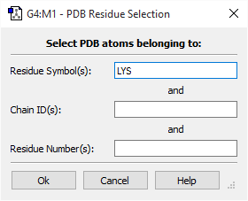

<!-- p.154 -->
# The Atom Selection Editor

The Atom Selection Editor, reached via the Tools=>Atom Selection menu path, specifies selection capabilities and tool preferences. It is illustrated below:

The Atom Selection Editor In this example, we are preparing to expand the selection to atoms bonded to already-selected atoms.

The buttons at the top of the dialog provide ways to select all atoms, no atoms, or the atoms within a specific atom group. The latter two buttons function as pull-down menus whose contents consist of all defined atom groups for the current structure (as in the example above where two different group classes are defined).

The checkboxes and popup menu in the central portion of the dialog specify defaults for the two selection modes. They have the following meanings:

| Item | Meaning |
| --- | --- |
| Mouse Selection in View | Specifies the default selection mode in View windows: |
| Allow Click Deselection | When unchecked, clicking again on a selected atom has no efefct. |
| Additive Rubberband Selection | When unchecked, each marquee selection replaces the current selection rather than adding to it. |
| Allow Rubberband Deselection | When checked, a marquee selection toggles the select status of all atoms in the enclosed region. |
| Allow Brush Deselection | When checked, a brush selection operation toggles the select status of all touched atoms. |
| Clear Selections Afetr Use | When unchecked, selections are retained even afetr an operation has acted on the component atoms. |

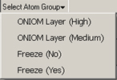

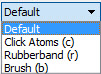

<!-- p.155 -->
The Expand Selection slider allows you to expand a selection to include atoms adjacent to already selected ones. The Using popup specifies how “adjacent” atoms are identified: by bonding, by absolute distance regardless of bonding, or by PDB residue. The choice made here affects what atoms will be added to the selection as the slider is moved to the right, and the Up To field indicates the maximum value corresponding to the right end of the slider: number of bonds, distance in Angstroms, or number of residues. Thus, moving the slider all the way to the right when Up To is 5 and Bond is selected will select all atoms within 5 bonds of all currently selected atoms. When PDB Residue is selected, then each step selects an entire PDB residue.

The list of selected atoms appears in the final Atoms field, which you can also edit directly.

<!-- p.156 -->
# The Atom List Editor

The Atom List Editor window is displayed when you select the Tools=>Atom List menu item or click on the Atom List button. This tool presents the coordinates and other parameters for the molecule in the active View window in an editable spreadsheet format. The window’s default configuration is illustrated below.

The Atom List Editor

The columns that are present in the table are controlled by the buttons in the toolbar. Columns corresponding to highlighted buttons are visible. Only buttons relevant to the current molecular structure are active. Individual columns may be displayed/ hidden using the items on the Columns menu. You can also go directly to a specific atom (by number) using the Go To control in the toolbar.

You can select all items within a column by double clicking on the column header. You can sort all selected rows based on the current column using the Rows=>Sort Selected submenu.

The default configuration of this window displays the molecule’s Z-matrix and Cartesian coordinates. Different data can be selected for display using the toolbar buttons.

Clicking one of the lettered display icons will show or hide all columns in that group. You can also control the display of every individual column by selecting or deselecting it in the Columns menu or in the submenu attached to the relevant icon via the

| Icon | View/Specify |
| --- | --- |
|  | Z-matrix coordinates |
|  | Cartesian coordinates |
|  | Optimization status |
|  | Fractional coordinates for PBC |
|  | ONIOM layer assignment and parameters |
|  | Molecular Mechanics atom type and charge |
|  | PDB file residue and chain data (read-only) |
|  | Isotope mass |

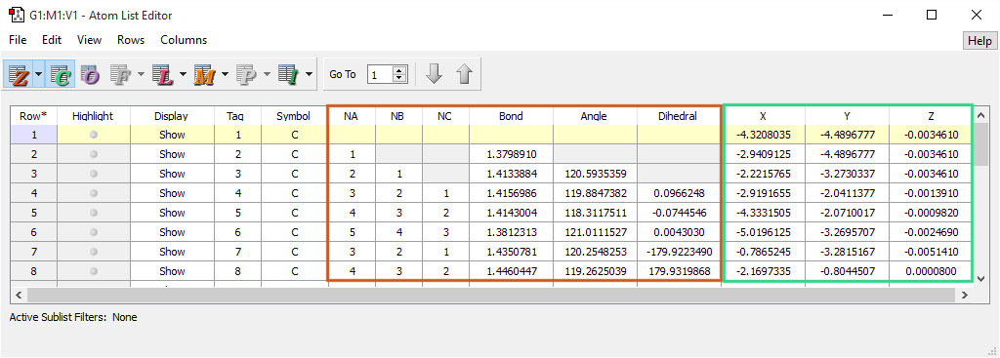

<!-- p.157 -->
small triangle to its right.

The following figure illustrates the columns that may be present in this window for each icon.

Additional Atom List Editor Columns

Beginning at the top and moving down and from left to right, these columns are controlled by the Show ONIOM Columns button, the Show MM Type Columns button, the Show Fractional Coordinates Columns button, the Show PDB Columns button, the Show Mass Columns button, and the Show Optimization Flag Columns button. Note that shaded columns are read-only.

Any of the molecular parameters can be edited in this spreadsheet-like window. Atoms’ parameters (or data) may be selected in the table by clicking on, clicking and dragging, or Ctrl and clicking on their Row cell in the leftmost column. Select all atoms in the Atom List Editor by double-clicking any of the named column headers; click again to deselect all.

You can add additional atoms by scrolling to the bottom of the window, selecting an element in the Symbol column, and then clicking the Add button. This inserts a new row into the list filled with default values.

## Atom Highlighting and Display

In general, atoms in View windows can be selected or unselected. Selected atoms are colored yellow (see below). Within the Atom List Editor, atoms can also be highlighted. In this case, they are colored light blue.

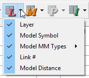

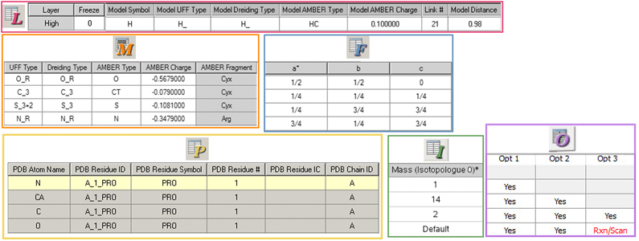

<!-- p.158 -->
Atom Selection, Highlighting and Hiding The View on the left has 6 selected atoms, 2 highlighted atoms, and 4 hidden atoms (an invisible methyl group bonded to the

seemingly bare ring carbon). The latter two properties are indicated in the corresponding columns of the Atom List Editor.

The dot in the Highlight column controls the highlighting of the the corresponding atom in the molecule’s View window. If an atom is both selected and highlighted, it appears as light blue.

The items on each of the popup menus in the Display column control whether each atom is visible in the View window. They have the following meanings when applied to a single atom:

- 

Show: Display this atom.

- 

Hide: Hide this atom.

- 

Hide Others: Hide all atoms except this one.

- 

Show Others: Display all atoms except this one.

When multiple rows in the atom list are selected, then turning highlighting on or off or changing the Display menu selection for any atom with the selection will affect all of the corresponding atoms.

## Defining Isotopologues

The I button controls the display of isotopologue definitions. You can add one or more isotopologue columns to the table using this button. You can specify which one to use for frequency analysis using the vibrational results features. The isotopes specified for Isotopologue 0 are used for input files created with the molecule.

If you select one or more rows of the table and them click in an isotopologue field, a popup menu containing the valid isotopes for that element will appear. For example, the menu for carbon contains: 12, 13 14 and Default. When you make a selection from one of these menus, your choice will be applied to all selected rows containing the same element. There is no way to reset all atoms to their defaults in a single operation.

## Atom List Editor Menus

The various menu items in the Atom List Editor window are described below. The File menu includes items related to saving and printing the data in the table:

- 

Print: Print the atom list table.

- 

Export Data: Save the data as a tab-separated format text file.

- 

Close: Close the Atom List Editor dialog.

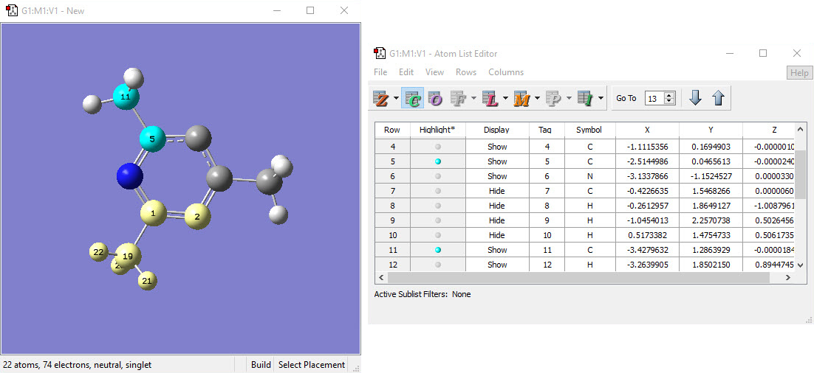

<!-- p.159 -->
The Edit menu items allow you to modify the contents of the molecule specification:

- 

Undo: Undo the previous action.

- 

Redo: Restore the previous “undone” operation.

- 

Copy Data: Copy the data from the current row to the clipboard.

- 

Delete: Delete atoms based on the selected submenu item: Selected Atoms (all selected atoms), Selected Hydrogen Atoms (all hydrogens which are selected), Selected Redundant Atoms (duplicate rows within the selection), All Atoms (delete all atoms), All Hydrogen Atoms (delete all hydrogen atoms), All Redundant Atoms (removes all duplicate rows within the molecule specification).

- 

Reorder: Modify the atom labels (tags) of the table according to the item selected from the submenu:

• Selected Atoms by Bonding: Order selected atoms so that bonded atoms are consecutive.

• Selected Atoms by Rows: Order selected atoms by atom number (i.e., Tag column).

• Selected Atoms: Hydrogens Last: Order hydrogen atoms last within their respective bonding group for

selected atoms.

• All Atoms (Except the First) by Bonding: Order atoms so that bonded atoms are consecutive.

• All Atoms by Row: Order entire table by atom number (i.e., Tag column).

• All Atoms: Hydrogens Last: Place all hydrogen atoms last within their respective bonding group.

• All Atoms by PDB Residue: Order entire table by residue assignment as specified in the PDB file.

- 

Z-Matrix: Contains items useful for working with Z-matrix molecule specifications:

• Standardize: Modify the Z-matrix into a form conforming to typical usage.

• Reconnect Selected Atoms by Bonding: Regenerate Z-matrix entries for selected atoms by analyzing bonding.

• Reconnect Selected Atoms with a Nearly Invalid Dihedral: Regenerate Z-matrix entries for selected atoms

where the dihedral angle is nearly invalid by analyzing bonding (rarely needed for Gaussian jobs).

• Reconnect All Atoms by Bonding: Regenerate Z-matrix entries for all atoms by analyzing bonding.

- 

Optimization Flags: Freeze/unfreeze atoms for a subsequent optimization. The “Yes” and “No” below refer to whether the item should be optimized.

• Opt All Coords (“Yes”) of Selected Atoms: Unfreeze selected atoms as necessary.

• Freeze All Coords (“No”) of Selected Atoms: Freeze the selected atoms.

• Opt All Coords (“Yes”) of All Atoms: Unfreeze all atoms as necessary.

• Freeze All Coords (“No”) of All Atoms: Freeze all atoms.

- 

PBC=>Delete All Atoms Outside Cell: Remove atoms not inside the unit cell.

- 

PBC=>Translate All Atoms Inside Cell: Translate all atoms outisde the unit cell boundary to equivalnet positions inside the cell, and then delete any redundant atoms.

- 

Add Hydrogens for All Atoms: Add hydrogen atoms to the structure (typically used with PDB files).

- 

Update MM Types and Charges: Regenerate the Molecular Mechanics atoms types for the molecule. The scope of the operation, Selected Atoms or All Atoms, is specified by the submenu selection.

<!-- p.160 -->
- 

MM Charges: Open the MM Charges dialog, shown below, which allows you to assign charges to atoms for use with Molecular Mechanics methods (typically, as part of the low-accuracy layer in an ONIOM job). The Clear option on the Action menu will remove any assigned charges from the specified atoms.

Assigning MM Charges with the Atom List Editor

This dialog is used to automatically assign charges to atoms for use in Molecular Mechanics calculations. The Target menu specifies which atoms should be assigned charges: all atoms, all selected atoms, or all atoms currently lacking an MM charge. The Action menu specifies which charge scheme should be used. Amber94 charges are always available. The other options in the list are available when they have been previously computed for the structure in a Gaussian calculation.

The View menu controls atom highlighting within view windows while the Atom List Editor is in use. Each item in the first section is a toggle, and a check mark next to it within the menu indicates that it is enabled:

- 

Exclusive Highlighting: Only allow one row within the table to be highlighted (i.e. one atom in the View Window).

- 

Z-Matrix Connectivity Highlighting: For each highlighted atom, also highlight the other atoms used to define its Z-matrix entry (i.e., bond, angle, and dihedral specification).

- 

ONIOM Link Highlighting: Display atoms for which the highlighted atom functions as a link atom for ONIOM calculations, based on the contents of the row’s ONIOM layer data.

The remaining items on the View menu have the following effects:

- 

Center Highlighted Atoms in View: Reposition the structure in the active View window so that highlighted atoms appear in the center.

- 

Add/Remove Highlighted Atoms to/from General Selection: Add/remove highlighted atoms from the current selection.

- 

Check for Crowded Atoms: Turn on highlighting for atoms that are unphysically close to one another (within 0.75 Angstroms).

The Rows menu controls whether some or all atoms within the molecule are visible in the table and also provides some shortcuts for selecting groups of atoms:

- 

Sublist Filters: Open the Sublist Filters dialog for defining atom filter expressions (described here). Sublist filters are used to limit the display; they make using this tool manageable for very large molecules.

- 

Sort Selected: Sort highlighted atom list rows, according to the active column and criterion selected in the submenu: Ascending by..., or Descending by.... The up and down arrow buttons in the toolbar are equivalent to these submenu items.

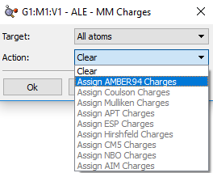

<!-- p.161 -->
- 

Sublist: Toggle display of atoms in and/or not in the active sublist, depending on the submenu item that is chosen (Show Sublist Atoms or Show Non-Sublist Atoms). Current selections are indicated by a check mark next to the corresponding item on the submenu.

- 

Select All: Select all atoms unconditionally.

- 

Invert Selection: Deselect all currently selected atoms, and select all deselected ones.

- 

Select Rows of Generally-Selected Atoms and Generally-Select Atoms of Selected Rows: Cause the selected (i.e. yellow) atoms in the View and the selected rows in the table to be similar. The first of these gives priority to currently selected atoms in the View Window, selecting corresponding table rows in addition to rows already selected, while the second causes the View selection to the rows selected within the table.

The Columns menu allows you to specify which columns appear in the table on an individual column basis. The first few items in the menu correspond to the default columns in the table, which are independent of the various column display buttons. You can select which columns appear for the Z-Matrix Coordinates and Connectivity, Cartesian Coordinates, Optimization Flags, Isotope Mass, Fractional Coordinates, ONIOM Data, MM Types, and PDB Data buttons via the corresponding submenus. The Cartesian Coordinates item has the same function as the corresponding button—although, individual coordinates cannot be selected separately.

<!-- p.162 -->
# Using Sublist Filters

Sublist filters are a means of limiting the visible rows within the Atom List Editor to a manageable number for large molecules. They are defined by means of a dialog reached with the Atom List Editor’s Rows=>Sublist Filters menu path, illustrated below.

Creating Sublist Filters

This dialog allows you to create and apply sublist filters which are used to limit the rows which are displayed within the Atom List Editor. In this case, we apply two filters in succession: Filter 1 selects atoms in the High ONIOM layer, and Filter 2 selects oxygen and nitrogen atoms within that subset.

To use the facility, you must first create a filter using the New Filter button. Filters are always named Filter n and cannot be renamed. The filter is defined using items from within the Criteria list; the popup menu displays the available categories of criteria items. In the figure, we are using the ONIOM category to define Filter 1. Select one or more criteria from the list and then use the > button to move them to the selected filter. Although we have not done so in the example, items from different Criteria categories can be combined with the same filter.

The >> button will similarly move all items within the list. Items can be removed from filters using the < and << items, to remove the selected item and all items (respectively). An entire filter is removed with the Remove Filter button.

Criteria within filters are combined with an OR logic: any atom matching any criterion will be displayed (or not, according to the settings on the Atom List Editor’s Rows=>Sublist submenu). Filters are activated and deactivated by selecting/deselecting the check box to the left of their name. When only a single filter is active, all atoms matching that filter are affected. When more than one filter is active, then all active filters are applied in series, in the order in which they are listed within the dialog, according to an AND logic. For example, Filter 2 is applied only to the matching atoms remaining after applying Filter 1. Subsequent filters will never enlarge the selection resulting from a previous filter, but rather only filter it further.

The available Criteria categories are:

- 

Select one or more atom tag numbers (serial numbers).

- 

Tag List: Select a list of atom tags.

- 

Elements: Select atoms by element type.

- 

ONIOM: Select atoms by ONIOM layer, layer boundary, and/or link atom presence.

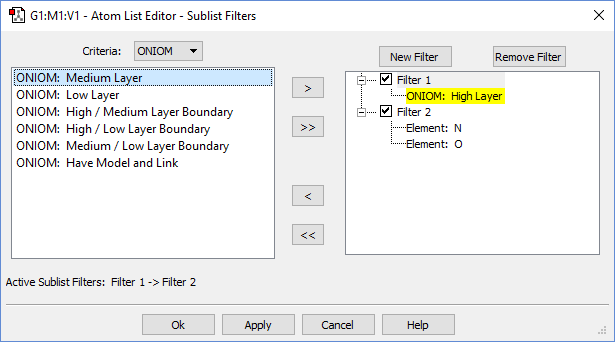

<!-- p.163 -->
- 

Select atoms having undefined Molecular Mechanics atoms types and/or MM charges.

Filters are specific to individual molecule groups, and they do not persist across different sessions for the corresponding input file. In other words, if you close and reopen the input file or if you exit and restart GaussView, current filters are lost.

<!-- p.164 -->
# The PDB Residue Editor and The PDB Secondary Structure Editor

Examining and modifying structures imported from PDB files may be made easier by the PDB Residue Editor and PDB Secondary Structure Editor, reached via the correspondingly named items on the Tools menu. They are illustrated below.

The PDB Residue and PDB Secondary Structure Editors The PDB Residue Editor (top) and PDB Secondary Structure Editor (bottom)

provide mainly read-only views of residue and other data assigned in PDB files.

The PDB Residue Editor (top) and PDB Secondary Structure Editor provide mainly read-only views of residue and other data assigned in PDB files. The Display column can be used to hide the atoms in certain residues/secondary structures for easier viewing of the molecule’s key features. The Highlight column can be used to highlight the atoms corresponding to the selected item. In this example, we have highlighted residue 12 in chain A, making it easy to locate in the View window below. In the Secondary Structure Editor, selecting a chain will also select its helix—although, the reverse is not the case.

The menus in these editors are very similar to those in the Atom List Editor discussed in the previous section. Briefly, they are:

The File menu includes items related to saving and printing the data in the table:

- 

Print: Print the atom list table.

- 

Export Data: Save the data as a tab-separated format text file.

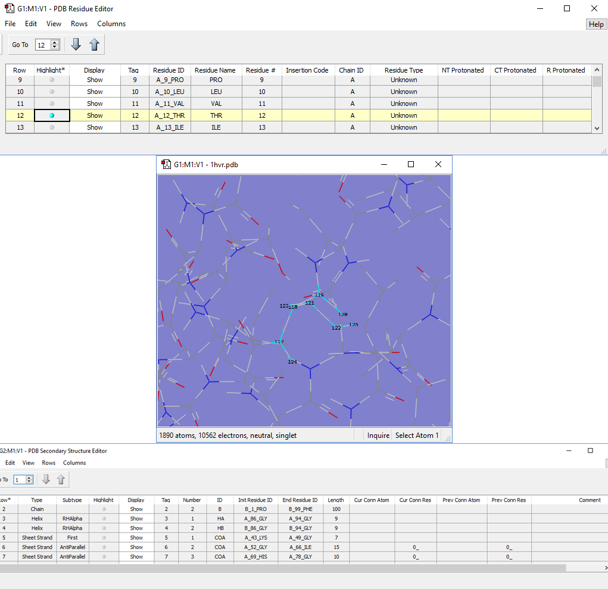

<!-- p.165 -->
- 

Close: Close the Atom List Editor dialog.

Edit: Contains menu items allow you to modify the contents of the molecule specification:

- 

Undo: Undo the previous action.

- 

Redo: Restore the previous “undone” operation.

- 

Copy Data: Copy the data from the current row to the clipboard.

- 

Delete: Delete atoms based on the selected submenu item: Selected Atoms (all selected atoms), Selected Hydrogen Atoms (all hydrogens which are selected), Selected Redundant Atoms (duplicate rows within the selection), All Atoms (delete all atoms), All Hydrogen Atoms (delete all hydrogen atoms), All Redundant Atoms (removes all duplicate rows within the molecule specification).

- 

Add Hydrogens: Adds hydrogen atoms to the residue where needed.

View: Atoms can be difficult to distinguish, as they are already highlighted and thus blue. Use this menu’s controls over atom highlighting to alleviate this problem. Each item in the first section is a toggle, and a check mark next to it within the menu indicates that it is enabled:

- 

Exclusive Highlighting: Only allow one row within the table to be highlighted (i.e. one atom in the View Window).

- 

Center Highlighted Residues in View: Reposition the structure in the active View window so that highlighted residues appear in the center.

- 

Select Atoms of Highlighted Residues: Select all atoms that are present in the currently highlighted residues. This operation adds to the current selection.

- 

Deselect Atoms of Highlighted Residues: Deselect all atoms present in highlighted residues.

Rows: Controls whether some or all atoms within the molecule are visible in the table and also provides shortcuts for selecting groups of atoms:

- 

Sort Selected: Sort highlighted atom list rows, according to the active column and criterion selected in the submenu: Ascending or Descending. The up and down arrow buttons in the toolbar are equivalent to these submenu items.

- 

Select All: Select all atoms unconditionally.

- 

Invert Selection: Deselect all currently selected atoms, and select all deselected ones.

- 

Select Rows of Generally-Selected Atoms and Generally-Select Atoms of Selected Rows: Cause the selected (i.e. yellow) atoms in the View and the selected rows in the table to be similar. The first of these gives priority to currently selected atoms in the View window, selecting corresponding table rows in addition to rows already selected, while the second causes the View selection to the rows selected within the table.

Columns: Allows you to specify which columns appear in the table on an individual column basis via checking or unchecking their respective boxes.

<!-- p.166 -->
# Using the Atom Group Editor

The Atom Group Editor, reached via the Atoms Groups item on the main Tools menu, allows you to define subgroups of atoms within a structure for various purposes. It is illustrated below.

The Atom Group Editor

This dialog is used to define fragments and other atoms groups for various types of Gaussian jobs. A separate charge and spin can be optionally assigned to each fragment (as we are doing here). The Atom Group Class popup lists the various kinds of atom groups for which GaussView provides special handling (see below).

Note that this dialog serves only to assign atoms to named groups. None of the items here have any effect on the structure or ever remove any atoms from the molecule.

The various columns in the spreadsheet hold the following data:

- 

Group ID holds a name for each atom group, typically the class names with a number.

- 

When the checkbox in the Highlight column is checked, the atoms in the corresponding group are encircled with the indicated highlight color.

- 

The menus in the Display column allows you to hide the atoms belonging to one or more groups.

- 

The Atom Tags field lists the serial numbers of the atoms in each group. You can define groups by entering atom numbers here directly, and the field is also updated when atoms are added to or removed from groups by other methods.

- 

The Atom Count column lists the number of atoms in the group and the Electrons column lists the number of electrons (both are read-only).

- 

The Charge, Spin Mult, and Unpaired Spins columns may be used to set per-fragment charges and spin multiplicities (an example is described later).

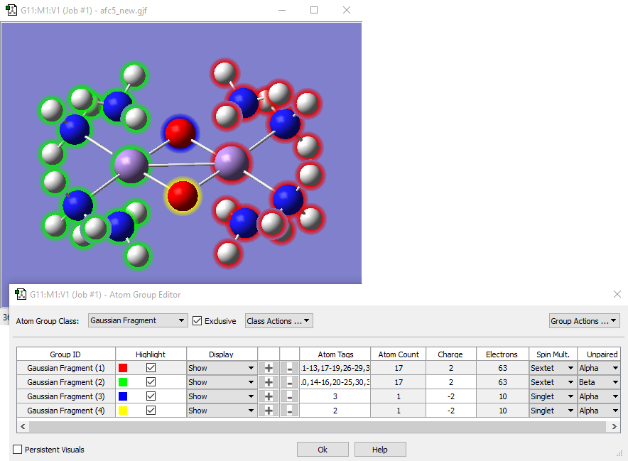

<!-- p.167 -->
- 

The plus and minus sign buttons in each row may be used to add or remove all currently selected atoms from the corresponding group.

Once atom groups are defined, the Select Atoms and Deselect Atoms items on the Group Actions menu can be used to select/deselect atoms within an atom group. The other items on this menu have the following uses:

- 

New Group: Add another group of the current group class. For example, selecting this item in the preceding figure will add another Gaussian Fragment group.

- 

Remove “item”: Removes the selected atom group. Any atoms in the group are assigned to the first group.

- 

Add Selected Atoms to/Remove Selected Atoms from: Equivalent to the plus and minus buttons in the Selected Atoms column.

There are two other important controls in this dialog:

- 

The Exclusive checkbox causes each atom to belong to exactly one atom group. When checked, if an atom is placed into an atom group, it is removed from its present group automatically. It is required for all of the atom group types used for various Gaussian calculation types. It is off by default for the Gaussian Fragment class, but the setting sticks once you enable it.

- 

The Persistent Visuals checkbox controls whether the highlighting and show/hide display settings are retained in the View window when the Atom Group Editor is closed. It is unchecked by default.

## Types of Atom Groups

The defined classes of atom groups are as follows:

- 

Gaussian Fragment: Define atom fragments for use in molecule specifications, for a fragment guess, and the like. Gaussian Calculation Setup Use: Guess panel: Use fragments (atom groups) for generating guess

- 

ONIOM Layer: Define regions using different model chemistries for ONIOM calculations. Gaussian Calculation Setup Use: Method panel: Multilayer ONIOM Model

- 

Freeze: Specify frozen atoms for geometry optimizations. Gaussian Calculation Setup Use: Adds freeze status column to the molecule specification.

- 

NMR Spin-Spin: Specify atoms for which to perform spin-spin coupling calculations during an NMR job. Gaussian Calculation Setup Use: Job Type panel for NMR: compute spin-spin couplings

- 

Select Normal Modes: Specify atoms with which to select normal modes in frequency calculations. Gaussian Calculation Setup Use: Job Type panel for Frequency or Opt+Freq: Select Normal Modes

The Class Actions menu allows you to create a new type of atom group, to reset the atom group assignments to the default (all in the first group), to remove an atom group class, and to rename a class.

<!-- p.168 -->
# Specifying ONIOM Layers

Choosing the Tools=>Select Layer menu item or clicking on the Select Layer button opens the Layer Selection Tool. This window is used to assign atoms to ONIOM layers graphically. It is illustrated below.

Assigning Atoms to ONIOM Layers

There are several methods for selecting atoms for layer assignment:

- 

You can use one of the buttons at the top of the dialog. The Select All button selects all atoms in the molecule, and the Select None button deselects all atoms. The Select Layer button selects all atoms currently assigned to the specified layer. The Select PDB Residues opens another selection dialog which allows you to select atoms by residue if this information was present in the PDB file corresponding to the current model.

- 

Use the left mouse button to select or deselect atoms manually, continuing until all the atoms that you want have been selected. Hold down the Shift key to add to the current selection.

- 

Proximity-based selection: Select an atom, and then use the Expand Selection slider and proceed until you have selected all the atoms you need. Moving it to the right increases the distance used when selecting atoms.

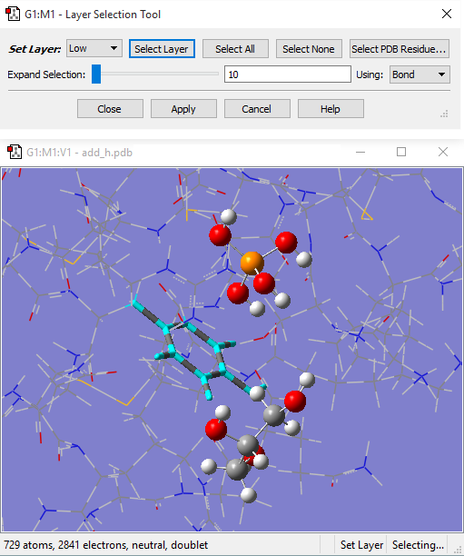

<!-- p.169 -->
This dialog allows you to assign atoms to layers for ONIOM calculations. Different layers are indicated by the different display formats. Here, the atoms in the ring at the left are selected for layer assignment.

For distance-based atom selection, the distance between atoms to be selected depends on the following criteria, selected in the Using popup menu:

- 

Bond: selects only atoms that are bonded to one another.

- 

Distance: selects atom(s) based solely on proximity to a current selection, regardless of bonding.

<!-- p.170 -->
# Imposing Symmetry

The Point Group Symmetry dialog is used to specify the desired symmetry for a molecular structure. It is reached via the Tools=>Point Group menu path.

Imposing Symmetry on a Molecular Structure

The controls in the upper section of the dialog have the following meanings:

- 

Enable point group symmetry: Enable GaussView’s symmetry features.

- 

Constrain to subgroup: Select a point group to which to constrain the structure.

- 

For: Select All changes to impose symmetry on future structural changes. None disables symmetry constrains.

The Approximate higher-order point groups area displays and allows you to apply higher symmetry subgroups to the current molecular structure. It contains the following controls:

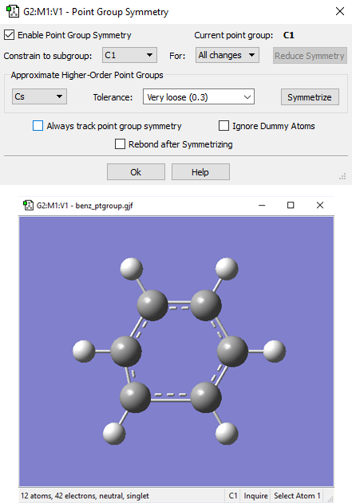

<!-- p.171 -->
- 

The popup menu on the left lists applicable point groups having higher symmetry than the current structure (if any). Select the desired point group before clicking Symmetrize.

- 

Tolerance menu: Cutoff level below which to consider structural parameters equal. Larger cutoffs make higher symmetry groups easier to identify. Thus, increasing the tolerance may cause additional point groups to appear in the popup menu on the left.

- 

Symmetrize button: Impose the selected higher-order point group on the molecular structure immediately.

The Always track point group symmetry: Tells GaussView to continuously compute point group assignments as the geometry changes. Use this item in conjunction with a symmetry constraint setting of None in order to view point group changes continuously as you adjust structural parameters (e.g., use the bond length slider). Normally, the point group is identified only after the change is completed. For very large molecules on slower systems, enabling this item may cause noticeable delays in response time.

In the preceding example, GaussView has identified the current point group of this distorted benzene molecule as C1. It also recognizes that the C2v point group might also be appropriate. Clicking the Symmetrize button will apply the specified point group to the structure. The Tolerance field can be used to tighten or relax the symmetry identification process. In this case, loosening the tolerance allows GaussView to identify the highest applicable point group as D6h.

The Symmetrize button (on the toolbar) and the Edit=>Symmetrize menu item both immediately impose the maximum identifiable point group on the current structure, using the most recent Tolerance setting from the Point Group Symmetry dialog for this molecule (or the default of Normal). They also have the side effect of enabling point group symmetry for the molecule (again, using the previous settings, if any).

The View window status bar will indicate any identified and constrained symmetry for the molecule:

<!-- p.172 -->
Symmetry-Related Status Bar Displays

Four views of the symmetry information section of the status bar for the triazine molecule: (a) symmetry has not been turned on; (b) molecule symmetry (D3h) but no symmetry constraint (C1); (c) molecule symmetry (D3h) and structure constrained to D3 symmetry; and (d) molecule symmetry and constraint symmetry are both D3h.

<!-- p.173 -->
# The Redundant Coordinate Editor

The Redundant Coordinate Editor allows you to create and edit redundant coordinates for use with Gaussian optimizations or potential energy surface scans. It is accessed via the Tools=>Redundant Coordinates menu path or the Redundant Coordinate Editor button. It is illustrated below.

The central feature of this dialog is a scrollable list containing information on each of the coordinates. A pencil icon in the status column marks that coordinate as the currently active coordinate. A warning sign in the status column indicates that that coordinate is incomplete or invalid. When the currently active coordinate is invalid or incomplete, the status bar at the bottom describes the nature of the warning. The coordinate column contains a brief description of the coordinate and its parameters.

The Redundant Coordinate Editor We are adding the bond coordinates for the two selected atoms so that its distance will be reported in the optimization

output (even though the atoms are not in fact bonded to one another). The list in the window also shows 2 other coordinates we

added.

A toolbar at the top provides buttons for adding a new coordinate, deleting a coordinate, and moving an item up or down in the list. Adding a new coordinate creates an unidentified coordinate, which is placed in the list just after the currently active coordinate and becomes the active coordinate.

All of the available redundant internal coordinate types are supported by the various selections in the two popups in the Coordinate area, and the items on these menus are self-explanatory. Any additional fields required by a specific coordinate type will appear in the panel when the type is selected. See the discussion of Opt=ModRedundant in the Gaussian User’s Reference for more information.

When exiting the Redundant Coordinate Editor, if any coordinates are still invalid or incomplete, you will be notified and given the option of continuing to edit. If you exit anyway, any invalid coordinates will be deleted.

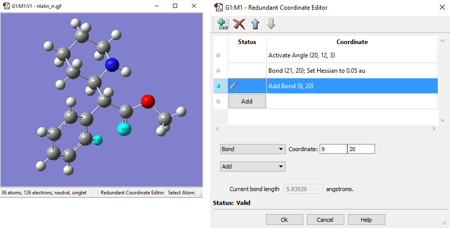

<!-- p.174 -->
# The Connection Editor

The Connection Editor, reached via the Tools=>Connection menu path, can be used to determine whether proper atom ordering is maintained throughout a molecule group. You can also use it to automatically reorder atoms to align atom tags between related structures across a molecule group (useful for preparing structures for QST2 and QST3 transition structure optimizations). Manual atom reordering is also possible.

When the Connection Editor is active, the molecule will be analyzed to determine if the atom tags match across the entire molecule group, and the status bar will report the result. If potentially fixable mismatches are detected, the dialog will report this and suggest that the user Enable Autofixing. Clicking on the corresponding button will tell the Connection Editor to reorder the atom labels to remove these mismatches. The success or failure of autofixing will be reported on the status bar. When autofixing is active, any manual reordering of atom tags will cause autofixing to be called and remove any mismatches that might have been introduced.

The Connection Editor must be used if you are attempting to set up a QST2 or QST3 optimization and the corresponding option is greyed out. By using the Connection Editor, the issues will be resolved and you will be able to set up the desired optimization calculation.

When active, autofixing can be disabled using the relabeled Disable Autofixing button. When autofixing is not applicable, the button is relabeled as No Autofixing.

<!-- p.175 -->
The Connection Editor

The Connection Editor is used to verify and assign atom equivalences in two molecular structures. When working with a molecule group, viewing in multi-geometry mode allows easier comparison and editing. In this contrived example, we need to swap the ordering of atoms 4, 5, and 6 in one of the models in order for the atoms to correspond properly. This can be done by clicking on the Enable Autofixing button or via a manual process.

Atoms can also be manually reordered by using the mouse. These operations use a reference atom as their basis (see the first bullet):

- 

Left clicking: Designate the atom as the reference atom. This can also be done using the Reference Atom control.

- 

Middle clicking: Assign the tag one greater than the reference’s item to the selected atom.

- 

Right clicking: Swap tags with the atom and the reference atom. The atom then becomes the new reference atom.

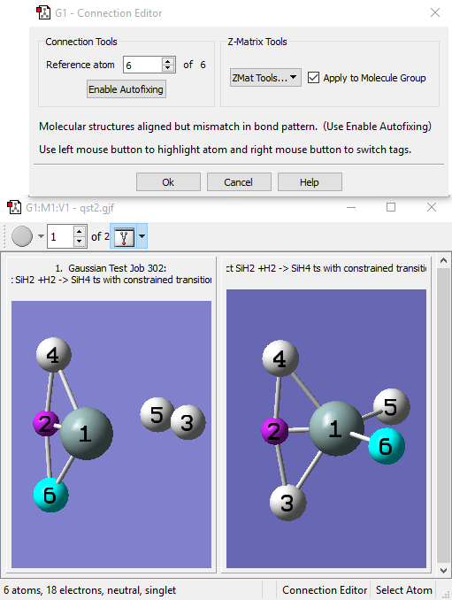

<!-- p.176 -->
The Apply to Molecule Group checkbox determines whether the Connection Editor’s actions apply only to the current model or to all models within the molecule group.

The ZMat Tools popup allows you to perform some Z-matrix operations on the molecule or molecule group:

- 

Standardize: Reconstruct the Z-matrix in standard form.

- 

Sort H: Move hydrogen atoms to the end of the atom ordering.

- 

Reorder: Reapply standard Z-matrix ordering.

- 

Reconnect: Regenerate connectivity data.

- 

Opt All: Optimize all atoms.

- 

Opt None: Optimize no atoms; i.e., freeze all atoms.

Any other items that may be present on this popup menu do not apply to Gaussian.

<!-- p.177 -->
# The Molecular Orbital (MO) Editor

The Tools=>MOs menu path and the MO Editor button both open the MOs window. It is used to inspect molecular orbitals (MOs) from Gaussian calculations—MO energy and occupancy diagrams, visualized MO isovalue surfaces—as well as to quickly generate new MOs and/or visually select active-space MOs to be used for CASSCF calculations.

The MO Editor This window is used for examining molecular orbitals visually and potentially rearranging

their occupancies and/or ordering for a subsequent Gaussian calculation. Here we are

viewing MO 20, one of 5 available surfaces (and 2 selected MOs).

The MOs dialog has its own embedded View window for displaying the molecule and surface corresponding to the currently selected MO (if available). This embedded view is read-only and cannot be used to edit the molecule. In viewing functionality, it functions almost identically to a standard View window in terms of including keyboard and mouse controls for translating, rotating, and zooming the molecule, accessing the context menu, and so on. (See the discussion of manipulating views earlier in this chapter and that concerning surfaces in “Viewing Gaussian Results” for details.)

The size of the Current Surface window can be changed by resizing the entire MOs dialog. Its width can also be adjusted by clicking and dragging on the partition between it and the MO diagram. This adjusts the relative widths of the two windows.

MOs can be selected for visualization, inclusion in future calculation, and other operations by left-clicking on them. Selected MOs are highlighted in yellow. If a surface is available for an MO, a small square appears to the right of the MO. The square is red for the MO whose surface is currently being viewed. Clicking on a different MO’s grey square will change the Current Surface area to show that MO’s surface.

The bottom portion of the window contains four panels:

- 

The New MOs panel is used to read-in or generate molecular orbitals.

- 

The Visualize panel allows you to generate surfaces for desired MOs.

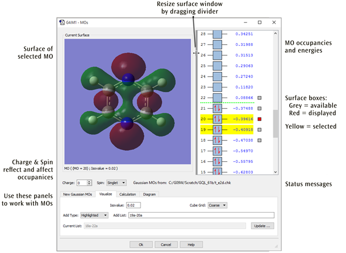

<!-- p.178 -->
- 

The Calculation panel allows you to modify the order of MOs for future Gaussian jobs.

- 

The Diagram panel controls the energy level and orbital occupancy display to the right of the view area.

The Visualize panel is visible in the figure above. The various fields in it specify which orbitals should be visualized, along with two surface generation parameters (the isodensity value and the grid density, via the Isovalue and Cube Grid fields, respectively). The Add Type popup contains items which specify which MOs to visualize; its options are generally selfexplanatory with the possible exception of Current List (regenerates the orbitals listed in the Current List field) and Other explanatory with the possible exception of Current List (regenerates the orbitals listed in the Current List field) and Other (specifies the arbitrary list of orbitals present in the editable Add List field). Note that GaussView attempts to keep the Add List and Add Type fields synchronized. Clicking the Update button will generate the requested orbital surfaces.

The figure below displays the other panels present in the MO Editor (stacked on top of one another), each of which will be discussed in the course of the remainder of this section.

The MO Editor’s New, Calculation, and Diagram Panels

Each panel shows a typical use for it (and not necessarily the default settings).

### Modifying Orbital Occupancies, Molecular Charge, and Spin Multiplicity

To the right of the Current Surface is the MO energy and occupancy diagram showing the MOs for the current molecule if available, initially arranged in order of increasing energy. Alpha and Beta electrons are represented by red up and down arrows in a blue box, respectively. Electrons can be moved from one MO to another by dragging them between the corresponding boxes. Electrons can also be added or removed from an MO by right-clicking in the MO box. Manipulating the MO occupancies in this way changes the net charge and/or spin multiplicity of the molecule as appropriate, reflected in

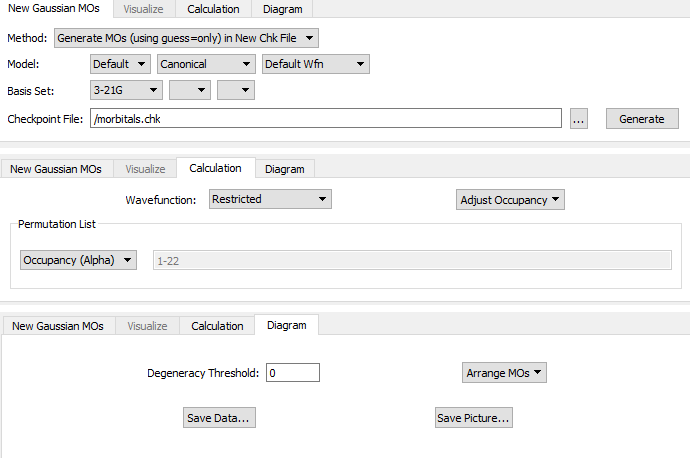

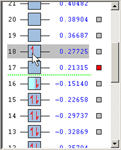

<!-- p.179 -->
the Charge and Spin fields. These fields can also be edited directly, and any changes will be reflected in the MO occupancies. Increasing the charge will remove electrons from the MOs, starting with the HOMO. Decreasing the charge will add electrons to the MOs, starting with the LUMO (or the HOMO if it is singly occupied). Similarly, increasing the spin multiplicity will move electrons from the highest doubly occupied MOs to the lowest virtual MOs, and decreasing the spin multiplicity will move electrons from the lowest-energy singly occupied MOs to the highest-energy singly occupied MOs. Finally, modifying the charge will also affect the spin multiplicity if the charge is changed by an odd number.

Controls in the Calculation panel also serve this purpose. The Adjust Occupancies popup contains two choices:

- 

Aufbau: Fill MOs with electrons in order of increasing orbital energy, in keeping with the current settings of Charge, Spin, and Wavefunction.

- 

Original: Restore the original read-in or computed orbital occupancies, modifying the Charge, Spin, and/or Wavefunction if appropriate.

### Controlling the Orbitals Display

The Diagram panel controls the orbital diagram. The Arrange MOs popup allows you to order orbitals by Energy, by Occupancy, or by CI; the latter is appropriate for creating a CAS active space (see below). The Degeneracy Threshold sets the value below which to consider orbital energies as equal. This feature is illustrated below.

Degenerate Orbitals in the MO Editor This MO display for NH3 illustrates how degenerate orbitals appear in the orbital display area. Note that we have modified the Degeneracy Threshold from its default value of 0 to allow GaussView to detect the degenerate MOs.

### Generating and Retrieving MOs

The New Gaussian MOs panel allows you to read-in or generate MO data, depending on the setting of the Method popup. When it is set to Load Existing Chk File, you can read in orbital data from a checkpoint file by specifying its location and then clicking Load.

When Method is set to Generate MOs (using guess=only) in New Chk File, the Model and Basis Set areas specify the calculation model for generating orbitals. The fields labeled Model specify the initial guess type, localization method, and wavefunction type, while the desired basis set is specified in the fields below these. The fields in the second line of this panel specify the basis set to use for the Gaussian calculation. Consult the discussion of the Guess keyword in the Gaussian User’s

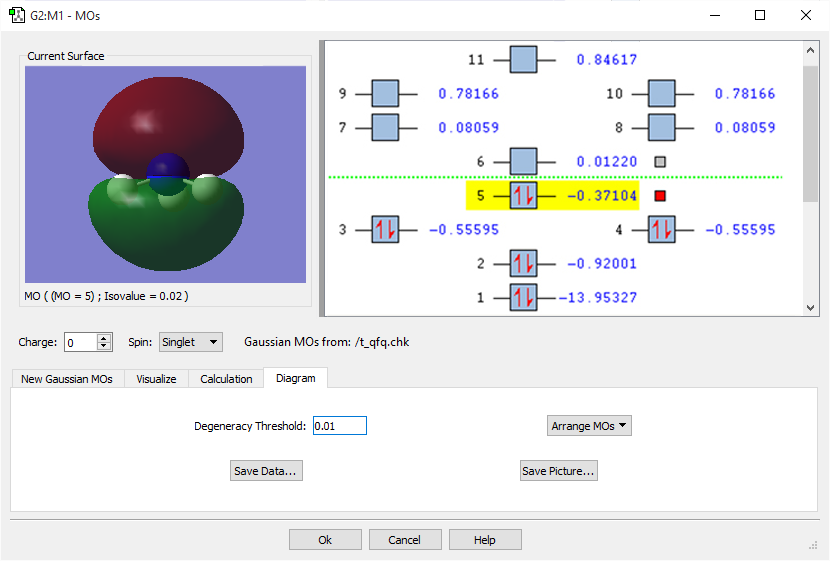

<!-- p.180 -->
Reference for more information on the various fields and choices. Clicking Generate will launch a Gaussian job to generate the orbital data (calculation type is Guess=Only).

### Rearranging Orbital Ordering

The Permutation List control in the Calculation panel displays the current orbital reordering at any given moment; it is initially empty. The popup in this area offers three choices for orbital reordering:

- 

Occupancy (Alpha): Reorder orbitals based on the current occupancies of the alpha orbitals. This will order filled orbitals below unfilled ones and fully occupied orbitals below partially occupied ones. Within each group, orbitals are arranged according to increasing energy.

- 

Occupancy (Beta): Reorder orbitals based on the current beta orbital occupancies (as in the previous item). Only available for unrestricted wavefunctions.

- 

CI: Reorder orbitals so that all occupied and all unoccupied orbitals are contiguous, with each group arranged in increasing energy order. This choice is appropriate for a CAS calculation.

### Miscellaneous Options

The Diagram panel contains two additional controls:

- 

Save Data: Save the molecular orbital information from the MO diagram to a simple text file: orbital number, occupancy, orbital energy for each orbital, and the number of frozen orbitals. For unrestricted wavefunctions, alpha and beta information will be saved in separate blocks.

- 

Save Picture: Save a graphic image of the MO diagram. You will be prompted for the filename and desired graphics format.

<!-- p.181 -->
# GMMX Conformer Calculation

The GMMX Conformer Calculation dialog is used to set up and run a GMMX calculation. This dialog will let you specify how you want the calculation set up. It is illustrated below.

The GMMX Conformer Calculation Window

The Force Field dropdown menu allows you to choose what type of force field to use for the Conformer Calculation. The default force field is MMFF94, a general purpose organic force field designed primarily for small, drug like organic molecules. The other two force fields, MMX and MM3, come from the Allinger group and differ from MMFF94 in the treatment of extended conjugation.

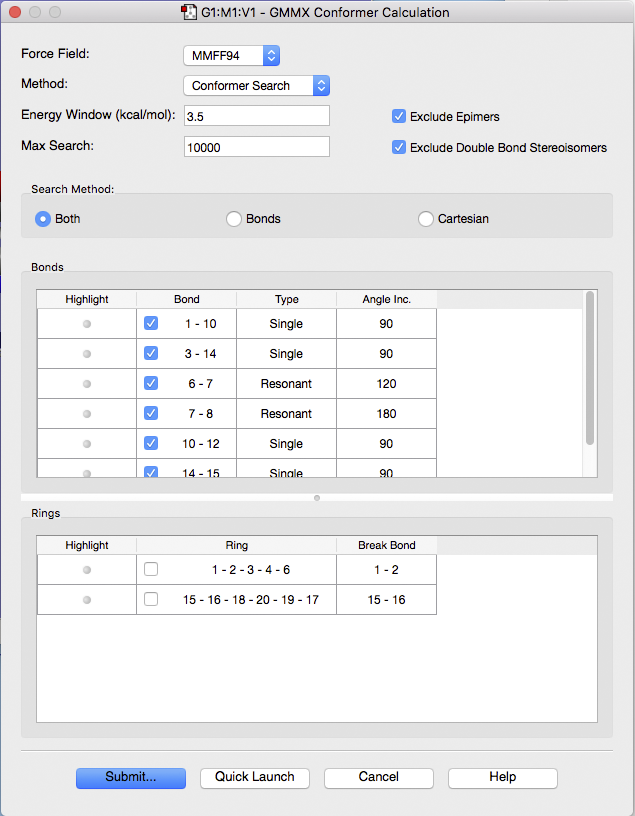

<!-- p.182 -->
The Method dropdown menu specifies what kind of calculation to run:

- 

Conformer Search: Perform a conformational search based on the parameters specified in the dialog.

- 

Optimization: Optimize the current structure with molecular mechanics.

- 

Grid Search: Perform a systematic conformational search in torsion space. The selected rotatable bonds are all set to an initial configuration and then stepped by the specified bond angle through 360 degrees. At each step, the current structure is minimized.

The Energy Window field specifies the tolerance level of the energy difference between the results and the lowest energy conformer (in kcal/mol). When the calculation is run, conformers that fall outside of this range will be discarded.

The Max Search field specifies the maximum number of structures that will be minimized.

When checked, the Exclude Epimers checkbox says to remove all epimers of the current structutre from the results set. Epimers are stereoisomers whose configurations differ only at a single stereo center.

When checked, the Exclude Double Bond Stereoisomers checkbox will remove stereoisomers resulting from rotations around a double bond from the results set, with the exception of double bonds selected in the Bonds list. Rotations about the latter are always considered regardless of this setting.

## Conformer Search

The Search Method options allow you to choose how you want GaussView to search for conformations. You can choose from Bonds, Cartesians, or Both at the same time:

- 

In a Cartesian search, each of the heavy atoms is moved by some random distance in each of the X, Y and Z dimensions. This is a good method for exploring the conformational space about a local minima.

- 

In the Bonds method, each of the selected rotatable bonds is rotated by some random amount. This normally provides large changes in the conformation of the molecule, and is a good method for hopping between local minima.

- 

For ring systems, the Ringmaker strategy of Still is used with the Bonds method. This involves breaking one bond in a ring, rotating about the remaining bonds, and then trying to reclose the ring. If the bond length or the bond angles of the reclosed ring are not reasonable, the conformation is rejected, and a new attempt is made. This method works well with flexible rings of size 8 or larger. Rings of limited flexibility, such as fused rings or rings with double bonds, do not work well and should not be included in a ring search. These systems will work fine with just a Cartesian search.

The two lists in the bottom of the window specify the bonds and rings to use in the search for conformers. The top list has three columns: Highlight, Bond and Angle. Clicking on the grey dot in the Highlight column will highlight that bond in the view window. The Bond column lists the atom numbers for each identified bond. The checkbox controls whether the bond is used during the calculation. The Angle column displays the increment in degrees for rotations about that bond.

The bottom list contains the parameters used when the molecular structure contains ring(s). In this case, the information specified is the ring angle and the bond to be broken. The checkbox again controls whether the item is active during the conformational search.

When you click on the icon in the Highlight column, GaussView will select the atoms and highlight them in the view window, giving a visual indication of the bond you are selecting. An example of this is included below.

<!-- p.183 -->
## Grid Search

A Grid Search specifies the rotation angle when rotating about the specified bonds. For example a value of 120° means that rotation angles of 0°, 120° and 240° will be used. Hence, a lower value will generate more structures for examination during the grid search. The Grid Search dialog is illustrated below:

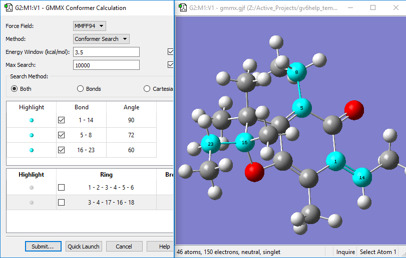

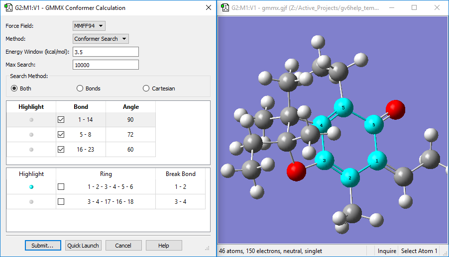

<!-- p.184 -->
The GMMX Conformer Calculation Window Grid Search method

The Bond column lists the atom numbers for each identified bond.

The Energy Window field specifies the tolerance level of the energy difference between the results and the lowest energy conformer (in kcal/mol). When the calculation is run, conformers that fall outside of this range will be discarded.

The Number of Structures shows how many structures are present in the molecule.

The other items in the dialog have the same functions and meanings as in the Conformer Search mode.

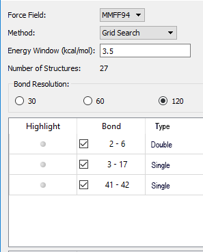

<!-- p.185 -->
# Building Periodic Systems with the Crystal Editor

The Tools=>PBC menu path and the Crystal Editor button both bring up the PBC window. This tool is used to specify unit cells for periodic systems. In order to use this feature, as well as to perform Periodic Boundary Conditions calculations in Gaussian, you will need some understanding of periodic systems, space groups, and general related terminology. This background is assumed in this section.

There are four buttons at the bottom of the window:

- 

Ok, which finalizes your selections and exits the window.

- 

What's this?, which tells you about the functionality of the next menu option you click.

- 

Undo, which reverts the settings to as they were before your most recent selection.

- 

Redo, which restores an undone selection.

The window contains five panels:

- 

Symmetry: Specifies the dimensionality of the unit cell, the lattice system, and space group constraints.

- 

Cell: Specifies dimensions of the unit cell and contains controls for repositioning and reducing cell contents.

- 

View: Specifies how many cells are displayed in each direction in the View window, as well as controlling the display/non-display of various items.

- 

Contents: Contains a list of atoms in the cell as an embedded mini Atom List Editor. Its popup also allows you to modify bonding.

- 

Reduce: Allows you to reduce the dimensionality of a unit cell (e.g., from a 3D system to a surface).

From the highest-level view, a typical process of building a periodic system might proceed as follows:

1: Use the Symmetry panel to specify the number of dimensions and desired space group.

2: Add atoms to the cell, using the mouse or via the Contents panel.

3: Remove any unwanted atoms (e.g., if you used a fragment as a shortcut to creating the necessary atoms).

4: Set the unit cell size, using the Cell panel.

5: Adjust bonding, using the Contents panel if appropriate.

6: Reduce cell contents if appropriate.

7: Specify display properties, using the View panel as desired.

## PBC Building Tutorials

Consult the PBC tutorials for more detailed instructions:

- 

Build a Trans-Polyacetylene Polymer From Ethylene

- 

Build a Graphite Sheet From Benzene

<!-- p.186 -->
- 

Build a Primitive Unit Cell of Diamond Crystal From Methane

- 

Build a Face-Centered Cubic Unit Cell for Diamond Crystal Using Space Group Symmetry

- 

Transform a Primitive Unit Cell of Diamond Crystal to a Face-Centered Cubic Unit Cell

- 

Transform a Face-Centered Unit Cell of Diamond Crystal to a Primitive Unit Cell

<!-- p.187 -->
# Opening Files: Basic Dialog Format

The Open File Dialog

The dialog above is the Basic Open File dialog. The format of this dialog is similar to those of the native operating system but has been modified to contain some GaussView specific functions.

## Directory List

The list box on the left shows recently and commonly accessed directories. Right clicking on one of the directories will give you the option of removing it from the list, as seen below.

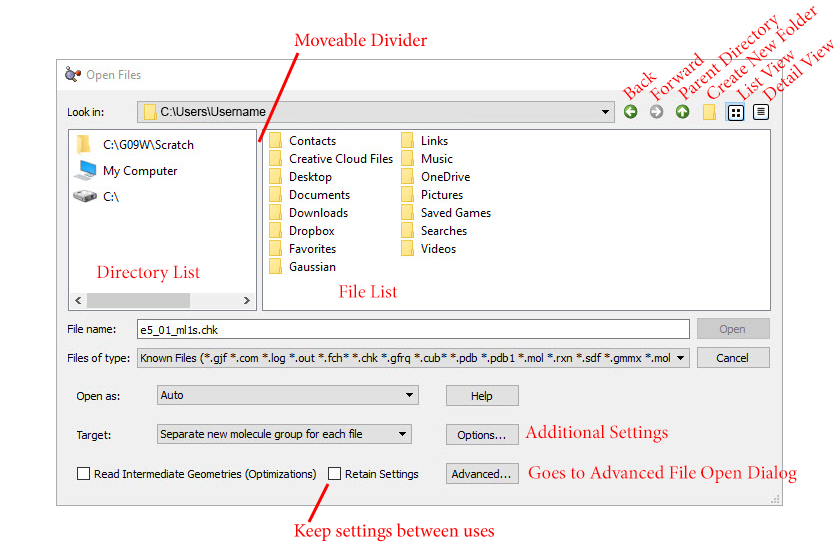

<!-- p.188 -->
Clicking on a directory in the left list will display its contents in the list box to the right, and you can navigate the folders there through the same method you would as the Operating System’s dialog.

The divider between these two list boxes can be moved by clicking and dragging it in order to change their sizes.

## Supported File Types

The Files of type popup is also used to limit the kinds of files included in the file list. Supported file types are:

- 

Known Files (.gjf, .com, .log, .out, .fch, .chk, .gfrq, .cub, .dat, .adat, .aout, .arc, .aarc, .pdb, .pdb1, .mol, .rxn, .sdf, .gmmx, .mol2, .ml2, .cif)

- 

Gaussian Files (.gjf, .com, .log, .out, .fch, .chk, .gfrq)

- 

Gaussian Input Files (.com or .gjf)

- 

Gaussian Output Files (.log or .out)

- 

Gaussian Formatted Checkpoint Files (.fch or .fchk)

- 

Gaussian Checkpoint Files (.chk)

- 

Gaussian Frequency Files (.gfrq)

- 

Cube Files (.cub or .cube)

- 

Brookhaven PDB Files (.pdb or .pdb1)

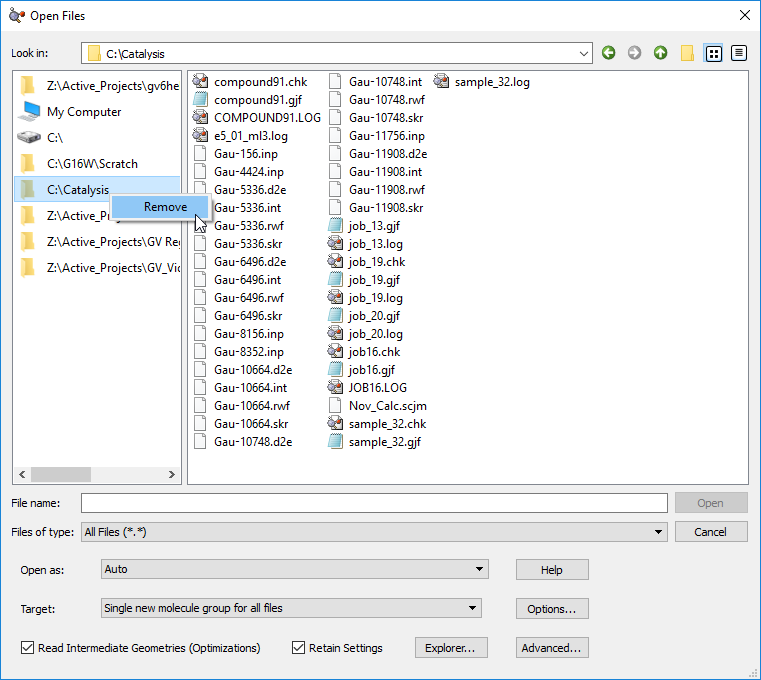

<!-- p.189 -->
- 

MDL Mol Files (.mol, .rxn or .sdf)

- 

MDL SDF Files (.sdf)

- 

GMMX Files (.gmmx)

- 

Sybyl Mol2 Files (.mol2 or .ml2)

- 

CIF Files (.cif)

All files may also be displayed if desired by selecting the All Files item.

The Open as popup is used to force an input file to be interpreted as the specified file type, regardless of the actual file extension. All supported file types are available as choices here. The default is Auto, which identifies the file type by its extension alone.

The Target popup specifies where the read-in structure should be placed:

- 

Separate new molecule group for each file: Create a new, one-member molecule group for each file that is read in. This is the default.

- 

Single new molecule group for all files: Create one new molecule group, and make each file a molecule within it. When opening a single file, this is equivalent to the first option.

- 

Append all files to active molecule: Place the structures from all opened files into the current molecule (in the current molecule group). This will result in additional fragments being added.

- 

Add all files to active molecule group: Add each file as a separate new molecule within the current molecule group. The current molecule is left unchanged.

- 

Add single new molecule for all files: Add the structures from all files into a single one-member molecule group (similar to the third option but creates a new molecule).

In general, only the first structure present in a file is input. Thus, only the structure in the first job step of Gaussian input files is retrieved. However, when selected, the Read Intermediate Geometries (Optimizations) checkbox causes GaussView to retrieve all geometries that are present in some Gaussian results files as separate models within the designated target. This box applies to results files from geometry optimizations, IRC jobs, ADMP and BOMD trajectory calculations, and potential energy surface scans: all jobs with an optimization component. It is not valid with the Append all files to active molecule choice.

The Options button directs you towards the Open Options dialog.

The Advanced button directs you towards the Advanced Open File dialog.

## File List Context Menu

The following illustration shows the context menu available by right-clicking in the file list area:

<!-- p.190 -->
Opening Files: Right-Click Dialog

The context menu has the following items:

- 

Rename: Allows the user to rename a file.

- 

Delete: Allows a user to delete a file or a group of selected files.

- 

Show Hidden Files: Reveals hidden files.

- 

New Folder: Creates a new sub-folder in the the current directory.

- 

Auto-Refresh Directory Views: Refreshes the directory view automatically when appropriate.

- 

Refresh Directory View: Refreshes the view of the current directory.

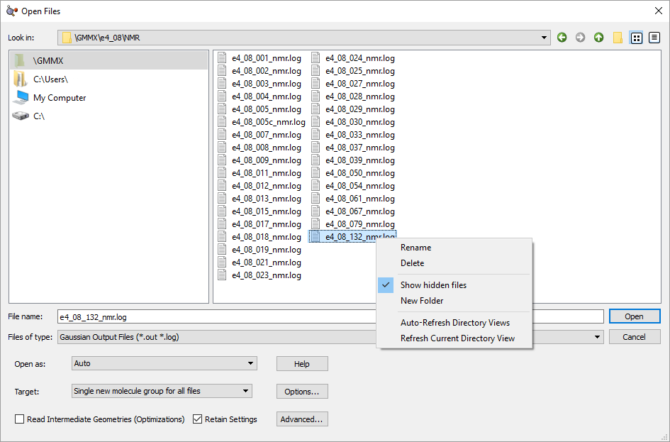

<!-- p.191 -->
# File Open Options

Clicking on the Options button in the Basic Open Files dialog results in the dialog below. The same panel is present in the Advanced Open Files dialog, named File Open Options.

This dialog (panel) contains items that modify the default file opening/structure reading/processing behavior for files. This dialog can be restored to its default settings by clicking on Default Settings button at the bottom right.

File Opening Options

Two options appear in the Gaussian Log and Checkpoint Files section:

- 

Read Intermediate Geometries (Optimizations): When checked, all of the geometries in an Optimization calculation will be loaded, instead of only the final one.

- 

Read Intermediate Geometries (Scans/IRCs): When checked, all of the geometries in a Scan or IRC calculation will be loaded, instead of only the final one.

The Save Formatted Checkpoint File menu in the Gaussian Checkpoint Files area controls saving the formatted checkpoint file:

- 

No: When selected, the formatted checkpoint file will not be saved.

- 

Yes, use same base file name: When selected, the formatted checkpoint file will be saved with the same base name as the file being opened.

- 

Yes, prompt for file name: When selected, a window will open when the formatted checkpoint file is ready to be saved, allowing the user to input a name.

The Use Bond Table menu in the Gaussian Checkpoint Files area controls how bonding is assigned when retrieving structures from the checkpoint file. Checkpoint files contain a bond table listing the bonds within the structure. Bonding can be assigned following this table or calculated from internuclear distances and standard atomic covalent radii. By default, GaussView uses the bond table to assign bonding for all retrieved geometries from checkpoint files created by optimizations and relaxed scans. It uses the bond table to assign bonding for the first geometry only with checkpoint files created by IRC or

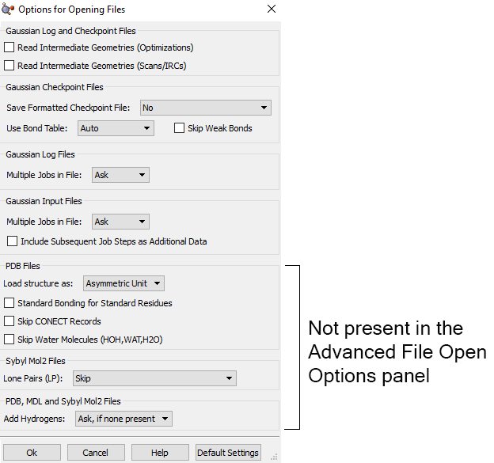

<!-- p.192 -->
molecular dynamics calculation, and it uses the bond table to assign bonding for the final geometry only for checkpoint files created by all other types of calculation types. This behavior corresponds to the Auto selection on this menu. The other items on the Use Bond Table menu are:

- 

First Geometry: Use the Bond Table to assign bonding for first geometry only. The bonding for any other retrieved structures is calculated.

- 

Last Geometry: Use the Bond Table to assign bonding for last geometry only. The bonding for any other retrieved structures is calculated.

- 

All Geometries: Use the Bond Table to assign bonding for all retrieved geometries.

- 

No Geometries: Don't use Bond Table to assign bonding for any geometries. In other words, calculate the bonding for all geometries.

The Skip Weak Bonds checkbox controls whether bonds with an assigned/calculated order < 0.75 are included. When it is checked, such bonds are skipped. Weak bonds can also be removed from a structure using the Edit=>Remove Weak Bonds menu path. Weak bonds may be added to a structure using the Bond SmartSlide using the dashed line bond type.

The Multiple Jobs in File menu in the Gaussian Log File area controls what happens when a log file contains results from multiple calculations:

- 

Ask: When selected, GaussView will open a window to prompt the user to select what to do with the multiple jobs contained in the file.

- 

Load First: When selected, GaussView will load the first job in the file and delete the rest.

- 

Load Last: When selected, GaussView will load the last job in the file and delete the rest.

- 

Load All: When selected, GaussView will load all of the jobs in the file as seperate windows, allowing each to be run.

The Gaussian Input File area has two options:

- 

Multiple Jobs in File: controls what happens when an input file contains more than one job.

• Ask: When selected, GaussView will open a window to prompt the user to select what to do with the multiple jobs contained in the file.

• Load First: When selected, GaussView will load the first job in the file and delete the rest, unless the checkbox, explain below, is checked.

• Load Last: When selected, GaussView will load the last job in the file and delete the rest, unless the checkbox, explain below, is checked.

• Load All: When selected, GaussView will load all of the jobs in the file as seperate windows, allowing each to be run.

- 

Include Subsequent Job Steps as Additional Data: When checked, GaussView will place the input for all jobs after the first into the Additional Data tab in the Gaussian Calculation Setup window.

The options under PDB Files apply specifically to opening PDF files:

- 

Load Structure as: Specifies handling of crystallographic structures, interpreting them as an asymmetric unit, a unit cell, or a biological unit.

- 

Standard Bonding for Standard Residues: If unchecked, GaussView determines connectivity, using the default distance cutoffs-based method. When checked, applies connectivity based on the contained residue specifications.

- 

Skip CONECT Records: Ignore connectivity records.

<!-- p.193 -->
- 

Skip Water Molecules: If checked, ignores any water molecules present in the PDB file (specifically, HOH, WAT, and/or H2O).

The following option applies to Sybyl Mol2 files:

- 

Lone Pairs (LP): Determines whether lone pairs are skipped or replaced with open valence atoms.

The PDB, MDL, and Sybyl Mol2 files section at the bottom of the panel has one option, Add Hydrogens, which specifies how hydrogen atoms are dealt with when opening files:

- 

Ask, if none present: Prompt whether to add hydrogens when a file is opened and no hydrogens are present.

- 

Yes, if none present: Automatically add hydrogens to the file when it is opened if it does not already have hydrogens.

- 

Ask: Ask the user whether hydrogens should be added regardless if there are any present in the file.

- 

No: The file is opened, and no attempt is made to add any missing hydrogen atoms.

- 

Yes: Missing hydrogens are always added where necessary when a file is opened.

<!-- p.194 -->
# Advanced Open Files Dialog: Open File List

The Open File List Menu

This page describes the File List panel of the Advanced Open File dialog. The File List panel can be used to save one or multiple files at one time, as well as to specify settings for those file(s). Note that the title of this dialog varies depending on the kind of information being saved. The File/Directory Preference controls the version of the file saving dialog (Basic or Advanced) that appears by default.

# Adding Files to the File List

The Add Files button opens up a file viewer, whose form is specified in the UI Options panel, to choose files to add to the file list. Clicking the button will open the most recently used directory. By clicking on the down arrow to the right of the Add Files button, a menu opens allowing the user to select which directory to open.

<!-- p.195 -->
The Add Recent File button creates a drop-down menu that allows the user to choose from files that were previously opened.

The Add Recent File List button will display a drop-down menu of prevoiusly opened groups of files (files opened in the same open operation).

The Actions button contains the following menu items:

- 

Selected Items: options apply only to selected (highlighted) files.

• Clear: This option removes the current files that have been selected.

• Check: This option checks the box to the left of the screen, selecting them.

• Uncheck: This option removes the check from the box in the “ID” column, unselecting them.

• Toggle: This option switches the current state of the checkbox. It will add the check to the left of the screen if it

is unchecked, and it removes the check from the left of the screen if it currently is checked.

- 

All Items: options apply to all files in the list.

• Clear: This option removes all the files in the current list.

• Check: This option checks the box to the left of the screen on all items in the current list.

• Uncheck: This option removes the checks from all boxes on all items in the current list.

• Toggle: This option switches the current state of all the items in the current list. If the box is checked, it becomes

empty, and if it is empty, it becomes checked.

The Sorting checkbox controls the ability for the items in the file list to be sorted. When it is checked, clicking on any column header will sort the items based upon the field. The caret character (^), used for ascending order, or a “v” character, used for descending order, appears at the top of the current sort column:

# Working with the File List

Within the file list, items can be selected by clicking on them; their line will then be highlighted with a blue background. They can also be checked or unchecked, indicated by the checkbox at the beginning of each line of the list, which controls whether the file is marked for opening. The Actions menu allows you to modify selections and check statuses for groups of files in a single operation.

<!-- p.196 -->
# Destinations for the New Molecules

The Open as button displays a drop-down menu that specifies how GaussView will open the files in the file list. By default, auto is selected. GaussView will automatically choose the file type if this is left unchanged.

The Target button displays a drop-down menu which gives the following options:

- 

Separate new molecule group for each file: Create a new one-member molecule group for each file that is read in. This is the default.

- 

Single new molecule group for all files: Create one new molecule group, and make each file a molecule within it. When opening a single file, this is equivalent to the first option.

- 

Append all files to active molecule: Place the structures from all opened files into the current molecule (in the current molecule group). This will result in additional fragments being added.

- 

Add all files to active molecule group: Add each file as a separate new molecule within the current molecule group. The current molecule is left unchanged.

- 

Single new molecule for all files: Add the structures from all files into a single one-member molecule group (similar to the third option but creates a new molecule).

The Retain File List checkbox is used to retain the list of files used.

The bottom bar of this menu displays several options available to the user. The Open button is inactive unless a file is marked for opening via the checkbox to its left.

The Open button will open the items in the file list.

The Cancel button will close the Open Files window.

The Default Settings button will restore all options to the GaussView defaults.

The Retain Settings option is enabled by clicking the checkbox. Enabling this makes GaussView retain the settings the user has inputted after closing the window. The next use of the dialog will use these settings.

<!-- p.197 -->
# Advanced Open Files Dialog: UI Options

The UI Options Panel

The UI Options panel allows you to use the options:

- 

Use Native File Browser: When checked, GaussView will use the operating system’s native file browser when adding items to the file list.

- 

Start with File Browser if Initial File List is Empty: When checked, GaussView will automatically open the file browser instead of the File List panel when the file list is empty (i.e., you are opening a new file).

<!-- p.198 -->
- 

File List Detail: The following options are available for displaying file information on the File List tab.

• Low: This shows only basic amount of information about the file(s) being opened: molecule group and structure (if any), filename, and directory.

• Medium: This displays more information about the file being opened: adds the file type.

• High: This displays the highest level of detail of a file that is being opened: adds the file size and creation and modification dates.

- 

Allow Duplicate Files: Checking this option allows GaussView to open the same file multiple times. If it is unchecked, you will not be allowed to add the same file to the file list more than once.

<!-- p.199 -->
# Saving Files: Basic

The Basic Save File Dialog

The dialog above is the Basic Save File dialog. Which version of the file-saving dialog is used is controlled by the File/ Directory Preference.

The list box on the left shows recently and commonly accessed directories. Right clicking on one of the directories will give you the option of removing it from the list.

Clicking on a directory in the left list will display its contents in the list box to the right, and you can navigate further by clicking folders there. The Files of type popup selection is used to limit the types of files that appear within the file list.

The divider between these two list boxes can be moved by clicking and dragging it in order to change their sizes.

<!-- p.200 -->
Right clicking on a file in the right list gives you the following options:

- 

Rename: Allows the user to rename a file.

- 

Delete: Allows a user to delete a file or a group of selected files.

- 

Show Hidden Files: Reveals hidden files.

- 

New Folder: Creates a new sub-folder in the the current directory.

- 

Auto-Refresh Directory Views: Refreshes the directory view automatically when appropriate.

- 

Refresh Directory View: Refreshes the view of the current directory.

The File name input line allows you to enter a file name of your choice. You can fill this field in automatically by clicking on an existing file in the list on the right.

The Save As: button will display a menu of file types (e.g., Gaussian Input File, PDB File, etc.). These choices are useful when the extension you want to use does not match the actual file type. The Auto choice deduces the file type from the extension, and it is usually the correct choice.

The New Molecule Group checkbox, when checked, will create a new molecule group consisting of the saved molecule(s) at the conclusion of the save operation.

The Write Cartesians checkbox, when checked, will force GaussView to write the molecular structure in Cartesian coordinates to the file being saved (i.e., when this would not be the default format).

The Explorer button opens the Operating System's dialog to the directory you currently have open above. On Mac OS X systems, this button is labeled Finder.

The Advanced button takes you to the Advanced Save File dialog.

<!-- p.201 -->
# Advanced Save File Dialog: File List

The Advanced Save File Dialog's File List Panel In this example, the last three file are selected (highlighted), and all files are checked. Some Actions menu items apply only to selected items. The save operation saves only checked files.

This page describes the File List panel of the Advanced Save File dialog. The File List panel can be used to save one or multiple files at one time, as well as to specify settings for those file(s). Note that the title of this dialog varies depending on the kind of information being saved. Which version of the file saving dialog (Basic or Advanced) appears by default is controlled by the File/Directory Preference.

Using the controls on the Actions menu, prefixes and/or molecule numbers can be added to filenames.

# Working with the Molecule List

Within the file list, items can be selected by clicking on them; their line will then have a blue background. They can also be checked or unchecked, indicated by the checkbox at the beginning of each line of the list, which controls whether the file is marked for saving.

<!-- p.202 -->
# Assigning File Names

The Set Files button opens up a file viewer (its format is specified in UI Options panel) where you can specify the directory in which to save the files (the default is the most recent directory) and also the filename. The dialog will assign the specified directory and name to all currently selected molecules. You can also specify the file type in the same dialog or via the popup menu in the main save dialog.

You can edit a filename directly by clicking on it. You can change any directory setting by double clicking on it and navigating to the desired folder.

The Recent File and Recent File List buttons will also assign names to the files, using the names of file(s) that were previously opened or saved. For most circumstances, we do not recommend using this feature.

## Changing the Directory

Clicking on the down arrow at the right edge of the Set Files button allows you to select from a list of recent directories:

The selected directory will set in the save dialog that opens.

# Modifying and Sorting the Molecule List

The Actions button, as well as right-clicking in the file list, contains the following top-level menu items:

- 

Selected Items: The operations apply only to the selected—highlighted—items in the file list.

- 

All Items: These operations will be applied to all files in the list.

Both of these menus contain the following submenu items, which apply to the selected files or all files (respectively):

- 

Set Files: This option allows you to specify a file name for the relevant files. Prefixes and/or molecule numbers can be added to the names using other options on this menu.

- 

Set Directory: This option changes the destination directory for the relevant files.

- 

Clear: This option removes the names given to the files.

- 

Check: This option marks the relevant files for saving.

- 

Uncheck: This option removes the check from the box to the left of the relevant file names, removing them from the save operation.

- 

Toggle: This option switches the current state of the checkbox for each relevant file.

- 

Add prefix: This option adds a prefix which you designate to each relevant file name.

- 

Include molecule numbers in file name: When saving multiple structures, this option adds a molecule number to the base filename for the relevant files.

- 

Remove molecule numbers in file name: This option removes any molecule numbers in the filenames of relevant items.

The Sorting checkbox control whether the items in the filelist can be sorted. When it is checked, then clicking on any column header will sort the items based upon the field. A caret character ^ (ascending order) or a “v”? character (descending order)

<!-- p.203 -->
appears at the top of the current sort column:

# Controlling the Save Operation

The remaining controls appear below the file list.

The Save As button opens a drop-down menu that can be used to override the format that is implied by the specfied file extension.

The New Molecule Group checkbox, when enabled, creates a new molecule group containing the saved molecules at the conclusion of the save operation.

The Save Molecule Group dropdown menu controls how molecule groups containing more than one structure are handled. It includes the following options:

• No: Save only the current structure in the molecule group.

• Yes, seperate file for each molecule: Save all molecules in the molecule group, creating a separate file for each

molecule.

• Yes, single file for all molecules: Save all molecules in the molecule group into a single file.

The items in the bottom bar of this dialog displays have the following uses:

- 

The Save button will save the file list.

- 

The Preview button will open a new window that displays the file to be saved.

- 

The Cancel button will close the Save Files dialog without saving anything.

- 

The Default Settings button will restore all options to the GaussView defaults.

- 

The Retain Settings checkbox will save the current settings after the save operation. The next use of this dialog will start from the saved settings.

The Save and Preview buttons are inactive unless a file is checked (marked for saving) and a filename has been specified for it.

When saving multiple files from one molecule group, GaussView prevents you from giving multiple files the identical name. A seperate, unique, file name must be specified for each file being saved.

<!-- p.204 -->
# Advanced Save File Dialog: File Save Options

The File Save Options Panel

The File Save Options panel allows you to specify the following options for image files:

- 

Enlarge Width and Height by: This option will enlarge the image size by the specified amount.

- 

Background Color: This option will change the color of the background for the saved image.

- 

Gray Scale: Checking this option will capture the image in grayscale.

This panel is inactive for all other file types.

<!-- p.205 -->
# Advanced Save File Dialog: UI Options

The Save File UI Options Panel

The UI Options panel allows you to use the options:

- 

Use Native File Browser: When checked, GaussView will use the operating system’s native file browser when adding items to the file list.

- 

Start with File Browser if Initial File List is Empty: When checked, GaussView will automatically open the file browser instead of the File List panel when the file list is empty (i.e., you are saving a new file).

- 

File List Detail: The following options are available for displaying details on the File List tab.

• Low: This shows only basic amount of information about the file(s) being saved: molecule group and structure,

filename, and directory.

• Medium: This displays more information about the file being saved: file type and checkpoint file names.

• High: This displays the highest level of detail of a file that is being saved: adds the file size and creation and

modification dates.

<!-- p.206 -->
# Saving Images

Save Image Dialog Additional Fields (Layout Varies)

When you are saving an image file, the Save File dialog is customized for this file type. The Files of type and Save as popups will contain the supported image file formats. The additional fields shown above will also be present. They have the following meanings:

- 

Enlarge Width and Height by: Set the image scaling factor.

- 

Background Color: Background color for the image. Note that the current background in the View window is ignored when generating the image file.

- 

Gray Scale: When checked, converts the image to gray scale (i.e., black and white) before capturing. The default is to save a color image.

<!-- p.207 -->
# How To: Save a Movie File

This page discusses how to save a movie using GaussView's Save Movie feature.

# Initial Setup

In order to use this feature to create MP4 movies, you must first download and install a program that will allow GaussView to save the movie files to your computer. The program is called FFmpeg, and can be downloaded from https://ffmpeg.org/.

In this example, we will be installing FFmpeg on a Windows computer. The process is similar for other operating systems.

First, we open the FFmpeg website, and click on the Windows graphic (1 below).

An option will appear below, saying Windows Builds, which we then click on (2 below).

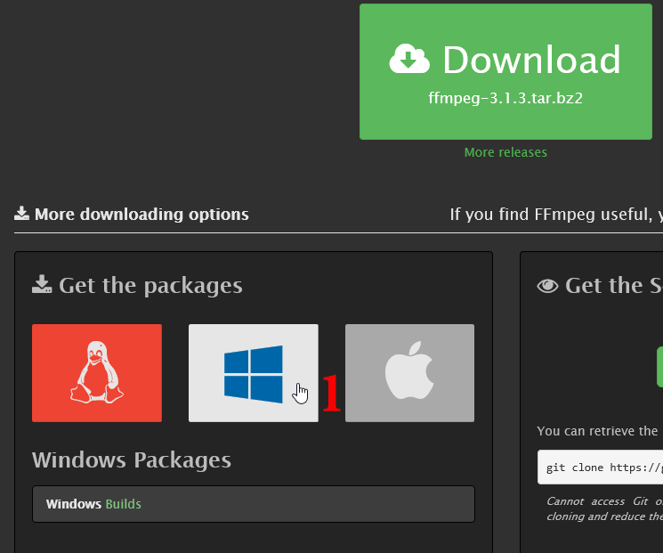

<!-- p.208 -->
A new window will appear, bring you to the download page for the various FFmpeg programs. We are using a 64-bit Windows Operating System for this example, so we download the 64-bit Static version of FFmpeg. In general, we recommend downloading the static version of the program on all platforms.

Once the download has finished, we open the location of the file, which will be in a compressed zip format.

We open the zipped file to unzip the files.

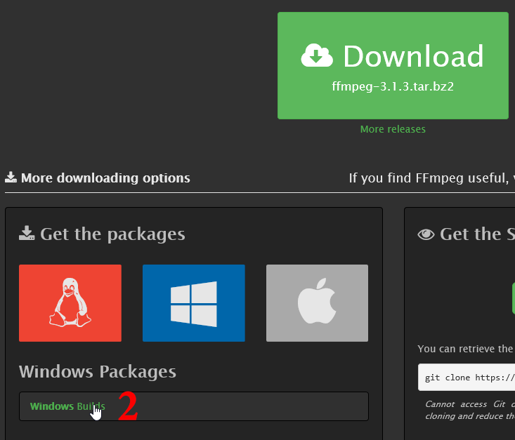

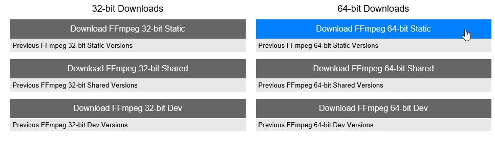

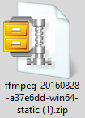

<!-- p.209 -->
The file we are interested in is ffmpeg.exe. In order to install it, we need to navigate to the GaussView 6 directory, and locate the bin folder. Drag the ffmpeg.exe executable from the unzipped file to the bin folder in GaussView 6.

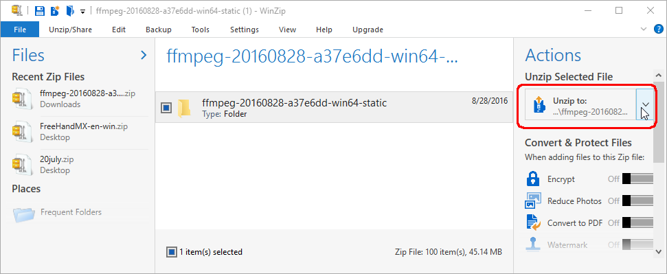

<!-- p.210 -->
Once this executable has been copied over to GaussView, the installation process is complete.

# Creating a Normal Mode Animation Movie

Open a checkpoint file of the molecule you wish to save a movie of. Navigate to the Results=>Vibrations menu, and the options for starting an animation in GaussView, and saving a Movie, will appear as demonstrated in the picture below. It is important to note that you cannot save a movie using GaussView when an animation is currently being shown in the view window.

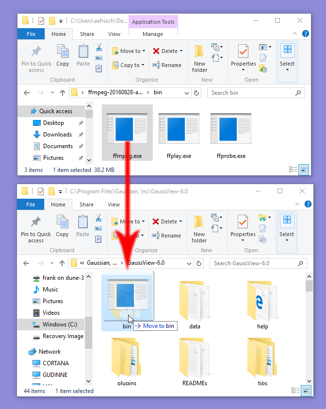

<!-- p.211 -->
Using this menu, you can start and stop the animation in the GaussView window, in order to preview it before saving the video. Below the Start Animation and Save Movie... buttons are the options that you can use to modify the movie settings:

- 

The Repeats: button controls how often, if at all, the animation in both GaussView and the video will repeat.

- 

The Frames per Cycle: button determines how many seperate frames are in each cycle of the movie.

- 

The Frame Delay (msec): button determines how long, in miliseconds, each frame is shown before displaying the next frame.

The Displacement Amplitude: slider determines how extreme the vibrations will be shown. Dragging it to the left will make the vibrations more subtle, while moving it to the right will make the vibrations more pronounced.

Below these controls are options to modify the information displayed with the animation. You can enable the displacement vectors and/or the dipole derivative unit vector as usual using the corresponding checkboxes, and control their length with the adjacent slider. The Displacement Amplitude slider controls the magnitude of the nuclear motion during the animation as usual.

You can preview the video by changing these sliders and clicking Start Animation. To save the movie, you select the Save Movie... menu. Select the Save Movie File... button from this dropdown. GaussView will open a dialog where you can navigate to where you want to save the movie file. The Save as type: field defaults to saving the movie as a .GIF file. Typically, one would select MPEG-4 Movie File (*.mp4), and save the file. GaussView will now save the file, using the normal Save File dialog.

# Saving a Multiview Molecule Group as a Movie

Any molecule group containing multiple views can be animated using the green button in the top left of the view window. The down arrow to the right of the green button offers options for modifying the animation's characteristics.

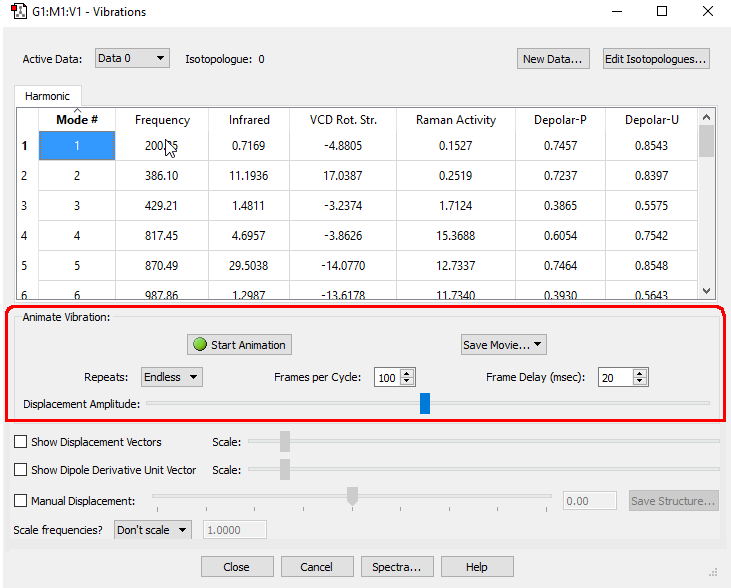

<!-- p.212 -->
Here, you can control how often, if at all, the animiation should repeat using the Repeats: button, how large the delay, in miliseconds, that each frame will be displayed using the Frame Delay (msec): button, and how long the delay between the animation loops should be using the Endpoint Delay (msec): button. The Sequence: button is used to play the animation backwards or forward, or combinations of the two.

To save the movie, you can select File=>Save Movie or click the Save Movie button from the toolbar. You then select the Save Movie File... button from this dropdown. GaussView will open a dialog where you can navigate to where you want to save the movie file. The Save as type: field defaults to saving the movie as a .GIF file. Generally, you will want to select MPEG-4 Movie File (*.mp4), and save the file. GaussView will now save the file using the he normal Save File dialog.

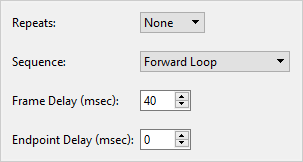

<!-- p.213 -->
# Converting Files

The Convert Files dialog

This dialog is used to convert files between different formats. The supported file types for this dialog are Ampac Input files, Gaussian Input files, MDL Mol files, MDL SDF files, GMMX Input files, and Sybyl Mol2 files.

The Add Files button will open the operating system’s file opening dialog and navigate to the last directory from which a file has been opened. This dialog is used to specify the files to be converted. Once added, they appear in the file list at the bottom of the dialog.

The File Type menu displays the type of files that GaussView can convert into. Selecting one of these will convert all of the specified files into this file type.

The Scheme menu allows you to specify if a calculation scheme should be used when creating the files. This option will only appear when selecting an Ampac Input File or a Gassian Input File.

The Directory menu allows you to choose the directory where GaussView will save the converted files. By default, GaussView will save the files in the source directory of the input files.

The Overwrite Existing Destination Files checkbox specifies if GaussView should overwrite files of the same name in the destination directory.

The Convert menu allows you to convert the highlighted file/all of the files in the above file (depending on the item you select).

The Clear menu allows you to remove files in the above file list.

The Close button will exit the Convert Files dialog.

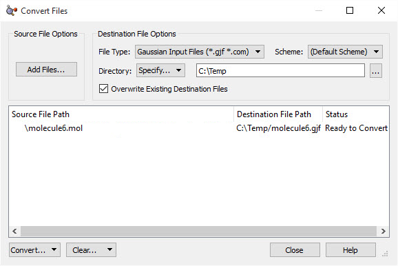

<!-- p.214 -->
# The SC Job Manager

The SC Job Manager is a simple queueing system that is included within GaussView. You can access its control dialog via the Calculate=>SC Job Manager menu path or the corresponding icon. This dialog is illustrated below:

The SC Job Manager The dialog is initially open to its Long Jobs Queue panel.

# Submitting Jobs from GaussView

When the SC Job Manager is specified to run Gaussian calculations, clicking on the Submit button in the Gaussian Calculation Setup dialog starts the process of submitting a job. First, you will be asked to save an input file (if necessary). Next, the following confirmation dialog will appear:

The dialog presents options for:

<!-- p.215 -->
- 

Customizing the job before submission (i.e., changing the queue): Confirm submission of Job at SCJobMan (default: unchecked).

- 

Requesting notification when the job completes: Notify when Job is finished (default: checked).

By default, the job is submitted immediately to the default SC Job Manager queue, and you will be notified when it completes.

If you select the upper checkbox in the preceding dialog, GaussView presents you with the dialog below:

The Submit Job Dialog when the SC Job Manager is in Use

When you click the Submit button at the bottom left of the dialog, the checked files in the file list will be submitted to specified SC Job Manager queue. You can use this dialog to modify the default job type and/or queue and to also select additional files for submission.

## Adding Files to the File List

The Add Files button opens up a file viewer, whose form is specified in the UI Options panel, to choose files to add to the file list. Clicking the button will open the most recently used directory. By clicking on the down arrow to the right of the Add Files button, a menu opens allowing the user to select which directory to open.

The Add Recent File button creates a drop-down menu that allows the user to choose from files that were previously opened.

The Add Recent File List button will display a drop-down menu of prevoiusly opened groups of files (files opened in the same open operation).

The Actions button contains the following menu items:

- 

Selected Items: Options apply only to selected (highlighted) files.

- 

All Items: Options apply to all files in the list whether selected or not.

Each of these menus contains the following items:

- 

Clear: This option removes selected/all files.

- 

Check: This option checks the box at the beginning of the line for selected/all items. Checking the box marks the items for submission.

<!-- p.216 -->
- 

Uncheck: This option removes the check from the box for selected/all items, unselecting them (excluding them from submission).

- 

Toggle: This option switches the current state of the checkbox for selected/all items.

The Sorting checkbox controls whether the items in the file list can be sorted. When it is checked, then clicking on any column header will sort the items based upon the field. A caret character ^ (ascending order) or a “v” character (descending order) appears at the top of the current sort column:

The controls at the bottom of the dialog have the following uses:

- 

The Submit as: dropdown menu specifies what type of job will be submitted. By default, Auto is selected, and the job type is determined from the file extension. In the above dialog, Gaussian was selected.

- 

The Target: dropdown menu allows you to specify which SC Job Manager queue the job is added to.

## Modfying the UI Options

The UI Options panel allows you to set the following options:

- 

Use Native File Browser: When checked, GaussView will use the operating system’s native file browser when adding items to the file list.

- 

Start with File Browser if Initial File List is Empty: When checked, GaussView will automatically open the file browser instead of the File List panel when the file list is empty (i.e., you are opening a new file).

- 

File List Detail: The following options are available for displaying file information on the File List tab.

• Low: This shows only basic amount of information about the file(s) being opened: molecule group and structure (if any), filename, and directory.

• Medium: This displays more information about the file being opened: adds the file type.

• High: This displays the highest level of detail of a file that is being opened: adds the file size and creation and modification dates.

- 

Allow Duplicate Files: Checking this option allows GaussView to open the same file multiple times. If it is unchecked, you will not be allowed to add the same file to the file list more than once.

# The SC Job Manager Dialog

The SC dialog has five panels:

- 

Long Jobs Queue: The Long Jobs Queue is where all of the files that have been targeted as such in the Submit Jobs dialog will appear.

- 

Short Jobs Queue: The Short Jobs Queue is where all of the files that have been targeted as such in the Submit Jobs dialog will appear.

- 

Queueless Jobs: The Queueless Jobs Queue is where all of the files that have been targeted as such in the Submit Jobs dialog will appear.

- 

Running Jobs: This panel provides information on the jobs that are currently running or are queued to run.

- 

Finished Jobs: This panel provides information on jobs that have finished running.

- 

Job Types: This panel provides information on the type of jobs that can be run using the SC Job Manager.

<!-- p.217 -->
The various panels in this control panel are discussed below in several separate sections.

The buttons at the bottom of the dialog have the following meanings:

- 

Submit Jobs: This button will open the Submit Jobs dialog.

- 

Hide: This button will hide the SC Job Manager from your view, but it will not stop the jobs that are running, and it will continue to run jobs that have been queued up.

- 

Exit: This button will close the SC Job Manager. Jobs that are currently running will continue, but no new jobs will be started. If the SC Job Manager is not exited, it will remain running as a seperate process even when GaussView is closed, continuing to process jobs.

## Exiting from the SC Job Manager

When you select Exit, a prompt will appear, asking you if you wish to completly exit the SC Job Manager. Clicking Yes will result in a prompt to save the current SC Job Manager project. Choose any convenient directory location for this file. Selecting No will result discard all data about completed, running and pending jobs generated since the last opening the SC Job Manager.

When you restart the SC Job Manager after having saved the data, all previously pending jobs will be present in the queue(s). Queues that held jobs that were running when the SC Job Manager will be paused, and the previously-running jobs will be listed as pending.

# The Long Jobs Queue, Short Jobs Queue, and Queueless Jobs Panels

The SC Job Manager The panels corresponding to queued and queueless jobs all contain the same controls for and information about relevant

jobs

The queue panels show current jobs controlled by the SC Job Manager. The fields in the various job lists contain the following information:

- 

Job ID: This is the ID given to the job. Jobs within the SC Job Manager are numbered sequentially across queues starting from 1.

- 

Name: This is the name of the job file.

<!-- p.218 -->
- 

Status: This field specifies whether the job is running or it is queued to run in the future. Note that finished jobs do not appear in this list.

- 

Job Type: This field specifies the type of job.

- 

Executable Path: This field shows what program is being used to run the job.

- 

Command Line: This field shows the command line used to run the job.

- 

Submitted: This field gives you the time and date when the job was submitted to the SC Job Manager.

- 

Started: This field gives you the time and date when the job was started.

Double clicking on an item in the file list corresponding to a running job will stream the output for that job. Double clicking on a pending job will open the input file for the job.

Right clicking on an item in the job lists opens the context menu:

The items on the context menu have the following meanings:

- 

Remove: Removes the selected job from the queue. If the job is running, it stops the job (after a confirmation prompt).

- 

Show Input File: Displays the contents of the input file for the selected job.

- 

Stream Output File: Streams the output file as the job runs, allowing you to observe its progress.

- 

Show stdout and stderr: Displays the current standard output and standard error data from the operating system. The data is not refreshed.

- 

Stream stdout and stderr: Streams the standard output and standard error streams from the operating system.

- 

Maximum Number of Running Jobs Allowed (Currently 1)...: Allows you to change the number of jobs which can be running in each queue at one time. By default, it is 1.

The following items appear only on the context menus for queues:

- 

Maximum Number: Specifies how many jobs the SC Job Manager can be running at one time. By default, it is set to 1.

- 

Pause Queue: Pauses the current queue of jobs, preventing any more from being started, but it will not end the job this is currently running.

# The Running Jobs Panel

Selecting the Running Jobs panel results in the dialog below:

<!-- p.219 -->
SC Job Manager: Running Jobs The fields have the following meanings:

- 

User: This field displays the user who is running the job.

- 

Process ID: This field displays the OS process ID assigned to the job by the underlying operating system.

- 

Parent Process ID: This field displays the OS process ID of the parent process for the job.

- 

App Name: This field displays the name of the application that is being used to run the job.

- 

Status: This field displays the current status of the job.

- 

App Path: This field displays the path to the application that is being used to run the job.

- 

Command Line: This field displays the command line used to run the job.

The Refresh button will update the job list to reflect all jobs’ current status.

The Only Show Known Job Types checkbox will limit the display to job types listed on the Job Types panel. If unchecked, all processes for the current user will be displayed.

Double clicking on an item in the file list will stream the output for that job. Right clicking on an item will allow you to remove it (i.e., kill the job).

# The Finished Jobs Panel

Selecting the Finished Jobs panel brings up the dialog below:

<!-- p.220 -->
SC Job Manager: List of Completed Jobs

The columns hold the following information:

- 

Job ID: This is the ID given to the job that is running. It is numbered sequentially, starting from 1. The Job ID number will be reused once the job is cleared.

- 

Name: This is the name of the file that is running, which includes its file extension.

- 

Status: This field specifies the currrent job status. There are several different statuses that can appear here. Completed indicates that the job finished successfully, and an output file can be open. Failed indicates that the job had an issue, and stopped running, and it may or may not produce a partial output file. Crashed indicates that the job failed without output (often before computation had started). Killed indicates that the job was stopped by the user.

- 

Job Type: This field specifies the type of job.

- 

Queue: This field displays what queue the job ran in.

- 

Executable Path: This field shows what program was used to run the job.

- 

Command Line: This field shows the full command line used to run the job.

- 

Submitted: This field gives you the time and date when the job was submitted to the SC Job Manager.

- 

Started: This field gives you the time and date when the job was started.

- 

Finished: This field gives you the time and date when the job was finished.

Double clicking on an item in the file list will attempt to open the output file for that job.

Right clicking brings up a shortened version of the context menu used in the queue panels. It has these options:

- 

Remove: This button will remove the file from the list.

- 

Show Input File: This button displays the input file used to run the job.

- 

Show Output File: This button displays the output file from the completed job.

- 

Show stdout and stderr: This button displays the standard output and standard error streams from the operating system.

# The Job Types Panel

Selecting the Job Types tab will display the following dialog:

<!-- p.221 -->
The columns in the table have the following meanings:

- 

DBID: This is the database ID for the job type (separate numbering from the jobs themselves).

- 

Name: This is the display name of the application used for running jobs.

- 

Application Name: This is the file name of the application executable used for running jobs.

- 

Executable Path: This displays the path to the executable.

- 

Default Queue: This displays which queue this job type uses by default.

- 

Input File Filter: This specifies what type of input file the job type uses.

- 

Output File Filter: This specifies what type of output file this job type produces.

- 

Environment Variables: Relevant environment variables for this job type.

- 

Generic Command Line: Command line template for launching this job type. This is defined in the Job Setup Preferences.

Right-clicking an item in the Job Types dialog displays the panel’s context menu, which is seen above:

- 

Add Job Type: This allows you add a new job type to the list.

<!-- p.222 -->
- 

Edit Selected Job Type: This allows you to edit the job type (see below).

- 

Remove Selected Job Type: This removes the selected job type from the current list.

- 

Remove All Job Types: This removes all of the job types in the current list.

- 

Add Default Job Types: This option adds all of the default job types that the SCJM begins with.

- 

Add Default Ampac Job Types: This option adds default Ampac jobs.

- 

Add Default Gaussian Job Types: This option adds default Gaussian jobs.

- 

Add Default GMMX Job Types: This option adds default GMMX jobs.

- 

Add Default Cubegen Job Types: This option adds default Cubegen jobs.

- 

Add Default Formchk Job Types: This option adds default Formchk jobs.

- 

Add Default Freqchk Job Types: This option adds default Freqchk jobs.

- 

Add Default Cubman Job Types: This option adds default Cubman jobs.

## Edit Job Type

This option is selected by clicking on Edit Selected Job Type from the context menu. It is displayed below:

Example Job Type: Cubegen Jobs

The dialog contains the following fields:

- 

Name: This is the display name of the application used for running jobs.

- 

Default Queue: This displays which queue this job type uses by default.

- 

Application Name: This is the program name of the application used for running jobs.

- 

Executable Path: This displays the path where the application is.

- 

Generic Command Line: Command line template for launching this job type. This is defined in the Job Setup Preferences.

- 

Input File Filter: This specifies what type of input file the job type uses.

- 

Output File Filter: This specifies what type of output file this job type produces.

<!-- p.223 -->
- 

Environment Variables: Relevant environment variables for this job type.

Note: This functionality should only be used by someone who has detailed knowledge running Gaussian and its utilities. If you are unsure of what these options are, it is recommended that you not use the Edit Job Type dialog.

# Enabling Use of the SC Job Manager

Select Use SC Job Manager for one or more Applications in the Job Setup Preferences to enable this facility.

Enabling the SC Job Manager for Cubegen Jobs

The Job Setup Preferences dialog allows you to examine and customize how Gaussian and its utilities are launched from within GaussView. It is illustrated below. The Application field at the top of the panel specifies the program or utility whose execution method is currently displayed. Below this popup, there are launch choices, and the command line associated with the selected launch method is displayed in the Command Line area. The values of the GaussView internal variables used in the command line are displayed below the field for your convenience.

<!-- p.224 -->
Job Setup Preferences This example elects to run Gaussian directly on the local computer via the command line. The grey

box shows the command used to do so (which can be edited). The variables used in the command

line—in uppercase, starting with @—are defined below the Command Line area.

For each job type, there are several launch choices:

- 

Execute directly using default command line: The job will be started on the local system using the command line specified in the lower area.

- 

Execute indirectly through script using default command line: The job will be started on the local system using a GaussView-provided script. These scripts are located in the bin subdirectory of the GaussView installation directory. Their names are listed below. The associated command line appears in the lower area of the dialog. You can customize the script if desired, using a text editor. To use a different script, define a custom command line (see the next bullet).

- 

Execute using custom command line: Use the command line specified in the box to start the job. You can enter whatever command line is appropriate for your situation. The GaussView-provided scripts may be called if desired. Successfully using this feature depends on a clear understanding of the command line invocation of Gaussian and its utilities under the current operating system. Consult the Gaussian User’s Reference for details.

- 

Use SC Job Manager: This functionailty is described in this current document.

The following figure illustrates the command line and other information displayed for running the Gaussian program using the second launch choice:

<!-- p.225 -->
Running Gaussian via an External Script This example is from a Windows system. Variable definitions differ on other system types.

# Available Command Line Variables

The following table lists the variables used to access executables and scripts:

Some of the items have additional variables defined for their command lines. Their values are generated from controls within the GaussView interface. See the Gaussian User’s Reference for details on the parameters to the various utilities.

Item Variable(s)

all @INFILE: input file (multiple, numbered input file variables are used in some cases) @OUTFILE: output file

| Item | Direct Execution | Script |
| --- | --- | --- |
| Gaussian program | @GXX (UNIX) @GXXW (Windows) | @GXX_SCRIPT |
| CubeGen utility | @CUBEGEN | @CUBEGEN_SCRIPT |
| CubMan utility | @CUBMAN | @CUBMAN_SCRIPT |
| FormChk utility | @FORMCHK | @FORMCHK_SCRIPT |
| FreqChk utility | @FREQCHK | @FREQCHK_SCRIPT |
| GMMX facility | @GMMX | @GMMX_SCRIPT |
| Gaussian help | @BROWSER | @GAUSSIANHELP_SCRIPT |
| Text editor | @SCFILEEDITOR | @SCFILEEDITOR_SCRIPT |

<!-- p.226 -->
most utilities

@MEMORY: amount of memory to use, specified via the field at the bottom of the dialog:

CubeGen @KIND: type of cube file @NPTS: number of points per “side”? @HEADER: whether to include a header line CubMan @KIND: type of cube file @SCALE: scale factor FreqChk @SAVE: whether to save normal modes @NFD: whether to skip full matrix diagonalization @SEL: whether normal modes will be specified (if applicable) @TEMP, @PRESS, @SCALE: temperature, pressure, scale factor @ISO: alternate isotope selection @PROJ: whether to project out the gradient direction @SELINPUT: list of normal modes to be included (if applicable) Gaussian help @GAUSSIANHELP_URL: location of the Gaussian

# GaussView-Provided Scripts

GaussView provides the following scripts in its bin subdirectory:

Each script’s usage is documented in comments at the beginning of the file. Prudence dictates making a backup copy of any script before modifying it in any way. Unless otherwise specified, all standard UNIX scripts are also provided on Mac OS X systems.

| Menu Item | Linux/UNIX/Mac OS X | Windows |
| --- | --- | --- |
| Gaussian | gv_gxx.sh | gv_gxx.bat |
| Cubegen | gv_cubegen.sh | gv_cubegen.bat |
| Cubman | gv_cubman.sh | gv_cubman.bat |
| FormChk | gv_formchk.sh | gv_formchk.bat |
| FreqChk | gv_freqchk.sh | gv_freqchk.bat |
| GMMX | gv_gmmx.sh | gv_gmmx.bat |
| Gaussian Help | gv_gaussianhelp.sh gv_gaussianhelp_mac.sh (Mac OS X) | gv_gaussianhelp.bat |
| File Editor | gv_fileeditor.sh gv_fileeditor_mac.sh (Mac OS X) | gv_fileeditor.bat |

<!-- p.227 -->
# Table of Icons and Menu Items

The following table lists the available icons and menu items along with their functions. Most items are described in detail in the relevant sections of the documentation.

Note that on Mac OS X systems, the key modifier is the Command key, not the Control key.

<!-- p.228 -->

| Icon | Name | Menu Path | Purpose | Keystroke |
| --- | --- | --- | --- | --- |
|  | New Molc. Group | File=>New Mol. Group | Create a new molecule (per submenu selection). | Ctrl-N |
|  | Add to Molc. Group | File=>New=>Add to Mol. Group | Add a new molecule to the current molecule group. | Ctrl-A |
|  | Open | File=>Open | Open files supported by GaussView. | Ctrl-O |
|  |  | File=>Recent Files | This menu path contains a list of files that have been opened most recently. You can specify the number of items in the list with the Maximum Recent Files field in the File/ Directory preferences. Teh file list is saved across GaussView sessions. |  |
|  |  | File=>Related Files | List of files related to the current molecule (e.g., input file, log file, checkpoint file, etc.). |  |
|  |  | File=>Refresh | Reload current file in active View window. |  |
|  | Save | File=>Save | Save molecule(s) in the active molecule group to file(s). | Ctrl-S |
|  |  | File=>Save Temp Files | Save any temporary files associated with Gaussian Quick Launch jobs. |  |
|  |  | File=>Convert Files | Convert between various Gaussian file and molecule file types. |  |
|  |  | File=>Directory | Opens the directory associated with file corresponding to the active molecule group in the native operating system. It also selects the file. |  |
|  | Print | File=>Print | Print the contents of the active View window. This selection opens the operating system’s print dialog. | Ctrl-P |
|  | Save Image | File=>Save Image File | Produce a graphics file of the current View window. |  |
|  | Save Movie | File=>Save Movie | Save movie file, movie frame files, or both (selected via submenu). |  |
|  | Preferences | File=>Preferences | Specify defaults for aspects of GaussView’s behavior. |  |
|  |  | File=>Exit | Close all GaussView windows and exit application. |  |
|  | Undo | Edit=>Undo | Reverse the previous editing action, and maintain a list of all previous actions for potential Redo. | Ctrl-Z |
|  | Redo | Edit=>Redo | Reverse the previous Undo operation. | Ctrl-Y |
|  | Cut | Edit=>Cut | Cut the current selection to clipboard. | Ctrl-X |

<!-- p.229 -->

|  | Copy | Edit=>Copy | Copy the current selection to clipboard. | Ctrl-C |
| --- | --- | --- | --- | --- |
|  | Paste | Edit=>Paste | Copy clipboard contents to the current model (per submenu selection). |  |
|  |  | Edit=>Paste=>Add to Molecule Group | Add the molecule on the clipboard as a new model within the current model group. | Ctrl-V |
|  |  | Edit=>Paste=>Replace Molecule | Replace current molecule with clipboard contents. |  |
|  |  | Edit=>Paste=>Append Molecule | Add molecule on the clipboard to the current model as a separate fragment. |  |
|  | Delete | Edit=>Delete | Remove the current selection. | Del |
|  | Image Capture | Edit=>Image Capture | Copy the contents of the active View window to the clipboard. | Ctrl-I |
|  | Standardize Z-Matrix | Edit=>Standardize Z- Matrix | Rewrite the current Z-matrix in a standardized form. |  |
|  | Symmetrize | Edit=>Symmetrize | Apply point group symmetry to the current model. |  |
|  |  | Edit=>Reorient | Restore canonical molecule orientation. |  |
|  | Rebond | Edit=>Rebond | Initiates a rebonding process in which GaussView reidentifies bonded atoms, based on a distance algorithm. Note that Gaussian usually does not use the bond information on the screen for calculations. This information is presented primarily to make it convenient for you to visualize the chemistry of the molecule. |  |
|  | Remove Weak Bonds | Edit=>Remove Weak Bonds | Remove all weak bonds from the structure. Weak bonds are indicated by dashed lines between the atoms. |  |
|  | Clean | Edit=>Clean | Adjust molecular geometry according to a set of rules designed to match chemical intuition. |  |
|  |  | Edit=>Mirror Invert | Invert the stereochemistry of the molecule. |  |
|  | Atom List Editor | Tools=>Atom List | Edit the molecule’s numerical coordinates and parameters in a spreadsheet-like dialog. |  |
|  | Redundant Coord. Editor | Tools=>Redundant Coordinates | Specify redundant internal coordinates for the Gaussian ModRedundant option. |  |
|  | Connection Editor | Tools=>Connection | Specify corresponding atoms in two related molecular structures (e.g., for Opt=QST2 or QST3 input). |  |
|  | Select Layer | Tools=>Select Layer | Assign atoms to layers graphically for ONIOM calculations. |  |

<!-- p.230 -->

|  |  | Tools=>Atom Groups | Open the Atom Group Editor, useful for defining fragments, ONIOM layers, frozen atoms, and other atom groupings. |
| --- | --- | --- | --- |
|  |  | Tools=>Atom Selection | Open the Atom Selection Editor, enabling you to perform advanced selection operations. |
|  |  | Tools=>PDB Residues | Open the PDB Residue Editor, which enables operations based on residues as defined in the originating PDB file. |
|  |  | Tools=>PDB Secondary Structures | Open the PDB Secondary Structure Editor, which enables operations based on PDB file secondary structures (e.g., chains and helixes). |
|  |  | Tools=>Point Group | Specify/impose symmetry on the current model. |
|  | Crystal Editor | Tools=>PBC | Create and modify unit cells for periodic structures. |
|  | MO Editor | Tools=>MOs | View, reorder, and modify occupancy for molecular orbitals. |
|  |  | Tools=>Custom Bonding Parameters | Specify alternate lengths for standard bond types. |
|  | Element Fragment | Builder=>Element Fragment | Open the Element Fragments palette. |
|  | Ring Fragment | Builder=>Ring Fragment | Access a palette of ring structures. |
|  | R-Group Fragment | Builder=>R-Group Fragment | Summon a palette of functional group fragments. |
|  | Biological Fragment | Builder=>Biological Fragment | Summon a palette of amino acid and nucleoside fragments. |
|  | Custom Fragment | Builder=>Custom Fragment | Access a custom fragment library. |
|  | Fragment | Builder=>Fragment | Submenu displays a list of fragments of the checked type. |
|  | Place Fragment at Centroid of Selected Atoms | Builder=>Place Fragment at Centroid of Selected Atoms | Places an atom at the centroid position of the currently selected atoms. |
|  | Modify Bond | Builder=>Modify Bond | Access Bond SmartSlide dialog afetr two atoms are selected. |
|  | Modify Angle | Builder=>Modify Angle | Access Angle SmartSlide dialog afetr three atoms are selected. |
|  | Modify Dihedral | Builder=>Modify Dihedral | Access Dihedral SmartSlide dialog afetr four atoms are selected. |
|  | Inquire | Builder=>Inquire | Examine structural data for the current molecule. |

<!-- p.231 -->

|  | Add Valence | Builder=>Add Valence | Add an additional hydrogen to the selected atom. |  |
| --- | --- | --- | --- | --- |
|  | Delete Atom | Builder=>Delete Atom | Eliminate atoms and/or open valences (dangling half bonds). |  |
|  | Invert Atom | Builder=>Invert Atom | Invert molecular structure about a selected atom. |  |
|  | Select Atoms by Clicking | Builder=>Select Atoms by Clicking | Select atoms by clicking on them. |  |
|  | Select Atoms by Rubberband | Builder=>Select Atoms by Rubberband | Select atoms by clicking and dragging a marquee enclosing them. |  |
|  | Select Atoms by Brush | Builder=>Select Atoms by Brush | Select atoms by clicking and swiping over them as with a paint brush. |  |
|  | Deselect All Atoms | Builder=>Deselect All Atoms | Deselect all currently selected atoms. |  |
|  | Select All Atoms | Builder=>Select All Atoms | Select all atoms. |  |
|  | Add View | View=>Add View | Create a new View window with an independently adjustable view of the current molecule. |  |
|  | Center | View=>Center | Center molecule in the View window (adjusts size). |  |
|  |  | View=>Builder | Close or reopen the standalone Builder palette. |  |
|  |  | View=>Hydrogens | Control the display of hydrogens in View window. |  |
|  |  | View=>Dummies | Control the display of dummy atoms in View window. |  |
|  |  | View=>Labels | If selected, label each atom with its serial number (reflecting its sequence in the list of atoms). |  |
|  |  | View=>Symbols | If selected, display the chemical symbol for each atom. |  |
|  |  | View=>Bonds | Control the display of bonds in the View window. |  |
|  |  | View=>Synchronize | Link views to synchronize mouse-based manipulations. |  |
|  |  | View=>Cartesian Axes | Control the display of X,Y,Z axes in the View window. |  |
|  |  | View=>Stereochemistry | Indicate molecule’s stereochemistry by labeling relevant atoms as R or S. |  |
|  |  | View=>Positioning Tools | Display the molecule positioning tools icons in the View window toolbar. |  |
|  | Display Format | View=>Display Format | Specify the display format for molecules and surfaces. | Ctrl-D |

<!-- p.232 -->

|  | Calculation | Calculate=>Gaussian Calculation Setup | Set up Gaussian input for the molecular structure in the current view winodw and optionally run the job. | Ctrl-G |
| --- | --- | --- | --- | --- |
|  | Quick Launch | Calculate=>Gauss. Quick Launch | Run a Gaussian job for the current molecule, bypassing the Gaussian Calculation Setup dialog. |  |
|  | Schemes | Calculate=>Gauss. Calc. Scheme | Define and modify Gaussian calculation schemes. |  |
|  | GMMX Conformer Dialog | Calculate=>GMMX Conformer Dialog | Perform a conformational search. |  |
|  | Current Jobs | Calculate=>Current Jobs | Display currently running GaussView- initiated Gaussian jobs (including CubeGen and FreqChk). |  |
|  | SC Job Manager | Calculate=>SC Job Manager | Open the SC Job Manager facility. | Ctrl-J |
|  |  | Results=>Summary | Provide summary data of the results of a Gaussian calculation (afetr a results file is opened). |  |
|  |  | Results=>Charge Distribution | Display partial charge density, as computed by various Gaussian methods. |  |
|  |  | Results=>PCM Solvation Cavity | Display the IEFPCM solvation cavity for the Gaussian job. |  |
|  |  | Results=>Atom Properties | Display predicted atomic charges and other atom properties. |  |
|  |  | Results=>Bond Properties | Display predicted bond orders and other properties. |  |
|  |  | Results=> Surfaces/Contours | Create, load, save, and display surfaces and contours. |  |
|  |  | Results=>Vibrations | Display calculated vibrational and other spectral data, including normal mode animation. |  |
|  |  | Results=>NMR | Display calculated NMR spectra. |  |
|  |  | Results=>UV-VIS | Display predicted UV/Visible spectra. |  |
|  |  | Results=>ORD | Display predicted ORD spectra. |  |
|  |  | Results=>Molecule Group Table | Display results of one or more jobs in tabular form. |  |
|  |  | Results=>Scan | Display plots of potential energy surface scans. |  |
|  |  | Results=>IRC/Path | Display plots of predicted IRC paths. |  |
|  |  | Results=>Trajectory | Display trajectory plots from ADMP or BOMD calculations. |  |
|  |  | Results=>Optimization | Display plots of geometry-optimization results. |  |
|  |  | Results=>Energy Plot | Displays plots of energy conformations from GMMX calculations. |  |
|  | View / Edit File | Results=>View / Edit File | Start an editor session for the log file for the current molecule. |  |

<!-- p.233 -->

|  | Stream Output File | Results=>Stream Output File | Display output from a currently running Gaussian calculation continuously as it becomes available. |  |
| --- | --- | --- | --- | --- |
|  |  | Windows=>Molecule Groups=>Show All | Display/restore windows for all model groups. |  |
|  |  | Windows=>Molecule Groups=>Show None | Hide windows for all model groups. |  |
|  |  | Windows=>Molecule Groups=>name | Display/restore windows for the specified model group |  |
|  |  | Windows=>Minimize All | Minimize all view windows. |  |
|  |  | Windows=>Restore | Raise active View window. |  |
|  |  | Windows=>Restore All | Open all minimized view windows. |  |
|  |  | Windows=>Close | Close the active View window. |  |
|  |  | Windows=>Close All | Close all open view windows. |  |
|  | Previous | Windows=>Previous | Activate the previous View window in sequence. | PgUp |
|  | Next | Windows=>Next | Activate the next View window in sequence. | PgDown |
|  | Cascade | Windows=>Cascade | Arrange all view windows in an overlapped pile. |  |
|  | Tile | Windows=>Tile | Resize and rearrange view windows so that all are visible. |  |
|  |  | Windows=>name | Make the specified View window the active one. |  |
|  | Help | Help=> GaussView Help | Open the GaussView help facility. | Ctrl-H |
|  |  | Help=> Quick Start | Essential information about building molecules, Gaussian job setup & running, and results visualization. |  |
|  |  | Help=> Menus and Icons | Reference table of all icons and menu items. |  |
|  |  | Help=> How do I...? | Frequently asked questions about GaussView. |  |
|  |  | Help=> Tutorials | List of GaussView tutorials. |  |
|  |  | Help=>Gaussian Help | Open the Gaussian website’s help section in the default browser. If Internet access is not available, a local copy included within the GaussView application tree is opened instead. |  |
|  |  | Help=>About GaussView | Display the GaussView copyright and version information. |  |
|  |  | Help=>GaussView Tips | Display GaussView tips. |  |
|  | Fragment Placement |  | Open a panel containing fragment placement options within the control window. |  |
| Icons found in the Active Model View window: |  |  |  |  |

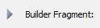

<!-- p.234 -->

|  | Animate |  | Display all models within the molecule group in succession. |
| --- | --- | --- | --- |
|  | Stop Animation |  | Stop an animated display. |
|  | Single View |  | Display only one model within the molecule group. |
|  | Multi View |  | Display all models within the molecule group. |
| Icons found in the fvie Fragment Palette windows: |  |  |  |
|  | Tacked |  | Keep this palette open until explicitly closed (amodal operation). |
|  | Untacked |  | Close palette when a difefrent one is opened (modal operation). |
| Icons related to various coordinate editing dialogs: |  |  |  |
|  | Z-matrix Coordinates |  | Display Z-matrix coordinates. |
|  | Cartesian Coordinates |  | Display Cartesian coordinates. |
|  | Fractional Coordinates |  | Display fractional coordinates for periodic systems. |
|  | ONIOM Layers |  | Display ONIOM layer assignments and related data. |
|  | MM Parameters |  | Display Molecular Mechanics atoms types and other data. |
|  | PDB Info |  | Display residue and chain assignments from a PDB file. |
|  | Isotope Masses |  | Display column(s) containing isotopes mass(es). |
|  | Optimize Coordinate |  | Display columns specifying atoms freezing or optimization activation. |
|  | Create a New Coordinate |  | Add a new redundant coordinate in the Redundant Coordinate Editor. |
|  | Sort Ascending |  | Sort rows in ascending order in the Atom List Editor. |
|  | Sort Descending |  | Sort rows in descending order in the Atom List Editor. |
| General icons used many places within GaussView: |  |  |  |
|  | Move Up |  | Move the selected item up in a list. |
|  | Move Down |  | Move the selected item down in a list. |
|  | Add Selected |  | Add the selected item to a list. |
|  | Add All |  | Add all items to a list. |

<!-- p.235 -->

|  | Remove Selected |  | Remove the selected item from a list. |
| --- | --- | --- | --- |
|  | Remove all |  | Remove all items from a list. |

<!-- p.236 -->
# Toolbar Configuration

The Customize Toolbars panel, accessed by right clicking on the toolbar and selecting Configure… allows you to choose which icons appear on the quick-access toolbar.

The Toolbar Configuration Panel

The Actions field allows you to select features from several lists corresponding to the eight default toolbar sections: Builder, Calculate Gaussian, Calculation Options, Edit, File, Tools, View, and Windows. These sections appear in the Toolbars field.

- 

Builder: Contains the functions associated with constructing molecules.

- 

Calculate Gaussian: Contains the functions associated with performing a Guassian calculation.

- 

Calculation Options: Contains the functions used to track Gaussian calculations.

- 

Edit: Contains standard editing operations such as Undo and Redo as well as model-cleaning functions.

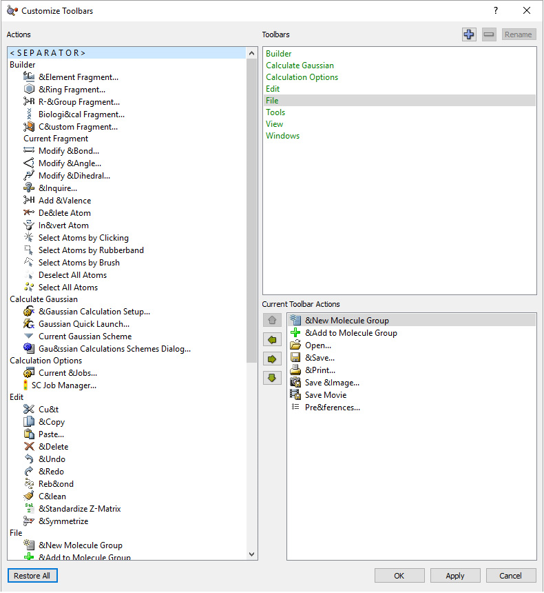

<!-- p.237 -->
- 

File: Contains functions to save and load files as well as generate image and movie files.

- 

Tools: Contains functions to view and edit atom properties like position and bonding as well as view molecular orbital information.

- 

View: Contains functions to control the display of currently in-view atoms and molecular groups as well as switch which windows are active.

- 

Windows: Contains functions that control how windows are displayed and how to switch between active ones.

The Toolbars field contains the following selections:

- 

Builder: Clicking this allows you to move functions into and out of the Builder toolbar section via the Current Toolbar Actions field.

- 

Calculate Gaussian: Clicking this allows you to move functions into and out of the Calculate Gaussian toolbar section via the Current Toolbar Actions field.

- 

Calculation Options: Clicking this allows you to move functions into and out of the Calculation Options toolbar section via the Current Toolbar Actions field.

- 

Edit: Clicking this allows you to move functions into and out of the Edit toolbar section via the Current Toolbar Actions field.

- 

File: Clicking this allows you to move functions into and out of the File toolbar section via the Current Toolbar Actions field.

- 

Tools: Clicking this allows you to move functions into and out of the Tools toolbar section via the Current Toolbar Actions field.

- 

View: Clicking this allows you to move functions into and out of the View toolbar section via the Current Toolbar Actions field.

- 

Windows: Clicking this allows you to move functions into and out of the Windows toolbar section via the Current Toolbar Actions field.

The left and right arrow buttons located between the Actions and the Current Toolbar Actions fields allow you to remove or add (respectively) an action to the toolbar, and the up and down arrows allow you to control the currently selected action’s placement.

<!-- p.238 -->
# Using a Custom Fragment Library

The Custom Fragment button can be used to access and modify a local fragment library. Clicking on it when it is inactive activates the last-used custom fragment library; the first fragment within it becomes the current fragment, appearing in the area below the toolbars and in the popup menu to the right of the various building buttons. If no custom fragment library exists, this area will be blank.

Clicking on the Custom Fragment button when it is selected opens the Custom Fragments palette, bringing up the lower dialog below:

The Custom Fragments Window

This palette allows you to select from the available fragments in the open library. The selected fragment will become the current fragment once the dialog is exited.

The Library field at the top of the palette indicates the fragment library that is in use. Previously opened libraries are also present in the list. Additional library locations may be opened by clicking on the button labeled “...”.

Fragment libraries are simply folders on disk, and individual fragments within a library are stored as files within that folder. Thus, creating a new fragment library consists of creating a folder at the desired location and then selecting it in this palette.

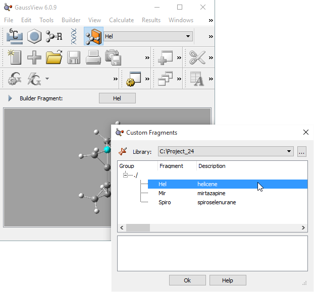

<!-- p.239 -->
The library will obviously be initially empty. Any non-fragment files within the folder are ignored—although, best practice is to limit fragment library folder use solely to fragment files.

Fragments within a fragment library are organized into a series of user-defined groups. If this feature has not been used, then all fragments will be within the “root” group: i.e., ./ as in the figure.

The Custom Fragment context menu, reached by right-clicking within the fragment list area in the center of the palette, is used to manage and modify fragment libraries. It has the following selections:

- 

New Group: Create a new group within the current library. The group is initially given a generic name that you can modify. Control-G is equivalent to this menu selection (Command-N under Mac OS X).

- 

New Fragment From Active Molecule: Add the current molecule within the currently selected group within the current fragment library. A generic label and description will be set, which you should edit as appropriate. In this context, Control-N/Command-N has the same function as this menu item.

- 

Edit Cell: Edit the text within the current item (group name, fragment name, fragment description). Note that the top-level group name cannot be modified.

- 

Delete: Delete the currently selected fragment or fragment group. Note that the top-level fragment group cannot be deleted. The Delete key is equivalent to this menu item.

- 

Font: Change the font style, font style, and font size.

- 

Text Color: Change the color of the text.

- 

Background Color: Change the color of the background.

- 

Show Grid: Displays the grid.

Note that fragments within a library can be updated only by removing and then re-adding them (there is no way to modify an existing fragment).

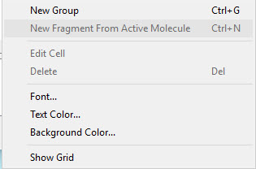

<!-- p.240 -->
# Gaussian Calculation Setup Keywords & Options

Items in Blue are accessed through dropdown menus. Items in Green are checkboxes that can be toggled. The keywords are the items that appear in the Gaussian input file.

| Job Type Tab |  |
| --- | --- |
| Job Type => Optimization | opt |
| Use RFO step | opt=rfo |
| Use Quadratic Macrostep | opt=quadmac |
| Use tight convergence | opt=tight |
| Optimize to a => TS (Berny) | opt=ts |
| Optimize to a => TS (QST2) | opt=qst2 |
| Optimize to a => TS (QST3) | opt=qst3 |
| Force Constants => Calculate at First Point | opt=calcfc |
| Force Constants => Calculate at all Points | opt=calcall |
| Force Constants => Read Internal | opt=readfc |
| Force Constants => Read Cartesian | opt=rcfc |
| Job Type => Frequency | freq |
| Compute VCD | freq=vcd |
| Save Normal Modes Options => Yes | freq=savenormalmodes |
| Save Normal Modes Options => No | freq=nosavenormalmodes |
| Skip diag. of full matrix | freq=nodiagfull |
| Select Normal Modes | freq=selectnormalmodes |
| Anharmonic Corrections | freq=anharmonic |
| Specify Anharmonic Modes | freq=selectanharmonicmodes |
| Compute projected frequencies | freq=projected |
| Compute Raman => No | freq=noraman |
| Compute Raman => Yes | freq=raman |
| Compute ROA => Yes | freq=roa |
| Read Incident Light Freqs => Yes | freq cphf=rdfreq |
| Read Incident Light Freqs => No | freq cphf=noread |
| Job Type => Opt+Freq | opt freq |
| Use RFO step | opt=rfo freq |
| Use tight convergence criteria | opt=tight freq |
| Compute VCD | opt freq=vcd |
| Save Normal Modes Options => Yes | opt freq=savenormalmodes |
| Save Normal Modes Options => No | opt freq=nosavenormalmodes |
| Skip diag. of full matrix | opt freq=nodiagfull |
| Select Normal Modes | opt freq=selectnormalmodes |
| Anharmonic Connections | opt freq=anharmonic |
| Specify Anharmonic Modes | opt freq=selectanharmonicmodes |
| Optimize to a => TS (Berny) | opt=ts freq |
| Force Constants => Calculate at First Point | opt=calcfc freq |
| Force Constants => Calculate at all Points | opt=calcall freq |
| Force Constants => Read Internal | opt=readfc freq |

<!-- p.241 -->

| Job Type Tab |  |  |  |
| --- | --- | --- | --- |
| Force Constants => Read Cartesian |  | opt=rcfc freq |  |
| Compute Raman => No |  | opt freq=noraman |  |
| Compute Raman => Yes |  | opt freq=raman |  |
| Compute ROA => Yes |  | opt freq=roa |  |
| Read Incident Light Freqs => Yes |  | opt freq cphf=rdfreq |  |
| Read Incident Light Freqs => No |  | opt freq cphf=noread |  |
| Job Type => IRC |  | irc=calcfc |  |
| Do IRCMax calculation |  | ircmax=calcfc |  |
| Compute more points, N= |  | irc=maxpoints=n |  |
| Recalculate Force Constants Every nth Point, n = |  | irc=recalc=n |  |
| Follow IRC => Forward only |  | irc=forward |  |
| Follow IRC => Reverse only |  | irc=reverse |  |
| Force Constants => Calculate Always |  | irc=calcall |  |
| Force Constants => Read from .CHK |  | irc=rcfc |  |
| Recorrect Steps => Never |  | irc=recorrect=never |  |
| Recorrect Steps => Yes |  | irc=recorrect=yes |  |
| Recorrect Steps => Always |  | irc=recorrect=always |  |
| Recorrect Steps => Test |  | irc=recorrect=test |  |
| Job Type => Scan => Rigid |  | scan |  |
| Job type => Relaxed (Z-Matrix) |  | opt=z-matrix |  |
| Job type => Scan, Relaxed (Redundant Coord) |  | opt=modredundant |  |
| Job type => Stability |  | stable |  |
| Reoptimize the wavefunction |  | stable=opt |  |
| Job Type => NMR |  | nmr=giao |  |
| CSGT Method |  | nmr=csgt |  |
| IGAIM Method |  | nmr=igaim |  |
| CSGT, IGAIM and Single Origin |  | nmr=all |  |
| Compute spin-spin couplings => Yes |  | nmr=spinspin |  |
| Compute spin-spin couplings => Yes, mixed |  | nmr=mixed |  |
| Method Tab |  |  |  |
| Method => Mechanics => UFF | uff |  |  |
| Method => Mechanics => Dreiding | dreiding |  |  |
| Method => Mechanics => Amber | amber |  |  |
| QEq Charges => All Atoms | method=qeq |  |  |
| QEq Charges => Untyped Atoms | method=untyped |  |  |
| QEq Charges => Uncharged Atoms | method=uncharged |  |  |
| Method => Restricted | R prefix |  |  |
| Method => Unrestricted | U prefix |  |  |
| Method => Restricted-Open | RO prefix |  |  |
| Method => Semi-empirical => PM6 | pm6 |  |  |
| Method => Semi-empirical => PDDG | pddg |  |  |
| Method => Semi-empirical => AM1 | am1 |  |  |
| Method => Semi-empirical => PM3 | pm3 |  |  |
| Method => Semi-empirical => PM3MM | pm3mm |  |  |
| Method => Semi-empirical => INDO | indo |  |  |
| Method => Semi-empirical => CNDO | cndo |  |  |

<!-- p.242 -->

| Method Tab |  |  |  |
| --- | --- | --- | --- |
| Use sparse matrices |  |  | sparse |
| Method => Hartree-Fock |  |  | hf |
| Method => DFT => LSDA |  |  | lsda |
| Method => DFT => BVP86 |  |  | bvp86 |
| Method => DFT => B3LYP |  |  | b3lyp |
| Method => DFT => CAM-B3LYP |  |  | cam-b3lyp |
| Method => DFT => B3PW91 |  |  | b3pw91 |
| Method => DFT => MPW1PW91 |  |  | mpw1pw91 |
| Method => DFT => PBEPBE |  |  | pbepbe |
| Method => DFT => HSEH1PBE |  |  | hseh1pbe |
| Method => DFT => HCTH |  |  | hcth |
| Method => DFT => TPSSTPSS |  |  | tpsstpss |
| Method => DFT => WB97XD |  |  | wb97xd |
| Method => DFT => APFD |  |  | apfd |
| Method => MP2 |  |  | mp2 |
| Method => MP4 |  |  | mp4(sdtq) |
| Include all electrons |  |  | method=full |
| Method => CCSD |  |  | ccsd |
| Read Amplitudes |  |  | ccsd=readamplitudes |
| Save Amplitudes |  |  | ccsd=saveamplitudes |
| Method => BD |  |  | bd |
| Method => CASSCF |  |  | casscf |
| RFO Quadratic Step |  |  | casscf=rfo |
| Method => Compound => CBS-4M |  |  | cbs-4m |
| Method => Compound => CBS-Q |  |  | cbs-q |
| Method => Compound => CBS-QB3 |  |  | cbs-qb3 |
| Method => Compound => CBS-APNO |  |  | cbs-apno |
| Method => Compound => W1BD |  |  | w1bd |
| Method => Compound => W1U |  |  | w1u |
| Method => Compound => W1RO |  |  | w1ro |
| Method => Compound => G1 |  |  | g1 |
| Method => Compound => G2 |  |  | g2 |
| Method => Compound => G1 |  |  | g1 |
| Method => Compound => G3S |  |  | g3s |
| Method => Compound => G4 |  |  | g4 |
| Multilayer ONIOM Model |  |  | oniom |
| Empirical Dispersion => If defined |  |  | empiricaldispersion=if defined |
| Empirical Dispersion => scheme |  |  | empiricaldispersion=scheme |
| Empirical Dispersion => none |  |  | noempiricaldispersion |
| Link0 Tab |  |  |  |
| Memory Limit | %mem |  |  |
| Shared Processors | %nprocshared |  |  |
| Chkpoint File | %chk |  |  |
| OldChk File | %oldchk |  |  |
| Read-write File | %rwf |  |  |
| Linda Workers | %lindaworkers |  |  |

<!-- p.243 -->

| Link0 Tab |  |  |  |  |
| --- | --- | --- | --- | --- |
| Kill Job | %kjob |  |  |  |
| General Tab |  |  |  |  |
| Use Quadratically Convergent SCF |  | scf=qc |  |  |
| Ignore Symmetry |  | nosymm |  |  |
| Use Modified Redundant Coordinates |  | geom=modredundant |  |  |
| Use Counterpose |  | counterpoise= |  |  |
| Write Connectivity |  | geom=connectivity |  |  |
| Write Gaussian Fragment Data |  | fragment in molecule specifciation |  |  |
| Additional Print |  | #p |  |  |
| Write PDB Data |  | included in molecule specifciation |  |  |
| Compute Polarities |  | polar |  |  |
| Compute Optical Rotations |  | optrot |  |  |
| Read Incident Light Freqs => Yes |  | cphf=rdfreq |  |  |
| Read Incident Light Freqs => No |  | cphf=noread |  |  |
| Use MaxDisk= |  | maxdisk |  |  |
| Geometry => Molecule Specification |  | geom=check |  |  |
| Geometry => Title, ..., Molecule Specification |  | geom=allcheck |  |  |
| Force Constants => Read Internal |  | opt=readfc |  |  |
| Force Constants => Read Cartesian |  | opt=rcfc |  |  |
| MO Guess |  | guess=read |  |  |
| Guess Tab |  |  |  |  |
| Guess Method => Core Hamiltonian |  |  | guess=core |  |
| Guess Method => Extended Huckel |  |  | guess=huckel |  |
| Guess Method => Read checkpoint File |  |  | guess=read |  |
| Guess Method => Read checkpoint if possible; otherwise generate |  |  | guess=tcheck |  |
| Guess Method => Read input checkpoint file |  |  | guess=input |  |
| Mix HOMO and LUMO orbitals |  |  | guess=mix |  |
| Always generate guess in optimizations |  |  | guess=always |  |
| Only do guess (no SCF) |  |  | guess=only |  |
| Localize Orbitals |  |  | guess=local |  |
| Save Orbitals to checkpoint file |  |  | guess=save |  |
| Permuted orbitals from MOs Dialog |  |  | guess=alter |  |
| Use fragments (atom groups) for generating guess |  |  | guess=fragment |  |
| Population Tab |  |  |  |  |
| Level of Output => Full |  | pop=full |  |  |
| Level of Output => Regular |  | pop=regular |  |  |
| Level of Output => Minimal |  | pop=minimal |  |  |
| Level of Output => None |  | pop=none |  |  |
| At every geometry |  | pop=always |  |  |
| Merz-Kollman (esp) Charges |  | pop=mk |  |  |
| Hirshfeld (CM5) Charges |  | pop=hirshfeld |  |  |
| Natural Transition Orbitals |  | pop=nto |  |  |
| Biorthogonalize orbitals |  | pop=biorth |  |  |
| Minimum basis set (MBS) Mulliken Charges |  | pop=mbs |  |  |
| Perform NBO calc => Full NBO |  | pop=nbo |  |  |

<!-- p.244 -->
# Frequently Asked Questions

What is the GaussView 6 Citation?

Normal name order:

GaussView, Version 6, Roy Dennington, Todd Keith, and John Millam, Semichem Inc., Shawnee Mission, KS, 2019.

Last name first:

| Population Tab |  |  |  |
| --- | --- | --- | --- |
| Perform NBO calc => NPA only |  |  | pop=npa |
| Perform NBO calc => Full NBO (use NBO 6) |  |  | pop=nbo6 |
| Perform NBO calc => NPA only (use NBO 6) |  |  | pop=npa6 |
| Perform NBO calc => Full NBO (use NBO 7) |  |  | pop=nbo7 |
| Perform NBO calc => NPA only (use NBO 7) |  |  | pop=npa7 |
| Save orbitals to chk file => Save NLMOs |  |  | pop=savenlmos |
| Save orbitals to chk file => Save NBOs |  |  | pop=savenbos |
| Save orbitals to chk file => Save Mixture of NLMOs and NBOs |  |  | pop=savemixed |
| Save orbitals to chk file => Save NTOs |  |  | pop=savento |
| Save orbitals to chk file => Save Biorthogonalized |  |  | pop=savebiorth |
| Save changes for later MM => Save Mulliken |  |  | pop=savemulliken |
| Save changes for later MM => Save ESP |  |  | pop=saveesp |
| Save changes for later MM => Save NPA |  |  | pop=savenpa |
| Save changes for later MM => Save CM5 |  |  | pop=savecm5 |
| Select density for analysis => Current |  |  | density=current |
| Select density for analysis => SCF |  |  | density=scf |
| Select density for analysis => MP2 |  |  | density=mp2 |
| Select density for analysis => Transition |  |  | density=transition |
| Select density for analysis => All Transitions |  |  | density=alltransition |
| Select density for analysis => CI |  |  | density=ci |
| Select density for analysis => QCI/CC |  |  | density=qci |
| Read density from checkpoint file |  |  | density=check |
| PBC Tab |  |  |  |
| k-Space Integration Method => Gamma Point Only (k = 0) |  | pbc=gammaonly |  |
| k-Space Integration Method => Specify Number of Points |  | pbc=nkpoints |  |
| Solvation Tab |  |  |  |
| Model => IEFPCM | scrf=iefpcm |  |  |
| Model => SMD | scrf=smd |  |  |
| Model => I-PCM | scrf=ipcm |  |  |
| Model => SCI-PCM | scrf=scipcm |  |  |
| Model => CPCM | scrf=cpcm |  |  |
| Model => Read checkpoint file | scrf=check |  |  |
| Solvent | solvent |  |  |
| Read additional input | scrf=read |  |  |

<!-- p.245 -->
GaussView, Version 6, Dennington, Roy; Keith, Todd; Millam, John. Semichem Inc., Shawnee Mission, KS, 2019.

BIBTEX Starting Entry

@misc{gv6

author="Roy Dennington and Todd Keith and John Millam", title="GaussView {V}ersion {6}", note="Semichem Inc. Shawnee Mission KS 2019"

You can cite the specific minor version that you use: e.g., 6.1.1.

How do I tell GaussView where to find Gaussian?

On Linux, UNIX and Mac OS X systems, you need to add the following files to your .bash_profile initialization file (regardless of your default shell):

export g16root=/path export GAUSS_SCRDIR=/path . $g16root/g16/bsd/g16.profile

GaussView will use these entries to located the Gaussian executables.

How do I specify different isotopes for frequency analysis?

You must define an additional isotopologue. Information here.

How do I displace the geometry along a normal mode? Look here.

How do I view the intermediate optimization steps?

Be sure that Read Intermediate Geometries (Optimizations) is checked in the Open Files dialog. Clicking the Retain Settings button will keep this setting across uses of the dialog and GaussView sessions.

How do I view the intermediate IRC or scan steps?

Be sure that Read Intermediate Geometries (Scans/IRC) is checked in the Options for Opening Files panel. Clicking on the Options button in the Basic Open Files dialog leads to this dialog. The same panel is present in the Advanced Open Files dialog, named File Open Options.

Clicking the Retain Settings button will keep this setting across uses of the dialog and GaussView sessions.

How do I view a 3D scan plot?

Three dimensional scan plots are produced automatically for scans over exactly two variables.

How do I drag and drop files?

On the Windows and MAC OS X platforms, files can be added to the current molecule group by dragging them from an Explorer window or other source and dropping them onto a View window. Dragging and dropping with the left mouse button will load the contents of each file and add it to the molecule group.

<!-- p.246 -->
# Charge Distribution Preferences

Defaults for the items in the Charge Distribution dialog can be set with the Charge Distribution Preferences panel (see the figure below).

Charge Distribution Preferences

This preference panel specifies how atomic charge results are visualized, using these options:

- 

Show Numbers: Place atomic charge values next to each atom.

- 

Color Atoms by Charge: Recolor each atom by atomic charge according to the specifications of the Color Range fields and the Symmetric Color Range checkbox.

- 

Symmetric Color Range: Forces the positive and negative limits of the charge range to have the same absolute magnitude (regardless of the actual range of the atomic charge values).

- 

Fixed Color Range: Force the charge display to use the default fixed range. This range is set to -1.0 to 1.0 by default, and it can be modified in the Charge Distribution Preferences.

- 

The Dipole Moment area of the dialog controls whether a vector representing the dipole moment is included in the display. When the vector is displayed, you can specify the scaling factor for the vector’s length (the default is about 1.0) using the slider control.

- 

Dipole Vector Color: Set the color for the vector.

- 

Dipole Vector Radius: Sets the thickness of the vector.

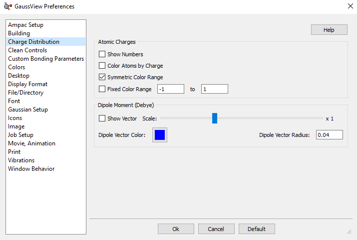

<!-- p.247 -->
# Clean Controls Preferences

The GaussView clean function may be customized via the Clean Controls Preferences panel (illustrated below).

Customizing the Clean Function You can use this preference panel to modify and customize how the GaussView Clean function operates.

The default clean settings attempt to achieve a balance that produces expected “normal” results. Altering the settings in Clean Controls Preferences can cause unexpected and undesirable results, so please read the following sections carefully before making any changes.

The following controls are available in the dialog. The fields in the Rel. Weights column are:

- 

Bond: The targeted bond lengths are assigned based on the van der Waals radii of the two atoms forming the bond, with slight adjustment for bond type. They are not intended to be chemically accurate, but they should give reasonable input geometries for Gaussian.

- 

NonBond: Repulsive term between all atoms that are not directly bonded. The purpose of this component is to keep atom centers apart so one atom is never masking another atom. However, it will not adjust biphenyl.

- 

Hard Angle: Hard angles are calculated for atom centers that contain 2–4 bonds. They are weighted more heavily since the targeted angles are known. These terms are vital for maintaining atom center integrity.

- 

Soft Angle: Soft angles are calculated for atom centers that contain 5 or more bonds. The targeted angles are not well known, but desired results can be achieved with practice. To produce a trigonal bipyramidal structure, adjust the axial bond angle to 180 degrees. Make sure the linear angle bias option is on. Most of the time, the clean procedure will produce the desired structure. Practice with coordinate patterns to get a feel for cleaning more complex coordinations.

- 

1-Ctr Dihed: Calculated from the Newman projections down each bond and limited to atom centers with fewer than 5 bonds. This term helps maintain atom center integrity when the 2-center dihedrals are causing distortions.

- 

2-Ctr Dihed: This is the only term that affects tertiary structure. The targeted dihedrals will be eclipsed or staggered based on the bond types. If each atom center contains multiple bonds, the targeted dihedral will be eclipsed.

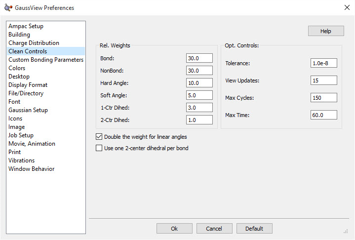

<!-- p.248 -->
The checkboxes at the bottom of the window have the following effects:

- 

Double the weight for linear angles: This term assists cleaning with soft angles where the angles at an atom center are not well known.

- 

Use one 2-center dihedral per bond: Normally, this option should remain unchecked. It is available to provide better performance on slower systems.

The fields in the Opt. Controls column are:

- 

Tolerance: Lower values give more accurate structures but can take significantly longer to clean. The range should be between 1.0E-5 and 1.0E-12.

- 

View Updates: Controls how often the views of the molecule being cleaned are updated. A value of 1 gives a refresh with every clean cycle. A value of 10 gives a refresh every 10 clean cycles. A value of 0 disables view updates until clean is complete. Depending on your system, this parameter can have a significant effect on cleaning time.

- 

Max Cycles: Maximum number of steps during a clean optimization. A good value is 150. Larger structures may require a larger value.

- 

Max Time: Maximum time (seconds) allowed for a clean operation to complete.

It is important to remember that the various components of the clean force field are relative. Changing one weight will affect the behavior of the other weights. For example, an excessive non-bond weight will produce longer bonds. Similarly, an excessive hard angle weight could affect the 2-center dihedrals.

You can disable any set of terms by assigning a weight of 0.0. For example, disabling the 1-center dihedral term can result in faster cleaning, but the resulting tertiary structure may not be as nice. Do not disable the bond weight or hard angle terms. The former should be kept high relative to the other terms.

# Clean Performance Tips

If the clean function is too slow on your system, try these settings:

- 

NonBond: 0

- 

1-Ctr Dihed: 0

- 

Use one 2-center dihedral per bond: checked

- 

View Updates: 0

Poor performance of the clean function can also be a symptom of a memory shortage on the system.

<!-- p.249 -->
# Customizing Colors

The Colors Preferences allow you to customize the coloring of View window backgrounds, atoms (elements), bonds, surfaces, and vibration vector displays. The dialog is illustrated below.

Customizing GaussView Color Options

All of the color preferences dialogs use similar controls. They all contain a Scheme popup that specifies how many colors comprise the display gradients. However, with the exception of surfaces, this item is limited to a single color.

In general, if the Use RGB Selector checkbox is selected (which is the default), then you can use the sliders below it to specify the RGB values for the desired color. If it is unchecked, then the system color selection utility will be invoked.

The buttons in the Colors Preferences dialog control the coloring of the following items:

- 

Background Color: Background color in view windows. Click on the color chip to modify it.

- 

Element Colors: Element-based atom coloring. This button brings up a periodic table indicating the default color for each element (see below). Click on any element to change its default color. Doing so results in the dialog on the right:

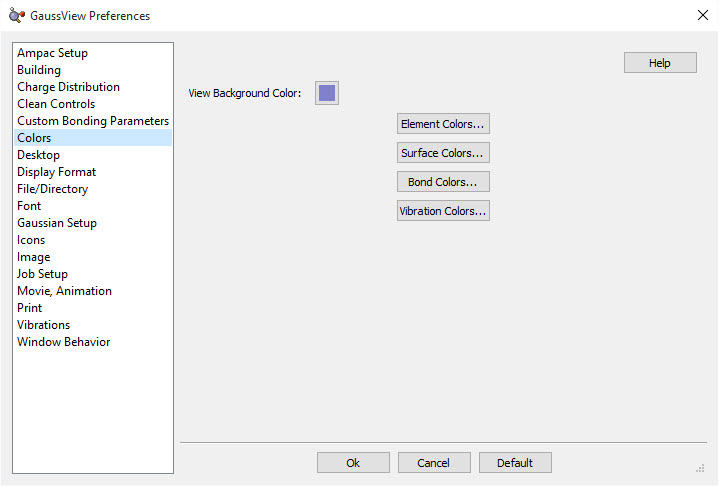

<!-- p.250 -->
Modifying Default Element Colors Here we are modifying the color of Neon atoms.

- 

Surface Colors: Specifies colors for surfaces (discussed below).

- 

Bond Colors: Sets coloring for bonds in each of the various display types. The dialog is similar to the one below, and it displays the selected color on a sphere. Don’t be confused by this; the selected colors will be used to color the bonds, not the atoms.

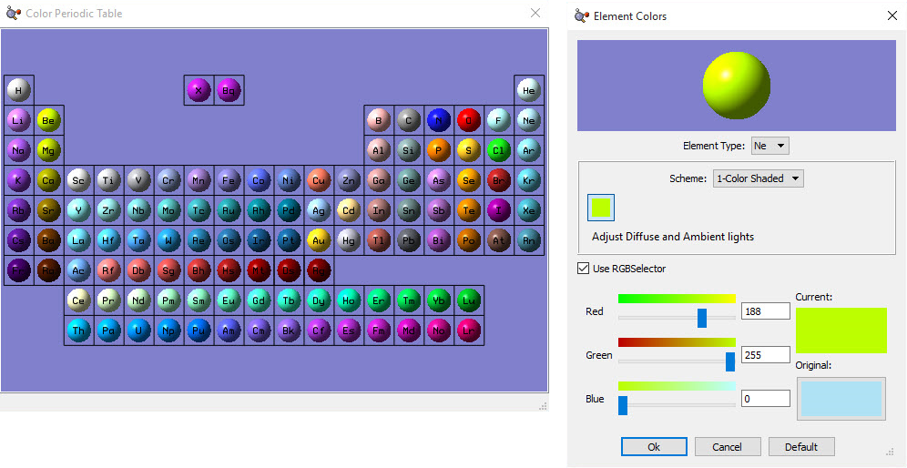

<!-- p.251 -->
Specifying Bond Coloring In this example, we are changing the color of bonds in wireframe display mode from grey to black.

- 

Vibration Colors: Sets the coloring of the dipole derivative and displacement vectors in vibrations displays. The color selected will be used to color the displayed vectors (not the atoms).

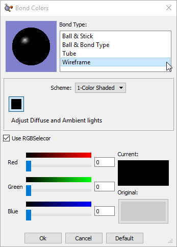

<!-- p.252 -->
Specifying Vector Colors in Vibrational Modes Displays

# Specifying Colors for Surfaces

The dialog below is used to specify coloring for surfaces. For surfaces types having positive and negative lobes (phases), two colors are specified (as in the figure, which specifies colors for MO surfaces).

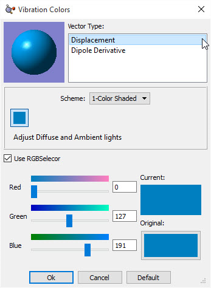

<!-- p.253 -->
Surface Coloring Preferences

The fields at the top of this example dialog allow you to select the surface type and display style. The example surface in the upper area of the dialog approximates how surfaces will look with the current settings.

The most important fields are located in the center of the dialog. The Scheme popup allows you to select the type of coloring that is applied to the object. The 1-Color Shaded, 2-Color Shaded, 3-Color Shaded, and 4-Color Shaded items select gradient-filled coloring, consisting of shades of the indicated color (1-Color Shaded) or blends between the specified colors (2 or more colors). Keep in mind that less is more with gradients when good taste prevails. The 1-Color Flat scheme colors the object using the specified color in a solid mode, without creating any illusion of three-dimensional shape.

Clicking on any of the color chips in this area allows you to modify that color. Note that two-lobed surfaces will have two sets of color chip(s), placed on the left and right sides of the dialog:

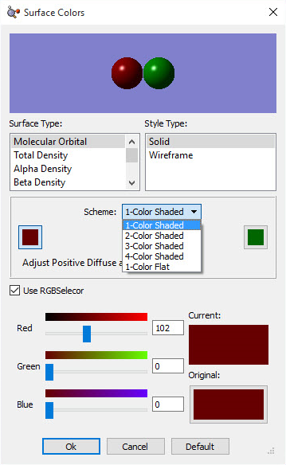

<!-- p.254 -->
# Custom Bonding Parameters

The Custom Bonding Parameters are used in those circumstantces when GaussView determines bonding based on geometry: distances between atoms. You can specify them for the current molecule via the Tools=>Custom Bonding Parameters menu path or by default in the Custom Bonding Parameters Preferences.

Note that this is an advanced GaussView feature intended for experienced users. Caution is in order when using it.

Defining Custom Bonding Parameters

GaussView determines bonding based on geometry in the following cases:

- 

When a molecule is loaded and there is no bonding connectivity data provided: e.g., a Gaussian input file without Geom=Connectivity, a log file (since these files don’t have bonding connectivity data in general), a PDB file for which Standard Bonding for Residues is not requested or for included HETATMS when CONECT records are either not present or are requested to be ignored, and so on.

- 

When you select Edit=>Rebond.

- 

When you perform point group or space group based symmetrization with the Rebond after Symmetrization option checked.

- 

When you click Combine Cells or select Contents=>Bonds=>Rebond in the PBC dialog.

- 

When you click Apply or OK in the Custom Bonding Parameters dialog. In this case, GaussView will recalculate bonding for any atom pairs that have custom bonding parameters. Important Tip: If any atoms are currently selected, consideration for rebonding will occur only for them. Otherwise, consideration will be given to all atoms.

The fields in the dialog have the following meanings:

- 

Active?: Whether the parameter is active (applied).

- 

Elem. 1 and Elem. 2: Atoms involved in the bond.

- 

Triple, Double, Resonant, Single, Weak: Maximum bond length for the specified bond type. Weak bonds are represented by a single dashed line. They can be visually useful for representing things like hydrogen bonds, and its

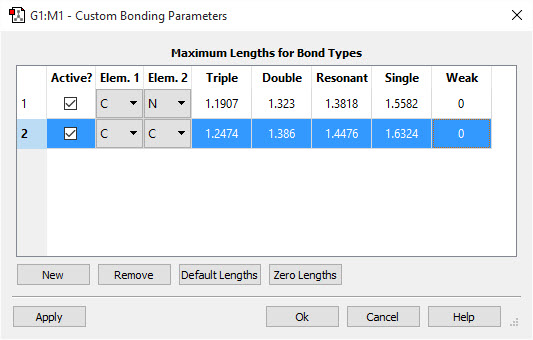

<!-- p.255 -->
value is typically left at 0. In this case, atoms separated by distances greater than the single bond value are treated as unbonded.

The custom bonding parameters don’t affect molecule building; builder fragments come with bonding provided. Since bonding can affect MM atom type determinations, adding hydrogens, chirality determinations, and the like, changing the bonding parameters can have real consequences when the bonding ends up being different than it would by default. These parameters are useful when GaussView doesn’t assign some bonds in the expected way because of an unusual or otherwise poor geometry (e.g., a PDB resulting created from a low resolution X-Ray diffraction experiment).

<!-- p.256 -->
# Display Format Preferences

This item is broken down into five subcategories: General, Molecule, Surface, Text, and Surface. Use the links to go to the discussion of each item elsewhere in this document.

# Desktop Preferences: Specifying File Associations Under Windows

On Windows systems, the Desktop section of the Preferences dialog allows you to set file associations: file extensions that will be associated with GaussView and for which the application will be opened automatically when such a file is opened. It is illustrated below. Note that the file extensions are divided among two panels.

Specifying Windows File Associations

To create a file association between GaussView and the listed Gaussian file type, place a check mark in the associated box. Removing the check mark similarly removes the file association. The Scope drop-down specifies whether the file association is to affect only the current user or all users on the system.

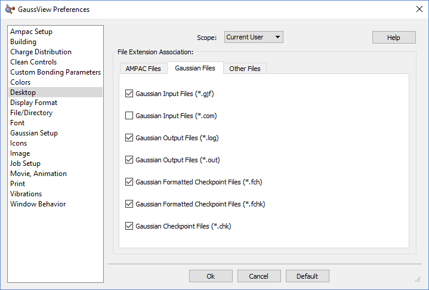

<!-- p.257 -->
# Specifying Default Directory Locations

The File/Directory Preferences are illustrated below. They allow you to specify the default locations for various kinds of GaussView-related files.

Specifying Default Directory Locations

The Starting Directory popup allows you to select the following choices:

- 

Use previous work directory: Keep track of the last directory visited, and use that directory the next time.

- 

Use launch directory: Always use the directory from which GaussView launched as the default directory.

- 

Specify: Always use the specified directory. You can use the ... button to navigate to the desired directory, or type the full path into the text box.

The Scratch Directory popup, which specifies the location for temporary scratch files that GaussView uses in some cases, has the following choices:

- 

Use GAUSS_SCRDIR: Use the Gaussian scratch directory for GaussView as well (as defined by the environment variable of this name).

- 

Use launch directory: Always use the directory from which GaussView launched as the Gaussian scratch directory.

- 

Specify: Always use the specified directory as the Gaussian scratch directory. You can use the ... button to navigate to the desired directory, or type the full path into the text box.

The Maximum Recent Files field specifies the maximum length of the recent files list on the File menu.

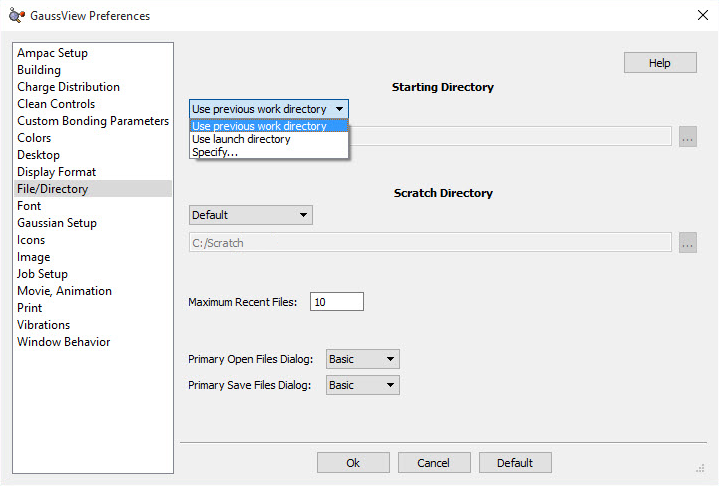

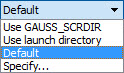

<!-- p.258 -->
The Primary Open Files Dialog and Primary Save Files Dialog popups allow you to select which version of the file opening and saving dialogs are used by default (respectively). The defaults are the simpler forms, corresponding to the Basic menu item. The Advanced menu selections correspond to the more complex, feature-rich versions.

<!-- p.259 -->
# GaussView Font Preferences

GaussView Preferences Font Panel The font options available for GaussView.

This panel displays the currently used application font. Clicking on the Choose button in this panel opens up the operating system’s font-selection dialog. Shown here is the dialog from a Windows Operating System.

Note that this setting does not affect the font used for display labels, as specified in the Display Format dialog/preference.

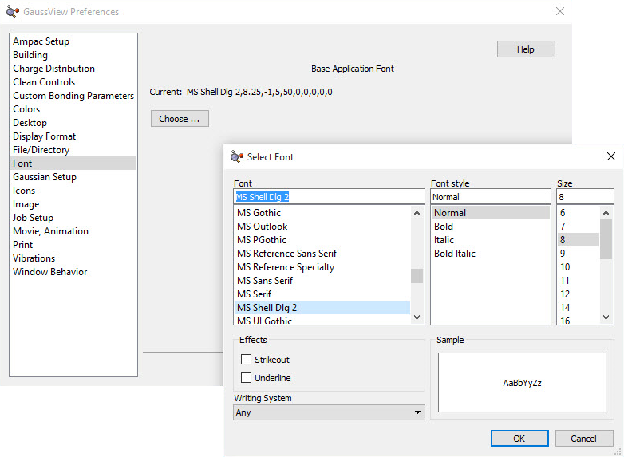

<!-- p.260 -->
# Gaussian Setup Preferences

Clicking on the Calculation button will open a version of the Gaussian Calculation Setup dialog that can be used to specify the default settings for Gaussian calculations. These settings also comprise the Default calculation scheme.

When you have finished setting up the default job, click the Retain button in the Gaussian Calculation Setup dialog to return to the preferences.

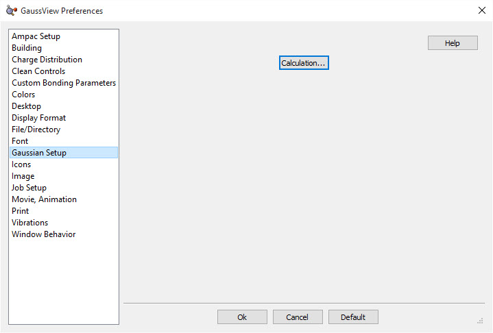

<!-- p.261 -->
# Modifying Icon Sizes

The Icons Preferences allow you to specify the icon sizes for various GaussView windows and toolbars. It is illustrated below. The controls in the dialog control the icons for menus, toolbars, and the standalone Builder palette. The defaults are small icons for the first two items and large icons for the third one.

Customizing Icon Sizes

You can select larger icons for various GaussView windows with this preference.

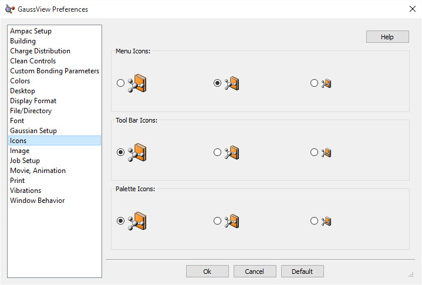

<!-- p.262 -->
# Image Preferences

Both image capture and image saving are subject to the settings in the Image Preferences, shown below. Settings in the Save dialog override those in the preferences.

Image Preferences

The fields in this panel have the following meanings:

- 

Object Quality: Specifies the image quality. Moving the slider toward the Realistic end of the scale increases the file size and the time required to generate the image file.

- 

Enlarge Width and Height by: Set the default image scaling factor (as above).

- 

Background Color: Background color for the image.

- 

Generic Pixel Format: Use the system software renderer. This option should be checked only after rendering problems/failures have been encountered during image capture or printing.

- 

Gray Scale: Convert the image to gray scale (i.e., black and white) before capturing. The default is to save a color image.

- 

Render Method: Specify the rendering method. The choices available in this menu are shown above. This setting should seldom be changed.

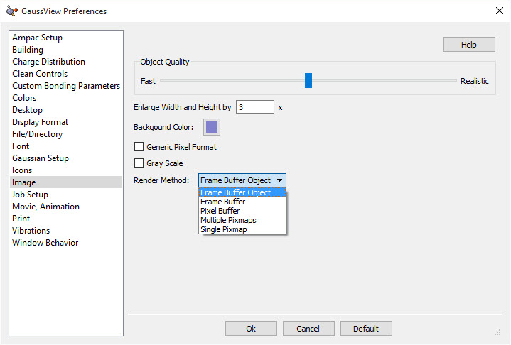

<!-- p.263 -->
# Specifying How the Gaussian Program is Executed

The Job Setup Preferences dialog allows you to examine and customize how Gaussian and its utilities are launched from within GaussView. It is illustrated below. The Application field at the top of the panel specifies the program or utility whose execution method is currently displayed. Below this popup, there are launch choices, and the command line associated with the selected launch method is displayed in the Command Line area. The values of the GaussView internal variables used in the command line are displayed below the field for your convenience.

Job Setup Preferences This example elects to run Gaussian directly on the local computer via the command line. The grey

box shows the command used to do so (which can be edited). The variables used in the command

line—in uppercase, starting with @—are defined below the Command Line area.

For each job type, there are several launch choices:

- 

Execute directly using default command line: The job will be started on the local system using the command line specified in the lower area.

- 

Execute indirectly through script using default command line: The job will be started on the local system using a GaussView-provided script. These scripts are located in the bin subdirectory of the GaussView installation directory. Their names are listed below. The associated command line appears in the lower area of the dialog. You can customize the script if desired, using a text editor. To use a different script, define a custom command line (see the next bullet).

- 

Execute using custom command line: Use the command line specified in the box to start the job. You can enter whatever command line is appropriate for your situation. The GaussView-provided scripts may be called if desired. Successfully using this feature depends on a clear understanding of the command line invocation of Gaussian and its utilities under the current operating system. Consult the Gaussian User’s Reference for details.

- 

Use SC Job Manager: Use the SC Job Manager facility to run the job, using the indicated command. It is described here.

<!-- p.264 -->
The following figure illustrates the command line and other information displayed for running the Gaussian program using the second launch choice:

Running Gaussian via an External Script This example is from a Windows system. Variable definitions differ on other system types.

# Available Command Line Variables

The following table lists the variables used to access executables and scripts:

Some of the items have additional variables defined for their command lines. Their values are generated from controls within the GaussView interface. See the Gaussian User’s Reference for details on the parameters to the various utilities.

Item Variable(s)

all @INFILE: input file (multiple numbered input file variables are used in some cases) @OUTFILE: output file

| Item | Direct Execution | Script |
| --- | --- | --- |
| Gaussian program | @GXX (UNIX) @GXXW (Windows) | @GXX_SCRIPT |
| CubeGen utility | @CUBEGEN | @CUBEGEN_SCRIPT |
| CubMan utility | @CUBMAN | @CUBMAN_SCRIPT |
| FormChk utility | @FORMCHK | @FORMCHK_SCRIPT |
| FreqChk utility | @FREQCHK | @FREQCHK_SCRIPT |
| GMMX facility | @GMMX | @GMMX_SCRIPT |
| Gaussian help | @BROWSER | @GAUSSIANHELP_SCRIPT |
| Text editor | @SCFILEEDITOR | @SCFILEEDITOR_SCRIPT |

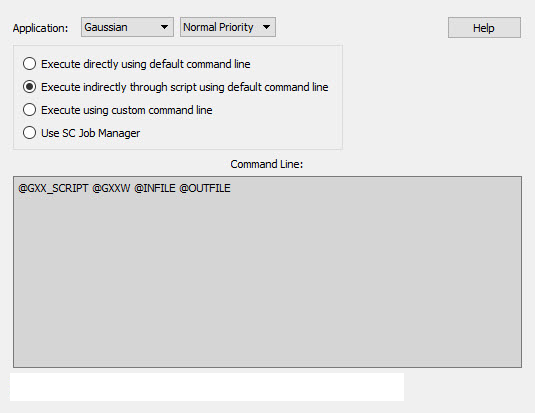

<!-- p.265 -->
most utilities @MEMORY: amount of memory to use, specified via the field at the bottom of the dialog:

CubeGen @KIND: type of cube file @NPTS: number of points per “side”? @HEADER: whether to include a header line CubMan @KIND: type of cube file @SCALE: scale factor FreqChk @SAVE: whether to save normal modes @NFD: whether to skip full matrix diagonalization @SEL: whether normal modes will be specified (if applicable) @TEMP, @PRESS, @SCALE: temperature, pressure, scale factor @ISO: alternate isotope selection @PROJ: whether to project out the gradient direction @SELINPUT: list of normal modes to be included (if applicable) Gaussian help @GAUSSIANHELP_URL: location of the Gaussian

# GaussView-Provided Scripts

GaussView provides the following scripts in its bin subdirectory:

Each script’s usage is documented in comments at the beginning of the file. Prudence dictates making a backup copy of any script before modifying it in any way. Unless otherwise specified, all standard UNIX scripts are also provided on Mac OS X systems.

| Menu Item | Linux/UNIX/Mac OS X | Windows |
| --- | --- | --- |
| Gaussian | gv_gxx.sh | gv_gxx.bat |
| Cubegen | gv_cubegen.sh | gv_cubegen.bat |
| Cubman | gv_cubman.sh | gv_cubman.bat |
| FormChk | gv_formchk.sh | gv_formchk.bat |
| FreqChk | gv_freqchk.sh | gv_freqchk.bat |
| GMMX | gv_gmmx.sh | gv_gmmx.bat |
| Gaussian Help | gv_gaussianhelp.sh gv_gaussianhelp_mac.sh (Mac OS X) | gv_gaussianhelp.bat |
| File Editor | gv_fileeditor.sh gv_fileeditor_mac.sh (Mac OS X) | gv_fileeditor.bat |

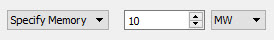

<!-- p.266 -->
# Movie/Animation Preferences

The Movie/Animation Preferences specifies settings for movies generated from GaussView. It is pictured below:

Movie/Animation Preferences: General and for Molecule Animations

The controls in the top half of the panel have the following meanings:

- 

Object Quality: Specifies the movie quality. Moving the slider toward the Realistic end of the scale increases the file size and the time required to generate the movie file.

- 

Enlarge Width and Height by: Set the default movie scaling factor (as above).

- 

Background Color: Background color for the movie.

- 

Gray Scale: Convert the movie to gray scale (i.e., black and white) before capturing. The default is to save a color movie.

- 

Render Method: Specify the rendering method. The choices available in this menu are shown above. This setting should seldom be changed.

- 

Generic Pixel Format: Use the system software renderer. This option should be checked only after rendering problems/failures have been encountered during movie capture or printing.

- 

Target Aspect Ratio: A projection attribute that describes the proportional relationship between the width of an image and its height.

There are two panels on the bottom half of the Movie/Animation Preferences window: the Molecule Group Animations panel, which applies to all animations except those of vibration frequencies, and the Vibration Animations panel, which controls animations of vibration frequencies.

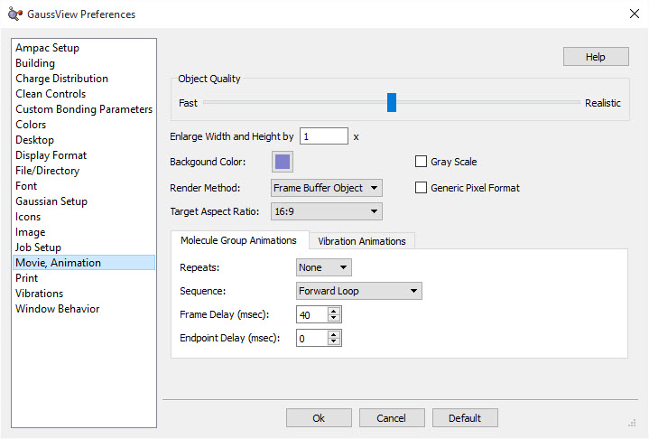

<!-- p.267 -->
# Animations of Multiview Molecule Groups

The controls on the Molecule Group Animations panel are:

- 

Repeats: Controls how often, if at all, the animination should repeat after the Start Animation button has been pressed.

- 

Sequence: Used to play the movie backwards or forwards and combinations of the two.

- 

Frame Delay (msec): The time, in miliseconds, that the rendering engine waits before moving on to the next image in the movie.

- 

Endpoint Delay (msec): Indicates, in miliseconds, how long the delay is between the endpoint of the animation and the next loop.

# Animations of Vibrational Frequencies

The controls on the Vibration Animation panel are:

- 

Repeats: Controls how often, if at all, the animination should repeat after the Start Animation button has been pressed.

- 

Frames per Cycle: The number of frames the movie is broken into per cycle.

- 

Frame Delay (msec): The time, in miliseconds, that the rendering engine waits before moving on to the next image in the movie.

Movie/Animation Preferences for Normal Mode Animations

<!-- p.268 -->
# Printing Preferences

The image in the active View window can be printed by selecting File=>Print or clicking on the Print button. The normal operating system Print dialog is then displayed.

Print output is also controlled by settings in the Print Preferences, as shown below. Settings in the Print dialog have precedence over those in the preferences.

GaussView Print Preferences Default values are displayed in this dialog.

The controls in this dialog have the following meanings:

- 

Object Quality: This slider specifies the quality of the generated print image. Both the time required for rendering and the print job size increase as the slider moves to the Realistic end of the scale.

- 

Automatically Increase Image Resolution: The default print operation increases the image resolution to match the printer resolution, up to the maximum factor specified in the Limit Image Enlargements to field.

- 

Limit Image Enlargement to: Specifies the maximum resolution increase for automatic operations. Note that this control does not affect image size (see the next control).

- 

Enlarge Width and Height by: Increase the image size by the indicated factor. If automatic image resolution is disabled, increasing this may result in poorer quality in the printed image.

- 

Background Color: Specify the background color for the image. The default is white.

- 

Gray Scale: Produce a gray scale (toned black-and-white) image. The default is a color image.

The remaining controls specify low-level graphics behavior. Generic Pixel Format says to use the system software renderer. This option should be checked only after rendering problems/failures have been encountered during image capture or printing.

<!-- p.269 -->
The Render Method popup specifies the rendering method to use in generating the image:

The default is Frame Buffer Object. This setting seldom needs to be changed.

<!-- p.270 -->
# Vibrations Display Preference

Vibration Preferences

This preference specifies the default Display Vibrations dialog settings:

- 

Displacement Amplitude: The amplitude of atomic displacement in normal mode animations.

- 

Displacement Vectors: The checkbox controls whether to display the motion associated with the vibration as a displacement vector in the View window. The Scale slider controls the vector’s length.

- 

Dipole Derivative Unit Vector: The checkbox controls whether to display the dipole derivative unit vector as a vector in the View window. The Scale slider controls the vector’s length.

For both the displacement vectors and the dipole derivative unit vector, you can modify the vector color with the Color control and the vector's thickness with the Radius setting.

<!-- p.271 -->
# Specifying GaussView Window Behavior

The Window Behavior Preferences, illustrated below, controls how various GaussView window types behave:

Window Behavior Preferences

These settings allow you to force certain window types to remain uppermost, as well as whether an empty View window is automatically created when the program starts.

The Mouse Cursor Tracking in Views popup controls whether the hover over atom display mode is active. By default, holding down F5 causes the atom number and type to be displayed when the cursor hovers over an atom. You can specify that this mode be always on or be disabled using this menu.

<!-- p.272 -->
# Molecule Building Examples and Strategies

The following examples illustrate how molecules are built in GaussView. As some of the tutorials build on previous material, be sure to save each file when finished.

## 1 - Building Pyridine: Using Untyped Atoms

The following is an example of how Pyridine is built in GaussView:

1-1 Start a new file by selecting the Create New Molecule Group option from the File menu in the main window.

1-2 Opens the Ring Fragment palette by double clicking on the Ring Fragment icon . Select benzene from the ring fragments; a benzene molecule appears in the Current Fragment window. (Alternatively, you can select benzene from the drop-down list in the main toolbar.)

1-3 Return to the View window. Click once: benzene displays.

1-4 Double-click on Element on the Builder window to open the Element Fragment palette. Click on nitrogen within the periodic table to select it. Then click on the N Atom button at the bottom of the palette.

Do not select one of the hybridizations. It is usually easier to use untyped atoms.

1-5 In the View window, click on the carbon atom you want to change to nitrogen.

1-6 Select the Delete Atom button on the Builder window.

1-7 On the View window, delete the hydrogen attached to the nitrogen by clicking on it.

1-8 Click on the Rebond button on the Builder window. Then, click on the Clean button.

You will often want to rebond before cleaning.

Pyridine is now complete. Save your work.

<!-- p.273 -->
## 2 - Building Phenylpyridine: Setting the Angle Between Rings

This example shows how to build Phenylpyridine based on an existing file, in this case, Pyridine.

2-1 We will be continuing from the previous example, Building Pyridine.

2-2 Double-click on Ring Fragment on the Builder window. Be sure that the benzene ring is selected.

2-3 Click on the hydrogen atom located on the carbon atom opposite the nitrogen atom on the View window. A second ring is attached to the first ring in place of the hydrogen.

2-4 Select the Modify Dihedral button on the Builder window.

2-5 Select atoms between the two rings, as shown in the following figure:

<!-- p.274 -->
The SmartSlide window opens when four atoms have been selected; make sure that Rotate Groups is selected for both Atoms 1 and 4.

### Modifying the Dihedral Angle

2-6 Move the slider to create a dihedral until the rings are perpendicular to each other (or enter 90.0 in the text box).

Click on the OK button.

Phenylpyridine is now complete.

<!-- p.275 -->
## 3 - Building Iron Pentacarbonyl: Selecting the Best Templates for a Given Task

This example builds iron pentacarbonyl.

3-1 Start a new file by selecting the New=>Create Molecule Group option from the File menu in the View window. Select the element iron, and then choose the trigonal bipyramidal iron template:

3-2 Return to the View window. Click once: the iron molecule displays.

3-3 Double-click on R-Group Fragment on the Builder window to open the R-Group Fragment palette. Select the linear C-N template, and place this group on each bond to the iron atom. Note that we select this template rather than one of the C-O groups because the former is linear.

3-4 Change the nitrogen atoms to oxygen atoms: select the element oxygen and then the free atom template (using either the choices at the bottom of the Element Fragment palette or the drop-down list on the main screen).

The molecule is now complete.

Note: This technique applies directly to versions of GaussView prior to version 6. The latter adds a carbonyl ligand group which is linear. When using it, the triple bonds should be changed to double bonds prior to clearing the molecule.

<!-- p.276 -->
## 4 - Building Tyrian Purple Dye: Appending a Structure

The following is an example of how a Tyrian purple dye 6,6'-dibromoindigo is built in GaussView:

4-1 Create a new file. Double-click on Ring Fragment on the Builder window to open the Ring Fragment palette.

4-2 Select the fused 5 and 6 carbon rings on the Builder window (see illustration immediately above), and then click on the View window to place a fragment.

4-3 Select the oxygen element and change the appropriate hydrogen atom in the five-member ring to oxygen by clicking on it.

4-4 Change the carbon atom opposite the oxygen to nitrogen.

4-5 Change the hydrogen atom on the outermost carbon atom in the six-member ring (on the same side as the nitrogen) to bromine in a similar manner.

4-6 Select Clean on the Builder window. Do not rebond.

4-7 Select all of the atoms in the current molecule by pressing the A key. Then choose Edit=>Copy; the molecule will appear in the Current Fragment window. Click in the View window to paste the current fragment.

4-8 Rotate and move the second ring so that the two carbon atoms to be bonded are close together and oriented properly with respect to one another.

To affect just one of the two fragments, hold down the Alt key while dragging the mouse. Using a second window is often helpful when performing complex positioning operations. Use the Add View option on the View menu to create one.

4-9 Delete the hydrogen atoms on the two carbon atoms to be bonded.

4-10 Create a double bond between the two carbon atoms: select the Modify Bond icon on the Builder window, and then click on the two carbon atoms to be bonded. The SmartSlide window opens; choose the double bond option from the BondType list, and click OK. Type list, and click OK.

4-11 Click on Clean.

The 6,6'-dibromoindigo molecule is now complete.

<!-- p.277 -->
Save your work.

## 5 - Docking Two Structures: Building Bichloro-Diphenyl

This example illustrates a method for building a molecular structure consisting of docked framents.

5-1 Create a new View window, and place a benzene ring in it. Change one of the hydrogen atoms to Chlorine. Repeat this process to create a second chlorobenzene ring.

5-2 Rotate one of the rings so that the chlorine atom is in the opposite position to the one in the first ring. You can accomplish this by holding down the Alt key while holding down the left mouse button and dragging:

<!-- p.278 -->
5-3 Position the rings so that they overlap and the carbon atoms to be bonded are in the correct position:

5-4 Delete the hydrogen atoms and dangling bonds in the overlap region.

5-5 Create a bond between the two carbon atoms, completing the molecule:

<!-- p.279 -->
5-6 Click on Clean; the molecule is now complete.

## 6 - Assigning Atoms to ONIOM Layers in a Small Peptide Chain

Note: This example is devised for its illustrative clarity rather than for scientific interest. Your molecule may look different from the figures below.

6-1 Create a peptide chain containing these amino acids: Phe-Ala-Gly: use the Biological Fragment palette to choose an Amino-Terminal Phenylalanine, a Central Fragment Alanine, and a Carboxyl-Terminal Glycine, adding each in turn to the the same View window.

6-2 Assign all atoms to the Low layer. Choose Select Layer from the Tools menu, and then click Select All. Verify that the current layer is set to Low. The display will look similar to the following figure.

<!-- p.280 -->
Click Apply.

6-3 Assign the following atoms to the Medium layer: all atoms in Ala, carbons in Ring in Phe, and atoms up to the double bond in Gly. Use any selection method you want; it will usually take two or more operations to assign all these atoms. For example, you can select the central carbon atom in Ala and drag the Expand Selection slider to add more atoms. Adding too few atoms is usually easier than adding too many. Click Apply.

Add additional atoms as necessary (use the center mouse button [or Shift+Click] to select, and then click Apply) until the selection is correct as in the following figure. The atoms in the Medium layer are now displayed as tubes, and the ones in the Low layer are in wireframe in the display:

<!-- p.281 -->
6-4 Assign the following atoms to the High layer: all atoms in Ala, including heavy atoms bonded to them. One selection method is to click the central carbon in Ala, change the Using field to Distance, and click twice at the right end of Expand Selection. The display will be as in the following figure:

<!-- p.282 -->
Click Apply. The display is as in the following figure:

Completed ONIOM-Assigned Molecule

Click Close. The atom layer assignment is now complete.

<!-- p.283 -->
## 7 - Setting Up an ONIOM Job

This example uses the molecule that was built and the layers that were defined in the final example in the Building Tutorial, and it continues on from those steps.

7-1 Select Gaussian Calculation Setup from the Calculate menu.

7-2 On the Method tab, check Multilayer ONIOM Model. Three tabs appear (High, Medium, and Low) in the Method section, which you can use to select the methods for treating each layer of atoms.

7-3 Click on the High tab, and then select an RHF/6-31G job:

7-4 Click on the Medium tab, then select an AM1 job:

7-5 Click on the Low tab, and specify a molecular mechanics calculation using the Amber force field:

7-6 These settings place the following line in the job’s route section:

# ONIOM=(RHF/6-31G:AM1:Amber)

<!-- p.284 -->
You can now go on to fill out the rest of the dialog box, and the job will be ready to be saved and run.

<!-- p.285 -->
# GMMX Conformer Tutorial

The following tutorial illustrates how to perform a conformational search and predict their Boltzmann-weighted spectra. It has three parts:

- 

Performing the Conformational Search

- 

Preparing and Running the Calculations

- 

Examining the Results

# Part 1: Performing a Conformational Search

1-1 Open or build one conformation of the molecule whose spectrum you want to analyze. We chose desflurane because of its simplicity and ease of illustration. You can find our starting file, desflurane_start, in the gmmx-tut subfolder of the help folder in the main GaussView installation directory.

1-2 Choose Calculate=>GMMX Conformer Dialog, and the GMMX Conformer Calculation window will appear.

1-3 We want to use the defaults for this calculation, so simply click Submit.

1-4 GaussView will prompt you to save a .GMMX file before it runs the conformational search. Click Save, and the standard Save window will open.

1-5 Provice a file name and then click Save. You will be prompted to submit the job to GMMX. Choose Submit.

1-6 When the conformation search completes, a dialog will appear, asking you which results file to open. Open the .SDF file:

<!-- p.286 -->
Note: There may be additional columns visible in the file list.

The Open .SDF File Dialog

1-7 The resulting dialog contains a list of the conformers the calculation found. In some cases, there will be duplicates.

<!-- p.287 -->
The Reading .SDF File Dialog Use this window to select the conformations to examine. The selected ones will be opened in a

new molecule group. Duplicates will have been automatically eliminated.

1-8 We select all of the conformers initially and open them by clicking Select All and then Ok. Then from the Results menu, we choose Energy Plot, which opens the Energy Plot window:

<!-- p.288 -->
The Energy Plot Window Use this window to determine which conformations should be retained.

The graph shows the energy (Y-axis) for each conformation (X-axis). This plot makes it easy to identify conformations with nearly the same energy. By stepping through the resulting plot, we can compare the structures and identify the physically distinct ones. For the purposes of this tutorial, we will work with conformations 1 through 6.

1-9 Once we have selected the conformations for which we want to run additional calculations, we close the .SDF file and reopen it by selecting its name from the File=>Recent Files list. Be sure that the Target drop-down is set to Single new molecule group for all molecules. The following molecule group will result (which we've annotated here with conformer identifications):

<!-- p.289 -->
Conformations of Desflurane

# Part 2: Preparing the Optimization and VCD Calculations

2-1 We now need to optimize the structures of the various conformation with a more accurate model chemistry and then predict their VCD spectra. Set up an Optimization+Frequency calculation using GaussView to do this, using the APFD/ 6-311+G(2d,p) model chemistry (or a different one of your choice). Check the Compute VCD button on the Job Type panel.

<!-- p.290 -->
The Gaussian Calculation Setup Window This window sets the parameters for the Gaussian calculation. The Assign to Molecule Group button applies them to the whole molecule group.

2-2 You can specify the job’s parameters by hand or by using a scheme.

2-3 Assign the job to the whole molecule group by clicking the Assign to Molecule Group button at the bottom right of the dialog.

2-4 Press Submit, and you will be prompted to save the input files in the subsequent window.

2-5 Click Advanced in order to open the Advanced Save dialog. This will allow us to save the input files for all 6 conformations in a single step.

<!-- p.291 -->
Accessing the Advanced Save Dialog Click on the Advanced button in the Basic Save dialog.

2-6 Set Save Molecule Group to Yes, separate file for each molecule.

2-7 Right click and then choose Select Actions=>All Items=>Set Files in order to designate the base file name and directory location for the files. We used the base name desflurane.

2-8 Select Actions=>All Items=>Include molecule numbers in file names. This will add a number to the base file name for each conformer, making them unique. This process is shown below.

Adding Molecule Numbers to the File Names

2-9 Be sure that the checkbox in the first column of each row is checked. This tells GaussView whether to save the corresponding file. Then click Save.

2-10 Once the files are saved, GaussView will prompt you to submit to each job. If you choose to do so, the resulting dialogs will differ depending on whether you are using the SC Job Manager (specified in the Job Setup Preferences).

<!-- p.292 -->
However, for the purposes of this tutorial, do not actually submit the jobs. We have provided the log files in the help/gmmxtut subfolder of the main GaussView installation location (help\gmmx-tut under Windows systems). tut subfolder of the main GaussView installation location (help\gmmx-tut under Windows systems).

# Part 3: Examining the VCD Spectra

3-1 Open the log files. They are in the gmmx-tut subfolder of the help folder under the GaussView installation directory:

Opening the Results Files

Be sure that the Target is set to Single new molecule group for all files. This allows you to open all the files as a single molecule group.

3-2 Select Results=>Vibrations, which will open the following window. In the Vibrations window, click on the Spectra button, then choose Mixture Spectra.

<!-- p.293 -->
The Vibrations Window Opening the composite spectrum window.

3-3 The Vibrational Spectra of Mixture window will appear. Close the IR Spectrum plot by clicking Plots in the upper left and deselecting IR Spectrum from the list. The VCD spectrum plot is displayed below.

The Vibrational Spectra of Mixture Window The spectra defaults to curve and stick representation, resulting in a "busy" plot.

Note that each conformer’s data appears twice: as both a curve plot and as a stick plot. Thus, this display is busy and hard to interpret.

<!-- p.294 -->
3-4 We used the Mixture Editor (Plots=>Mixture Editor) to make the plot easier to understand, we changed the Plot Style field of each spectrum to Curve (the default is Sticks and Curve). Set Plot Style in the Combination area to None.

Modifying the Plot with the Mixture Editor

This produces the following spectra graph, which is much simpler to read. It is also zoomed to show the relevant parts of the spectra.

VCD Spectrum of Desflurane We have removed the sticks plot for each conformer.

3-6 Go back to Mixture Editor. Click the Use Boltzmann Populations as Weights box above the conformation list. The weight values will be changed to their population fraction.

3-7 For demonstration purposes, we will remove most of the curves from the spectrum. Set the Plot Style to None for all but the first two conformations.

3-8 Add the Boltzmann-averaged combination plot by selecting Plot Style=>Curve in the Combination area. Then click Curve Pen. Set the curve pen to be thicker, dotted and its color to be red, as shown below.

<!-- p.295 -->
Modifing the Curve Appearance

Click Ok to close the Mixture Editor. These changes produce the following plot.

Final Spectra Display The composite spectrum is shown as a dotted red curve.

This spectrum display can be saved, customized, and printed as usual.

3-9 Close the spectrum display and the Vibrations dialog. Select Results=>Molecule Group Table from the menu. This opens a window where you can view the key calculation results in a tabular form:

<!-- p.296 -->
Default Molecule Group Table Display

It is possible to customize this table; the exact options depend on the job type. Here, we have added the 3D View column and changed the magnification and orientation for each conformation:

The Customized Molecule Group Table Window

Experiment with different options within the Molecule Group Table to acquaint yourself with its features.

<!-- p.297 -->
# Periodic Boundary Conditions (PBC) Tutorials

## Tutorial 1 - Build a Trans-Polyacetylene Polymer From Ethylene, PBC/1D

1-1 Start a new file by selecting the Create New Molecule Group option from the File menu in the main window.

1-2 Make the vinyl fragment (ethylene) the “current fragment” by double-clicking on the R-Group Fragment toolbar button and then clicking on the “vinyl” button in the R-Group Fragment palette.

1-3 Click anywhere in the empty View window to create and ethylene molecule.

1-4 Center the molecule in the View window by clicking on the Center toolbar button.

1-5 Turn on atom labels for the View window by checking Labels from the View menu of the main window.

1-6 In the View window, click on atom 5 of ethylene to create a trans-butadiene molecule.

1-7 Show the PBC dialog for the molecule by selecting PBC from the Tools menu of the main window.

1-8 In the Symmetry tab of the PBC dialog, select One from the Lattice Dimensions drop-down list.

<!-- p.298 -->
1-9 In the Cell tab of the PBC dialog, push down the Place button, and make sure Vertex Only is selected to enable placement of the cell origin (O (0)) vetex at any atom selected in the View window, using the mouse. In the View window, click on atom 2.

1-10 In the Cell tab of the PBC dialog, select a (1) instead of O (0) to enable placement of the “a” cell vetex at any atom selected in the View window using the mouse. In the View window, click on atom 7.

1-11 In the Cell tab of the PBC dialog, select Delete All Atoms Outside Cell from the Trim Contents drop-down list.

1-12 In the Cell tab of the PBC dialog, click on the Center Contents button.

1-13 At this point, we have defined a primitive unit cell for a PBC/1D model of trans-polyacetylene polymer.

<!-- p.299 -->
1-14 In the View tab of the PBC dialog, show two cells along the “a” axis by selecting 2 from the corresponding spin box in the Cell Replication section. By default, the contents of replicate cells are shown in Low Layer format.

1-15 In the View tab of the PBC dialog, select Normal from the Replicate Contents Display drop-down list to show the contents of the replicate cells in the same format as the reference unit cell contents.

1-16 In the Contents tab of the PBC dialog, select the Rebond Intercell item from Bonds popup menu to update the bonding between atoms in adjacent cells.

1-17 Both of the unique CC bond lengths are too long in comparison to experiment. Change the intracell bond length between atoms 1 and 3 by clicking on the Modify Bond toolbar button and then clicking on atoms 1 and 3 in the same cell in the View window. In the corresponding Semichem Smartslide dialog, change the bond length value from 1.54 to 1.44 in the input field and then click on the OK button.

1-18 Change the intercell bond length between atoms 1 and 3 by clicking on the Modify Bond toolbar button and then clicking on atoms 3 and 1 in adjacent cells in the View window. In the corresponding Semichem Smartslide dialog, change the bond length value from 1.38253 to 1.36 in the input field and then click on the OK button.

<!-- p.300 -->
1-19 In the Contents tab of the PBC dialog, select the Rebond All item from the Bonds popup menu to update the bonding between atoms in the same cell as well as in adjacent cells.

1-20 In the View tab of the PBC dialog, click on the Combine button in the Cell Replication section. This will cause the reference unit cell and the replicate unit cell shown on screen to be combined into a larger “supercell” that is twice the primitive unit cell. Note the atom number changes. Note also that the number of cells being viewed is automatically reduced to one.

## Tutorial 2 - Build a Graphite Sheet From Benzene, PBC/2D

2-1 Start a new file by selecting the Create New Molecule Group option from the File menu in the main window.

<!-- p.301 -->
2-2 Make the benzene fragment the “current fragment” by double-clicking on the Ring Fragment tool button and then clicking on the “benzene” button in the Ring Fragment palette.

2-3 Click anywhere in the empty View window to create a benzene molecule.

2-4 Center the molecule in the View window by clicking on the Center toolbar button.

2-5 Turn on atom labels for the View window by selecting Labels from the View menu.

2-6 Show the Point Group dialog for the molecule by selecting Point Group from the Tools menu of the main window. In the Point Group dialog, check the Enable Point Group Symmetry box and click on the Symmetrize button to symmetrize benzene to D6h. Then, select D6h from the Constraint to Subgroup drop-down list.

<!-- p.302 -->
2-7 Change the CC bond lengths to match the experimental values for graphite. Click on the Modify Bond toolbar button and then click on atoms 1 and 2 in the the view window. In the corresponding Semichem Smartslide dialog, change the bond length value from 1.39499 to 1.42 in the input field and then click on the OK button. Note that all of the CC bond lengths have increased to 1.42 to preserve the D6h symmetry. In the Point Group dialog, uncheck the Enable Point Group Symmetry box, and then click the OK button.

2-8 Show the PBC dialog for the molecule by selecting PBC from the Tools menu of the main window.

2-9 In the Symmetry tab of the PBC dialog, select Two from the Lattice Dimensions drop-down list.

<!-- p.303 -->
2-10 In the Cell tab of the PBC dialog, push down the Place button, and make sure Vertex Only is selected to enable placement of the cell origin (O (0,0)) vertex at any atom selected in the view window using the mouse. In the View window, click on atom 6.

2-11 In the Cell tab of the PBC dialog, select a (1,0) instead of O (0,0) to enable placement of the “a” cell vertex at any atom selected in the View window using the mouse. In the View window, click on atom 2.

<!-- p.304 -->
2-12 In the Cell tab of the PBC dialog, select b (0,1) instead of a (1,0) to enable placement of the “b” cell vertex at any atom selected in the View window using the mouse. In the View window, click on atom 4.

2-13 In the Cell tab of the PBC dialog, select Delete All Atoms Outside Cell from the Trim Contents drop-down list.

<!-- p.305 -->
2-14 Delete the hydrogen atom by clicking on the Delete Atom toolbar button and then clicking on the hydrogen atom in the View window.

2-15 In the Cell tab of the PBC dialog, click on the Center Contents button.

<!-- p.306 -->
2-16 At this point, we have defined a primitive unit cell for a PBC/2D model of graphite.

2-17 In the View tab of the PBC dialog, show three cells along both the “a” and “b” axes by selecting 3 from the corresponding spin boxes in the Cell Replication section. By default, the contents of replicate unit cells are shown in Low Layer format.

2-18 In the View tab of the PBC dialog, select Normal from the Replicate Contents Display drop-down list to show the replicate contents in the same format as the reference unit cell contents.

<!-- p.307 -->
2-19 In the Contents tab of the PBC dialog, select the Rebond All item from Bonds popup menu to update the bonding between all atoms.

2-20 In the View tab of the PBC dialog, click on the Combine button in the Cell Replication section. This will cause the reference unit cell and the replicate unit cells shown on screen to be combined into a larger “supercell” that is nine times the primitive unit cell. Note the atom number changes. Note also that the number of cells being viewed is automatically reduced to one to avoid potential confusion.

<!-- p.308 -->
## Tutorial 3 - Build a Primitive Unit Cell of Diamond Crystal From Methane, PBC/3D

3-1 Start a new file by selecting the Create New Molecule Group option from the File menu in the main window.

3-2 Make the Carbon Tetrahedral fragment the “current fragment” by double-clicking on the Element Fragment tool button and then clicking on Carbon and then Carbon Tetrahedral in the Element Fragment palette.

3-3 Click anywhere in the empty View window to create a methane molecule.

3-4 Center the molecule in the View window by clicking on the Center toolbar button and then position the molecule so all atoms are visible.

3-5 Turn on atom labels for the View window by checking Labels from the View menu of the main window.

<!-- p.309 -->
3-6 Show the Point Group dialog for the molecule by selecting Point Group from the Tools menu of the main window. In the Point Group dialog, check the Enable Point Group Symmetry box, and then select Td from the Constraint to Subgroup drop-down list.

3-7 Change the CH bond lengths to match the experimental values for the diamond CC bond length. Click on the Modify Bond toolbar button, and then click on atoms 1 and 2 in the the View window. In the corresponding Semichem Smartslide dialog, change the bond length value from 1.07 to 1.54 in the input field, and then click on the OK button. Note that all of the CH bond lengths have increased to 1.54 to preserve the Td symmetry. In the Point Group dialog, uncheck the Enable Point Group Symmetry box, and then click the OK button.

3-8 Show the PBC dialog for the molecule by selecting PBC from the Tools menu of the main window.

3-9 In the Symmetry tab of the PBC dialog, select Three from the Lattice Dimensions drop-down list.

3-10 In the Cell tab of the PBC dialog, push down the Place button to enable placement of the cell origin (O (0,0,0)) vertex at any atom selected in the View window using the mouse. In the Moving drop-down list, select Whole Cell instead of Vertex Only so that the whole cell will be translated rather than just the cell origin vertex. In the View window, click on atom 3.

<!-- p.310 -->
3-11 In the Cell tab of the PBC dialog, select a (1,0,0) instead of O (0,0,0) to enable placement of the head of the “a” lattice vector at any atom selected in the View window using the mouse. In the Moving drop-down list, select Vertex Only instead of Whole Cell so that just the “a” vertex will be translated rather than the whole cell. In the View window, click on atom 5.

3-12 In the Cell tab of the PBC dialog, select b (0,1,0) instead of a (1,0,0) to enable placement of the head of the “b” lattice vector at any atom selected in the View window using the mouse. In the View window, click on atom 4.

3-13 In the Cell tab of the PBC dialog, select c (0,0,1) instead of b (0,1,0) to enable placement of the head of the “c” lattice vector at any atom selected in the View window using the mouse. In the View window, click on atom 2.

<!-- p.311 -->
3-14 In the Contents tab of the PBC dialog, select the Delete=>All Redundant Atoms item from the Edit menu of the Atom List editor.

3-15 In the Contents tab of the PBC dialog, change the hydrogen atom to a carbon atom atom by editing the second row of the Symbol column in the Atom List editor.

3-16 In the Contents tab of the PBC dialog, select Rebond All from the Bonds popup menu.

<!-- p.312 -->
3-17 The bonds between reference unit cell atoms and replicate cell atoms are shown in the replicate format, which is Low Layer by default. In the View tab of the PBC dialog, select Dull from the Replicate Contents Display drop-down list in order to better see the bonds in this case.

3-18 At this point, we have defined a primitive unit cell for a PBC/3D model of a diamond crystal.

3-19 In the View tab of the PBC dialog, check the Show All Boundary Atoms checkbox to show all atoms in or on the boundary of the cell.

3-20 In the View tab of the PBC dialog, show two cells along each of the “a,” “b,” and “c” axes by selecting 2 from the corresponding spin boxes in the Cell Replication section.

<!-- p.313 -->
3-21 In the View tab of the PBC dialog, click on the Combine button in the Cell Replication section. This will cause the reference unit cell and the replicate unit cells shown on screen to be combined into a larger “super” unit cell that is 8 times the primitive unit cell. Note the atom number changes. Note also that the number of cells being viewed is automatically reduced to one to avoid potential confusion.

Tutorial 4 - Build a Face-Centered Cubic Unit Cell for Diamond Crystal Using Space Group Symmetry, PBC/3D

4-1 Start a new file by selecting the Create New Molecule Group option from the File menu in the main window.

4-2 Show the PBC dialog for the molecule by selecting PBC from the Tools menu of the main window.

4-3 In the Symmetry tab of the PBC dialog, select Three from the Lattice Dimensions drop-down list.

<!-- p.314 -->
4-4 In the Symmetry tab of the PBC dialog, check the Enable Space Group Symmetry checkbox, and then select 227 (F d -3 m:1) from the Constrain to Space Group drop-down list.

4-5 In the Contents tab of the PBC dialog, add a carbon atom at fractional coordinates (0, 0, 0) by first selecting C from the Symbol column (be sure to tab out of the Symbol field) and then selecting the Add button.

4-6 In the Cell tab of the PBC dialog, select Fix Contents’ Fractional Coordinates from the Cell Changes drop-down list, and then change the “a” cell length from 4 to the experimental value of 3.56 in the corresponding input field. Note that all of the cell lengths change to 3.56, and also the space group symmetry is preserved because of the Cell Changes option being used.

4-7 In the Contents tab of the PBC dialog, select Rebond All from the Bonds popup menu. Then, go to the the View tab and select Dull instead of Low Layer from the Replicate Contents Display drop-down list.

<!-- p.315 -->
4-8 At this point, we have defined a Face-Centered Cubic unit cell for a PBC/3D model of a diamond crystal.

4-9 In the View tab of the PBC dialog, check the Show All Boundary Atoms checkbox to show all atoms in or on the boundary of the cell.

4-10 In the View tab of the PBC dialog, show two cells along each of the “a”, “b”, and “c” axes by selecting 2 from the corresponding spin boxes in the Cell Replication section. Also, select the Low Layer item from the Replicate Contents Display drop-down list.

<!-- p.316 -->
4-11 In the Symmetry tab of the PBC dialog, uncheck the Enable Space Group Symmetry checkbox.

4-12 In the View tab of the PBC dialog, click on the Combine button in the Cell Replication section. This will cause the reference unit cell and the replicate unit cells shown on screen to be combined into a larger “supercell” that is 8 times the primitive unit cell. Note the atom number changes. Note also that the number of cells being viewed is automatically reduced to one to avoid potential confusion.

Tutorial 5 - Transform a Primitive Unit Cell of Diamond Crystal to a Face-Centered Cubic Unit Cell, PBC/3D

5-1 Start a new file by selecting the Create New Molecule Group option from the File menu in the main window.

<!-- p.317 -->
5-2 Make the Carbon Tetrahedral fragment the “current fragment” by double-clicking on the Element Fragment tool button and then clicking on Carbon and then Carbon Tetrahedral in the Element Fragment palette.

5-3 Click anywhere in the empty View window to create a methane molecule.

5-4 Center the molecule in the View window by clicking on the Center toolbar button and then position the molecule so all atoms are visible.

5-5 Turn on atom labels for the View window by checking Labels from the View menu of the main window.

5-6 Show the Point Group dialog for the molecule by selecting Point Group from the Tools menu of the main window. In the Point Group dialog, check the Enable Point Group Symmetry box, and then select Td from the Constraint to Subgroup drop-down list.

5-7 Change the CH bond lengths to match the experimental values for the diamond CC bond length. Click on the Modify Bond toolbar button, and then click on atoms 1 and 2 in the the View window. In the corresponding Semichem Smartslide dialog, change the bond length value from 1.07 to 1.54 in the input field, and then click on the OK button. Note that all of the CH bond lengths have increased to 1.54 to preserve the Td symmetry. In the Point Group dialog, uncheck the Enable Point Group Symmetry box, and then click the OK button.

<!-- p.318 -->
5-8 Show the PBC dialog for the molecule by selecting PBC from the Tools menu of the main window.

5-9 In the Symmetry tab of the PBC dialog, select Three from the Lattice Dimensions drop-down list.

5-10 In the Cell tab of the PBC dialog, push down the Place button to enable placement of the cell origin (O (0,0,0)) vertex at any atom selected in the View window using the mouse. In the Moving drop-down list, select Whole Cell instead of Vertex Only so that the whole cell will be translated rather than just the cell origin vertex. In the View window, click on atom 3.

5-11 In the Cell tab of the PBC dialog, select a (1,0,0) instead of O (0,0,0) to enable placement of the head of the “a” lattice vector at any atom selected in the View window using the mouse. In the Moving drop-down list, select Vertex Only instead of Whole Cell so that just the “a” vertex will be translated rather than the whole cell. In the View window, click on atom 5.

<!-- p.319 -->
5-12 In the Cell tab of the PBC dialog, select b (0,1,0) instead of a (1,0,0) to enable placement of the head of the “b” lattice vector at any atom selected in the View window using the mouse. In the View window, click on atom 4.

5-13 In the Cell tab of the PBC dialog, select c (0,0,1) instead of b (0,1,0) to enable placement of the head of the “c” lattice vector at any atom selected in the View window using the mouse. In the View window, click on atom 2.

5-14 In the Contents tab of the PBC dialog, select the Delete=>All Redundant Atoms item from the Edit menu of the Atom List editor.

5-15 In the Contents tab of the PBC dialog, change the hydrogen atom to a carbon atom atom by editing the second row of the Symbol column in the Atom List editor.

<!-- p.320 -->
5-16 In the Contents tab of the PBC dialog, select Rebond All from the Bonds popup menu.

5-17 The bonds between reference unit cell atoms and replicate cell atoms are shown in the replicate format, which is Low Layer by default. In the View tab of the PBC dialog, select Dull from the Replicate Contents Display drop-down list in order to better see the bonds in this case.

5-18 At this point, we have defined a primitive unit cell for a PBC/3D model of a diamond crystal.

5-19 Show the PBC dialog for the molecule by selecting PBC from the Tools menu of the main window.

5-20 In the View tab of the PBC dialog, select Dull from the Replicate Contents Display drop-down list.

<!-- p.321 -->
5-21 In the View tab of the PBC dialog, check the Show All Boundary Atoms checkbox.

5-22 In the View tab of the PBC dialog, show one replicate cell along the “-c” axis, using the corresponding spin boxes (1 1 1 0 0 1) in the Cell Replication section.

5-23 In the Cell tab of the PBC dialog, select Fix Contents Cartesian Coordinates from the Cell Changes drop-down list, and check the Add/Remove atoms checkbox. Then, push down the Place button, and select a (1,0,0) instead of 0 (0,0,0) to enable placement of the head of the “a” lattice vector at any atom selected in the View window, using the mouse. In the View window, click on the atom at position (1, 1,-1).

<!-- p.322 -->
5-24 In the View tab of the PBC dialog, show zero replicate cells along the “-c” axis again, one along the “-a” axis, and two along the “+b” axis, using the corresponding spin boxes (1 2 1 1 0 0) in the Cell Replication section.

5-25 In the Cell tab of the PBC dialog, select b (0,1,0) instead of a (1,0,0) to enable placement of the head of the “b” lattice vector at any atom selected in the View window, using the mouse. In the View window, click on the atom at position (-1, 2, 0).

<!-- p.323 -->
5-26 In the View tab of the PBC dialog, show one replicate cell along the “+a” axis again, one along the “-b” axis, and two along the “+c” axis, using the corresponding spin boxes (1 1 2 0 1 0) in the Cell Replication section.

5-27 In the Cell tab of the PBC dialog, select c (0,0,1) instead of b (0,1,0) to enable placement of the head of the “c” lattice vector at any atom selected in the View window, using the mouse. In the View window, click on the atom at position (0, -1, 2).

<!-- p.324 -->
5-28 In the View tab of the PBC dialog, show just the reference cell using the corresponding spin boxes (1 1 1 0 0 0) in the Cell Replication section.

5-29 In the View tab of the PBC dialog, uncheck the Show All Boundary Atoms checkbox.

<!-- p.325 -->
5-30 We now have a face-centered cubic unit cell of diamond that gives the same crystal structure as that from the primitive unit cell we started with.

Tutorial 6 - Transform a Face-Centered Unit Cell of Diamond Crystal to a Primitive Unit Cell, PBC/3D

6-1 Start a new file by selecting the Create New Molecule Group option from the File menu in the main window.

6-2 Show the PBC dialog for the molecule by selecting PBC from the Tools menu of the main window.

6-3 In the Symmetry tab of the PBC dialog, select Three from the Lattice Dimensions drop-down list.

<!-- p.326 -->
6-4 In the Symmetry tab of the PBC dialog, check the Enable Space Group Symmetry checkbox, and then select 227 (F d -3 m:1) from the Constrain to Space Group drop-down list.

6-5 In the Contents tab of the PBC dialog, add a carbon atom at fractional coordinates (0, 0, 0) by first selecting C from the Symbol column (be sure to tab out of the Symbol field) and then selecting the Add button.

6-6 In the Cell tab of the PBC dialog, select Fix Contents’ Fractional Coordinates from the Cell Changes drop-down list, and then change the “a” cell length from 4 to the experimental value of 3.56 in the corresponding input field. Note that all of the cell lengths change to 3.56, and also the space group symmetry is preserved because of the Cell Changes option being used.

6-7 In the Contents tab of the PBC dialog, select Rebond All from the Bonds popup menu. Then, go to the the View tab and select Dull instead of Low Layer from the Replicate Contents Display drop-down list.

<!-- p.327 -->
6-8 At this point, we have defined a Face-Centered Cubic unit cell for a PBC/3D model of a diamond crystal.

6-9 Then, do the following steps: (a) uncheck the Enable Space Group Symmetry box in the Symmetry tab; (b) select Fix Contents’ Cartesian Coordinates from the Cell Changes drop-down list of the Cell tab.

6-10 In the Cell tab of the PBC dialog, push down the Place button, and select a (1,0,0) instead of 0 (0,0,0) to enable placement of the head of the “a” lattice vector at any atom selected in the View window using the mouse. In the View window, click on atom 7.

<!-- p.328 -->
6-11 In the Cell tab of the PBC dialog, push down the Place button, and select b (0,1,0) instead of a (1,0,0) to enable placement of the head of the “b” lattice vector at any atom selected in the View window using the mouse. In the View window, click on atom 3.

6-12 In the Cell tab of the PBC dialog, push down the Place button, and select c (0,0,1) instead of b (0,1,0) to enable placement of the head of the “c” lattice vector at any atom selected in the View window using the mouse. In the View window, click on atom 5.

<!-- p.329 -->
6-13 In the Cell tab of the PBC dialog, select Delete All Atoms Outside Cell from the Trim Contents popup menu.

6-14 In the Contents tab of the PBC dialog, select Rebond All from the Bonds popup menu.

<!-- p.330 -->
6-15 In the View tab of the PBC dialog, select Dull from the Replicate Contents Display drop-down list.

6-16 We now have a primitive unit cell for diamond crystal that gives the same crystal structure as that from the face-centered cubic unit cell we started with.

6-17 In the View tab of the PBC dialog, check the Show All Boundary Atoms checkbox.

<!-- p.331 -->

